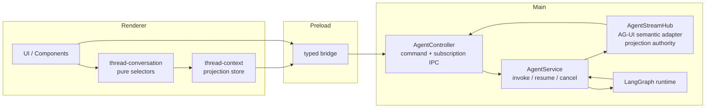
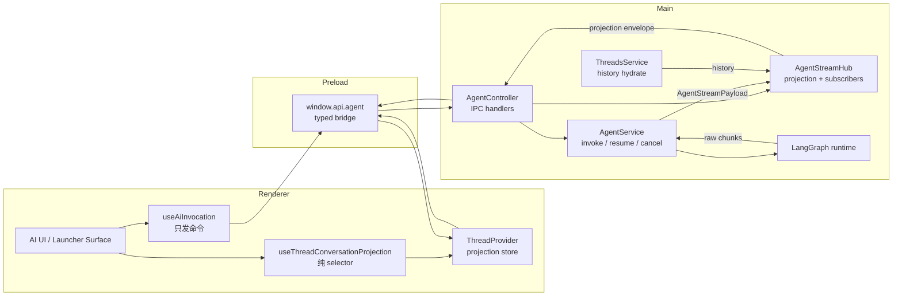
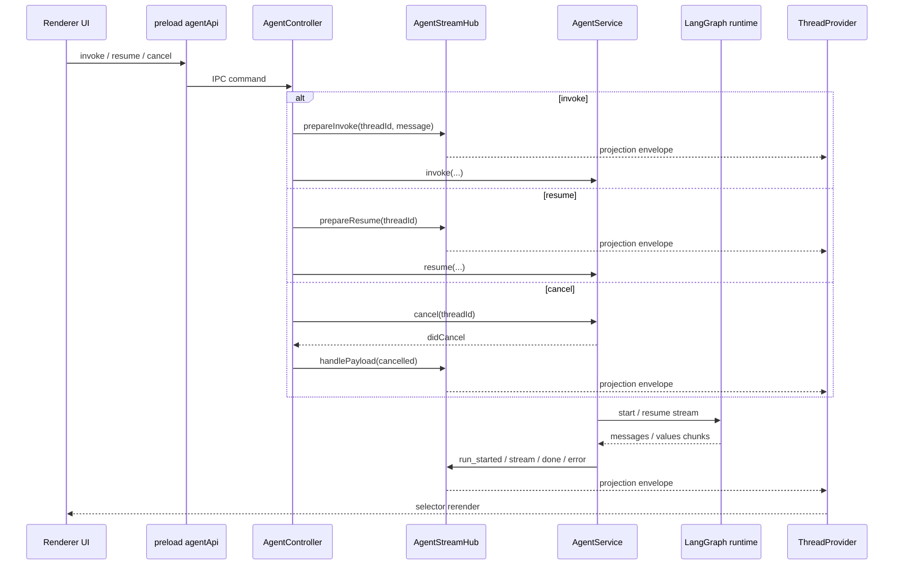

# AG-UI Thread Projection Architecture

这份文档说明 AG-UI 在 Openwork 里的准确位置，以及它和 LangGraph、main、preload、renderer 的边界关系。

目标不是“再引一套前端状态框架”，而是把 agent runtime 和 UI 之间的协议语言标准化，同时把 durable truth 收口回 main。

## 一句话定位

- `LangGraph` 是 agent runtime。
- `AG-UI` 是 `main -> preload -> renderer` 之间的事件语义。
- `AgentThreadProjection` 是 renderer 消费的 authoritative thread snapshot。

在 Openwork 里，AG-UI 不替代 LangGraph，也不在 renderer 再跑一套 client state machine。

## AG-UI 在系统里的位置

当前链路分成三层：

1. `LangGraph runtime`
   - 负责真正的 agent 执行、流式 chunk、interrupt、resume。
2. `main` 中的 `AgentStreamHub`
   - 把 LangGraph raw chunks 规约成统一 thread projection。
   - 同时产出 AG-UI 风格事件，作为稳定的事件语义。
3. `renderer`
   - 只订阅 projection。
   - 只发送 `invoke / resume / cancel` 命令。
   - 不再自己解释 active/passive stream，也不再自己做两路 merge。

这意味着：

- durable run truth 在 `main`
- preload 只是 typed bridge
- renderer 不再拥有 stream 协议解释权

## 系统定位图

这张图只回答一个问题：AG-UI 在 Openwork 里到底落在哪一层。

结论很直接：

- `AG-UI` 落在 `main` 的 `AgentStreamHub` 这一层，承担事件语义和 projection 规约。
- `preload` 不持有 AG-UI 状态，只转发 typed IPC。
- `renderer` 不消费 LangGraph chunk，只消费 `projection + lifecycle event`。

## 当前边界

### main

`main` 负责：

- `invoke / resume / cancel` 命令入口
- 真实 `LangGraph runtime`
- thread 级别的 projection 规约
- run lifecycle
- subscriber registry
- 历史线程 hydrate

`main` 不负责：

- React 订阅
- UI 选择器
- 组件级展示策略

### preload

`preload` 负责：

- 暴露 typed bridge
- 透传 `getProjection / subscribeProjection / invoke / resume / cancel`

`preload` 不负责：

- 持有 projection 状态
- listener 策略
- stream merge

### renderer

`renderer` 负责：

- 把 projection 收口为 thread store
- 基于 projection 做 selector
- 发命令

`renderer` 不负责：

- 解释 LangGraph chunk
- 维护 active/passive stream
- 自己“落盘式拼消息”

## 组件图

## Projection Envelope

`renderer` 不直接消费 raw AG-UI event stream，而是消费：

- `projection`
  - 当前 thread 的 authoritative snapshot
- `event`
  - 这次 projection 变化对应的 AG-UI event
  - 订阅初始化或主动 `getProjection()` 时可为 `null`

当前 bridge 类型是 `AgentProjectionEnvelope`：

- `projection: AgentThreadProjection`
- `event: BaseEvent | null`

其中：

- `projection` 给 renderer 当真相
- `event` 给生命周期、调试、协议对齐和未来跨端复用

## Openwork 边界和 AG-UI 概念映射

| Openwork 组件 | AG-UI 角色 | 是否持有 authoritative state | 说明 |
| --- | --- | --- | --- |
| `LangGraph runtime` | runtime producer | 否 | 只产出执行结果和 chunk，不直接暴露给 renderer |
| `AgentService` | runtime driver | 否 | 管理 invoke / resume / cancel 和 stream payload |
| `AgentStreamHub` | AG-UI adapter + event projector | 是 | 把 payload 规约成 `BaseEvent` 和 `AgentThreadProjection` |
| `AgentController` | transport boundary | 否 | 暴露 `getProjection / subscribeProjection / invoke / resume / cancel` |
| `preload/api/agent.ts` | typed bridge | 否 | 不做 merge，不持有 listener 策略 |
| `ThreadProvider` | projection store | 否 | main snapshot 的本地镜像，不是状态真相源 |
| `thread-conversation` | selector layer | 否 | 只派生 `displayMessages / toolResults / pendingApproval` |
| UI components | AG-UI subscriber consumer | 否 | 只读 projection，发命令，不解释协议 |

## 为什么是 projection first

这里没有直接把 renderer 建成 AG-UI event reducer，有两个原因：

1. 当前系统的真实目标是收回状态归属，而不是把复杂度从一套 reducer 挪到另一套 reducer。
2. 对 Electron 多窗口场景，晚订阅者首先需要的是 authoritative snapshot，而不是从某个中间 event 继续猜状态。

所以当前做法是：

- `main` 内部用 AG-UI 风格事件语义表达状态变化
- renderer 永远优先消费 `projection`
- event 作为协议语言，而不是 renderer 的第二状态源

## LangGraph 到 AG-UI / Projection 的映射

| 来源 | main 内处理 | projection 变化 | 发出的 AG-UI event |
| --- | --- | --- | --- |
| `prepareInvoke(message)` | 在 `AgentStreamHub` 里先写入 user message | `messages += user`，`isLoading=true`，`status=running` | `MESSAGES_SNAPSHOT` |
| `prepareResume()` | 清理 pending approval，准备继续执行 | `isLoading=true`，`status=running` | `STATE_SNAPSHOT` |
| `run_started(runId)` | 建立 run lifecycle | `runId` 写入，`status=running` | `RUN_STARTED` |
| `stream(messages)` assistant chunk | 增量 upsert assistant/tool message | `messages` 更新 | `MESSAGES_SNAPSHOT` |
| `stream(messages)` tool call chunk | 解析 `task` 工具，维护 subagent/token usage | `subagents`/`tokenUsage` 更新 | `STATE_SNAPSHOT` |
| `stream(values)` with `messages` | 用 values snapshot 对齐消息 | `messages` 更新 | `MESSAGES_SNAPSHOT` |
| `stream(values)` with `todos` | 同步 todo state | `todos` 更新 | `STATE_SNAPSHOT` |
| `stream(values)` with `__interrupt__` | 生成 HITL request | `pendingApproval` 写入，`isLoading=false`，`status=interrupted` | `STATE_SNAPSHOT` |
| `done` | 正常 run 结束 | `isLoading=false`，`status=idle/interrupted` | `RUN_FINISHED` |
| `cancelled` | 主动取消 | `isLoading=false`，`pendingApproval=null`，`status=cancelled` | `RUN_FINISHED` with `{ cancelled: true }` |
| `error` | 显式失败 | `error` 写入，`isLoading=false`，`status=error` | `RUN_ERROR` |

## AgentService payload 到 AG-UI 的映射

这一层是 Openwork 当前真正的协议收口点。`renderer` 不再看 raw payload，只看 hub 的规约结果。

| `AgentStreamPayload` | `AgentStreamHub` 行为 | 输出给 renderer |
| --- | --- | --- |
| `run_started` | 记录 `runId`，切到 `running` | `RUN_STARTED` + 最新 projection |
| `stream(messages)` | upsert assistant/tool message，提取 tool / token / subagent 状态 | `MESSAGES_SNAPSHOT` / `STATE_SNAPSHOT` + 最新 projection |
| `stream(values)` | 对齐 values snapshot、todos、interrupt | `MESSAGES_SNAPSHOT` / `STATE_SNAPSHOT` + 最新 projection |
| `done` | 结束 run，按是否有 pending approval 落到 `idle` 或 `interrupted` | `RUN_FINISHED` + 最新 projection |
| `cancelled` | 结束 loading，清空 pending approval，标记 `cancelled` | `RUN_FINISHED` + 最新 projection |
| `error` | 写入结构化错误并切到 `error` | `RUN_ERROR` + 最新 projection |

## 当前为什么只发 snapshot

目前 `AgentStreamHub` 只发：

- `RUN_STARTED`
- `RUN_FINISHED`
- `RUN_ERROR`
- `MESSAGES_SNAPSHOT`
- `STATE_SNAPSHOT`

没有引入 `STATE_DELTA` 或更细颗粒度的 text delta，原因很直接：

- projection reducer 先要稳定
- renderer 不再承担 chunk 合并逻辑
- 多窗口和晚订阅者优先需要可直接重建的 snapshot

后续如果确实出现性能或协议复用压力，再从 `STATE_SNAPSHOT` 演进到 `STATE_DELTA`，而不是一开始就把协议复杂度拉满。

## 多订阅者模型

Openwork 当前采用的是：

- `one thread runtime`
- `one thread projection`
- `many subscribers`

也就是：

- 同一个 `threadId` 在 `main` 只维护一份 `AgentStreamHub` entry
- 多个 window / panel / store 都只是这个 entry 的 subscriber
- 新订阅者先拿当前 `projection`
- 后续持续收到 envelope 更新

这解决了原来的两个核心问题：

1. renderer 不再自己区分 active/passive stream
2. 晚加入的订阅者不需要靠本地 merge 补状态

## invoke / resume / cancel 时序

## 晚订阅者接入方式

新窗口或新 surface 加入某个 thread 时，不需要重新发起 runtime，也不需要找“active stream”。

流程是：

1. `renderer` 调 `subscribeProjection(threadId)`
2. `main` 在 `AgentController` 里注册 subscriber
3. `AgentStreamHub` 返回当前 envelope
4. 后续该订阅者持续收到同一个 thread projection 的更新

这就是 AG-UI 在 Openwork 里的实际价值：

- 给多订阅者一个统一协议语言
- 但真正的 authoritative state 仍是 main-side projection

## 当前代码锚点

- `src/main/agent/service.ts`
- `src/main/agent/stream-hub.ts`
- `src/main/agent/controller.ts`
- `src/main/agent/module.ts`
- `src/shared/agent-projection.ts`
- `src/preload/api/agent.ts`
- `src/renderer/src/lib/thread-context.tsx`
- `src/renderer/src/lib/thread-conversation.ts`
- `src/renderer/src/lib/ai-invocation.ts`

## 结论

在 Openwork 里：

- LangGraph 是执行引擎
- AG-UI 是事件语义
- `AgentThreadProjection` 是 renderer 的消费真相

这套分层的核心不是“用了一个新库”，而是把 run lifecycle、projection 和 subscriber 管理重新收回 main，并让协议命名变得标准化。
