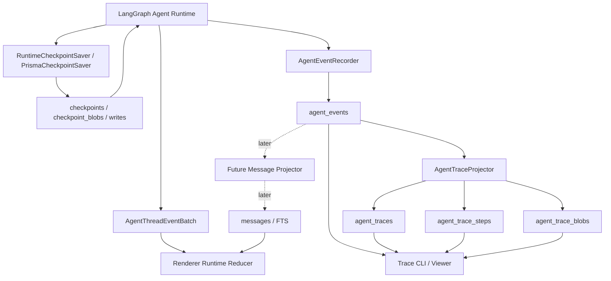

# Openwork Agent Event Log 与本地 Trace MVP 设计

日期：2026-06-13

## 摘要

Openwork 需要一层本地、持久、可重放的 agent event log，用于记录 Openwork 自己关心的 agent 运行事实。该 event log 不替代 LangGraph checkpoint；checkpoint 继续负责恢复运行现场。event log 的第一批消费者是本地 trace CLI / viewer，用于排查 agent 本地开发问题。未来它也可以作为 messages、搜索、统计、审计等读模型的事实输入。

第一阶段目标：

- 建立 `agent_events` 事实账本。
- 基于 `agent_events` 生成 trace 读模型。
- 提供本地 trace CLI，能检查 run、step、LLM 输入、tool 调用、HITL、checkpoint 边界、token、耗时和错误。
- 不改变 checkpoint 恢复语义。
- 不改变现有 messages 读路径。

## 背景问题

当前 Openwork 有三类数据路径：

- LangGraph checkpoint：能恢复运行现场，但不是为人类排查设计。
- Renderer runtime events：能驱动当前 UI，但不是持久历史事实。
- messages 表：能服务历史 UI 和搜索，但不能解释一次 agent run 内部为什么这样执行。

因此，遇到 agent 异常时，开发者很难快速回答：

- run 跑到了哪一步？
- 哪一步调用了哪个模型、哪个工具？
- LLM 当时实际拿到的 messages、system prompt、tool schema 是什么？
- 哪个 tool 输出最大、最可能污染上下文？
- token、耗时、错误集中在哪一步？
- HITL、interrupt、resume、checkpoint 分别发生在什么位置？

event log 与 trace MVP 的目的，是把这些 agent 运行事实稳定落库，并提供可查询的本地诊断入口。

## 设计原则

### 一个领域一个事实源

Openwork 不应把恢复、排查、产品 UI 都合成一个“大事实源”。各层职责如下：

```text
checkpoint tables
= LangGraph 恢复事实源

agent_events
= Openwork agent 运行事实账本

agent_traces / agent_trace_steps
= trace 读模型

messages table
= 产品 UI / 搜索读模型
```

### checkpoint 不被 event log 替代

LangGraph checkpoint 继续承担恢复、resume、fork、HITL continuation 等运行时职责。`agent_events` 记录 Openwork 可解释、可投影、可诊断的事实，但第一阶段不参与恢复 LangGraph state。

### event log 是底座，trace 是第一消费者

`agent_events` 是 append-only 事实账本。trace CLI / viewer 不是单独的事实源，而是从 `agent_events` 投影出的诊断读法。

### 第一阶段不改 messages 读路径

messages 表继续按现有机制服务历史 UI 和搜索。未来可以增加 `agent_events -> messages` projector，但该工作应作为后续阶段独立推进。

### 不持久化所有 streaming delta

流式 token delta 主要服务 live UI。event log 持久化语义边界和最终内容，例如 LLM input captured、assistant completed、tool completed、approval resolved，而不是每个 token。

## 系统关系



术语边界：

- **Renderer Runtime Reducer**：消费 live runtime events，生成当前屏幕状态，内存态。
- **AgentEventRecorder**：在 main/runtime 边界记录 Openwork agent 事实，持久态。
- **AgentTraceProjector**：从 `agent_events` 生成 trace 查询模型。
- **Message Projector**：生成 messages 表的机制，第一阶段不调整。

## 外部参考

### opencode event log

opencode 的可借鉴点是事件事实层，而不是部署形态：

- typed event 有稳定的 type、version、aggregate、schema。
- 同一 aggregate 下事件有递增 seq，可用于 replay 和 gap 检查。
- 事件先作为事实落库，再由 projector 更新 message/session 等读模型。
- durable event 存储语义边界，不必持久化所有 streaming delta。

Openwork 不能直接复制 opencode 的运行架构，因为 Openwork 当前依赖 LangGraph checkpoint 作为恢复机制。可复制的原则是：

```text
Openwork-owned facts should be durable events.
LangGraph-owned recovery should stay in checkpoint.
Product reads should come from projections.
```

### LobeHub agent-tracing

LobeHub `packages/agent-tracing` 的可借鉴点是诊断模型：

- operation/run 级 envelope。
- step 级 LLM/tool 输入、输出、耗时、token、cost、raw events。
- `messagesBaseline + messagesDelta` 避免每步重复存全量 messages，又能重建任意 step。
- context input/output 用于解释模型实际拿到的上下文。
- tool calling/result 用于分析工具输出质量。
- partial snapshot 让 run 崩溃后仍能查看半截 trace。

Openwork 应吸收该诊断模型，但落地到 SQLite / Prisma，而不是照搬文件存储格式。

## 数据模型

### `agent_events`

Openwork agent 事实账本。它是本设计最核心的 durable fact layer。

字段建议：

```text
event_id primary key
aggregate_id
aggregate_type thread | run
seq integer
thread_id
run_id nullable
type
schema_version integer
payload json/text
created_at
checkpoint_id nullable
trace_id nullable
metadata json/text nullable
```

约束建议：

```text
unique(aggregate_id, seq)
index(thread_id, run_id)
index(type)
```

职责：

- append-only 记录 Openwork agent 事实。
- 提供 replay / gap check / projector 输入。
- 支撑 trace、未来 messages projector、统计和审计。

第一阶段事件类型：

```text
run.started
run.resumed
run.interrupted
run.finished
message.user.created
message.assistant.started
message.assistant.completed
llm.input.captured
llm.output.captured
tool.call.started
tool.call.completed
tool.call.failed
approval.requested
approval.resolved
checkpoint.committed
```

### `agent_event_sequences`

为 `agent_events` 提供 aggregate 级 seq 分配。

字段建议：

```text
aggregate_id primary key
aggregate_type thread | run
seq integer
updated_at
```

职责：

- 保证同一 aggregate 下事件顺序稳定。
- 支撑 projector 判断是否漏 event。

### `agent_traces`

trace 级入口和摘要，是 `agent_events` 的读模型。

字段建议：

```text
trace_id primary key
thread_id
run_id
agent_id nullable
status running | completed | failed | interrupted | waiting_for_human | canceled
model nullable
provider nullable
started_at
completed_at nullable
completion_reason nullable
error_type nullable
error_message nullable
total_steps integer default 0
total_input_tokens integer default 0
total_output_tokens integer default 0
total_tokens integer default 0
total_cost real default 0
projected_through_seq integer default 0
created_at
updated_at
```

职责：

- `jl trace list` 的数据源。
- 展示 run 总耗时、总 token、失败原因。
- 标记 trace 是否 incomplete / gap。

### `agent_trace_steps`

step/span 级 trace read model。

字段建议：

```text
trace_id
step_index integer
step_type call_llm | call_tool | approval | checkpoint | runtime
status running | completed | failed | waiting_for_human
started_at
completed_at nullable
duration_ms nullable
model nullable
provider nullable
input_tokens integer default 0
output_tokens integer default 0
total_tokens integer default 0
cost real default 0
tool_name nullable
tool_call_id nullable
input_blob_id nullable
output_blob_id nullable
messages_baseline_blob_id nullable
messages_delta_blob_id nullable
context_blob_id nullable
error_type nullable
error_message nullable
projected_through_seq integer
```

约束建议：

```text
primary key(trace_id, step_index)
```

职责：

- `jl trace inspect <traceId>` 的主时间线。
- `jl trace inspect <traceId> --step <n>` 的入口。
- 快速定位耗时、token、tool、error。

`agent_trace_steps` 不是事实源，只是从 `agent_events` 投影出的 read model。

### `agent_trace_blobs`

大 payload 存储。

字段建议：

```text
blob_id primary key
trace_id
step_index nullable
kind llm_input | llm_output | tool_input | tool_output | messages_baseline | messages_delta | context_snapshot | tool_schema | raw
content_type application/json | text/plain
encoding json | text | gzip+json
size_bytes integer
sha256
preview text nullable
value text/blob
created_at
```

职责：

- 存完整 LLM input/output。
- 存完整 messages baseline/delta。
- 存完整或大型 tool output。
- 存 context snapshot / tool schema。
- 让 event/step 表保持轻量。

第一版可以先使用 text/json，不必立即压缩；保留 `encoding` 和 `sha256` 字段，便于后续压缩、去重、retention。

## 事件语义

### run 事件

```text
run.started
run.resumed
run.interrupted
run.finished
```

用途：

- 建立 trace envelope。
- 记录 run 生命周期。
- 关联 thread、run、trace。

### message / LLM 事件

```text
message.user.created
message.assistant.started
message.assistant.completed
llm.input.captured
llm.output.captured
```

用途：

- 解释模型输入输出。
- 生成 trace step。
- 为未来 messages projector 提供候选事实。

`llm.input.captured` 应优先把完整 payload 写入 `agent_trace_blobs`，event payload 保存 blob id、摘要、token 统计和模型信息。

### tool 事件

```text
tool.call.started
tool.call.completed
tool.call.failed
```

用途：

- 记录 tool name、tool_call_id、参数、结果、耗时、错误。
- 支撑 tool output 质量分析。
- 生成 call_tool step。

大型 tool output 应写入 `agent_trace_blobs`。

### approval / HITL 事件

```text
approval.requested
approval.resolved
```

用途：

- 记录 human-in-the-loop 的等待、审批、拒绝、修改。
- 解释 run 为什么暂停或恢复。

### checkpoint 事件

```text
checkpoint.committed
```

用途：

- 记录 checkpoint 成功写入边界。
- 关联 `checkpoint_id`，方便排查恢复状态与 trace 的关系。

该事件不表示 trace 拥有 checkpoint 内容；checkpoint 内容仍由 LangGraph saver 负责。

## 投影

### 第一阶段：trace projector

第一阶段只实现 trace projector：

```text
agent_events -> agent_traces
agent_events -> agent_trace_steps
agent_events -> agent_trace_blobs
```

trace projector 要求：

- 按 `(aggregate_id, seq)` 顺序处理事件。
- 记录 `projected_through_seq`。
- 发现 seq gap 时标记 trace incomplete / gap。
- projector 失败必须可观察，不能静默吞错。

### 后续阶段：message projector

后续可独立设计：

```text
agent_events -> messages -> FTS/history UI
```

该阶段不属于第一版 MVP。第一版仍沿用现有 messages 表生产机制，避免同时改恢复层、读模型和 trace 层。

## CLI MVP

第一版先实现 CLI。CLI 比 UI 更快产生调试价值，也更适合验证数据模型是否足够。

命令建议：

```text
jl trace list
jl trace inspect latest
jl trace inspect <traceId>
jl trace inspect <traceId> --step <n>
jl trace inspect <traceId> --events
jl trace inspect <traceId> --tools
jl trace inspect <traceId> --messages
jl trace inspect <traceId> --payload
```

### `trace list`

展示：

- trace id
- thread id / run id
- status
- started/completed
- duration
- total steps
- total tokens
- model/provider
- error 摘要

### `trace inspect`

展示 run 时间线：

```text
Trace abc123  thread=... run=...
status=failed model=gpt-... duration=23.4s tokens=18.2k

0 call_llm   completed  3.2s   in=9.1k out=812
1 call_tool  completed  1.4s   execute_command
2 call_llm   completed  4.7s   in=12.8k out=1.1k
3 approval   waiting    approve execute_command
4 resume     completed
5 call_tool  failed     execute_command  ENOENT
```

### `--step <n>`

展示：

- step 输入 messages 摘要。
- system / developer / environment context。
- tool schema 摘要。
- tool 参数和结果。
- token、cost、duration。
- error stack/summary。

### `--messages`

从 `messages_baseline_blob_id + messages_delta_blob_id` 重建某一步前后的 messages。

### `--tools`

展示所有 tool call/result，并计算基础指标：

- output chars
- output token estimate
- success/failure
- 最大输出
- 错误输出
- 可疑重复输出

## 采集边界

第一阶段优先在 main/runtime 边界采集，不在 renderer 组件中生成 durable events。

候选采集位置：

- `src/main/agent/service.ts`：run 生命周期。
- `src/main/agent/runtime.ts`：LangGraph stream 入口。
- `src/main/agent/agent-thread-runner.ts`：runtime events 与 thread projection。
- `src/main/checkpointer/runtime-checkpointer.ts`：checkpoint committed 边界。
- tool approval / execution middleware：tool 与 HITL 事件。

React component 只能消费 trace，不拥有 durable event 事实。

## 失败语义

第一阶段 `agent_events` 不替代 checkpoint 恢复，因此失败语义如下：

- checkpoint 写入失败：恢复能力受损，应暴露为核心错误。
- `agent_events` 写入失败：记录 diagnostics error，run 可以继续；对应 trace 标记为 incomplete / gap。
- trace projector 失败：保留 event log，标记 projection lag/gap，错误可观察。
- partial trace 必须尽量保留，便于排查崩溃前发生了什么。
- 不做静默吞错。

如果后续 `agent_events` 成为 messages、搜索、统计等更多产品读模型的事实源，再收紧 event 写入失败语义。

## 存储与保留

第一阶段不做复杂 retention。先落准确数据，再用真实 SQLite 统计决定保留策略。

建议量化：

```sql
select kind, count(*), sum(size_bytes)
from agent_trace_blobs
group by kind
order by sum(size_bytes) desc;
```

后续可选：

- trace 只保留最近 N 天。
- failed / waiting_for_human trace 保留更久。
- blob 单独压缩或清理。
- tool output blob 做 sha256 去重。

## 与 checkpoint saver 的关系

`PrismaCheckpointSaver` 负责 LangGraph checkpoint 契约。现有 checkpoint manifest 与 `channel_values` 已经做物理拆分：

- `checkpoints.checkpoint` 不直接存完整 `channel_values`。
- `checkpoint_blobs` 按 channel/version 存储。
- 写入遵循 LangGraph `newVersions` 语义。

本设计不要求重写 saver。边界如下：

- checkpoint saver 只负责 LangGraph checkpoint 契约。
- `RuntimeCheckpointSaver` 可以在 checkpoint 成功后发出 `checkpoint.committed` 事实事件。
- event log / trace recorder 不应藏进纯 `PrismaCheckpointSaver`。

## 暂不做

- 不移除 checkpoint 中的 `messages` channel。
- 不让 messages 表反向重建 LangGraph checkpoint。
- 不把所有 streaming token delta 存成 durable event。
- 不在纯 `PrismaCheckpointSaver` 里做 Openwork message 同步。
- 不先做完整 trace UI。
- 不把 `agent_trace_steps` 当第二事实源。
- 不要求第一版兼容 OpenTelemetry exporter。
- 不直接搬运 opencode 的 sidecar、protocol 或部署形态。

## 实施顺序

1. 增加 Prisma schema 和 migration：`agent_events`、`agent_event_sequences`、`agent_traces`、`agent_trace_steps`、`agent_trace_blobs`。
2. 增加 main 侧 `AgentEventRecorder`，提供 appendEvent，并保证 aggregate seq。
3. 增加 `AgentTraceProjector`，从 `agent_events` 更新 `agent_traces`、`agent_trace_steps`、`agent_trace_blobs`。
4. 在 run 生命周期、LLM step、tool call、approval、checkpoint committed 边界打点。
5. 增加 CLI：list、inspect、step、events、tools、messages。
6. 增加测试：event seq、trace 写入、partial trace、failed trace、tool output blob、messages delta 重建。
7. 用真实本地数据分析 event/blob 占用，再决定 retention。

## 验收标准

一次 agent 异常后，开发者不需要翻 checkpoint blob 或依赖前端状态猜测，可以直接执行：

```text
jl trace inspect latest --events
jl trace inspect latest --step 3 --messages
jl trace inspect latest --tools
```

并看到：

- run 生命周期。
- step 时间线。
- LLM 输入和输出。
- tool 调用参数、输出、错误和耗时。
- HITL / resume / interrupt 位置。
- checkpoint committed 边界。
- token、cost、duration 统计。
- trace 是否 incomplete / gap。

同时，Openwork 拥有第一版 durable agent event log，为后续 messages projector、搜索、统计、审计和更清晰的 runtime contract 留出路径。
