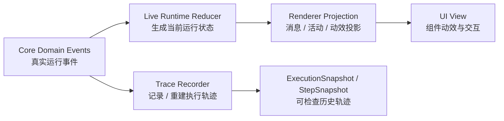
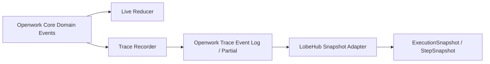

# Agent Event / State / Trace Final 方案

日期：2026-06-09

## 最终结论

Openwork 不应该把 UI event 和 trace event 做成两套互不相干的系统。正确方向是：



也就是说：

- 核心事件只有一套，表达 agent 工作真实发生了什么。
- live runtime state 从核心事件 reduce 出来，服务当前 UI。
- renderer projection 从 runtime state/messages 派生展示结构和动效。
- 未来 trace recorder 也消费同一批核心事件，生成 LobeHub `agent-tracing` 可读的 snapshot。
- trace 实现可以改，不要求 Openwork core event 长得像 LobeHub `StepSnapshot`。
- UI-only 展示结构不能反向进入 core runtime event。

本轮代码实现只补第一波 runtime facts 和 renderer projection，不实现 trace recorder、LobeHub adapter、`ExecutionSnapshot` 或 `StepSnapshot` 产出。

## 三方输入

### 1. Openwork 现状

现有核心入口是 `src/shared/agent-thread-runtime.ts`：

- `AgentThreadEventBatch`
- `AgentThreadRuntimeState`
- `ActiveAgentRun`
- `ActiveAgentToolCall`
- `run.started / run.resumed / run.finished`
- `message.upserted / message.part.delta`
- `tool.callUpdated / tool.started / tool.updated`
- `approval.requested / approval.cleared`
- `run.tokenUsageUpdated`

这些已经能支撑一部分 live UI，但缺少更稳定的 timing、step、tool execution 和 trace reconstruction 事实。`run.phaseChanged` 仍保留在 reducer contract 里作为兼容事件，但当前 runner 没有真实 emitter；本轮主路径由 `message.upserted / message.part.delta / tool.* / approval.*` 这些工作事实在 reducer 内推进 phase。

### 2. Codex 交互层设计

Codex 值得学的是交互背后的事实，不是 UI group 名字本身：

- tool activity 需要 running、waiting result、complete/error、duration。
- approval 要能独立显示、等待、恢复。
- dynamic tools 要能解释某个 thread/run 为什么有某些工具。
- history/read model 要能回看 turn、tool、duration、result。

但这些不应该作为 core event：

- `collapsed-tool-activity.*`
- `dynamic-tool-call-group.*`
- `agentActivity.openChanged`
- `approvalExpanded`
- `isAwaitingFirstAssistant`
- `toolPreview.created`

它们是 projection/local UI，不是 agent 工作事实。

### 3. LobeHub `agent-tracing`

`/Users/junjieding/dingjunjie_dev/2026_05/lobehub/packages/agent-tracing` 的核心 shape 是：

- `ExecutionSnapshot`
  - `operationId / traceId`
  - `startedAt / completedAt / completionReason`
  - `model / provider`
  - `totalTokens / totalCost / totalSteps`
  - `steps`
- `StepSnapshot`
  - `stepType: call_llm | call_tool`
  - `startedAt / completedAt / executionTimeMs`
  - `messagesBaseline / messagesDelta`
  - `toolsCalling / toolsResult`
  - `toolsetBaseline / activatedStepToolsDelta`
  - `contextEngine`
  - `events`

这说明 trace 需要的是可重建的 execution/step 事实，而不是 UI 动效事件。

## 核心事件分层

### A. 继续保留并复用的事件

这些已有事件应该继续作为 live UI 和 trace recorder 的输入：

| 事件 | 用途 |
|---|---|
| `run.started` | 新 turn/run 开始，首 token 前 UI 不能空白 |
| `run.resumed` | HITL resume 是同一个 paused turn，不是新 user turn |
| `run.finished` | run 完成、失败或取消 |
| `message.upserted` | assistant/user/tool message 进入 runtime state |
| `message.part.delta` | 流式文本、reasoning、assistant content |
| `tool.callUpdated` | tool name/args/status 的 active runtime fact |
| `tool.started` | tool execution 进入 running |
| `tool.updated` | 当前 tool execution 结束或等待结果边界 |
| `approval.requested` | HITL pending fact |
| `approval.cleared` | runtime 接受 resume 后清除 pending approval |
| `run.tokenUsageUpdated` | token usage 统计 |

兼容但不是本轮主路径：

| 事件 | 用途 |
|---|---|
| `run.phaseChanged` | 兼容旧/外部 emitter；当前 runner 不发，phase 由 message/tool/approval events 推进 |

### B. 本轮已补强的核心事实

这些是三方交集里已经落到代码的事实：Openwork live UI 需要，Codex-like 交互动效需要，未来 trace 映射也需要。

| 增量 | 类型 | 为什么需要 |
|---|---|---|
| `ActiveAgentRun.startedAt` | runtime state 字段 | 首 token 前、run elapsed、trace operation startedAt 都需要稳定起点 |
| `ActiveAgentRun.phaseStartedAt` | runtime state 字段 | active status elapsed 不能用组件 mountedAt 冒充工作耗时；由 message/tool/approval event 推进 |
| `run.finished.completedAt / durationMs / error` | event 字段 | UI、history、trace completion 都需要稳定完成时间和失败原因 |
| `tool.callUpdated` 的 active tool facts | runtime event/state | tool id/name/args/status 在正式 tool row 出现前也能驱动 active status；正式工具展示仍以 assistant message `tool_calls` 为准 |
| `tool.started.startedAt` | core event 字段 | tool row running、未来 trace `call_tool` step、history duration 的起点 |
| `tool.updated.completedAt / durationMs / status / error` | core event 字段 | live transition：结束当前 active tool、更新 activeRun phase，不作为 durable projection source |
| tool message metadata `openworkToolExecution` | durable message fact | renderer projection 能从 tool result 读出 completed/failed/duration，不靠 UI timer 回写 |
| `approval.cleared(decision, resolvedAt)` | core event 字段 | trace 和审计需要知道 approved/rejected，不只是 UI 清空 |

本轮没有新增 `toolset.loaded / toolset.changed / toolset.loadFailed`，因为当前代码路径没有稳定的 toolset load session owner；也没有新增 `llmStep.*`，因为这波不实现 trace recorder 或 LobeHub step 产出。

### C. 不进入核心的 projection/local 状态

这些可以存在，但只能在 renderer projection 或组件 local：

| 名称 | 正确 owner | 原因 |
|---|---|---|
| `collapsed-tool-activity` | `message-projection.ts` | 只是把多个 tool activity 折叠成一组 |
| `dynamic-tool-call-group` | `message-projection.ts` | 只是动态工具调用的展示分组 |
| `agentActivity.openChanged` | component local state | 展开/收起不影响继续、恢复、审批、trace |
| `approvalExpanded` | component local state / derived UI | 真正事实是 `pendingApproval` |
| `isAwaitingFirstAssistant` | projection | 可由 `activeRun + assistantMessageId + turn contents` 推出 |
| `toolPreview.created` | projection | preview 来自 `tool.callUpdated` |
| `thinking.started` | projection 或 trace step detail | reasoning/message delta 已经是事实来源 |
| tool row `title/detail/meta` | renderer tool component | 从正式 assistant message `tool_calls` 的 args/display/presentation 和 tool result 派生；loading 占位不复用工具名，runtime state 不保存展示 desc |
| exploration activity summary | renderer projection / view | `已探索 N 个文件 / N 次搜索` 这类收起态摘要由正式 tool rows 的 tool name + official args + execution status 聚合得出；缺少 path/pattern/query/command 这类计数事实时不折叠成摘要，展开后仍显示原 tool rows；不是 core event |
| turn elapsed divider (`workingFor / workedFor`) | renderer projection / view | running 从 `ActiveAgentRun.startedAt` 派生；completed 从 durable tool result metadata 的 execution range 派生。没有事实起点/完成时间就不显示，不用 component mountedAt 伪造 |
| `write_todos` visible row | `ChatTodos` / Agent 任务投影 | `write_todos` 是任务状态更新事实，不再伪装成正文里的 completed tool row；正文 activity 不为它创建隐式 tool result |

## State 增量边界

可以新增 state，但必须明确 owner。

### Live runtime state

可加：

```ts
interface ActiveAgentRun {
  startedAt: Date
  phaseStartedAt: Date
}

interface ActiveAgentToolCall {
  id: string
  name: string
  argsText: string
  status: "arguments_streaming" | "running" | "waiting_result"
  startedAt: Date
  runId: string | null
  messageId: string | null
  index: number | null
}
```

理由：

- 这是当前运行状态，不是 UI 私有状态。
- UI elapsed、trace operation timing、debug timing 都能复用。
- 不会和 checkpoint/artifact/HITL 争 owner。
- `ActiveAgentToolCall` 只保存正在执行/等待结果的工具事实；`display / presentation` 这类工具展示 metadata 的 owner 是 tool registry / extension runtime 写入的 assistant message `tool_calls`，renderer projection 消费它们生成 view。

### Durable / read model state

本轮没有新增独立表或新的持久模型。completed/failed tool execution 的 durable fact 暂时挂在 tool message metadata：

```ts
const AGENT_TOOL_EXECUTION_METADATA_KEY = "openworkToolExecution"

interface AgentToolExecutionTiming {
  messageId: string | null
  runId: string | null
  toolCallId: string
  toolName: string | null
  status: "running" | "completed" | "failed"
  startedAt: Date
  completedAt?: Date
  durationMs?: number
  error?: { message: string; type?: string }
}
```

理由：

- active tool call 只服务当前 run，tool result 到达后 active tool 会从 runtime state 移除。
- `tool.updated` 是 live transition event：它结束当前 active tool、推进 `activeRun.phase`，但不会成为 completed/failed view 的 durable owner。
- completed tool history 和 renderer projection 需要能从 message facts 读回 duration/status/error。
- UI completed duration 不能从 renderer timer 回写。
- turn-level completed elapsed 目前只在这个 turn 有带 `openworkToolExecution` 的 completed/failed tool result metadata 时显示；没有 durable run-finished read model 时，projection 不从组件生命周期或 latest message 时间拼总耗时。
- 如果后续需要独立 query/index，再把这份 metadata 提升为结构化 read model；本轮不提前加表。

### Trace recorder state

后续可加在 trace 模块，不放进 renderer runtime：

```ts
interface TraceOperationPartial {
  operationId: string
  startedAt: number
  steps: TraceStepPartial[]
}

interface TraceStepPartial {
  stepIndex: number
  stepType: "call_llm" | "call_tool"
  startedAt: number
  completedAt?: number
  events: Array<{ type: string; [key: string]: unknown }>
}
```

理由：

- trace 可以落本地文件或独立表。
- trace 写入失败不应阻断 checkpoint/HITL 主路径。
- 但失败必须可观察，不能静默吞掉。

## Trace 接入方式

推荐不要让 Openwork core event 直接变成 LobeHub `StepSnapshot`。更稳的是：



两种实现都可以：

1. Openwork 内部写 adapter，把 core events 组装成 LobeHub `ExecutionSnapshot`。
2. 改 LobeHub `agent-tracing`，让它先吃 Openwork event log，再 reconstruct 出 `StepSnapshot`。

关键约束：

- core event 命名优先服从 Openwork domain。
- trace package 可以适配 Openwork event log。
- 不为了 trace 把 renderer projection event 提升成 core event。

## Event 到 LobeHub Trace 的映射

| Openwork domain event/fact | LobeHub trace 字段 |
|---|---|
| `run.started(startedAt, runId, threadId)` | `ExecutionSnapshot.startedAt / operationId / traceId / topicId` |
| `run.finished(completedAt, durationMs, status, error)` | `ExecutionSnapshot.completedAt / completionReason / error` |
| `message.upserted / message.part.delta` | `messagesBaseline / messagesDelta`，后续 trace recorder 可据此重建 `call_llm` step |
| `tool.callUpdated` | `toolsCalling` preview / args delta |
| `tool.started(startedAt)` | `StepSnapshot.stepType = call_tool`、`toolsCalling`、`startedAt` |
| `tool.updated(completedAt, durationMs, status, error)` | live transition，后续 trace recorder 可消费；renderer durable projection 不从这里读 completed/failed |
| tool result message metadata `openworkToolExecution` | renderer durable `toolsResult` read model |
| `run.tokenUsageUpdated` | `inputTokens / outputTokens / totalTokens` |
| `toolset.loaded / changed` | `toolsetBaseline / activatedStepToolsDelta`，本轮未实现 |
| `approval.requested` | `completionReason = waiting_for_human` 或 step event |
| `approval.cleared(decision, resolvedAt)` | step event / resume audit detail |

## 第一波落地范围

第一波只做三方交集，不做大而全 trace 平台。

### 做

1. 定义 core domain event 增量：run timing、phase timing、tool execution timing、approval decision。
2. 保持 live reducer 从 core events 生成 `AgentThreadRuntimeState`。
3. 保持 UI projection 从 runtime state/messages 派生动效，不新增 UI-only core event。
4. 用 tool message metadata 保存 completed/failed tool execution timing，让 renderer projection 能回读结果状态。
5. 在 renderer projection/view 派生 turn elapsed divider 和 collapsed tool activity summary；summary 只消费真实 tool facts，不用最新工具名充当 group label。
6. 补测试：runtime reducer、agent runner/tool execution/approval、message projection、store/runtime manager。

### 不做

1. 不做 `Thread Goal` 独立生命周期。
2. 不做 `Thread Spawn Edge / Subagent` 可恢复委派关系。
3. 不做 artifact 新事件/新模型，继续保留现有 `Artifact`、`ArtifactPresentation`、`present_artifacts`、`artifacts:changed` 边界。
4. 不做 LobeHub `agent-tracing` recorder、adapter、`ExecutionSnapshot` 或 `StepSnapshot` 产出。
5. 不做 `collapsed-tool-activity.*` core event。
6. 不做 `dynamic-tool-call-group.*` core event。
7. 不做 `agentActivity.openChanged`、`approvalExpanded`、`isAwaitingFirstAssistant`、`toolPreview.created`、`thinking.started` 这类 UI-only core state/event。
8. 不做完整 `agent_signal.*` source/signal/action/result 分析模型。它可以第二波接。

## 验证标准

必须能回答：

1. 一个 event 是否表示真实工作事实？
2. 这个 event 是否能同时服务 live UI 和 trace reconstruction？
3. 如果只服务 UI，它是否留在 projection/local？
4. 如果只服务 trace，它是否放在 trace recorder 而不是 renderer runtime？
5. event 写入失败是否可见？
6. trace 写入失败是否不会阻断 checkpoint/HITL/artifact 主路径？

最低测试：

- `agent-thread-runtime` reducer：run timing、phase timing、approval decision 不丢。
- `message-projection`：first-token-before-content、waiting_result、approval、active tool status、turn elapsed divider、tool activity summary 都从现有/新增事实派生；active tool 不生成临时工具组，summary 不退化成最新工具名。
- `action-message-view`：read/search/list/command 单条 tool row summary 从 tool renderer/schema facts 派生，保留 title/detail/meta，不由 collapsed group 负责。
- `agent-thread-runner`：tool call streaming preview、tool execution completed/failed metadata、approval resume decision。
- `agent-run-bootstrap` / store / runtime manager：hydrated active run、runtime event overlay、projection source facts 不丢。
- `npm run typecheck` 通过。

第二波 trace 测试再补：

- 一段 core events 能生成 LobeHub-compatible `ExecutionSnapshot`。
- trace recorder 失败不会让 run/checkpoint 假成功或静默丢失。

## 可直接使用的后续 Goal Prompt

```text
Goal: 在现有第一波 runtime facts 基础上，设计并实现 Openwork trace recorder / LobeHub-compatible snapshot adapter 的最小第二波。

背景：
- Openwork 当前已有 AgentThreadEventBatch、AgentThreadRuntimeState、message projection 和 HITL/checkpoint/artifact 边界。
- Codex Desktop 的 UI group 名称不应直接进入 core event，但其交互背后的事实值得学习：tool activity、approval、duration、dynamic tools、history read model。
- LobeHub packages/agent-tracing 使用 ExecutionSnapshot / StepSnapshot 表达可检查执行轨迹，但 Openwork 不必让 core event 直接长成 LobeHub shape；可以通过 adapter 或调整 trace 实现来重建 snapshot。
- 第一波已经实现 run/phase timing、tool execution timing、approval decision、tool message metadata `openworkToolExecution`，并让 renderer projection 从 runtime facts 派生 UI 动效。

任务：
1. 先定义边界：core domain event、live runtime state、renderer projection、component local state、trace recorder 分别负责什么。
2. 基于现有第一波 core events，设计 trace recorder 的本地写入 owner、失败语义和可观察信号。
3. 重点评估这些 facts 如何重建 LobeHub `ExecutionSnapshot / StepSnapshot`。
4. 明确不进入 core event 的 UI-only 状态：collapsed-tool-activity、dynamic-tool-call-group、agentActivity.openChanged、approvalExpanded、isAwaitingFirstAssistant、toolPreview.created。
5. 给出第二波最小实现方案：trace event log / partial state、snapshot adapter、trace reconstruction fixture、trace failure semantics。
6. 给出验证方式：trace reconstruction fixture tests、trace recorder failure tests，并确认 trace 写入不会阻断 checkpoint/HITL/artifact 主路径。

非目标：
- 不做 Thread Goal 独立生命周期。
- 不做 Thread Spawn Edge / Subagent 可恢复委派关系。
- 不做完整 agent_signal source/signal/action/result 分析模型。
- 不引入 fallback-heavy 状态层；能从已有事实派生的 UI 状态不要新增 core state。

验收：
- 一份清晰设计文档。
- 一个最小事件/状态增量清单。
- 一个 Openwork core events 到 LobeHub ExecutionSnapshot/StepSnapshot 的映射方案。
- 明确哪些事件属于 core，哪些属于 trace recorder，哪些只能留在 projection/local UI。
```
