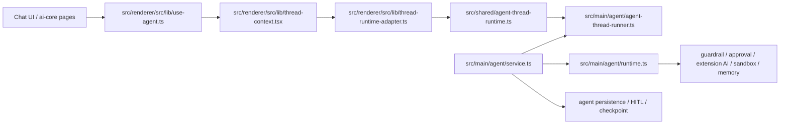
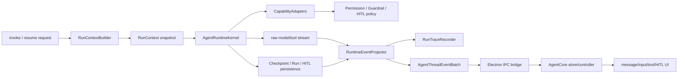

# Agent Runtime/Core 包化技术实现报告

日期：2026-06-06

## 结论

CopilotKit v2 对 Openwork 当前 agent 整体有参考价值，但不适合作为整体替换框架。它最有价值的部分不是 UI 组件，也不是 runtime 端点本身，而是这几类设计：

- 用协议把 agent event、thread、tool call、interrupt/HITL 统一起来。
- 后端 runtime 和前端 React core 分包，避免 UI 组件直接拥有 agent 运行语义。
- runner/transport/handler 分层，让 agent 执行、连接、停止、thread 查询各有入口。
- 前端 tool/HITL renderer 注册机制清晰，UI 渲染能力和后端工具执行分开。
- debug event bus、SSE/connect、thread list 等可观测和会话能力比较完整。

但 Openwork 是桌面端本地主权 agent，不是 Web SaaS chat runtime。我们当前多出来的关键语义包括 workspace、本地文件系统、权限/审批、LangGraph checkpoint、thread history/fork/search、native extension AI、local memory、Electron IPC 和 main-owned runtime snapshot。它们不是并列塞进一个大 service 里，而是要靠一条明确的协作链串起来：main process 先构建 `RunContext`，runtime kernel 只拿上下文执行，capability adapters 负责工具和策略，persistence adapters 负责 checkpoint/HITL/history，event projector 把执行流变成 Openwork runtime events，IPC bridge 只传 snapshot/event，renderer core 只做 headless projection 和用户动作分发。

因此建议：新建两个 Openwork-owned package，但只借鉴 CopilotKit 的分层方式，不引入 CopilotKit 作为核心依赖。

- `@openwork/agent-runtime`：main/backend agent runtime 包，拥有运行、恢复、取消、工具执行策略、checkpoint/HITL 语义。
- `@openwork/agent-core`：renderer/frontend agent core 包，拥有无样式或低样式的 headless state/controller、tool/HITL 渲染注册、composer/view projection。

现有 message 渲染和输入框基础样式可以保留，其余 agent 状态、hook、运行协议和工具/审批 UI 组织方式应按上述边界重构。

## 实施摘要

推荐实施路径：

1. 先建 `@openwork/agent-runtime` / `@openwork/agent-core` 两个 package，只放公开 API 类型和 README，不迁行为。
2. 保持 `src/shared/agent-thread-runtime.ts` 作为短期 runtime event 事实源，不立刻拆第三个 protocol 包。
3. 先给现有 runtime 接一层本地 run trace，服务后续拆包验证；不要先做漂亮 debugger UI。
4. 后端再把 `AgentService` 的 run context、HITL、checkpoint、event projector 语义抽到 runtime package，DeepAgents/LangGraph 继续作为 adapter。
5. 前端再把 `useAgent` 拆成 core controller/state/projection，Chat UI 保留 message/input 基础样式。
6. 最后用 tool/HITL renderer registry 替换 Chat 内部硬编码工具展示。

总体周期：单人 6.5-9 周，双人 4.5-6 周。PR1 只建包和边界，2-3 天可完成。

## 当前 Openwork 实体



当前事实：

- `src/shared/agent-thread-runtime.ts` 已经是 Runtime v2 的状态和事件事实源，包含 `AgentThreadRuntimeState`、`AgentThreadEventBatch`、`run.started`、`run.resumed`、`approval.requested`、`approval.cleared` 等关键语义。
- `src/main/agent/service.ts` 不是薄包装，它处理 invoke/resume/cancel、HITL request 校验、workspace mismatch、run persistence、checkpoint 同步、stream sink。
- `src/main/agent/runtime.ts` 创建 LangChain/DeepAgents runtime，并组装 filesystem、guardrail、tool approval、desktop automation、web tools、extension AI、memory、subagent 等 middleware。
- `src/main/agent/agent-thread-runner.ts` 把 agent stream 转换为 Openwork runtime event/snapshot，是当前主进程 runtime projection 的关键实体。
- `src/renderer/src/lib/thread-context.tsx` 负责 snapshot-first、event batch、revision gap resync、thread store 更新和 stream loading。
- `src/renderer/src/lib/use-agent.ts` 同时做 composer input、thread ensure、invoke/resume/retry/stop、fork state、pending approval、message projection，是后续前端拆包的主要收口点。

## CopilotKit v2 对比

### 它多了什么

- `AgentRunner` 抽象：`run`、`connect`、`isRunning`、`stop` 分离，适合抽成 Openwork 的 backend runtime facade。
- HTTP/SSE endpoint 适配：Express/Hono/Node/fetch router 都能挂同一个 runtime。我们不需要 HTTP 框架适配，但可以借鉴“transport adapter 不拥有 runtime 语义”。
- AG-UI event 协议：消息、状态、tool call、run lifecycle 更通用。它可以作为事件命名和 tool renderer schema 的参考。
- React provider/core 分层：`CopilotKitProvider` 管 agents/tools/renderers，`useAgent` 订阅 agent 更新，chat UI 只消费 core。
- tool renderer 注册：`defineToolCallRenderer`、`useFrontendTool`、`useHumanInTheLoop` 把工具 UI 注册成显式能力，而不是散落在 message 组件里。
- debug event bus 和 runtime info：适合我们后续做 agent 调试面板和事件回放。

### 它少了什么

- 没有 Openwork 的本地 workspace identity、workspace mismatch resume 语义。
- 没有 Electron main/preload/renderer IPC 边界。
- 没有本地 Prisma/thread/checkpoint/history/fork/search 的完整语义。
- 没有我们的 permission mode、execute-command guardrail、unknown command HITL、desktop automation policy。
- 没有 native extension runtime 和 extension AI capability snapshot。
- 没有 local memory context pack、memory suggestion、temporary mode 等本地记忆主权语义。
- CopilotKit HITL 更偏前端 tool promise/renderer 注册；Openwork HITL 是后端中断、持久化 request、resume 同一个 paused run，失败语义更重。

### 核心差异

CopilotKit 的 agent 设计更像“Web runtime + agent protocol + React SDK”。Openwork 的 agent 设计应该是“本地主权 runtime + IPC event contract + desktop capability kernel + renderer headless core”。

所以我们不应该把 Openwork 改成 CopilotKit-shaped app；应该把 CopilotKit 的清晰包边界吸收进 Openwork 自己的 runtime/core 包。

### 输出来源校准

`agent-runtime` 的公开 API 和输出形状不能只从一个外部项目照搬。它们应该分层参考：

| 输出/能力 | 主要参考 | Openwork 落点 |
| --- | --- | --- |
| runtime stream events | CopilotKit / AG-UI 的 runner event 形态 | 保留 Openwork `run.started`、`message.part.delta`、`tool.started`、`approval.requested`、`run.resumed`、`run.finished` 等桌面 runtime 语义 |
| runtime snapshot | Openwork 现有 `AgentThreadRuntimeState` / `AgentThreadDataSnapshot` | main-owned thread/run 状态，包含 messages、todos、subagents、token usage、pending HITL、fork state |
| HITL / pending approval | Openwork checkpoint interrupt + persisted HITL | CopilotKit 只参考 renderer/HITL 注册方式，不能替代后端持久化 request 和 resume same paused run 语义 |
| run trace / debugger | LobeHub `packages/agent-tracing` 的 snapshot/step/partial/reconstruct 结构 | 改成 `runId`、`threadId`、workspace、permission、checkpoint、HITL、extension capability、memory snapshot 的 Openwork trace |
| tool/HITL renderer registry | CopilotKit renderer registry + LobeHub shared tool UI | renderer 只注册展示能力，不决定工具能否执行 |

因此 `AgentThreadEventBatch`、runtime snapshot、pending approval 不是 CopilotKit 原样输出；它们优先来自 Openwork 当前 runtime 事实。CopilotKit 负责校准 runner/event/API 的形态，LobeHub `agent-tracing` 负责校准 debugger/trace 的结构。

## 这些语义怎么配合

目标不是把 workspace、checkpoint、extension、memory、HITL 都放进一个 `AgentService`，而是把它们分成三类：

- Run facts：一次运行开始前必须冻结或解析的事实，例如 threadId、runId、workspace identity、model、permission mode、memory context snapshot、extension capability snapshot。
- Runtime capabilities：运行中 agent 可以调用的能力，例如 filesystem sandbox、execute command guardrail、desktop automation、native extension tools、web tools、memory suggestion tools。
- Runtime observation：运行后或运行中要给 UI 和历史系统看的事实，例如 messages、todos、subagents、pending approval、token usage、fork state、run status、search index。

协作方式应该是这样：



### 1. `RunContextBuilder`：把动态世界冻结成一次 run 的输入

现在这部分散在 `src/main/agent/service.ts`：它从 thread metadata 取 `workspacePath`，解析 `OpenworkWorkspaceIdentity`，读取/冻结 permission mode，解析 message refs 对应的 extension AI capabilities，构建 Openwork memory context pack，`beginAgentRun` 时把 permission、memory snapshot、extension AI snapshot 写入 run metadata。

未来应该抽成 `@openwork/agent-runtime` 的上下文构建边界：

```ts
interface AgentRunContext {
  aiCapabilities: ResolvedExtensionAiCapability[]
  memoryContextPack: OpenworkMemoryContextPack | null
  modelId?: string
  permissionMode: PermissionModeName
  runId: string
  source: "invoke" | "resume"
  threadId: string
  workspace: OpenworkWorkspaceIdentity
  workspacePath: string
}
```

它的关键作用是：invoke 用当前 workspace/memory/capability 生成 snapshot；resume 不重新猜，而是从 run metadata 还原 snapshot，并检查当前 workspace identity 是否仍匹配。这样 workspace、memory、extension capabilities 才能和 checkpoint/resume 绑定，而不是每次 UI 点击时重新算一遍。

### 2. `AgentRuntimeKernel`：只执行 run，不决定 UI

Kernel 的职责是拿 `AgentRunContext` 和 turn input 去跑 agent loop。当前是 `createAgentRuntime(...)` + `runtime.agent.stream(...)` + `buildAgentRunConfig/buildAgentResumeConfig`。

它应该借助 adapter，而不是直接知道所有产品服务：

- `ModelAdapter`：当前是 `getChatModelInstance`，未来隔离 LangChain model shape。
- `CheckpointAdapter`：当前是 `RuntimeCheckpointSaver` / Prisma checkpoint。
- `ToolRuntimeAdapter`：当前是 DeepAgents/LangChain middleware stack。
- `Abort/Lease`：当前是 `ThreadLifecycleGate` 和 `AbortController`，保证同 thread 单 run，并在 delete/run 切换时可中止。

这层可以继续保留 DeepAgents/LangGraph，只是把它变成 `adapters/deepagents.ts`。真正要抽出来的是 Openwork-owned kernel contract，而不是马上换掉 kernel 实现。

### 3. `CapabilityAdapters`：工具能力按来源接入，策略统一落在后端

工具能力不是 renderer 传一个 tool schema 就完事。Openwork 的工具能力至少有四类来源：

- workspace filesystem：`LocalSandbox`、filesystem middleware，绑定 `workspacePath`。
- command/desktop automation：execute-command classifier、mutation predictor、desktop automation policy。
- native extension AI：`createExtensionAiRuntime` 根据 capability snapshot 生成 tool bindings，并通过 approval policy provider 判断是否要确认。
- memory：memory context 进入 prompt，memory suggestion/inclusion 通过 `OpenworkMemoryService` 记录。

它们应该统一被 `CapabilityAdapters` 注入 kernel，产物是工具定义、工具执行函数、工具审批策略、可见 tool bindings。renderer 只能看到 runtime event 和 approval view model，不应该自己决定某个 tool 是否可执行。

### 4. `PersistenceAdapters`：checkpoint、HITL、history/search 是同一个恢复语义

这里是 CopilotKit 不够的地方。Openwork 的 history 不是纯 message array，它要能 fork、search、resume interrupted run。

当前协作点：

- `beginAgentRun` 创建 run，并写入 permission/memory/extension snapshot。
- `RuntimeCheckpointSaver.afterPut` 在 checkpoint 写入后同步 message search index，并抽取 HITL request 持久化。
- `syncRunFromLatestCheckpoint` 根据 checkpoint interrupt 决定 run/thread 状态。
- `ThreadsService.getPersistedAgentThreadData` 从 checkpoint、latest HITL、artifacts、latest run 组装 thread data。
- `clone` / `cloneUntilMessage` 依赖 checkpoint parent chain 和 fork guard。

未来应该把这些收成 `RunPersistenceAdapter`、`CheckpointAdapter`、`HitlStore`、`ThreadHistoryReader` 四个接口。它们仍由 main composition root 接 DB/Prisma，但 `agent-runtime` 用接口表达语义。

### 5. `RuntimeEventProjector`：把 kernel stream 变成唯一 UI 事实源

当前 `AgentThreadRunner` / `ThreadRuntimeProjector` 已经在做这件事：`prepareInvoke` 先写 user message 和 `run.started`，`prepareResume` 写 `run.resumed`，stream 的 `messages` 更新 assistant/tool message，`values` 更新 todos 和 approval，最后输出 `AgentThreadEventBatch`。

未来这块应该进入 `@openwork/agent-runtime` 或协议附近，成为主进程 runtime event projector。它只输出 Openwork runtime event：

- `run.started` / `run.resumed` / `run.idAssigned` / `run.finished`
- `message.upserted` / `message.part.delta`
- `tool.started` / `tool.updated`
- `approval.requested` / `approval.cleared`
- `todos.replaced` / `subagents.replaced`

renderer 的 `agent-core` 只能 reduce 这些 event，不能再从 raw LangChain chunk 推断运行语义。

### 6. `RunTraceRecorder`：第一形态是 Agent Debugger 的证据层

`RunTraceRecorder` 不是第三个漂亮空包，也不是一开始就做完整 UI。它先接在现有 `AgentService` / `AgentThreadRunner` / event projector 路径上，把每一次 agent run 记录成本地可检查的工作单元。

它参考 LobeHub `packages/agent-tracing` 的结构：`ExecutionSnapshot`、`StepSnapshot`、partial snapshot、file store、reconstruct、CLI viewer。但 Openwork 不能直接照搬它的 `operationId/topicId/agentId` 语义，应该改成：

```ts
interface AgentRunTrace {
  checkpoint?: {
    checkpointId?: string
    namespace?: string
  }
  completedAt?: number
  completionReason?: "completed" | "failed" | "cancelled" | "interrupted" | "waiting_for_human"
  extensionCapabilities?: unknown
  memorySnapshot?: unknown
  modelId?: string
  permissionMode: string
  runId: string
  startedAt: number
  steps: AgentRunTraceStep[]
  threadId: string
  traceId: string
  workspace: AgentRuntimeWorkspace
}
```

第一版 trace 必须记录：

- run lifecycle：invoke、resume、cancel、finish/error。
- stream/event：message delta、tool started/updated/result、todos/subagents。
- HITL：approval requested、decision、resume target、approval cleared。
- context snapshot：workspace、permission mode、memory context、extension capability snapshot。
- checkpoint pointer：能定位 paused run 和恢复路径，但不暴露 LangGraph 私有 tuple 给 renderer。

它的价值是：在 runtime/core 真实迁移前，先让现有 runtime 变得可观察。后续每个阶段不是靠“页面看起来能跑”判断，而是能 inspect run trace。

默认存储应在 `OPENWORK_HOME` 下，例如：

```text
OPENWORK_HOME/agent-traces/
  latest.json
  _partial/
```

不要默认写 workspace cwd 的 `.agent-tracing`，也不要第一版引入 remote store。远端同步或上传最多是后续显式开启的诊断能力，不能改变本地主权语义。

### 7. `IPCBridge`：传输层只保证顺序和重放，不拥有语义

Electron IPC 是当前主传输：`agent:invoke`、`agent:resume`、`agent:cancel`、`agent:connectThreadEvents`、`threads:agentThreadData`。它要做的是 snapshot-first、event subscription、disconnect cleanup、revision gap 后 resync。

这层可以借鉴 CopilotKit `connect/run/stop/threads` 的入口拆法，但不应该变成 HTTP runtime。HTTP/SSE 最多作为未来 remote adapter，不能倒过来决定 Openwork runtime contract。

### 8. `AgentCore`：前端只做 headless state、controller 和 renderer registry

`@openwork/agent-core` 要借助 runtime snapshot/event 做三件事：

- controller：把 invoke/resume/stop/retry 变成对 IPC bridge 的命令。
- projection：把 `AgentThreadRuntimeState` 推导成 message turns、tool state、approval view model、composer state。
- registry：把 tool/HITL renderer 按 tool name/kind 注册，替代 Chat message 里硬编码所有工具。

它不能做：

- 不能重新判断 permission。
- 不能持久化 HITL request。
- 不能根据 raw checkpoint 恢复 message。
- 不能把 workspace/memory/extension capability 当作前端状态源。

## 配合矩阵

| 语义 | 事实源 | 借助什么机制配合 | renderer 能看到什么 |
| --- | --- | --- | --- |
| workspace | thread metadata + `OpenworkWorkspaceIdentity` | `RunContextBuilder` 在 invoke 解析，resume 与 run metadata snapshot 比对 | workspace path/name、mismatch error |
| 本地文件系统 | main-owned `workspacePath` | `LocalSandbox` + filesystem middleware | tool call、文件结果、approval 展示 |
| 权限/审批 | run metadata + tool policy + HITL store | permission mode snapshot、guardrail provider、tool approval middleware、`HitlStore` | pending approval view model、approve/reject |
| checkpoint | Prisma checkpoint | `CheckpointAdapter` 写入/读取，`afterPut` 同步 HITL 和 search | runtime snapshot/events，不看 checkpoint |
| thread history/fork/search | ThreadsService + checkpoint + DB search index | `ThreadHistoryReader`、fork guard、message search sync | thread list、fork state、messages |
| native extension AI | extension manifests/runtime definitions + run snapshot | `ExtensionCapabilityResolver` + `ExtensionAiRuntimeAdapter` + approval policy | tool renderer、extension approval 文案 |
| local memory | OpenworkMemoryService + run metadata snapshot | context pack 注入 prompt，inclusion 记录，resume 从 snapshot rebuild | included memories、temporary mode 状态 |
| Electron IPC | preload/main bridge | snapshot-first subscription、event batch、revision gap resync | `AgentCoreTransport` |
| runtime snapshot | `AgentThreadRuntimeState` reducer | `RuntimeEventProjector` + `AgentThreadEventBatch` | 唯一 UI 事实源 |

## 目标包边界

### `@openwork/agent-runtime`

职责：

- 定义 main/backend agent runtime 的公开契约：`invoke`、`resume`、`cancel`、`getSnapshot`、`subscribeEvents`。
- 拥有 run lifecycle 状态机：new run、resume paused run、finish、cancel、error。
- 拥有 HITL continuation 语义：request 持久化、decision 校验、resume target、approval cleared。
- 拥有 tool execution policy：permission mode、guardrail、tool approval、desktop automation、extension AI。
- 拥有 checkpoint/history 的运行时适配，不让 renderer 理解 LangGraph checkpoint。
- 输出 Openwork runtime events，而不是直接输出 UI message projection。

不做：

- 不 import renderer、React、chat UI。
- 不暴露 LangChain/LangGraph/DeepAgents 私有类型给 renderer。
- 不处理 message bubble、scroll、input UI。
- 不把 HTTP/SSE 作为核心传输；Electron IPC 是当前主传输，HTTP 只能是 adapter。

建议目录：

```text
packages/agent-runtime/
  src/index.ts
  src/kernel.ts
  src/events.ts
  src/hitl.ts
  src/tools.ts
  src/checkpoint.ts
  src/adapters/deepagents.ts
```

### `@openwork/agent-core`

职责：

- 定义 renderer/frontend agent core 的 headless state 和 controller。
- 维护 composer draft、invoke/resume/stop/retry controller、pending approval view model。
- 从 runtime snapshot/events 推导 message projection、tool render state、todos/subagents/token usage。
- 提供 tool/HITL renderer registry，支持按 tool name、tool call id、agent scope 渲染。
- 保留现有 message 和输入框基础样式的接入点，但不让样式组件拥有运行语义。

不做：

- 不执行后端工具。
- 不持久化 run/checkpoint/HITL request。
- 不直接读写 main process 私有服务。
- 不在多个 hooks 里叠 `draftInputFromThread ?? pendingInput` 这类隐式 fallback 链。

建议目录：

```text
packages/agent-core/
  src/index.ts
  src/state.ts
  src/controller.ts
  src/projection.ts
  src/tool-renderers.ts
  src/hitl-renderers.ts
  src/react/
```

### 共享契约

短期可以继续以 `src/shared/agent-thread-runtime.ts` 为事实源，不立刻拆第三个包。等 `agent-runtime` 和 `agent-core` 都接上后，再决定是否抽出：

```text
packages/agent-protocol/
```

如果一开始就拆三包，容易把迁移面扩大。更稳的顺序是先把 runtime/core 两端的职责收住，再迁出协议。

## Package API 草案

这里的接口目标是“让边界清楚”，不是先做一套通用框架。第一版只覆盖 Openwork 当前需要的运行路径。

### `@openwork/agent-runtime` 对 app 暴露

```ts
export interface AgentRuntimeHostPorts {
  checkpoints: AgentCheckpointStore
  events: AgentRuntimeEventSink
  hitl: AgentHitlStore
  history: AgentThreadHistoryReader
  memory: AgentMemoryContextProvider
  runStore: AgentRunStore
  tools: AgentToolCapabilityProvider
  workspace: AgentWorkspaceResolver
}

export interface AgentRuntimeKernel {
  cancel(input: { threadId: string }): Promise<boolean>
  invoke(input: AgentRuntimeInvokeInput): Promise<void>
  resume(input: AgentRuntimeResumeInput): Promise<void>
}
```

接口含义：

- `AgentRuntimeKernel` 是产品语义入口，替代现在 `AgentService.invoke/resume/cancel` 的核心逻辑。
- `AgentRuntimeHostPorts` 是 main app 注入的真实能力，避免 package 直接 import Prisma、Electron、preferences、native extension registry。
- `events` 只发 Openwork runtime event，不发 LangChain chunk 给 renderer。
- `tools` 统一返回 filesystem、command、desktop automation、extension AI、memory tools，以及它们的 approval policy。
- `runStore` 和 `hitl` 分开，因为 run 状态和 HITL request 是两类恢复语义；不要合成一个“万能 persistence”。
- `trace` 可以作为 Phase 1 后加入的 host port，默认写 `OPENWORK_HOME` 本地 trace；第一版不要 remote store。

第一版不要做：

- 不提供 HTTP/SSE server。
- 不提供多 backend plugin registry。
- 不把 CopilotKit/AG-UI 类型作为公开依赖；可以参考事件命名和 runner 结构，但 public API 用 Openwork 自有类型。
- 不把 LangGraph checkpoint tuple 暴露到 package public API。

### `@openwork/agent-core` 对 renderer 暴露

```ts
export interface AgentCoreTransport {
  cancel(threadId: string): Promise<void>
  invoke(input: AgentCoreInvokeInput): void
  resume(input: AgentCoreResumeInput): void
  subscribe(threadId: string, listener: (batch: AgentThreadEventBatch) => void): AgentCoreSubscription
}

export interface AgentCoreController {
  clearError(): void
  invoke(input?: ComposerMessageInput): Promise<boolean>
  resetDraft(value?: string): void
  resume(decision: HITLDecision): Promise<void>
  retry(): Promise<void>
  setDraft(value: string): void
  stop(): Promise<void>
}

export interface AgentCoreState {
  canInvoke: boolean
  canResume: boolean
  canRetry: boolean
  canStop: boolean
  composer: AgentComposerState
  error: string | null
  messages: AgentMessageProjection
  pendingApproval: HITLRequest | null
  run: AgentCoreRunState
  toolRenderState: AgentToolRenderState[]
}
```

接口含义：

- `AgentCoreTransport` 是 renderer 到 preload/main 的唯一边界，当前可以由 `window.api.agent` 实现。
- `AgentCoreController` 取代 `useAgent` 里混在一起的 submit、retry、resume、stop、input reset。
- `AgentCoreState` 是 UI 可消费状态；Chat 组件只读它，不参与 runtime 判断。
- tool/HITL renderer registry 消费 `toolRenderState` 和 `pendingApproval`，不直接解析 raw message chunk。

第一版不要做：

- 不接管 message bubble 和 input 基础样式。
- 不引入全局 Redux/Zustand 之类新状态库，除非现有 `ThreadContext` 无法承载。
- 不在 React effect 里同步派生 setState；投影优先走 reducer/selector。

## 当前文件迁移映射

| 当前文件 | 目标归属 | 迁移动作 |
| --- | --- | --- |
| `src/shared/agent-thread-runtime.ts` | 暂留 shared，未来 protocol | Phase 1 先保持事实源，runtime/core 同时依赖；稳定后再迁包 |
| `src/main/agent/service.ts` | app adapter + `@openwork/agent-runtime` | invoke/resume/cancel 状态机抽入 runtime；DB/workspace/preference 注入为 ports |
| `src/main/agent/runtime.ts` | `@openwork/agent-runtime/adapters/deepagents` | 保留 DeepAgents 作为 adapter；公开 API 不泄漏 LangChain 类型 |
| `src/main/agent/agent-thread-runner.ts` | `@openwork/agent-runtime` 或 protocol-adjacent | `ThreadRuntimeProjector` 和 event batch 逻辑进入 runtime 包；controller 只接 IPC |
| `src/main/agent/persistence.ts` | `@openwork/agent-runtime` + app persistence ports | run lifecycle 语义进 runtime；Prisma 细节留 main adapter |
| `src/main/checkpointer/runtime-checkpointer.ts` | app adapter | `afterPut` 语义保留，但通过 `CheckpointAdapter` / `HitlStore` 暴露给 runtime |
| `src/main/agent/extension-ai-runtime.ts` | capability adapter | extension AI session/tool binding 作为 `AgentToolCapabilityProvider` 的一类能力 |
| `src/main/openwork-memory/service.ts` | app adapter | context pack/snapshot/inclusion 通过 `AgentMemoryContextProvider` 注入 |
| `src/preload/api/agent.ts` | transport adapter | 实现 `AgentCoreTransport`，保持 IPC channel 稳定 |
| `src/renderer/src/lib/thread-context.tsx` | renderer bridge | 先保留 snapshot-first/event subscription；后续降级为 core provider 的外壳 |
| `src/renderer/src/lib/thread-runtime-adapter.ts` | `@openwork/agent-core/projection` | runtime event -> thread state projection 迁入 core |
| `src/renderer/src/lib/use-agent.ts` | `@openwork/agent-core/react` + app hook | controller/state 拆入 core；app hook 只接 thread 创建、workspace UI、copy |
| `src/renderer/src/components/chat/Messages.tsx` | UI | 保留 message 展示，但 tool/HITL 分发改走 registry |
| `src/renderer/src/components/chat/ChatContainer.tsx` | UI/app shell | 保留输入框基础样式和 workspace/memory toggles，运行逻辑改走 core controller |

## 第一波可落地 PR

第一波不要迁行为，只建立可验证边界：

1. 新增两个空 package：`packages/agent-runtime`、`packages/agent-core`。
2. `agent-runtime` 只导出 `AgentRuntimeKernel`、`AgentRuntimeHostPorts`、`AgentRunContext`、`AgentRuntimeEventSink` 类型。
3. `agent-core` 只导出 `AgentCoreTransport`、`AgentCoreController`、`AgentCoreState`、renderer registry 类型。
4. `tsconfig.node.json` 只加 `@openwork/agent-runtime` path；`tsconfig.web.json` 只加 `@openwork/agent-core` path。
5. 不改 `AgentService`、`ThreadContext`、`useAgent` 行为。

这波的价值是把依赖方向先钉住：main 可以看到 runtime package，renderer 可以看到 core package，但 runtime 不知道 renderer，core 不知道 main 私有实现。

### PR1 文件规格

当前 `pnpm-workspace.yaml` 已经包含 `packages/*`，所以 PR1 不需要改 workspace 配置。需要新增：

```text
packages/agent-runtime/
  README.md
  package.json
  src/index.ts

packages/agent-core/
  README.md
  package.json
  src/index.ts
```

`packages/agent-runtime/package.json`：

```json
{
  "name": "@openwork/agent-runtime",
  "version": "0.0.0",
  "private": true,
  "type": "module",
  "main": "./src/index.ts",
  "types": "./src/index.ts",
  "exports": {
    ".": "./src/index.ts"
  }
}
```

`packages/agent-core/package.json`：

```json
{
  "name": "@openwork/agent-core",
  "version": "0.0.0",
  "private": true,
  "type": "module",
  "main": "./src/index.ts",
  "types": "./src/index.ts",
  "exports": {
    ".": "./src/index.ts"
  },
  "peerDependencies": {
    "react": "^19.2.1"
  }
}
```

`agent-runtime` 第一版 `src/index.ts` 只放后端公开 API 类型；`agent-core` 第一版 `src/index.ts` 只放前端公开 API 类型。不要在 PR1 import 现有 `src/main`、`src/renderer`、`src/shared` 代码，避免一开始就把边界打穿。

`packages/agent-runtime/README.md`：

```md
# @openwork/agent-runtime

Openwork main-process agent runtime.

This package owns backend agent run semantics: run context, invoke/resume/cancel lifecycle,
HITL continuation, runtime events, and host ports for tools, checkpoint, memory, workspace,
and thread history.

It must not import renderer, preload, Electron UI objects, React, or chat components.
DeepAgents/LangGraph are implementation adapters, not public API.
```

`packages/agent-core/README.md`：

```md
# @openwork/agent-core

Openwork renderer agent core.

This package owns frontend agent state/controller semantics: composer state, runtime event
projection, invoke/resume/stop/retry control, and tool/HITL renderer registration.

It must not execute backend tools, persist runs, read checkpoints, or import main-process
services. Chat message and input styling live in the app UI, not in this package.
```

tsconfig path：

```json
// tsconfig.node.json
"@openwork/agent-runtime": ["packages/agent-runtime/src/index.ts"]

// tsconfig.web.json
"@openwork/agent-core": ["packages/agent-core/src/index.ts"]
```

注意：`packages/*/src/**/*` 目前同时被 node/web tsconfig include。PR1 的类型文件必须保持环境无关；后续如果 runtime package 出现 Node-only import，需要再收窄 include 或拆 package tsconfig，不要让 web build 被动编译 Node-only runtime 代码。

PR1 边界检查：

```bash
npm run typecheck:node
npm run typecheck:web
rg "@openwork/agent-runtime" src/renderer packages/agent-core
rg "@openwork/agent-core" src/main packages/agent-runtime
rg "from ['\\\"]react['\\\"]|from ['\\\"]electron['\\\"]|from ['\\\"]@langchain|from ['\\\"]langchain|from ['\\\"]deepagents" packages/agent-runtime/src
rg "from ['\\\"]electron['\\\"]|from ['\\\"]@langchain|from ['\\\"]langchain|from ['\\\"]deepagents|from ['\\\"]@prisma" packages/agent-core/src
```

其中后四个 `rg` 应该无输出。`agent-core` 可以声明 React peer dependency，但 PR1 不需要实际 import React。

### 后续边界检查脚本规格

PR1 可以先用 `rg`，但从 Phase 1 开始建议把包边界检查脚本化，接入 `npm run check:guardrails`。现有 guardrail 聚合入口是 `.agents/skills/launcher-extension-guardrails/scripts/check-guardrails.mjs`，新增脚本可以命名为：

```text
.agents/skills/launcher-extension-guardrails/scripts/check-agent-package-boundaries.mjs
```

检查规则：

- `packages/agent-runtime/src/**` 禁止 import `react`、`react-dom`、`electron`、`@renderer/*`、`@ai-core/*`、`@launcher-shell/*`、`src/renderer/*`、`src/preload/*`。
- `packages/agent-runtime/src/index.ts` 禁止 export LangChain/LangGraph/DeepAgents 类型。
- `packages/agent-core/src/**` 禁止 import `electron`、`@langchain/*`、`langchain`、`deepagents`、`@prisma/client`、`src/main/*`。
- `src/renderer/**` 禁止 import `@openwork/agent-runtime`。
- `src/main/**` 禁止 import `@openwork/agent-core`。
- `packages/agent-core/src/**` 禁止 import `packages/agent-runtime` 或 `@openwork/agent-runtime`。
- `packages/agent-runtime/src/**` 禁止 import `packages/agent-core` 或 `@openwork/agent-core`。

触发条件：

- PR1 只建 package API skeleton 时，人工 `rg` 足够。
- Phase 1 开始出现 package 内部多个文件或第一次真实 import 现有代码时，必须补脚本。
- 一旦脚本存在，`check-guardrails.mjs` 应该调用它，避免边界检查变成文档里的人工步骤。

### PR1 执行顺序

1. 新建两个 package 目录、`package.json`、`README.md`、`src/index.ts`。
2. 在 `src/index.ts` 写环境无关公开 API 类型；不要从 `src/main` / `src/renderer` / `src/shared` import。
3. 在 `tsconfig.node.json` 添加 `@openwork/agent-runtime` path。
4. 在 `tsconfig.web.json` 添加 `@openwork/agent-core` path。
5. 先跑 import 边界 `rg`，确认没有反向引用和 runtime/core 私有依赖。
6. 再跑 `npm run typecheck:node` 和 `npm run typecheck:web`。
7. 最后跑 `git diff --check`。

如果 PR1 需要改 `package.json` root dependencies，说明它已经超出“只建 package API skeleton”的范围，应该停下来重新确认。

### PR1 `src/index.ts` 类型骨架

`packages/agent-runtime/src/index.ts` 第一版可以是纯公开 API 类型：

```ts
export type AgentRuntimeRunSource = "invoke" | "resume"
export type AgentRuntimeRunStatus = "running" | "waiting_approval" | "completed" | "failed" | "cancelled"

export interface AgentRuntimeWorkspace {
  canonicalPath: string
  displayName: string
  workspaceKey: string
}

export interface AgentRunContext {
  modelId?: string
  permissionMode: string
  runId: string
  source: AgentRuntimeRunSource
  threadId: string
  workspace: AgentRuntimeWorkspace
  workspacePath: string
}

export interface AgentRuntimeInvokeInput {
  context: AgentRunContext
  message: unknown
}

export interface AgentRuntimeResumeInput {
  context: AgentRunContext
  decision: unknown
  requestId: string
}

export interface AgentRuntimeEventSink {
  publish(batch: unknown): void | Promise<void>
}

export interface AgentRuntimeHostPorts {
  events: AgentRuntimeEventSink
}

export interface AgentRuntimeKernel {
  cancel(input: { threadId: string }): Promise<boolean>
  invoke(input: AgentRuntimeInvokeInput): Promise<void>
  resume(input: AgentRuntimeResumeInput): Promise<void>
}
```

`packages/agent-core/src/index.ts` 第一版也只放前端公开 API 类型：

```ts
export interface AgentCoreSubscription {
  dispose(): void
  ready: Promise<void>
}

export interface AgentCoreTransport {
  cancel(threadId: string): Promise<void>
  invoke(input: unknown): void
  resume(input: unknown): void
  subscribe(threadId: string, listener: (batch: unknown) => void): AgentCoreSubscription
}

export interface AgentComposerState {
  refs: readonly unknown[]
  text: string
}

export interface AgentCoreRunState {
  isBusy: boolean
  runId: string | null
  status: "idle" | "preparing" | "running" | "waiting_approval" | "error"
}

export interface AgentCoreState {
  canInvoke: boolean
  canResume: boolean
  canRetry: boolean
  canStop: boolean
  composer: AgentComposerState
  error: string | null
  messages: readonly unknown[]
  pendingApproval: unknown | null
  run: AgentCoreRunState
  toolRenderState: readonly unknown[]
}

export interface AgentCoreController {
  clearError(): void
  invoke(input?: AgentComposerState): Promise<boolean>
  resetDraft(value?: string): void
  resume(decision: unknown): Promise<void>
  retry(): Promise<void>
  setDraft(value: string): void
  stop(): Promise<void>
}
```

这里故意使用少量 `unknown` 和 string 类型，是为了 PR1 不依赖 `src/shared`、`src/main`、`src/renderer`。到 Phase 1 再把 `AgentThreadEventBatch`、`HITLDecision`、`ComposerMessageInput` 等真实 shared 类型接进来。

## 重构范围

这次重构不是视觉重做。保留和替换边界如下：

### 保留

- Chat message 的基础视觉样式、气泡层级、markdown/code 展示的基本观感。
- 输入框的基础样式、键盘体验、附件/refs 的用户可见入口。
- 当前 Electron IPC channel 名称，至少迁移期不改：`agent:invoke`、`agent:resume`、`agent:cancel`、`agent:connectThreadEvents`、`threads:agentThreadData`。
- 当前 Runtime v2 event 语义，至少 Phase 1 不重命名核心 event。
- 当前 DeepAgents/LangGraph kernel 实现，先作为 adapter 被包住。

### 替换

- `useAgent` 作为大一统 hook 的状态归属。
- `ThreadContext` 同时承担 runtime bridge、stream loading、history refresh、thread store 更新的过宽职责。
- Chat message 内部硬编码 tool/HITL 展示分发。
- renderer 侧根据 activeRun/pendingApproval 重复推导 busy/fork/retry 等 runtime 语义。
- 后端 `AgentService` 直接混合 run context、persistence、runtime execution、stream serialization 的结构。

### 不做

- 不借这次重构改视觉主题。
- 不把 HTTP/SSE 做成主通道。
- 不先换掉 DeepAgents/LangGraph。
- 不把 memory/extension/workspace 做成前端配置。
- 不加一层“万能 fallback”，遇到 checkpoint/HITL/workspace mismatch 直接暴露清晰错误。

## PR 拆分建议

| PR | 目标 | 主要文件 | 验证 |
| --- | --- | --- | --- |
| PR 1 | package skeleton + boundary README | `packages/agent-runtime`、`packages/agent-core`、tsconfig | typecheck node/web、import 边界 rg |
| PR 2 | current runtime run trace | `src/main/agent/agent-thread-runner.ts`、`src/main/agent/service.ts`、runtime tracing | trace inspect、partial trace、runtime/thread-runner tests |
| PR 3 | protocol/event projector 收口 | `src/shared/agent-thread-runtime.ts`、`src/main/agent/agent-thread-runner.ts` | runtime/thread-runner tests |
| PR 4 | backend runtime facade | `src/main/agent/service.ts`、`src/main/agent/persistence.ts`、runtime ports | agent service/persistence/error tests + BDD approval |
| PR 5 | DeepAgents adapter 包装 | `src/main/agent/runtime.ts`、tool middleware wiring | typecheck node + targeted agent runtime tests |
| PR 6 | frontend core controller/state | `src/renderer/src/lib/use-agent.ts`、`thread-context.tsx`、core package | web typecheck + ai-core/thread-store tests |
| PR 7 | tool/HITL registry | `Messages.tsx`、chat tools、core renderer registry | tool rendering tests + BDD approval |
| PR 8 | cleanup/docs | old shims、docs index、package README | full typecheck、guardrails、diff check |

每个 PR 都应该能独立说明“哪一个边界更真了”。如果一个 PR 同时改 backend runtime、renderer UI、tool approval 和 docs，它就太大了。

## 迁移路线

### Phase 0：方案与包骨架

周期：2-3 天。复杂度：S。

产出：

- 新增 `packages/agent-runtime` 和 `packages/agent-core` 的 package skeleton。
- 只导出类型和边界接口，不迁移行为。
- tsconfig path 只允许 main 侧 import `@openwork/agent-runtime`，renderer 侧 import `@openwork/agent-core`。
- 两个 package README 写清楚：事实源、禁止 import、第一批迁移目标。

验收：

- 没有行为变化。
- `npm run typecheck:node`、`npm run typecheck:web` 通过。
- `rg "@openwork/agent-runtime" src/renderer packages/agent-core` 无结果。
- `rg "@openwork/agent-core" src/main packages/agent-runtime` 无结果。
- package 中没有 React/main 交叉 import。

### Phase 1：现有 runtime run trace

周期：3-5 天。复杂度：M。

产出：

- 参考 LobeHub `agent-tracing`，但用 Openwork 自有 `runId/threadId/workspace/checkpoint/HITL` 语义，增加 `RunTraceRecorder`、`LocalRunTraceStore`、trace inspect 基础能力。
- `RunTraceRecorder` 先接现有 `AgentService` / `AgentThreadRunner`，记录 partial trace 和 completed trace。
- 默认写 `OPENWORK_HOME/agent-traces`，不写 workspace cwd，不默认 remote。
- 记录 run lifecycle、message/tool event、approval requested/decision/resume、checkpoint pointer、workspace/memory/extension snapshot。

验收：

- 一次正常 invoke 能生成 completed trace。
- 一次 waiting approval 能生成 partial trace，并能 inspect 到 pending approval、runId、threadId、workspace。
- 一次 resume 能在同一个 trace 或关联 trace 中看出 resume target。
- trace 不 import renderer，不暴露 LangGraph checkpoint tuple 到前端。

### Phase 2：协议和状态机收口

周期：1 周。复杂度：M。

产出：

- 把 `AgentThreadRuntimeState`、`AgentThreadEventBatch`、runtime reducer、event draft builder 迁入或 re-export 到 runtime/core 可共同依赖的位置。
- 明确 run event 的失败语义：`run.started`、`run.resumed`、`approval.requested`、`approval.cleared`、`run.finished`。
- 保持现有 IPC channel 不变。
- 给 `RuntimeEventProjector` 增加小型 contract tests，覆盖 invoke、resume、approval、cancel、error。

验收：

- `tests/node/agent-thread-runtime.test.ts`、`tests/node/thread-runtime-batch.test.ts`、`tests/node/agent-thread-runner.test.ts` 通过。
- renderer 仍然 snapshot-first，revision gap 仍然 resync。
- 如果 event API 改名或新增字段，必须同步更新 preload/renderer type import，不允许保留旧 alias。

### Phase 3：后端 runtime package 接管 facade

周期：1.5-2 周。复杂度：L。

产出：

- 把 `src/main/agent/service.ts` 中 invoke/resume/cancel 的核心状态机抽进 `@openwork/agent-runtime`。
- `src/main/agent/service.ts` 降级为 composition/root adapter，负责接 DB、workspace、preferences、IPC sink。
- `src/main/agent/runtime.ts` 作为 DeepAgents adapter 留在 runtime package 或由 package 包装。
- HITL request 校验、workspace mismatch、checkpoint resume 语义保持后端拥有。
- `ThreadLifecycleGate` 作为同 thread 单 run 的 lease 机制注入 runtime，不散落在 controller/service。
- `beginAgentRun`、`resumeAgentRun`、`syncRunFromLatestCheckpoint` 语义进入 runtime，用 app port 落 DB。

验收：

- `tests/node/agent-service-stream.test.ts`、`tests/node/agent-persistence.test.ts`、`tests/node/agent-errors.test.ts` 通过。
- BDD agent approval/resume 场景通过。
- 不新增“看起来能跑”的吞错 fallback。
- resume 必须继续从 run metadata 恢复 memory/context/extension snapshots，不能重新按当前 UI 状态构造。

### Phase 4：前端 agent-core 接管 headless state

周期：2 周。复杂度：L。

产出：

- 从 `src/renderer/src/lib/use-agent.ts` 拆出 `AgentCoreController` 和 `AgentCoreState`。
- `ThreadContext` 继续是 runtime event bridge，但不再混入 composer fallback 语义。
- message projection 和 tool render state 进入 core，Chat UI 只读 projection。
- 现有 message bubble 和输入框基础样式保留，invoke/resume/stop/retry 逻辑改走 core controller。
- 明确三个 input 概念：composer draft、submit payload、thread persisted draft；不再用一个 `input` 串联所有含义。

验收：

- `tests/node/thread-store-core.test.ts`、`tests/node/thread-data-adapter.test.ts`、`tests/node/launcher-ai-thread-navigation.test.ts` 通过。
- `tests/node/ai-core-composer-keyboard.test.ts` 通过。
- 前端 hook 中不再出现多层 input fallback。
- ChatContainer 不直接判断 activeRun/pendingApproval 的运行语义，只消费 core selector。

### Phase 5：tool/HITL renderer registry

周期：1-1.5 周。复杂度：M。

产出：

- 借鉴 CopilotKit 的 renderer registry，定义 Openwork tool/HITL renderer 注册接口。
- DirectoryTool、approval card、execute-command approval、extension AI tool view 改成 registry 消费。
- Chat message renderer 不再硬编码所有工具形态。
- renderer registry 的 key 至少包含 `toolName` 和可选 `kind`，不要只靠 display title。

验收：

- pending approval 能从 runtime request 稳定渲染。
- tool running/result/error 三态可观察。
- unknown command HITL 仍显示完整命令和决策入口。
- extension tool approval 仍能显示 capability display name、confirmation facts、危险等级。

### Phase 6：删除旧 hook/projection 冗余

周期：1 周。复杂度：M。

产出：

- 删除旧 `useAgent` 中与 core 重复的状态归属。
- 删除临时 adapter/shim。
- 更新架构文档和测试覆盖。
- docs index、package README、engineering boundary docs 同步新边界。

验收：

- `npm run typecheck`、关键 node tests、BDD agent/thread features 通过。
- `npm run check:guardrails` 通过。
- `git diff --check` 通过。
- `rg "draftInputFromThread \\?\\?|pendingInput|projection fallback|legacy agent"` 没有遗留迁移 shim。

## 周期与复杂度

单人节奏：7-9.5 周。

双人并行：5-6.5 周。并行方式应该是 backend runtime/tracing 一人、frontend core 一人；协议状态机必须由一人最终拍板，避免双源真相。

复杂度判断：L。

原因：

- 后端 runtime 不是单纯 SDK 替换，涉及 checkpoint、HITL、DB、workspace、extension AI、permission policy。
- 前端 `use-agent`、`ThreadContext`、message projection、Chat UI 已经交织，拆包时容易产生 duplicated runtime truth。
- 保留 message/input 基础样式能降低视觉迁移成本，但不能降低状态机迁移成本。

### 工作量拆解

| 工作项 | 复杂度 | 单人周期 | 主要风险 |
| --- | --- | --- | --- |
| package skeleton + boundary docs | S | 2-3 天 | 路径配了但无人使用，变成摆设 |
| current runtime run trace | M | 3-5 天 | trace 成为独立玩具，没有服务 runtime/core 拆边界 |
| runtime event/protocol 收口 | M | 1 周 | shared/runtime/core 三边同时改，产生兼容 shim |
| backend runtime facade | L | 1.5-2 周 | resume/checkpoint/HITL 失败语义被稀释 |
| DeepAgents adapter 包装 | M | 3-5 天 | LangChain 类型继续漏到 public API |
| frontend core controller/state | L | 2 周 | `useAgent` fallback 链换个名字继续存在 |
| tool/HITL renderer registry | M | 1-1.5 周 | approval card 被做成 UI-only promise |
| legacy cleanup + BDD | M | 1 周 | 旧 projection 或 hook shim 没删干净 |

### 双人并行方式

- Backend owner：Phase 1/2/3，负责 `agent-runtime`、run trace、run context、checkpoint/HITL、DeepAgents adapter、event projector。
- Frontend owner：Phase 4/5，负责 `agent-core`、transport/controller/projection、renderer registry、Chat 接入。
- Shared owner：一个人最终负责 `AgentThreadEvent` API，不建议两个人同时改 event schema。

### 退出条件

如果出现以下情况，说明迁移方向错了，要暂停而不是继续堆 adapter：

- renderer 需要 import main/private DB/service 类型才能完成 core 状态。
- `agent-runtime` public API 出现 LangGraph checkpoint tuple、LangChain message chunk、Electron `WebContents`。
- resume 需要重新读取当前 UI refs 或当前 extension list 才能继续旧 run。
- HITL approval 刷新页面或切 thread 后无法恢复。
- package 建好后实际行为仍由旧 `useAgent` / `ThreadContext` 的 fallback 决定。

## 主要风险

| 风险 | 后果 | 处理方式 |
| --- | --- | --- |
| renderer 重新拥有 runtime 语义 | approval/resume、busy、fork 状态分裂 | runtime snapshot/event 是唯一事实源 |
| HITL 被做成前端 promise | 刷新/切 thread 后丢失审批 | request 持久化和 resume target 永远在后端 |
| 过早拆第三个 protocol 包 | 迁移面变大，类型引用更乱 | Phase 1 先稳定 shared contract，再决定迁出 |
| 引入 CopilotKit 运行时依赖 | 打包体积、Web transport 假设、license/cloud 语义混入 | 只借鉴设计，不依赖其 runtime/core |
| trace 先独立成包但不接现有 runtime | 变成第三个空概念包，不能帮助迁移 | Phase 1 必须接 current runtime，先服务 debug 和拆边界 |
| 照搬 LobeHub agent-tracing 类型 | operation/topic/agent 语义污染 Openwork | 只借鉴 snapshot/step/partial/reconstruct 结构，字段改成 run/thread/workspace/checkpoint/HITL |
| input fallback 链继续存在 | 用户和开发者都分不清 submit 来源 | composer draft、pending submit、thread draft 明确命名 |
| tool renderer 硬编码在 chat | extension/native tool UI 难扩展 | registry 接管 tool/HITL renderer |

## 验证策略

每个阶段都要有可观察验收，不靠“页面看起来能跑”。

- 类型：`npm run typecheck:node`、`npm run typecheck:web`、最终 `npm run typecheck`。
- 单测：优先覆盖 `agent-thread-runtime`、`agent-thread-runner`、`agent-service-stream`、`thread-runtime-batch`、`thread-store-core`、`ai-core-composer-keyboard`。
- Trace：Phase 1 起每次 invoke/resume/HITL/cancel 都要能生成或更新本地 trace；至少支持 inspect latest 和 inspect partial。
- BDD：涉及用户可见 invoke/resume/approval/thread lifecycle 时，跑 `tests/bdd/features/agent.feature` 和 `tests/bdd/features/threads.feature`。
- Guardrail：触及 `ai-core`、extension runtime、launcher shell 边界后跑 `npm run check:guardrails`。
- 文档：迁移完成后更新 docs index 和 runtime/core 包 README。

## 完成审计清单

只有以下证据都满足，才能说原目标完成：

### 目标追踪表

| 原目标要求 | 当前报告覆盖 | 仍缺什么 |
| --- | --- | --- |
| 增加一个后端 `agent-runtime` package | `packages/agent-runtime` 已创建，包含 `package.json`、`README.md`、`src/index.ts`，并在 `tsconfig.node.json` 增加 `@openwork/agent-runtime` path | 后续 Phase 1 再接真实 runtime 行为 |
| 增加一个前端 `agent-core` package | `packages/agent-core` 已创建，包含 `package.json`、`README.md`、`src/index.ts`，并在 `tsconfig.web.json` 增加 `@openwork/agent-core` path | 后续 Phase 3 再接真实 renderer core 行为 |
| message 和输入框基础样式保留 | `重构范围` 明确 Chat message、输入框基础样式、键盘体验、附件/refs 入口保留 | 后续 Phase 3/4 接入 core 时需要代码验证 UI 未重做 |
| 其他 agent 结构准备重构 | `这些语义怎么配合`、`目标包边界`、`当前文件迁移映射`、`PR 拆分建议` 已定义 runtime/core/adapters/event projector/registry 的重构路径 | 后续还未实际迁移 `AgentService`、`useAgent`、`ThreadContext`、tool/HITL renderer |
| 技术实现报告 | 本文档覆盖结论、现状、CopilotKit 对比、协作机制、package API、迁移映射、PR 拆分、roadmap、周期、复杂度、风险、验证 | 后续完整重构需要按 roadmap 继续执行 |
| 周期、roadmap、复杂度 | `迁移路线`、`周期与复杂度`、`工作量拆解`、`PR 拆分建议` 已覆盖 | 后续按实现反馈调整估算 |

| 要求 | 完成证据 |
| --- | --- |
| 增加后端 package | `packages/agent-runtime/package.json`、`packages/agent-runtime/src/index.ts` 存在，包名为 `@openwork/agent-runtime` |
| 增加前端 package | `packages/agent-core/package.json`、`packages/agent-core/src/index.ts` 存在，包名为 `@openwork/agent-core` |
| package 被 workspace 纳入 | `pnpm-workspace.yaml` 覆盖 `packages/*`，无需额外条目 |
| main 侧可引用 runtime | `tsconfig.node.json` 有 `@openwork/agent-runtime` path |
| renderer 侧可引用 core | `tsconfig.web.json` 有 `@openwork/agent-core` path |
| 没有反向依赖 | `rg "@openwork/agent-runtime" src/renderer packages/agent-core` 无输出；`rg "@openwork/agent-core" src/main packages/agent-runtime` 无输出 |
| PR1 不改行为 | `AgentService`、`ThreadContext`、`useAgent` 未迁移行为或只做纯类型引用 |
| 技术实现报告存在 | `docs/agent-runtime-core-package-plan-cn.md` 覆盖边界、协作机制、package API、迁移映射、roadmap、周期、复杂度、风险、验证 |
| 类型检查通过 | `npm run typecheck:node`、`npm run typecheck:web` 通过 |
| 无格式/补丁问题 | `git diff --check` 通过 |

后续完整重构完成还需要额外证据：backend runtime facade 已接入、frontend core 已接入、tool/HITL registry 已替换硬编码、旧 fallback/shim 已删除、BDD agent/thread 场景通过。那属于后续重构阶段，不应混同于 PR1 的建包目标。

## 已定决策与待决问题

已定决策：

- 新 package 归 Openwork 自有，不引入 CopilotKit runtime/core 作为核心依赖。
- 短期只建两个包：`agent-runtime` 和 `agent-core`；`agent-protocol` 等协议包等两端稳定后再考虑。
- Electron IPC 是主传输；HTTP/SSE 只可能是未来 adapter。
- DeepAgents/LangGraph 第一阶段保留，通过 adapter 包住，不在建包阶段替换 kernel。
- HITL request、run persistence、checkpoint、workspace mismatch 继续由 main/runtime 侧拥有。
- renderer core 只能消费 snapshot/event 和发控制命令，不拥有工具执行、权限判断、checkpoint 恢复。

待决问题：

- `ThreadRuntimeProjector` 最终归 `agent-runtime` 还是独立 protocol-adjacent 模块，需要在 Phase 1 根据测试边界决定。
- `src/shared/agent-thread-runtime.ts` 何时迁出 shared，要等 runtime/core 都接入后再做，不应在 PR1 决定。
- tool/HITL registry 的 key 是否只按 `toolName`，还是引入 `kind/source`，需要结合 extension tool 和 execute-command approval 的展示需求确认。
- `ThreadContext` 最终是完全消失，还是作为 `AgentCoreProvider` 的 app bridge 保留，要等 Phase 3 拆 `useAgent` 后判断。
- 是否补一个专门的 import-boundary check script，而不是只靠 `rg`，可以在 PR1 后视维护成本决定。

## 推荐决策

推荐做，但不要从“换 CopilotKit”开始。

正确切入点是：

1. 先把 Openwork 自己的 `agent-runtime` / `agent-core` 包边界立起来。
2. 后端先保留 DeepAgents/LangGraph adapter，不急着换 kernel。
3. 前端先拆 headless core，保留 message/input 基础样式。
4. tool/HITL renderer registry 作为第一批明显用户可见收益。
5. 等包边界稳定后，再评估 PI/AG-UI/CopilotKit 协议是否适合替换后端 kernel 或事件协议。

这条路线的重点是减少当前 agent 的状态归属混乱，而不是为了框架迁移而迁移。
