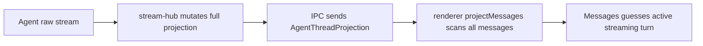
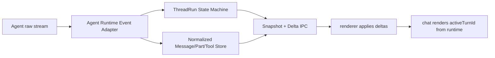

# Agent Thread Runtime v2 Goal

## 当前实现状态

Runtime v2 已成为 main / preload / renderer 的唯一 chat thread 状态通道：

- `src/shared/agent-thread-runtime.ts` 定义 thread snapshot、run state、runtime events 和 reducer。
- `src/main/agent/stream-hub.ts` 只维护 runtime state，并只发布 `AgentThreadEventBatch`。
- `src/main/agent/controller.ts` 只暴露 `agent:getThreadSnapshot`、`agent:subscribeThreadEvents`、`agent:unsubscribeThreadEvents`。
- `src/preload/api/agent.ts` 只暴露 `getThreadSnapshot` 和 `subscribeThreadEvents`。
- `src/shared/agent-projection.ts`、`getProjection`、`subscribeProjection`、旧 projection envelope 已删除。

renderer 仍保留 `message-projection.ts`，但它现在是纯 UI 展示投影：把 runtime snapshot/events 里的 messages、active run、tool/approval facts 投影成 chat display rows，不再承担 thread runtime 状态所有权。

## 目标

把 Openwork chat 从“renderer 根据全量 messages 猜当前状态”，升级为“main agent runtime 明确产出 thread 事实、run 状态、message delta、active turn”。

这不是单纯的 renderer 性能优化。它要解决的是 agent thread runtime 的状态模型问题：谁在运行、属于哪个 turn、产生了哪些 message / part / tool 事实、renderer 应该消费什么，都必须成为明确的系统边界。

## 要解决的问题

### 1. Active turn 错位

当前 renderer 通过 `isLoading + lastAssistantId` 推断哪个 turn 正在 streaming。这个推断在 assistant 第一 token 尚未出现时不可靠：新 user message 已经发送，但 renderer 仍可能把旧 assistant 所属 turn 当作 active turn。

正确的 owner 应该是 main agent runtime。用户发送消息后，runtime 应立即创建 active run，并明确：

- 当前 run 属于哪个 `turnId`
- 对应哪个 `userMessageId`
- assistant message 是否已经创建
- 当前 phase 是 thinking、streaming、tool running 还是 waiting approval

### 2. Projection 全量更新和 reopen 卡顿

当前 main 维护 `AgentThreadProjection.messages[]`，renderer 收到 projection 后再执行全量 message projection。长会话下，reopen、streaming token、tool update、approval update 都可能放大 IPC、projection CPU 和 React render 成本。

正确的 owner 应该是 agent thread event/state 模型：

- 历史消息是历史数据
- 当前 run 是运行状态
- streaming token 是 message part delta
- tool 和 approval 是结构化事实
- renderer 只 apply snapshot / delta，不重新理解整段 thread

## 当前 Openwork 现状

### main

当前 `AgentStreamHub` 是 projection authority。它从 `AgentStreamPayload` 中接收 `run_started`、`stream`、`done`、`cancelled`、`error`，再修改 `AgentThreadProjection`。

关键文件：

- `src/main/agent/service.ts`
- `src/main/agent/stream-hub.ts`
- `src/main/agent/controller.ts`
- `src/shared/agent-projection.ts`

现有协议的核心 shape 是：

```ts
export interface AgentThreadProjection {
  error: IpcErrorPayload | null
  isLoading: boolean
  messages: Message[]
  pendingApproval: HITLRequest | null
  runId: string | null
  status: AgentProjectionStatus
  subagents: Subagent[]
  threadId: string
  todos: Todo[]
  tokenUsage: AgentTokenUsage | null
}
```

这个 shape 对 renderer 友好，但它不是足够细的 runtime event protocol。尤其是：

- `isLoading` 只能说明“有东西在跑”，不能说明哪个 turn 在跑
- `messages[]` 是完整数组，不能表达 token/part 级增量
- `status` 只有 thread 级别，不足以表达 run phase
- `pendingApproval` 缺少和 active run / active turn 的一等绑定

### preload

当前 preload 暴露：

- `agent:getProjection`
- `agent:subscribeProjection`
- `agent:unsubscribeProjection`
- `agent:invoke`
- `agent:resume`
- `agent:cancel`

preload 只做 typed bridge，不应该持有 projection 状态，也不应该承担 event reducer。

### renderer

当前 `thread-context` 收到 `AgentThreadProjection` 后：

1. 稳定 message 引用
2. 稳定 pending approval / todos / subagents / token usage
3. 执行 `projectMessages(messages, previousProjection)`
4. 更新 thread store

`Messages` 再根据 projection 中的 `activeTurnKey`、`lastAssistantId` 和 `isLoading` 判断 streaming turn。

这导致 renderer 同时承担了两个不该承担的职责：

- 从 message 列表推断 agent run ownership
- 在每次 projection update 时重新扫描 message 历史

## 外部参考实践

### OpenCode：runtime 事实模型更清楚

OpenCode 的关键实践不是某个 UI 技巧，而是状态边界更清楚：

- assistant message 有 `parentID`，明确归属哪个 user message
- session status 独立为 `idle / busy / retry`
- streaming 使用 `message.part.delta`
- UI active message 先看 pending assistant 的 `parentID`
- 如果 assistant 第一 token 尚未出现，但 session 处于 busy，则回退到最后一个 user message

对应参考：

- `/Users/junjieding/dingjunjie_dev/2026_05/opencode/packages/opencode/src/session/message-v2.ts`
- `/Users/junjieding/dingjunjie_dev/2026_05/opencode/packages/opencode/src/session/status.ts`
- `/Users/junjieding/dingjunjie_dev/2026_05/opencode/packages/app/src/pages/session/message-timeline.tsx`

对 Openwork 的启发：

1. active turn 不应该由 renderer 猜。
2. assistant 必须一等归属到 user turn。
3. busy/running 状态必须独立于 assistant token 是否已经出现。
4. streaming delta 应该是协议事实，而不是 full message snapshot 的副作用。

### LobeHub：renderer store 和 virtual list 边界成熟

LobeHub 更值得学习的是 renderer 层的稳定性和 scroll intent：

- `displayMessages` 即使被 parse 重建，也用 `stabilizeReferences` 保留未变子树引用。
- conversation store 注册 virtua scroll methods。
- `scrollToBottom` 滚到真实最后一个 virtual item，而不只是最后一条 message。
- streaming item 和用户 selection item 会 `keepMounted`。
- BackBottom 位于 virtual list 外部，不被列表回收影响。

对应参考：

- `/Users/junjieding/dingjunjie_dev/2026_05/lobehub/src/features/Conversation/store/slices/data/stabilizeReferences.ts`
- `/Users/junjieding/dingjunjie_dev/2026_05/lobehub/src/features/Conversation/store/slices/data/action.ts`
- `/Users/junjieding/dingjunjie_dev/2026_05/lobehub/src/features/Conversation/store/slices/virtuaList/action.ts`
- `/Users/junjieding/dingjunjie_dev/2026_05/lobehub/src/features/Conversation/ChatList/components/VirtualizedList.tsx`

对 Openwork 的启发：

1. renderer store 要保持 message / block / tool 引用稳定。
2. scroll intent 应收口在 chat viewport 边界。
3. virtual list 负责 viewport 和测量，不负责解释 agent 状态。
4. LobeHub 的前端优化不能替代 Openwork 的 agent runtime 状态机升级。

## 目标架构

### 旧架构



### 新架构



## 模块边界

### AgentService

位置：`src/main/agent/service.ts`

职责：

- 执行 invoke / resume / cancel
- 管理 AbortController
- 连接 LangGraph 或其他 agent runtime
- 把 raw runtime output 交给 stream sink

不负责：

- 持有 thread projection
- 判断 active turn
- 维护 renderer display rows

### AgentStreamHub / AgentThreadRuntime

位置：`src/main/agent/stream-hub.ts`

目标职责：

- 作为 thread runtime reducer
- 接收 normalized agent events
- 维护 active run state machine
- 维护 normalized message / part / tool facts
- 生成 snapshot
- 发布 delta events
- 支持 subscriber late join
- 支持 history hydrate

不负责：

- React selector
- virtual list scroll strategy
- UI-specific display grouping

### Shared Protocol

位置：`src/shared/agent-projection.ts` 或新增 `src/shared/agent-thread-runtime.ts`

目标职责：

- 定义 `AgentThreadSnapshot`
- 定义 `AgentThreadEvent`
- 定义 `ActiveAgentRun`
- 定义 revision / cursor / pagination contract

不负责：

- main 内部 raw runtime adapter
- renderer component props

### Preload Agent API

位置：`src/preload/api/agent.ts`

目标职责：

- 暴露 typed IPC bridge
- 保持命令入口：invoke / resume / cancel
- 新增 snapshot / event subscription bridge

不负责：

- event reducer
- projection merge
- active run 推断

### Renderer Thread Store

位置：

- `src/renderer/src/lib/thread-context.tsx`
- `src/renderer/src/lib/thread-store-core.ts`
- `src/renderer/src/lib/message-projection.ts`

目标职责：

- apply snapshot
- apply delta events
- 保持 message / turn / display row 引用稳定
- 为 UI 提供 selectors

不负责：

- 解释 raw runtime stream
- 猜 active turn
- 每次 token 更新重扫全量 history

### Chat Viewport

位置：

- `src/renderer/src/components/chat/Messages.tsx`
- `src/renderer/src/components/chat/useVirtualChatScrollIntent.ts`
- `src/renderer/src/components/chat/ChatJumpToLatestButton.tsx`

目标职责：

- virtual list viewport
- bottom anchoring
- paused follow / jump to latest
- dynamic height measurement
- keep mounted active/selected rows

不负责：

- run 状态机
- assistant 和 user 的归属推断
- thread history pagination source of truth

## 核心状态模型

`turnId` 使用 user message id。这和 OpenCode 的 `assistant.parentID` 思路一致，避免额外映射层。

```ts
export type AgentRunStatus =
  | "idle"
  | "queued"
  | "running"
  | "waiting_approval"
  | "cancelling"
  | "completed"
  | "failed"
  | "cancelled"

export type AgentRunPhase =
  | "thinking"
  | "streaming"
  | "tool_running"
  | "waiting_tool_result"

export interface ActiveAgentRun {
  runId: string
  threadId: string
  turnId: string
  userMessageId: string
  assistantMessageId: string | null
  status: AgentRunStatus
  phase: AgentRunPhase | null
}
```

状态语义：

- `run.started` 后立即有 `activeRun.turnId`
- assistant 尚未出现时，`assistantMessageId = null`
- 第一段 assistant content 出现后，绑定 `assistantMessageId`
- tool call 开始后，phase 进入 `tool_running`
- HITL 出现后，status 进入 `waiting_approval`
- done / error / cancel 后，active run 结束

## 事件协议草案

```ts
export interface AgentThreadSnapshot {
  activeRun: ActiveAgentRun | null
  hasMoreBefore: boolean
  messagesPage: Message[]
  revision: number
  threadId: string
}

export type AgentThreadEvent =
  | {
      type: "thread.snapshot"
      revision: number
      snapshot: AgentThreadSnapshot
    }
  | {
      type: "run.started"
      revision: number
      run: ActiveAgentRun
    }
  | {
      type: "run.phaseChanged"
      revision: number
      runId: string
      phase: AgentRunPhase
    }
  | {
      type: "message.upserted"
      revision: number
      message: Message
    }
  | {
      type: "message.part.delta"
      revision: number
      messageId: string
      partId: string
      field: "text" | "reasoning" | "toolArgs"
      delta: string
    }
  | {
      type: "tool.started"
      revision: number
      runId: string
      toolCallId: string
      messageId: string
    }
  | {
      type: "tool.updated"
      revision: number
      runId: string
      toolCallId: string
      messageId: string
    }
  | {
      type: "approval.requested"
      revision: number
      runId: string
      approval: HITLRequest
    }
  | {
      type: "run.finished"
      revision: number
      runId: string
      status: "completed" | "failed" | "cancelled"
    }
```

## 行为结果

完成后应达到：

- renderer 不再判断哪个 turn 正在运行，只读 `activeRun.turnId`
- assistant 第一 token 未出现时，UI 仍准确显示新 user turn 为 active
- streaming token 不触发 full projection IPC
- reopen thread 默认加载 latest page + activeRun
- 历史分页由 thread runtime / store 协议支持，不由 virtual list 临时补洞
- `projectMessages` 不再是每个 agent event 的必经全量路径
- main `stream-hub` 从 projection mutator 升级为 thread runtime reducer

## 分阶段落地计划

### Phase 1：状态机补齐

目标：

- 在 main runtime 内部引入 `ActiveAgentRun`
- 修复 active turn 错位
- 尽量不改大协议

推荐改动：

- `src/shared/agent-projection.ts`
  - 给 `AgentThreadProjection` 增加 `activeRun: ActiveAgentRun | null`
- `src/main/agent/stream-hub.ts`
  - `prepareInvoke` 立即创建 active run
  - `run_started` 补 run id
  - assistant message 出现时绑定 `assistantMessageId`
  - tool / approval / done / cancel / error 更新 run status
- `src/renderer/src/lib/thread-context.tsx`
  - 保存 `activeRun`
- `src/renderer/src/lib/message-projection.ts`
  - active turn key 优先来自 `activeRun.turnId`
- `src/renderer/src/components/chat/Messages.tsx`
  - streaming 判断使用 runtime active turn

验收：

- 新 user message 发送后，即使 assistant 第一 token 延迟，active turn 仍是新 user turn。
- 旧 assistant 不再被错误标记为 streaming。
- launcher 和标准 history 表现一致。

### Phase 2：内部事件 reducer

目标：

- 让 `stream-hub` 内部先事件化
- 仍可生成旧 `AgentThreadProjection`
- 避免一次性跨层大爆炸

推荐改动：

- 新增 shared runtime event 类型
- `stream-hub` 内部用 reducer apply event
- 每次 event 都带 revision
- projection 从 runtime state 派生

验收：

- 旧 `subscribeProjection` 行为不回退。
- 单元测试覆盖 run started、assistant delta、tool started、approval requested、done、error、cancel。
- revision 单调递增。

### Phase 3：IPC snapshot + delta

目标：

- 新增真正的增量订阅协议
- 降低 streaming IPC payload 和 renderer parse 成本

推荐改动：

- `src/main/agent/controller.ts`
  - 新增 `agent:getThreadSnapshot`
  - 新增 `agent:subscribeThreadEvents`
  - 新增 `agent:unsubscribeThreadEvents`
- `src/preload/api/agent.ts`
  - 暴露 typed snapshot/event API
- 保留旧 `subscribeProjection` 一个短周期，但新 renderer path 走 event API

验收：

- streaming token IPC payload 不再包含完整 messages 数组。
- late subscriber 可先拿 snapshot，再从后续 revision 接 event。
- revision gap 能触发重新 snapshot。

### Phase 4：renderer store apply delta

目标：

- renderer 从 projection consumer 升级为 snapshot/delta mirror
- 局部更新 message / part / tool

推荐改动：

- `src/renderer/src/lib/thread-store-core.ts`
  - 增加 apply snapshot / apply event actions
- `src/renderer/src/lib/thread-context.tsx`
  - 使用新 agent API
- `src/renderer/src/lib/message-projection.ts`
  - 支持受影响 turn 的局部 projection
  - 保持 message / turn / display row 引用稳定

验收：

- 单 token update 不触发全量 `projectMessages(messages)`。
- React Profiler 中更新范围集中在 active turn / active row。
- 历史 message row 不因 active token 更新重渲染。

### Phase 5：历史分页

目标：

- 解决 reopen 长会话卡顿
- history loading 成为 thread runtime/store 协议的一部分

推荐改动：

- snapshot 默认返回 latest page
- 增加 `loadMessagesBefore(cursor)`
- renderer prepend older page 时保持 scroll anchor
- virtual list 只负责 viewport，不负责数据真相

验收：

- 1000 messages thread reopen 不出现明显主线程长卡顿。
- 向上滚加载历史不跳动。
- active run 不受历史分页影响。

### Phase 6：删除旧 projection 主协议

目标：

- 新协议成为唯一 renderer 主路径
- projection 退化为派生视图或调试对象

推荐改动：

- launcher 和标准 history 都切到 snapshot/event path
- 删除 renderer 对旧 full projection 的主依赖
- 清理旧 compatibility path

验收：

- 代码中没有长期并存的两套 chat runtime 协议。
- `AgentThreadProjection.messages[]` 不再是 streaming 主通道。

## 性能验收标准

- 1000 messages thread reopen 没有明显长卡顿。
- streaming token update 不发送完整 messages array。
- 单 token update 不触发全量 message projection。
- 历史 rows 在 streaming 时不重渲染。
- active row markdown / tool cluster 可以更新，但更新范围必须局部。
- jump to latest、paused follow、切线程恢复位置在 launcher 和标准 history 中一致。

## 功能验收标准

- 新消息发送后，assistant 第一 token 出现前，active turn 指向新 user turn。
- assistant streaming 后，active run 绑定 assistant message。
- tool running、tool result、approval interrupt、resume、cancel、error 都能从 runtime 状态机解释。
- pending approval 明确归属 run / turn / tool call。
- 切线程、关闭 launcher、重新打开 launcher 后，active run 和 latest page 恢复正确。

## 架构验收标准

- active streaming 状态 owner 在 main agent runtime，不在 `Messages` 组件。
- renderer 不依赖 LangGraph / AG-UI raw stream shape。
- preload 不持有状态，只做 typed bridge。
- projection 是派生视图，不是跨进程主协议。
- virtual list 只负责 viewport/rendering，不负责 agent 状态推断。
- 不引入无设计的跨层 prop drilling。
- 不长期保留两套协议和两套组件作为“兼容设计”。

## 非目标

- 不在本方案中重写 markdown renderer。
- 不在本方案中重做 tool UI 样式。
- 不在本方案中修改 BDD 全局夹具。
- 不把 renderer virtual list 当成 agent 状态机的替代品。
- 不为了未来可能的云同步提前抽象远端 event store。

## 最终结果

这项工作完成后，Openwork 应该拥有一个清楚的 agent thread runtime：

- runtime 知道当前 run
- run 知道当前 turn
- turn 由 user message id 定义
- assistant message 归属到 turn
- streaming 是 part delta
- tool / approval 是结构化事件
- renderer 是 snapshot/delta mirror
- chat viewport 是纯渲染和滚动边界

这会同时解决 active turn 错位、长会话 reopen 卡顿、streaming 历史重渲染，以及后续 queue / interrupt / tool waiting / resume 等 agent 能力继续演进时的状态归属问题。
