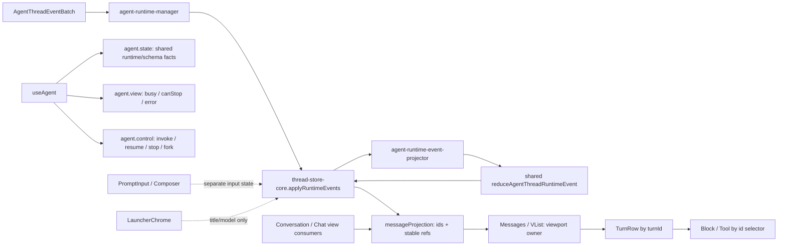
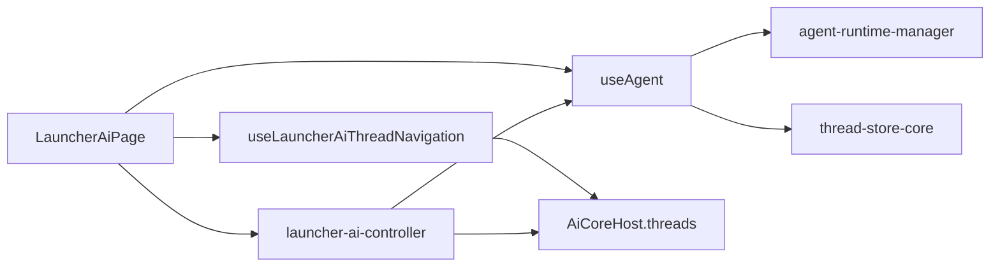

# AI Launcher 流式渲染性能边界设计稿

这份文档记录 `Trace-20260606T100830.json.gz` 这次性能分析后的设计约束。

目标不是先修某个 `memo` 或 `useCallback`，而是在动代码前把 AI launcher 流式任务的单向数据流、状态 owner、projection 边界和验收标准钉住，避免后续实现重新滑回“page 层猜数据、组件层层 fallback、整棵树被 token delta 拖动”的状态。

## 背景判断

这次 trace 的核心结论：

- 主卡顿在 renderer main thread 的 JS / React work，不是 GPU 或 layout/paint 主导。
- `virtua` 本身不是根因；问题在于 Openwork 只学到 LobeHub 的虚拟列表和部分 reference stabilization，没有完整学到 selector ownership。
- 流式 token delta 进入 renderer 后，当前路径会牵动 `LauncherChrome`、composer、footer、`Messages`、activity cluster 和 tool subtree。
- 当前最危险的方向是继续补局部 fallback 或局部 memo，而不是先收状态边界。

## V2 优化 Goal

重建 AI launcher 的 `runtime shared state -> derived view -> component` 单向数据流，清掉当前 renderer 里状态归属混杂、重复派生和过度 fallback 的路径。

AI launcher 前端只保留三类数据：

```ts
thread.agent
// runtime/schema-backed shared state
// messages, todos, approvals, subagents, artifact refs, activeRun...

thread.view
// renderer derived view
// messageProjection, waiting assistant row, tool badge, subagent groups...

thread.ui / component local state
// launcher shell local state
// activeTab, open files/panels; composerText stays component-local
```

`thread.agent` 不是后端只读 source，而是由 runtime 仲裁的 shared state。后端 agent / middleware 可以写入；前端如果要修改，只能通过 `control.updateState / invoke / resume / stop` 这类命令进入 runtime，再由 event/snapshot 回流更新 store。renderer store 不能自己补一份“看起来像 agent state”的状态。

目标数据流：

```txt
runtime events / snapshots
  -> thread.agent
  -> thread.view
  -> components
```

反向只允许：

```txt
components / controller
  -> control command
  -> runtime
  -> events / snapshots
```

当前要清理的是仍然存在的边界问题：

- `ThreadState` 中 shared state、derived view、local UI state 的归属要明确。
- `view` 只能从 `thread.agent` 派生，不能反推或补写 shared state。
- `toolExecutions` 继续从 messages / activeRun / pendingApproval 派生，不新增 agent state。
- `subagents / artifacts / approvals / todos` 作为 runtime shared state 的一等事实，不靠组件从文本或 tool call 猜。
- `MessageTurnView` 只负责展示派生等待态，例如 running 但 assistant message 还没出现。
- `useAgent` 保持薄：当前 thread 的运行态和命令 facade，不做 projection，不造大状态包。
- `useThreadSelector` 可以保留，但职责限定为 selector 订阅，并验证流式 token 更新不会扩大刷新范围。
- 文档里的历史删除项只能作为禁回归说明；代码里已经删掉的 `useAiThread / thread-runtime-adapter` 不再作为当前待办。

验收标准：

- 没有 renderer 侧重复 shared state。
- 没有组件层猜 runtime 状态。
- 没有为了兜底而保留的旧 fallback 分支。
- 流式 token 更新只刷新消息相关视图，不刷新整个 launcher。
- typecheck 和目标测试通过。
- 最后用 trace 或 profiler 复核卡顿链路。

## 目标数据流

### Runtime 到视图



### Launcher 命令层



原则：

1. `useAgent` 只做 React runtime adapter：连接/订阅 thread runtime 状态，暴露 `invoke / resume / stop` 这类窄命令。
2. launcher 的 submit、branch、前后切换、新建草稿、审批恢复由无 hook 的 controller 编排。
3. `LauncherAiPage` 是组合层，只收集 hook 依赖和渲染 shell，不重新拥有 agent 运行状态。
4. 不再恢复 `useAiThread` / `useLauncherAiController` 这种“大 hook 返回 conversation/controller 全家桶”的形态；这些是已删除的禁回归项，不是当前待删目标。

### `useAgent` 三段接口

目标接口：

```ts
agent.state // runtime/schema-backed shared state: graph channels + runtime state
agent.view // 前端派生视图: messageProjection, tool/subagent/fork view, isBusy, canStop
agent.control // 命令: invoke, stop, resume, fork
```

边界定义：

- `agent.state` 承载 runtime/schema-backed shared state：一部分来自 LangGraph `stateSchema`，一部分来自 runtime state schema / durable product refs。当前稳定 graph channel 是 `messages`、`todos`、`title`、`artifacts`；runtime fact 必须由后端结构化生产，不能由前端猜。
- `agent.state` 不是后端只读 source。前端可以通过真实 `agent.control.updateState(...)` 之类命令请求修改 shared state，但不能直接在 renderer store 里补写一份假状态。
- `agent.view` 只承载 renderer 为展示派生的 view model，例如 `messageProjection`、`toolExecutions`、`subagent view`、`fork view`、`isBusy`、`isLoading`、`canStop`、`error`。
- `agent.control` 只承载命令，不拥有展示状态，也不制造 renderer-only shared state。
- 只需要发命令的 caller 走 `agent-control.ts` 普通命令层，不调用 `useAgent`，避免为了 `invoke` 订阅 `messageProjection/messages/todos`。
- `messageProjection` 不能进入 `agent.state`，它是 display projection，不是后端 `stateSchema`。
- `pendingApproval` 使用现有 runtime interrupt 事实，进入 `agent.state.pendingApproval` 并驱动 `agent.control.resume`；当前不新增 LangGraph `approvals` schema channel。
- `subagents` 是后端 runtime 生产的结构化委派运行事实，不是前端从 tool 文本猜出来的状态；它属于 `agent.state.subagents`，再派生 `agent.view.subagents`。
- `toolExecutions` 当前不进入 `agent.state`。它是 renderer view：从 `messageProjection` 的 assistant tool calls / tool results、`activeRun` 和 `pendingApproval` 派生；`tool.started` / `tool.updated` 只更新 runtime run phase，不额外维护一份后端 tool execution store。
- `fork` 相关的 checkpoint、policy、capability 属于 runtime/checkpoint/control 边界；按钮状态、禁用原因、当前选择态进入 `agent.view.fork`，执行动作进入 `agent.control.fork`，不进入 `agent.state`。
- `artifacts` 当前由 `present_artifacts` middleware 写入真实 `stateSchema.artifacts`，同时通过 `ArtifactsService` 持久化 artifact 内容。`stateSchema.artifacts` 只放 manifest / receipt / status 这类轻量事实；artifact content 不进入 LangGraph state。内容只能通过 `ArtifactsService` 的 read/open API 读取，底层可能是 artifact 表 payload、managed file，或 external URL handle。
- `updateState` 是未来命令层目标，但必须等 main/runtime 有真实 graph state update 路径后再暴露；禁止在 renderer 做一个假 `updateState` 兜底。

### CopilotKit v2 对照结论

CopilotKit v2 的关键不是“所有东西都是 hook”，而是：

- `AbstractAgent / ProxiedCopilotRuntimeAgent / IntelligenceAgent` 持有 `messages / state / isRunning`。
- `CopilotKitCore.subscribeToAgentWithOptions(agent, ...)` 订阅 agent，支持 throttle 和 lifecycle callback。
- `useAgent` 只是 React runtime adapter：解析 agent、订阅 agent、触发 re-render，返回 `{ agent }`。
- `CopilotChat` 调 `agent.addMessage(...)` 和 `copilotkit.runAgent({ agent })`，再把 `agent.messages / agent.isRunning` 传给 view。
- `CopilotChatView` 是展示层，不反向归约 runtime。

对应到 Openwork：

- 后端 IPC runtime 不能再由页面显式猜 `ensureThreadRuntime` 时机。
- renderer 不应该恢复一个叫 `thread-runtime-adapter` 的长期层；当前代码已删除，文档只把它作为禁回归项。
- 当前实现已把 runtime connect / revision gap / replay / snapshot load 收到 `agent-runtime-manager`。
- `useAgent` 负责连接当前 thread runtime，并向 Chat/Launcher 暴露 `state / view / control` 三段接口。
- `ThreadProvider` 只保留 store/provider/context 薄壳，不再内联 runtime event 订阅和 resync 状态机。

### Openwork `stateSchema` 当前事实

`createAgent` 的 graph state 不是前端随便命名的对象：

- LangChain `createAgent` 内建 `messages` channel。
- `todoListMiddleware()` 声明自己的 `stateSchema`，当前已经贡献 `todos` channel。
- `createTitleMiddleware()` 声明 `title` channel。
- `createSubAgentMiddleware()` 当前提供 `task` tool 和 subagent 调用编排；它本身没有声明 `stateSchema`，不会自动贡献 `subagents` graph channel。
- middleware schema 会和 root `stateSchema` 合并；没有明确产品需求时，不新增根 schema 字段。
- HITL 审批当前来自 runtime values 里的 interrupt。它是 runtime fact，前端公开为 `agent.state.pendingApproval`、approval view 和 resume command input；当前不是新建的 LangGraph `approvals` schema channel。
- `subagents` 当前来自 `task` tool call 生命周期：main runtime 识别 `task` tool call / tool result，发出结构化 runtime event。它是运行态委派事实，前端公开为 `agent.state.subagents` 并派生 `agent.view.subagents`，当前不是 graph state channel。
- `createArtifactToolsMiddleware()` 声明 `artifacts` channel。`present_artifacts` tool 调用 `ArtifactsService` 持久化内容，并返回 `Command.update.artifacts`，只更新 manifest / receipt / status；artifact content 只能通过 artifact service/API 读取，不进入 LangGraph state。参考 DeerFlow 的正确理解是：`stateSchema.artifacts` 存 refs/paths，artifact 内容走 `/artifacts/{path}` 这类 API。

### SubAgent 状态决策

`subAgent` 需要状态，但要分清三件事：

```ts
agent.state.subagents // 后端结构化委派事实，由 runtime 生产
agent.view.subagents // 前端展示投影，由 agent.state.subagents 派生
agent.control // 当前不直接控制 subagent；通过主 agent invoke / stop / resume 间接控制
```

当前不新增 `stateSchema.subagents`，原因是：

- DeepAgents 的 `createSubAgentMiddleware()` 负责提供 `task` tool，并把 subagent 最终输出作为 `ToolMessage` / `Command.update` 回到主图；它不是一个内建 `subagents` shared-state channel。
- Openwork 应由 main/runtime 生产结构化 subagent run facts，表达当前 run 的委派进度，适合驱动 UI 进度、references、kanban 和右侧面板。
- 如果未来产品要让 subagent 成为可恢复、可审计、可由前后端共同修改的 durable work item，再设计新的 graph/shared state channel；到那时应该替换当前 runtime-only 形状，而不是额外叠一个同名字段。

因此前端目标不是继续把 raw `Subagent[]` 分散喂给 `SubagentPanel`、`SubagentReferencesPanel`、`KanbanView` 后各算一遍，而是集中派生一个 `subagent view`：

- active / completed / failed counts。
- references list item：`id / title / detail / meta / status`。
- panel groups：running、completed、failed。
- kanban items：带 parent thread 的可展示卡片。

这些都属于 `agent.view` 或对应 feature 的 selector projection，不属于 `agent.state`，也不属于后端 `stateSchema`。对应的 raw subagent run facts 属于 `agent.state.subagents`。关键约束是：view 必须从后端结构化 runtime facts 派生，不能从 tool 文本、tool result 字符串或组件局部 fallback 猜出来。

### Agent 数据边界

对 `useAgent` / controller / view 来说，数据面只有两类：

```ts
agent.state // runtime/schema-backed shared state: graph state + runtime state + durable refs
agent.view // 前端从 agent.state 派生的展示模型
```

`graph state`、`runtime state`、`durable product refs` 不是三种前端状态类型，而是 `agent.state` 背后的不同 runtime owner。UI 组件不应该直接关心它们来自 LangGraph channel、runtime event，还是 artifacts DB；这些差异要收在 runtime/controller/manager 边界里。

`agent.state` 是数据语义，不是 React 订阅形状。一个 caller 只需要命令，就走 `agent.control`；只需要 approval view，就只订阅 approval view；只需要 artifacts view，就只订阅 artifacts view。不能因为概念上 `agent.state` 包含 messages / todos / subagents / artifacts，就让 `useAgent()` 默认把全量 state 和 projection 都拉进每个页面。

判断一个前端推导是否应该从 `agent.view` 升级为 `agent.state`，按这个顺序问：

1. agent / 后端是否也需要读写这个事实？
2. 这个事实是否影响继续、恢复、审批、取消、审计或跨视图一致性？
3. 这个事实是否只能从 messages / tool calls / raw result 里倒推，导致多个前端组件各猜一遍？
4. 如果它丢失，系统是只少一个展示效果，还是会误导任务状态？

结论表里的“后端来源”只是实现 owner，不是前端类型：

| 事实 | agent 层 | 后端来源 / owner | 决策 |
| --- | --- | --- | --- |
| `messages` | `agent.state` | LangChain built-in channel | 保持第一公民。 |
| `todos` | `agent.state` | `todoListMiddleware().stateSchema` | 保持第一公民；工具卡片里从 args 展示 todo 预览只是局部 view。 |
| `title` | `agent.state` | `createTitleMiddleware().stateSchema` | 保持第一公民。 |
| `pendingApproval` | `agent.state.pendingApproval` + `agent.control.resume` | runtime interrupt / `__interrupt__` | 是第一公民 runtime state，但当前不进 LangGraph schema；不新增 `approvals` schema。 |
| `subagents` | `agent.state.subagents` -> `agent.view.subagents` | `task` tool call 生命周期 / runtime events | 是第一公民 runtime state；集中派生 view，暂不进 graph `stateSchema`。 |
| tool execution status | `agent.view.toolExecutions` | `messages` / tool results + `activeRun` + `pendingApproval` | 是展示级第一公民，但不是 shared state；统一由 renderer projection 派生，组件不各自猜 running / approval / complete。 |
| `artifactRefs` / artifact manifest | `agent.state.artifacts` | `createArtifactToolsMiddleware().stateSchema` + `present_artifacts` tool + `ArtifactsService` | artifact refs/receipt/status 是 shared state；artifact content 不进 LangGraph state。DeerFlow 的 `stateSchema.artifacts` 是 refs/paths，内容走 artifact API；Openwork 当前只写 manifest / receipt / status。 |
| `fork` capability / checkpoint fact | `agent.view.fork` + `agent.control.fork` | backend snapshot / runtime control policy | 应收口为 runtime/control fact；UI 可以派生禁用展示，但不能拥有 fork policy，也不进 schema。 |
| `isBusy` / `canStop` / loading text | `agent.view` | `activeRun`、`pendingApproval`、local preparing | 留在 `agent.view`。 |
| `messageProjection` / rows / block groups | `agent.view` | `messages` + runtime facts | 留在 renderer projection。 |
| `openFiles` / `openArtifacts` / composer text | 非 agent 数据 | 用户本地 UI 操作 | `openFiles/openArtifacts` 留在 shell thread UI；composer text 只留在 component local state，不进 `agent.state`。 |

这意味着真正需要继续大刀清理的不是新增一堆 schema 字段，而是把前端正在猜的运行事实收回 runtime：

- `subagents`: 已有 runtime state；前端 view 要继续集中到 selector projection，不能让 panel、references、kanban 各自从 raw tool 文本猜。
- `toolExecutions`: 不落 runtime shared state。shared state 只保留 `messages`、`activeRun`、`pendingApproval` 等事实；renderer 在 `messageProjection` 之后统一派生 `agent.view.toolExecutions`，pending approval 覆盖同一个 `toolCallId` 的 view status，不制造重复 entry。`Messages` / tool row 只消费 view status，不反推 shared state。
- `artifact receipts`: 已有 durable artifact records 和 `stateSchema.artifacts`，但 renderer 还没有从 runtime values stream 解码 artifacts view；工具 detail 不应再长期通过 args + key 拼 receipt。
- `forkState`: 已有 snapshot fact，但 `useAgent` 里还在补 effective policy，应该收口到 runtime/control 边界。

当前 Openwork `stateSchema` 暂定只保留：

```ts
messages // built-in
todos // todoListMiddleware
title // createTitleMiddleware
artifacts // createArtifactToolsMiddleware; manifest / receipt / status only
```

当前 Openwork 应由 runtime/product owner 生产、进入 `agent.state` 的 facts：

```ts
activeRun -> agent.state.activeRun -> agent.view.isBusy / agent.view.canStop
pendingApproval -> agent.state.pendingApproval -> agent.control.resume
subagents -> agent.state.subagents -> agent.view.subagents
tokenUsage -> agent.state.tokenUsage -> agent.view.tokenUsage
```

其中 `subagents` 是 runtime/product fact，不是 LangGraph schema 字段；实现时要优先删除/替换现有前端猜测路径，避免在旧结构上叠新结构。

当前 Openwork 应由 renderer projection 生产、进入 `agent.view` 的 facts：

```ts
messageProjection -> agent.view.messageProjection
toolExecutions -> agent.view.toolExecutions // from messages + activeRun + pendingApproval
```

当前 Openwork 应由 runtime/checkpoint/control 拥有、但不进入 `agent.state` 的 facts：

```ts
forkCapability / checkpoint metadata -> agent.view.fork + agent.control.fork
```

当前 Openwork artifact facts：

```ts
artifactContent // read/write through ArtifactsService; not LangGraph state
artifactRefs / manifest / receipt / status -> stateSchema.artifacts -> agent.state.artifacts
```

DeerFlow 的 artifacts 是“双层表达”：graph `ThreadState.artifacts` 是 `string[]` 路径引用，`present_files` tool 只把 normalized paths 写入 state；真正文件内容由 artifacts router / artifact API 读取。Openwork 当前也采用这个原则：后端已有真实 `stateSchema.artifacts` 和 reducer，只放 refs / manifest / receipt / status / storage handle；内容通过 `ArtifactsService` 读取，底层存储实现不改变它“不属于 LangGraph state”的语义。不能在 renderer 把 DB artifacts 包装成一个假的 stateSchema 字段。

后续如果要支持 `agent.control.updateState(...)`：

1. 先定义要开放给 UI/agent 共写的 state channel。
2. 让 channel 进入真实 `createAgent({ stateSchema })` 或 middleware `stateSchema`。
3. main/runtime 暴露真实 graph state update 入口。
4. renderer 只能通过 `agent.control.updateState` 发命令，不直接改 `agent.state`。
5. `thread_values` 只能在明确设计后作为持久化/恢复机制使用，不能被当成前端 fallback。

原则：

1. runtime facts 只往下流。
2. renderer store 拥有稳定状态和 display projection。
3. viewport 只拥有滚动、虚拟列表和底部几何。
4. block/tool 子树按 id 订阅自己的 slice。
5. composer 不消费 streaming projection。
6. fallback 必须有明确触发条件、失败语义和可观察信号。

## 分层职责

### 1. `AgentThreadEventBatch`

职责：

- 表达 runtime facts：run、revision、message delta、tool、approval、todos。
- 保持运行事实和 UI 展示形态分离。

禁止：

- 携带 viewport / composer / footer 形状。
- 让 UI 组件反向影响 runtime state 是否成立。

### 2. `agent-runtime-manager`、`agent-runtime-event-projector`、`agent-runtime-snapshot-reducer` 和 `thread-store-core`

职责：

- `agent-runtime-manager` 拥有 IPC runtime connect、event batch、revision gap resync、snapshot load。
- `agent-runtime-event-projector` 复用 shared `reduceAgentThreadRuntimeEvent` 处理 runtime events，然后把结果映射成 `ThreadState.agent` 和 `ThreadState.view.messageProjection`。
- `agent-runtime-snapshot-reducer` 把非运行态 snapshot 数据映射成 `ThreadState` 可接受的状态变化；busy/interrupted 的运行事实不能由 snapshot reducer 生产。
- `thread-store-core` 拥有 renderer thread state。
- 输出稳定 `ThreadState`。
- 维护 renderer display projection，但 projection 仍然只是 display data，不是 React component tree。

当前相关入口：

- `src/renderer/src/lib/agent-control.ts`
- `src/renderer/src/lib/agent-runtime-manager.ts`
- `src/renderer/src/lib/agent-runtime-event-projector.ts`
- `src/renderer/src/lib/agent-runtime-snapshot-reducer.ts`
- `src/renderer/src/lib/thread-context.tsx`
- `src/renderer/src/lib/thread-store-core.ts`
- `src/shared/agent-thread-runtime.ts`

### 3. `messageProjection`

职责：

- 从 raw messages 派生 display projection。
- 尽量保持引用稳定，让 unchanged subtree 可以 bailout。
- 逐步从 `displayRows: [{ turn }]` 过渡到 `rowIds / turnIds / blockIds / toolIds + stable maps/selectors`。

禁止：

- 把 UI 行为策略混进 projection。
- 让下游组件拿整颗 `turn` 后继续猜 block/tool shape。
- fast path miss 后静默全量重建且没有任何可观察信号。

当前相关入口：

- `src/renderer/src/lib/message-projection.ts`
- `src/renderer/src/lib/thread-message-stability.ts`
- `src/renderer/src/lib/stabilize-references.ts`

### 4. `Messages / VList`

职责：

- 拥有 viewport。
- 管理 `VList`、`VListHandle`、scroll intent、bottom inset、tail spacer、jump to latest。
- 当前按 stable `displayRows` 渲染虚拟行，并把 turn row 收口到 `MessageTurnRow`。后续如果继续做 Phase 3，再把 `displayRows` 完整收紧为 `rowIds / turnIds / stable maps`。

禁止：

- 同时承担 turn decomposition、tool result 分发、activity expansion 全局编排。
- 从 parent 接收每轮变化的 footer ReactNode。
- 把整颗 `turn`、`toolResults`、inline handler 继续往下传。
- 从 parent 接收 `pendingApproval` 再逐层传给 tool row；approval 归属在 `agent.state.pendingApproval`，工具行应在 row/tool owner 内按需要 selector。

当前相关入口：

- `src/renderer/src/components/chat/Messages.tsx`
- `src/renderer/src/components/chat/useVirtualChatScrollIntent.ts`

### 5. `Turn / Block / Tool`

职责：

- 只渲染自己的展示切片。
- 按 `turnId / blockId / toolCallId` 自订阅。
- tool result、approval、tool args 只让对应 tool subtree 更新。

禁止：

- `AssistantActivityCluster` 通过 parent props 接收整组 `items/toolResults` 后每个 tick 重新 render。
- `ActionMessage` 只因为 `onExpandedChange` 新闭包或 parent activity props 改变而 render。

### 6. `PromptInput / LauncherChrome`

职责：

- composer 只关心 input、attachment draft、pending approval、busy/canStop 这类窄状态。
- chrome 只关心标题、模型、导航和 launcher shell 状态。

禁止：

- 因 assistant token delta 重建 composer children、tooltip tree、headerLeading。
- 通过 `conversation` 大对象把 message projection 泄漏到 page 层。

## 越界点与禁回归项

### 1. 大 hook 返回 `conversation/controller` 全家桶

历史文件样本（当前代码已删除，只作为禁回归样本）：

- `src/renderer/src/ai-core/useAiThread.ts`
- `src/renderer/src/ai-core/useLauncherAiController.ts`

问题：

- `messageProjection / todos / pendingApproval / input / error / isLoading` 被揉成一个 page-level 对象。
- 下游 `LauncherAiPage` 订阅后，token delta 不只影响消息列表，也会影响 composer/chrome/action wiring。
- 把 controller 做成 hook 后，React 订阅、命令编排、导航状态又被揉到同一层，等于把 `useAiThread` 换了个名字。

正确方向：

- `useAgent` 保持窄 React runtime adapter。
- launcher 命令编排放到无 hook 的 `launcher-ai-controller.ts`。
- navigation 可以保留为 hook adapter，但只拥有 thread target / adjacent thread state。
- conversation surface、composer surface、chrome surface 分别订阅自己需要的 slice。
- Chat/Launcher 的消息列表投影只进入 conversation/chat view consumer，不进入 `useAgent`，也不进入 page/controller/chrome。
- `Messages` 自己按 `threadId` 订阅 `messageProjection`；conversation/chat viewport 父层只订阅 `hasVisibleTurns`、`displayRowCount` 这类 primitive，不能再通过 props 传整颗 projection。
- `Messages` 不接收 `pendingApproval`；审批展示由 turn/tool owner 从 store 中按 turn/tool 关联读取。

当前约束：

- `useAiThread` 已删除，不允许恢复。
- `useLauncherAiController` 已删除，不允许用大 hook 代替 controller/manager。

### 2. `LauncherAiPage` 同时拥有 chrome、conversation、composer

文件：

- `src/renderer/src/ai-core/LauncherAiPage.tsx`

问题：

- page 层是 streaming subscriber。
- inline `headerLeading`、composer children、PromptInput style、action handlers 都会随 page render 重建。

正确方向：

- page 只做 shell 布局。
- `ConversationSurface` 订阅 projection/viewport 必需状态。
- `ComposerSurface` 订阅 input/busy/approval 必需状态。
- `ChromeSurface` 订阅 title/model/nav 必需状态。

### 3. footer row 每轮接收新 ReactNode

文件：

- `src/renderer/src/ai-core/LauncherAiConversation.tsx`
- `src/renderer/src/components/chat/Messages.tsx`

问题：

- footer 作为 VList tail row 是正确方向，因为 bottom geometry 要进入 list 坐标系。
- 旧实现里 `footerSlot` 由 parent 每次 render 创建，trace 里 `Messages.footerSlot` 每轮都变。

当前约束：

- `Messages` 不接收 `footerSlot` ReactNode。
- footer row 通过稳定 `renderFooter` 入口渲染具体 footer component。
- footer component 内部按 `threadId / runId / todos / subagents / error` 订阅自己展示所需状态。

正确方向：

- 保留 tail row。
- footer row 内部按 `threadId / runId / todos / subagents / error` 自订阅。
- parent 不传每轮变化的 ReactNode。

### 4. `Messages` 同时承担 viewport 和业务分发

文件：

- `src/renderer/src/components/chat/Messages.tsx`

问题：

- `Messages` 是 viewport owner，却同时做 active turn lookup、activity expansion map、turn decomposition、tool result 分发。
- `VList` data 携带完整 `turn`，不是 row id。

正确方向：

- `Messages` 只接收 row ids / viewport state。
- row renderer 只把 id 交给 `TurnRow`。
- `TurnRow / Block / Tool` 自己 selector。

当前已落地：

- `Messages` 自己订阅 `displayRows`、`activeTurnKey`、`latestTurnKey`、`visibleTurnCount`，父层不再传整颗 projection。
- `MessageTurnRow` 按 `turnKey` selector 读取对应 turn，并按当前 turn 的 tool ids 订阅 `agent.view.toolExecutions` 签名。
- `Messages` 不再接收 `pendingApproval`，approval request 在 row 内按 turn 归属读取。

### 5. activity/tool handler 引用每 tick 变化

文件：

- `src/renderer/src/components/chat/Messages.tsx`
- `src/renderer/src/components/chat/ActionMessage.tsx`

问题：

- `AssistantActivityCluster.onExpandedChange` 在 trace 中每次更新都变化。
- `ActionMessage` 很多 render 并不是因为 result 变化，而是父级 handler 和 activity props 变化。

正确方向：

- expansion 属于局部 UI 状态或 keyed UI store，不应由 `Messages` 作为全局 map 逐层传入。
- tool 组件按 `toolCallId` 读取 result/approval。

### 6. projection fast path fallback 没有观测

文件：

- `src/renderer/src/lib/agent-runtime-event-projector.ts`

问题：

- `updateProjectedMessage(...) ?? projectMessages(...)` 可以作为正确性 fallback。
- 但如果 fast path 经常 miss，当前没有信号暴露，会掩盖 reference stability 失败。

正确方向：

- 保留 fallback，但在 dev/debug 下计数。
- 记录 miss 原因：tool message、unknown assistant、turn not found、shape changed、revision gap 等。

## 允许的 fallback

允许保留，但必须有清楚语义：

- runtime revision gap -> resync / replay。
- projection fast path miss -> full `projectMessages`，但 dev/debug 下必须可观测。
- viewport 测量中 `virtua` API 不可用 -> DOM measurement fallback，但只能封在 scroll owner 内部。
- final snapshot / footer growth -> 由 viewport 的 row observation 处理，不能让 page 猜滚动状态。

## 不允许的 fallback

后续实现中不要再加：

- page 层根据“可能有/可能没有”猜 message shape。
- 子组件收到整颗 `turn` 后自己再修复 block/tool shape。
- projection 失败后静默全量重建且无信号。
- 为了避免 null/error 把真实边界问题包装成“还能跑”。
- 在 hot render/scroll path 默认写 IPC 或磁盘诊断。

## 改造顺序

### Phase 1：拆 page 宽订阅

目标：

- `LauncherAiPage` 不再因为 token delta 重建 composer/chrome。

动作：

- 拆 `ConversationSurface`、`ComposerSurface`、`ChromeSurface`。
- 每个 surface 只调用自己的 selector。
- 消除 `conversation` 大对象在 page 层的传播。
- `useAgent` 成为 runtime connect + approval/busy/control 的窄 React adapter；`messageProjection` 只进入 conversation/chat viewport 订阅。
- 删除独立 `stream loading` 状态源，loading 只从 `activeRun.status` 推导。

验收：

- 流式 token delta 时，`PromptInput` render count 接近 `0`。
- `LauncherChrome` 不因 token delta render。
- `LauncherAiPage` / `ChatContainer` 外层不直接订阅 `messageProjection`。
- `LauncherAiConversationViewport` / `ChatThreadViewport` 不接收或传递整颗 `messageProjection`，只用 primitive selector 驱动 empty state、jump button 和 virtual item count。

### Phase 2：收 footer 边界

目标：

- footer 仍在 VList tail row 内，但不由 parent 每轮创建 ReactNode。

动作：

- 新建 chat footer row component。
- footer row 内部按 thread/run/todo/subagent/error selector 自订阅。
- `Messages` 不再接收不稳定 footer ReactNode。

验收：

- `Messages` changed props 不再出现每 tick 的 `footerSlot`。
- footer growth 仍然能保持 bottom follow。

### Phase 3：调整 projection shape

目标：

- projection 输出从 object tree props 转向 ids + stable refs/selectors。

动作：

- `displayRows` 当前已经是 `turnKey + footer row`，不再携带完整 `turn`。
- `MessageTurnRow` 按 `turnKey` selector 读取对应 turn。
- turn 内部仍有 `assistants/toolResults` object shape；后续如果继续深拆，再把 block/tool 建成更细 stable lookup。

验收：

- active assistant token delta 不重建 `displayRows`，也不改变 inactive turn refs。
- `tests/node/message-projection.test.ts` 覆盖 `streaming assistant fast path keeps long history rows and inactive turns stable`。
- `tests/node/thread-store-core.test.ts` 覆盖 `runtime token delta in long history keeps inactive turns and rows stable`。
- projection fast path miss 有 dev/debug 计数。

### Phase 4：tool/activity 自订阅

目标：

- tool result 只更新对应 tool subtree。

动作：

- `AssistantActivityCluster` 接收 ids，而不是整组 `items/toolResults`。
- `ActionMessage` 按 `toolCallId` selector 读取 toolCall/result/approval。
- expansion 状态下沉或 keyed 化。

验收：

- `ActionMessage` 只在对应 `toolCallId` 的 result/approval/tool args 变化时 render。
- `AssistantActivityCluster.onExpandedChange` 不随 streaming tick 变化。

### Phase 5：可观察性和回归保护

目标：

- 后续不会在不知情的情况下退回全量重建。

动作：

- 增加 projection fast path miss debug counter。
- 增加 render-count dev guard 或 trace checklist。
- 保留关键 projection identity 测试。

验收：

- production trace 中 Renderer main 的 React long tasks 明显下降。
- debug 下能看到 projection full reproject 频率。

## Trace 里的关键验收指标

这次 trace 暴露出的坏信号：

- `Messages` render 中 `footerSlot` 每轮变化。
- `Messages` render 中 `onRetry` 每轮变化。
- `PromptInput` render 中 `children / style / onSubmit` 每轮变化。
- `LauncherChrome` render 中 `headerLeading / children / shellConfig` 每轮变化。
- `AssistantActivityCluster` render 中 `onExpandedChange` 每轮变化。
- `ActionMessage` 多数 render 不是由 result 变化触发。

改造后要反向验证：

- streaming token delta 不触发 composer/chrome。
- viewport 只因 row ids、scroll state 或 active row signature 变化而更新。
- tool result 只触发对应 tool。
- footer growth 仍由 tail row / viewport 处理，不回到 page 层猜测。

## LobeHub 对照原则

LobeHub 值得参考的不是“用了 virtual list”，而是这条链：

```text
raw/db messages
  -> conversation-flow parse
  -> stabilizeReferences
  -> display message ids
  -> VirtualizedList
  -> MessageItem by id
  -> Block/Tool self-subscribe by id
```

Openwork 当前已经有部分 stabilization，但没有把消费边界完全改成 selector ownership。后续不要再停在“projection 引用稳定”这一层；真正要守住的是下游组件不要继续通过 props 接收整颗业务对象。

## 开工前检查清单

每次开始改这条路径前，先回答：

1. 这次改动的状态 owner 是谁？
2. 输入是什么？输出是什么？
3. 数据是否只单向流动？
4. 有没有 page 层猜 message/tool shape？
5. 有没有新增 fallback？它的触发条件、失败语义和可观察信号是什么？
6. token delta 会不会让 composer/chrome/footer/tool sibling 重渲染？
7. 验收 trace 或 render count 怎么看？

如果这 7 个问题回答不清楚，不要开始写实现。
