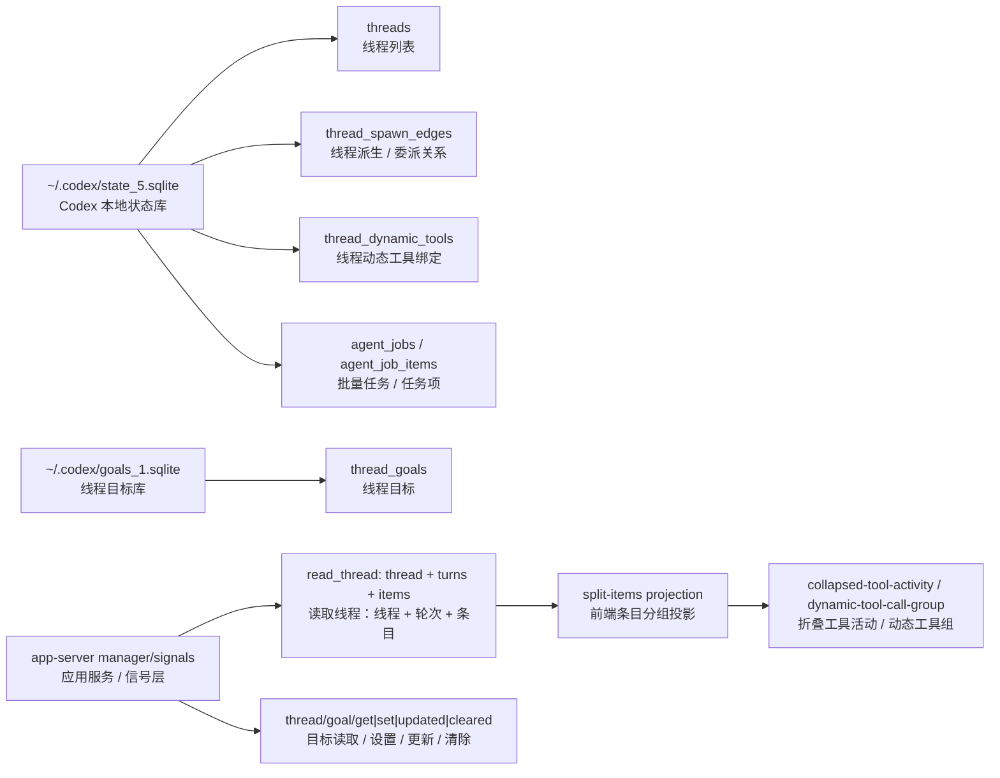
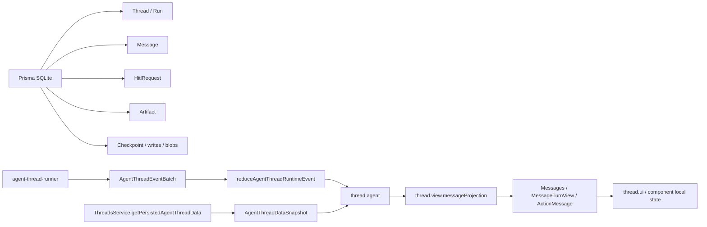

# Codex Desktop 与 Openwork Agent Harness 差异清单

日期：2026-06-09（2026-06-11 复核 Codex Desktop 本机快照）

## 结论

Codex Desktop 值得 Openwork 学的不是 `collapsed-tool-activity` 或 `dynamic-tool-call-group` 这些前端 render group 名称，而是它把长程委托任务拆成了更稳定的事实层。当前取舍是：

- thread / turn / item 的历史事实。
- tool call 的状态、输入、耗时和结果事实。
- dynamic tools 的按 thread 注册事实。
- batch job / job item 的后台工作事实。
- thread goal 的独立生命周期：已识别，但本轮先不做。
- thread spawn edge 的父子关系：已识别，但本轮先不做。

Openwork 当前已经有自己的强项：LangGraph checkpoint、HITL approval、artifact/diff、runtime event、renderer projection 和 launcher UI。本轮重点不从 Codex 的后台表反推 schema，而从前端组件动效出发，反推哪些 state/event 是真实工作事实、哪些只是 projection 或 component local state。

最重要的边界：

> Codex Desktop 的 UI 折叠策略是 projection，不是协议。Openwork 本轮只从组件动效倒推缺失的运行事实；只影响展示密度、折叠展开、shimmer 节奏的东西不应进入核心 runtime state。

## 证据入口

本次对照来自本机 Codex Desktop 的实际包和 Openwork 当前代码，不从产品印象倒推。Codex Desktop chunk hash 会随版本漂移；下表的 chunk 名称是 2026-06-11 本机快照，复跑方式见 `.agents/skills/codex-desktop-code-paths/`：

| 系统 | 证据 | 观察 |
|---|---|---|
| Codex Desktop | `/Applications/Codex.app/Contents/Resources/app.asar` 抽取到 `/tmp/codex-app-asar-window-research` | Electron webview 和 app-server chunk 可读 |
| Codex render projection | `webview/assets/split-items-into-render-groups-2NGKahMb.js` | `collapsed-tool-activity`、`pending-mcp-tool-calls`、`dynamic-tool-call-group` 由前端把 items 派生成 render groups |
| Codex thread read model | `webview/assets/app-server-dynamic-tools-LoTaSv01.js` | `read_thread` 返回 `thread + turns + items`；turn 和 tool item 带 `startedAt/completedAt/durationMs` |
| Codex goal flow | `webview/assets/app-server-manager-signals-DixsiAkQ.js` | `thread/goal/get|set|updated|cleared` 独立于普通 conversation state |
| Codex local persistence | `~/.codex/state_5.sqlite`、`~/.codex/goals_1.sqlite` | `threads`、`thread_spawn_edges`、`thread_dynamic_tools`、`agent_jobs`、`agent_job_items`、`thread_goals` 分开持久化 |
| Openwork runtime state | `src/shared/agent-thread-runtime.ts` | active run、tool calls、pending approval、todos、subagents、token usage 是 shared runtime state |
| Openwork persistence | `prisma/schema.prisma`、`src/main/threads/service.ts` | `Thread/Run/Message/HitlRequest/Artifact/Checkpoint` 已持久化；snapshot 由 `ThreadsService.getPersistedAgentThreadData` 输出 |
| Openwork renderer boundary | `src/renderer/src/lib/thread-store-core.ts`、`src/renderer/src/lib/message-projection.ts` | `thread.agent / thread.view / thread.ui` 已分层；tool activity 是 projection |
| Openwork UI path | `src/renderer/src/components/agent-ui/Tool.tsx`、`src/renderer/src/components/chat/ActionMessage.tsx`、`src/renderer/src/components/chat/MessageTurnView.tsx`、`src/renderer/src/lib/message-projection.ts` | 本轮从组件动效和 projection 反推 state/event |

## 实体对齐

Codex Desktop 的关键分层：

图里几个 Codex 表名的中文含义：

| 表 / 节点 | 中文意思 |
|---|---|
| `thread_spawn_edges` | 线程派生 / 委派关系：parent thread 和 child thread 的连接边 |
| `thread_dynamic_tools` | 线程动态工具绑定：这个 thread 里可用的动态工具和 schema |
| `agent_jobs / agent_job_items` | 批量任务 / 任务项：一批后台任务及其拆分出来的单个 item |
| `thread_goals` | 线程目标：thread 独立的目标、状态、预算和消耗 |

Openwork 当前关键分层：

因此对照时必须按 owner 判断：

| 事实类型 | 正确 owner | 不应落到 |
|---|---|---|
| 能影响恢复、审批、继续、审计、fork 的工作事实 | main/runtime + durable store + shared type | renderer component local state |
| 从 messages/activeRun 派生的工具展示分组 | `message-projection.ts` / UI primitive | Prisma schema / runtime event |
| thread goal 生命周期 | 已识别为未来独立 goal service/store/control；本轮暂不做 | prompt 文本、todo 文案、chat message |
| subagent 父子关系和委派边 | 已识别为未来 durable thread/subagent edge；本轮暂不做 | 只靠 `task` tool result 或 Kanban card |
| dynamic tool catalog/session binding | runtime tool registry/session fact | system prompt 全量展开或 UI registry |

## 从组件动效反推 State/Event

本轮主线不是“Codex 有哪些表 Openwork 没有”，而是先看 Openwork 前端组件正在表达什么动效，再反问这些动效背后需要哪一级事实。

组件边界：

- `Tool.tsx` 是 UI primitive：图标、badge、shimmer、折叠。
- `ActionMessage.tsx` 是单个 tool activity view：把 `ToolComponentStatus`、`ActiveAgentToolCall`、`HITLRequest` 投成 tool row。
- `MessageTurnView.tsx` 是 turn 内 activity 编排：thinking/tool group、active turn status row、approval 展开策略。
- `message-projection.ts` 是 renderer projection：从 messages、active run、pending approval、active tool calls 投出 activity entries 和 status。
- `agent-thread-runtime.ts` 是 shared runtime contract：`run.started/run.resumed/run.phaseChanged/message.* / tool.* / approval.*` 是事实输入。

动效反推矩阵：

| 组件动效 | 需要的事实 | 现在来源 | owner 判断 | 本轮结论 |
|---|---|---|---|---|
| 首 token 前的状态行：loader + 文案 shimmer | active running turn、`assistantMessageId === null`、turn 里还没有 assistant content | `activeRun.status/phase/assistantMessageId/turnId` + `messageProjection.turns` | projection | 不新增 `isAwaitingFirstAssistant`；继续从 active run 和 turn 内容派生 |
| thinking 标题 shimmer | 当前 streaming assistant message 里有 reasoning block | `streamingAssistantId` + message content | projection/UI | 不新增 thinking event；`message.upserted/message.part.delta` 足够 |
| assistant 正文流动 | 最后一段 assistant content 正在 streaming | `streamingAssistantId` + assistant message id | component/projection | 文本流本身就是动效，不需要额外状态 |
| tool args streaming 的等待感 | tool call id/name/argsText/messageId/status | `tool.callUpdated` -> `ActiveAgentToolCall` | runtime fact + projection | 只驱动 active status/正式 tool row 状态；不要新增 `toolPreview.created` 或临时工具组 |
| tool running spinner/shimmer | tool status `arguments_streaming/running`、`startedAt` | `tool.callUpdated`、`tool.started`、`ActiveAgentToolCall.startedAt` | runtime fact | active elapsed 可本地计时；开始时间必须来自 runtime |
| waiting result 平静等待 | tool status `waiting_result` | `ActiveAgentToolCall.status` 或 pending execution projection | projection | 保持“不 shimmer 但仍 pending”；这是语义状态，不是 loading 动画 |
| approval 警告态 + 强制展开 | pending approval 的 tool call | `approval.requested` + `pendingApproval` | durable HITL/runtime fact | 保持 approval 事实驱动；UI 不能本地清 pending |
| completed/error 稳定态 | tool result、失败结果、completed duration | tool message/result；未来可合并 durable tool execution | durable read model + projection | 只为历史回看补 completed duration，不从 UI elapsed 回写 |
| activity group 折叠/展开/chevron | 用户手动展开状态 | component `useState` / controlled props | component local state | 不进 runtime event；最多作为 UI local preference |
| header summary 切换成最新 active tool | activity list 中最新 pending item | `message-projection.ts` over entries/executions | projection | 只补 projection test，不补核心状态 |
| active status elapsed 3 秒后显示 | tool、run 或当前阶段的 startedAt | tool 阶段已有 `ActiveAgentToolCall.startedAt`；非 tool 阶段由 `ActiveAgentRun.startedAt` / `phaseStartedAt` 提供 runtime fact | runtime fact | 表达事实耗时只消费 runtime 起点；没有起点就不显示，不用 component mountedAt 伪造 |
| reduced motion / transition 节奏 | 用户 motion preference、CSS class | CSS/UI primitive | UI | 不进入 agent state/event |

由这张表反推出的 state/event 取舍：

| 需要保留的 runtime event | 组件为什么需要 |
|---|---|
| `run.started` | active turn 立即成立，首 token 前不能空白 |
| `run.resumed` | resume 是同一个 paused turn，不应被 UI 看成新 user turn |
| `run.phaseChanged` | active status 文案从理解请求、思考、工具执行、等待结果之间切换 |
| `message.upserted` / `message.part.delta` | thinking、assistant 正文流式动效的唯一内容来源 |
| `tool.callUpdated` | 参数流式 preview 和 tool row 标题/detail 的来源 |
| `tool.started` / `tool.updated` | tool running/waiting result 的语义边界 |
| `approval.requested` / `approval.cleared` | approval 警告态、强制展开和 resume 清理边界 |

本轮不应新增的 event/state：

- `collapsed-tool-activity.*`
- `dynamic-tool-call-group.*`
- `agentActivity.openChanged`
- `thinking.started`
- `toolPreview.created`
- `isAwaitingFirstAssistant`
- `approvalExpanded`

本轮事实边界收敛为两个：

1. 非 tool active status 的真实起点：当前已由 runtime 提供 `activeRun.startedAt` 和 `phaseStartedAt`。前者用于本轮总耗时，后者用于当前阶段耗时；组件只消费这两个事实，不再让 `mountedAt` 伪装成工作耗时。
2. completed tool/turn duration：历史回看需要稳定 `completedAt/durationMs`，来源应是 runtime/main durable fact，不是 renderer 本地 timer。

## 逐项事实模型审计

这张表按目标里的名词逐项对齐：先看 Codex Desktop 的源码/本地库事实，再看 Openwork 当前 owner，最后判断要补、保留还是明确不补。

| 维度 | Codex Desktop 事实模型 | Openwork 当前 owner | 取舍 |
|---|---|---|---|
| thread | `threads` 本地表保存 id、cwd、title、archive/pin/source/model 等；dynamic tools 暴露 `create_thread/list_threads/read_thread/send_message_to_thread/fork_thread/set_thread_*` | `Thread`/`Run` Prisma 表，`ThreadsService`，renderer `thread-store-core` | 已有基础 thread；goal 本轮暂不做，先看组件需要的 read/projection fact |
| turn | `read_thread` 返回 turns，每个 turn 有 `status/error/startedAt/completedAt/durationMs/items` | `Message` + `activeRun.turnId` + `messageProjection.turns` | 缺 durable turn timing/read model；应补最小 timing facts |
| tool | `commandExecution/fileChange/mcpToolCall/dynamicToolCall` items 有状态、输入、输出截断、duration | `ActiveAgentToolCall`、assistant `tool_calls`、tool message、`message-projection.ts` | active status 已有；缺 completed tool execution durable read model |
| approval | `automatic-approval-review`、`permission-request`、approval request item 被 projection 单独识别；等待态显示 `Awaiting approval` | `HitlRequest` 表、`tool-approval-middleware.ts`、`approval.requested/cleared`、`ComposerApprovalPrompt` | 已有更强 durable HITL；不要新增 UI pending flag，只补审计视图时从 `HitlRequest` 派生 |
| artifact | Codex 有 host artifact transfer、generated image、diff comments、thread handoff artifact 处理 | `Artifact`、`ArtifactPresentation`、`ArtifactsService`、`present_artifacts` state schema | 已有；不要塞进 thread item。可补统一 activity read model |
| diff | Codex 把 `turn-diff` 当 item，支持 review、revert/reapply，并用 `apply-patch` 操作实际 patch | `Artifact(kind=patch)`、file mutation approval、recording fs/mutation prediction、artifact preview | 已有 artifact/diff 路线；可加强 diff presentation，不新增平行 diff store |
| checkpoint | Codex thread fork 明确“只包含 completed history”；本地 thread/rollout 路径支撑 read/fork/resume | LangGraph `Checkpoint/CheckpointWrite/CheckpointBlob`，`PrismaCheckpointSaver`，`ThreadsService.clone*` | 已有核心恢复/fork owner；不要让派生 projection 反向阻塞 checkpoint |
| resume | Codex 有 `resumeState`、`maybe-resume-conversation`、`needs_resume/resuming/resumed` UI gating | `AgentController.handleResume`、`AgentThreadRunner.prepareResume`、`run.resumed`、`approval.cleared` | 已有 HITL resume state machine；保持语义，不退回 `run.started` |
| control | Codex dynamic tools 暴露 create/list/read/send/fork/pin/archive/rename；UI 暴露 stop/fork/archive/resume/review diff | `agent-control.ts` 暴露 invoke/resume/stop；ThreadsService 暴露 create/update/clone/delete | 基础 control 已有；thread-goal control 本轮暂不做，先看组件动效需要哪些 read/control fact |

## Codex 有而 Openwork 不该直接照搬的东西

### 1. Render group 名称不该进协议

Codex 的 `collapsed-tool-activity`、`pending-mcp-tool-calls`、`dynamic-tool-call-group` 来自 `split-items.js` 对 items 的渲染派生。它们表达的是“这一屏怎么折叠/聚合更好看”，不是 agent 是否真的完成了某个工作。

Openwork 已有对应层：

- `src/renderer/src/lib/message-projection.ts` 生成 `assistant-content`、`agent-activity`、active status 和 tool execution view。
- `src/renderer/src/components/chat/MessageTurnView.tsx` 决定 activity group 怎么渲染。
- `src/renderer/src/components/chat/ActionMessage.tsx` 和 `src/renderer/src/components/agent-ui/Tool.tsx` 决定 tool row 外壳。

结论：不要新增 `CollapsedToolActivityEvent`、`DynamicToolCallGroupState` 之类核心状态。需要改变折叠策略时，只改 projection/UI 并补 `tests/node/message-projection.test.ts`。

### 2. Codex 的 thread item shape 不应压过 Openwork 的 artifact/HITL/checkpoint

Codex 的 `read_thread` item 对 command、file change、MCP tool、dynamic tool 有统一 history view。Openwork 不需要为了像 Codex 而把 artifact、diff、HITL、LangGraph checkpoint 全塞进一个 item 表。

Openwork 已经有更清晰的产品事实：

- `HitlRequest` 是 durable approval。
- `Artifact` / `ArtifactPresentation` 承载可检查结果。
- `Checkpoint` / `CheckpointWrite` / `CheckpointBlob` 承载恢复和 fork。
- `Message` 承载聊天与 tool result。

结论：如果要做“统一活动历史”，应从这些 durable fact 派生一个 read model，而不是反向把现有表改成 Codex item model。

## 候选缺口与本轮取舍

### 暂不做（原 P0）: Thread Goal 独立生命周期

本轮决策：先不做。下面只保留它作为未来候选缺口，避免把 prompt、todo 或 thread title 临时包装成 goal。

服务的用户交互：

- 用户能看到“这个 thread 被委托的总目标是什么”。
- 长任务暂停/恢复/完成时，目标状态不丢失。
- goal 的 token/time budget 和完成状态可审计，而不是藏在聊天文本里。

Codex 证据：

- `goals_1.sqlite.thread_goals` 独立保存 `thread_id / goal_id / objective / status / token_budget / tokens_used / time_used_seconds`。
- app-server 通过 `thread/goal/get|set|updated|cleared` 维护 goal。
- goal status 有 `active / paused / blocked / usage_limited / budget_limited / complete`。

Openwork 当前状态：

- 没有独立 `ThreadGoal` 表或 shared type。
- 长程目标主要散落在 user prompt、todo、thread title 或当前 run 上。
- `Todo` 是工作注意力/步骤，不等于“这个 thread 被委托的总目标及预算状态”。

未来 owner：

- durable store：新增 `ThreadGoal` 或等价本地结构化表。
- main service：`ThreadGoalService`，由 thread control 调用。
- shared type：`ThreadGoalSnapshot`，进入 thread snapshot 或独立 goal snapshot。
- renderer：只消费 goal view，不从 messages/todos 猜目标。

未来事件/控制：

| 操作 | 语义 |
|---|---|
| `threadGoal.set` | 用户或系统明确建立/更新 thread 目标 |
| `threadGoal.statusChanged` | active/blocked/complete 等生命周期变化 |
| `threadGoal.cleared` | 完成后清理 active goal，但可保留 completed record |
| `threadGoal.usageUpdated` | token/time budget 这类可审计消耗 |

失败语义：

- goal 写入失败应可见，不应吞掉后继续伪装成已有 goal。
- goal 更新失败不应阻断 message/checkpoint 主写入，但 UI 应显示 goal 状态未更新。
- budget/usage 是约束事实，不应由 renderer 本地计时反写。

验证方式：

- Node test：创建 goal、更新状态、完成清理 active goal、保留 completed goal。
- Thread snapshot test：读取 thread 时 goal 能被恢复。
- UI projection test：goal active/blocked/complete 不依赖 todo 文案。

### P0: Durable Work Unit Timing

服务的用户交互：

- 回看历史时知道一个 turn/tool 花了多久。
- 当前 tool running 时可以显示 elapsed，完成后显示稳定 duration。
- 卡顿、超时、失败分析能定位到 turn/tool，而不是只看到一段长消息。

Codex 证据：

- `read_thread` 的 turn 有 `startedAt / completedAt / durationMs`。
- command/dynamic tool/MCP tool item 有 `durationMs`。
- app-server manager 内部也维护 `startedAtMs / completedAtMs / durationMs`。

Openwork 当前状态：

- `ActiveAgentToolCall.startedAt` 只在 active run 内用于 running elapsed display。
- `Subagent.startedAt/completedAt` 存在，但由 `TaskToolCallTracker` 在当前 run 内维护。
- `Message.created_at`、`Run.createdAt/updatedAt` 已存在，但缺少“turn started/completed”和“tool execution durable history”的明确读模型。
- `ToolExecutionTime` 是 UI 本地 elapsed，不是 durable fact。

建议 owner：

- run/turn timing：main runtime 在 `run.started/run.finished` 和 turn 边界写事实。
- tool execution timing：runtime/tool middleware 在 tool start/result/error 时写事实。
- renderer 只显示 durable completed duration；running elapsed 可继续本地派生。

建议最小字段：

| 事实 | 字段 |
|---|---|
| turn/run timing | `threadId`、`runId`、`turnId`、`startedAt`、`completedAt`、`durationMs`、`status` |
| tool execution | `threadId`、`runId`、`messageId`、`toolCallId`、`toolName`、`status`、`startedAt`、`completedAt`、`durationMs` |

建议 event/control：

| 操作 | 语义 |
|---|---|
| `turn.started` / `turn.completed` | 记录用户 turn 的稳定生命周期 |
| `toolExecution.started` / `toolExecution.completed` | 记录 tool call 的稳定执行耗时 |
| `toolExecution.failed` | tool 执行失败时保存失败状态和 duration |
| `threadActivity.read` | 读取历史 activity 时合并 messages、tool execution 和 artifacts |

失败语义：

- tool execution 记录失败不能让 tool 本身“假成功”；至少要在 runtime trace 或 error log 可见。
- completed duration 不能由 UI elapsed 反算后写回。
- 缺少 duration 时展示为空，不要用当前时间兜底制造假耗时。

验证方式：

- Runner test：tool started/result 会产生 timing fact。
- Persistence test：reload 后 completed tool 仍显示 duration。
- Projection test：running elapsed 和 completed duration 边界清楚。

### 暂不做（原 P1）: Thread Spawn Edge / Subagent 委派关系

本轮决策：先不做。下面只保留它作为未来候选缺口；当前 subagent 仍按 active run progress 和 UI projection 处理，不建立可恢复 child thread graph。

服务的用户交互：

- 用户能看出某个子任务是哪个 parent thread 委派出来的。
- 子任务可以被打开、恢复、审计，而不是只在当前 run 的进度面板里闪一下。
- Kanban/历史页能在 reload 后重建 parent-child 工作关系。

Codex 证据：

- `state_5.sqlite.thread_spawn_edges` 独立保存 `parent_thread_id / child_thread_id / status`。
- manager 可以从 `thread_spawn` payload 读取 parent thread、depth、agent nickname、role。

Openwork 当前状态：

- `Subagent` 由 `task` tool call 生命周期投出，字段有 `id/name/description/status/startedAt/completedAt/toolCallId/subagentType`。
- 没有 durable parent/child thread edge。
- Kanban 里可以把 subagent 放到 parent thread 下展示，但这仍是当前 runtime facts 的 renderer 消费，不是可恢复的 thread graph。

未来 owner：

- 如果 subagent 只是当前 run 的进度条：继续放在 `agent.state.subagents`，不新增 durable edge。
- 如果产品要支持“subagent 是可恢复、可进入、可审计的工作单元”：新增 `ThreadSpawnEdge` 或 `DelegatedWork` durable fact。

未来最小字段：

| 字段 | 语义 |
|---|---|
| `parentThreadId` | 发起委派的 thread |
| `childThreadId` 或 `delegatedWorkId` | 可打开/恢复的子工作单元 |
| `toolCallId` | 触发委派的 tool call |
| `status` | pending/running/completed/failed/cancelled |
| `depth` | 多层委派时的层级 |
| `agentRole` / `agentNickname` | 展示与权限语义，不替代权限控制 |

未来 event/control：

| 操作 | 语义 |
|---|---|
| `delegatedWork.created` | `task` tool 创建可恢复子工作单元时写 edge |
| `delegatedWork.statusChanged` | 子工作 pending/running/completed/failed/cancelled 的生命周期 |
| `delegatedWork.open` | UI 或 agent 打开 child thread / delegated work |
| `delegatedWork.readByParent` | parent thread 历史读取时合并委派关系 |

失败语义：

- 创建 child thread 成功但 edge 写失败，会造成 orphan work；应明确失败并阻断或补偿。
- edge 写成功但 child thread 创建失败，应标记 failed，而不是保留 running。
- subagent 读写权限仍由 runtime/guardrail 控制，不由 UI edge 决定。

验证方式：

- DB test：parent 删除时 edge 语义明确。
- Runtime test：`task` 委派创建 edge，完成时更新 edge status。
- UI test：reload 后仍能从 parent thread 看到 delegated work。

### P1: Dynamic Tools 的 Thread Session 事实

服务的用户交互：

- agent 能解释“这个 thread/run 里为什么可以调用某个 extension tool”。
- @mention 或模型选择 extension 后，schema/details 加载状态可恢复、可审计。
- 工具调用失败时能区分“catalog 有这个能力”和“schema 没加载/加载失败”。

Codex 证据：

- `state_5.sqlite.thread_dynamic_tools` 按 `thread_id / position` 保存 `name / description / input_schema / namespace / defer_loading`。
- Desktop app 还有 `dynamic-tool-call` item 和 `dynamic-tool-call-group` UI projection。

Openwork 当前状态：

- extension capability 由 registry/runtime middleware 管理。
- 正在演进的目标是轻量 catalog 默认进入 prompt，`loadExtension` 加载完整 schemas，`callExtension` 作为唯一执行入口。
- 当前不应把每个 extension tool 展开成顶层 LangChain tool。

建议 owner：

- extension catalog 是轻量索引。
- `loadExtension` 成功后的 schema/details 是当前 run/session 的 tool availability fact。
- `callExtension` 是执行边界。

建议事实：

| 事实 | 语义 |
|---|---|
| `loadedExtension` | 当前 thread/run 已加载哪个 extension |
| `loadedToolSchemas` | 加载后的 tool schemas/details，可重建 prompt/tool binding |
| `extensionToolCall` | 通过 `callExtension` 执行的真实调用记录 |

建议 event/control：

| 操作 | 语义 |
|---|---|
| `extensionCatalog.read` | 读取轻量 capability catalog |
| `extension.loadRequested` / `extension.loaded` | 当前 thread/run 加载 extension schemas/details |
| `extension.loadFailed` | schema/details 加载失败并可见 |
| `extensionTool.called` | `callExtension` 记录真实执行入口 |

失败语义：

- catalog 可用不代表 tool schema 已加载。
- `loadExtension` 失败必须暴露给 agent/user，不能 fallback 到空工具集继续跑。
- `callExtension` 仍是唯一执行入口，避免把 extension tool 膨胀成不可控顶层 tool。

验证方式：

- System prompt test：轻量 catalog 有，完整 schema 不默认展开。
- Runtime test：`loadExtension -> callExtension` 后 reload 能解释这次 tool availability。
- Tool registry test：未加载 extension 时不能直接执行其 tool。

### P2: Batch Job / Agent Job Item

服务的用户交互：

- 把一批相似任务拆成可追踪 item。
- 每个 item 可分配 thread、记录 attempt/result/error。
- 用户能区分“单个 thread 失败”和“批处理 item 失败”。

Codex 证据：

- `state_5.sqlite.agent_jobs` 和 `agent_job_items` 存在后台批处理概念。
- job item 可分配 thread，并有 attempt、result、error、completed/reported 时间。

Openwork 当前状态：

- 主要围绕单 thread 的 delegated software work。
- 还没有明确产品需求要求把一个 CSV/job 拆成多个 thread item。

建议：

- 暂不进入核心 agent runtime。
- 如果未来做批量任务，把它作为独立 `JobService` / `JobItem`，再把 item 关联到 thread。
- 不要为了“Codex 有这个表”提前加泛化 job abstraction。

建议 owner：

- durable store：未来独立 `Job` / `JobItem` 表。
- main service：未来 `JobService` 负责 item 分配、attempt、result 和 error。
- thread runtime：只接收被分配的单个 item，不拥有 batch orchestration。

建议 event/control：

| 操作 | 语义 |
|---|---|
| `job.created` / `jobItem.created` | 建立批处理及 item |
| `jobItem.assigned` | item 分配到 thread |
| `jobItem.completed` / `jobItem.failed` | item 生命周期结束 |
| `job.read` | 读取 batch 进度，不反向修改 thread checkpoint |

失败语义：

- job item 失败属于 batch orchestration，不应污染单 thread 的 run status。
- thread 失败可以回写 job item，但 job item 不应反向决定 thread checkpoint 是否成立。

验证方式：

- 等真实批处理产品需求出现后，再写 job item state machine 测试。

## 已有但必须守住的事实边界

### Keep: Approval / HITL

服务的用户交互：

- 工具执行前让用户批准或拒绝。
- reload 后仍能看到待审批事项。
- resume 时继续同一个暂停的 turn，而不是假装开启新任务。

Codex 证据：

- `split-items.js` 把 `automatic-approval-review`、带 `approvalRequestId` 的 `exec/patch`、`permission-request` 识别成独立等待/审批 items。
- `local-conversation-thread.js` 对未完成审批显示 `Awaiting approval`。
- approval review 统计会聚合 approved/rejected count 和 duration。

Openwork 当前状态：

- `src/main/agent/tool-approval-middleware.ts` 在 `wrapToolCall` 阶段触发 LangGraph `interrupt(...)`。
- `src/main/checkpointer/runtime-checkpointer.ts` 在 checkpoint 后提取 interrupt 并 `upsertHitlRequest(...)`。
- `src/main/db/hitl.ts` 持久化 `request_id/thread_id/run_id/tool_call_id/tool_name/tool_args/review/status/decision`。
- `src/shared/agent-thread-runtime.ts` 用 `approval.requested` / `approval.cleared` 驱动 `pendingApproval`。
- `src/renderer/src/components/chat/ComposerApprovalPrompt.tsx` 和 `MessageTurnView.tsx` 只消费 pending approval。

建议 event/control：

| 操作 | 语义 |
|---|---|
| 保留 `approval.requested` | runtime 暂停且产生待审批事实 |
| 保留 `approval.cleared` | resume 真正被 runtime 接受后才清除 pending approval |
| 保留 `agent.control.resume(decision)` | UI 只能提交决定，不直接改 pending approval |

失败语义：

- 不能因为 UI 点击 approve 就本地清空 approval；必须等 runtime resume 接受。
- checkpoint/HITL 写入失败必须可见，不能继续显示成可恢复审批。
- 同一 assistant step 里多个审批工具继续由 middleware 串行/拒绝并发，不在 UI 层猜。

验证方式：

- `agent-thread-runtime.test.ts`：`run.resumed` 不清 pending approval，`approval.cleared` 才清。
- `agent-runtime-manager.test.ts` / `agent-control.test.ts`：没有 pending approval 时不能 resume。
- BDD：待审批 reload 后仍可 approve/reject。

### Keep: Artifact / Diff

服务的用户交互：

- 把可检查结果放进 artifact 面板，而不是埋在长消息里。
- 对 patch/diff 进行 review、打开、复制、后续复核。
- 让 fork/reload 后仍能找回 deliverable。

Codex 证据：

- `read_thread` 暴露 `fileChange` item，必要时包含 diff。
- `local-conversation-thread.js` 把 `turn-diff` 渲染为可 review 的 diff card，并支持 `apply-patch` 做 revert/reapply。
- handoff/fork 路径会 transfer host artifacts 和 diff comments。

Openwork 当前状态：

- `src/main/agent/artifact-tools-middleware.ts` 提供 `present_artifacts`，并把轻量 manifest 写入 graph state。
- `src/main/artifacts/service.ts` 持久化 `Artifact` 和 `ArtifactPresentation`，用 `idempotencyKey/contentHash` 防止同一 tool call 重放写出不同内容。
- `prisma/schema.prisma` 中 `Artifact` 保存 `threadId/runId/messageId/toolCallId/kind/source/preview/payload/status`。
- renderer 通过 `thread.agent.artifacts` 和 artifact preview components 展示结果。

建议 event/control：

| 操作 | 语义 |
|---|---|
| 保留 `present_artifacts` | agent 显式发布可检查结果 |
| 保留 `artifacts.changed`/snapshot | artifact service 是 durable owner，renderer 只更新列表 |
| 可新增 `threadActivity.artifactPresented` read model | 只做历史展示投影，不替代 Artifact 表 |

失败语义：

- `idempotency-conflict` 必须报错，不能覆盖旧 artifact。
- artifact projection 失败不应阻塞 checkpoint，但必须有日志和可重建路径。
- patch/diff 不要同时写两套真相；如果进入 artifact，就从 artifact 派生 UI。

验证方式：

- artifact service test：同一 idempotency key 内容不一致时失败。
- runtime test：`present_artifacts` 返回 ToolMessage 并更新 state artifacts。
- UI/projection test：artifact list reload 后仍能打开 preview。

### Keep: Checkpoint / Fork

服务的用户交互：

- reload 后恢复历史和 pending approval。
- 从某个历史点 fork/branch。
- 长任务失败后能检查最后稳定状态。

Codex 证据：

- `fork_thread` 描述明确：fork 只包含 completed history，source 正在运行时 active turn/unfinished response 不复制。
- `fork-conversation-from-turn`、`fork-conversation-from-latest`、worktree fork 和 branch starting state 是 control 层能力。
- `read_thread` 通过 cursor/turnLimit 分页读历史，不要求 UI 直接持有全部运行内存。

Openwork 当前状态：

- `src/main/checkpointer/prisma-saver.ts` 是 LangGraph checkpoint owner，按 `threadId/checkpointNs/checkpointId` 写 `Checkpoint`、`CheckpointWrite`、`CheckpointBlob`。
- `RuntimeCheckpointSaver.afterPut` 在 core checkpoint 写成功后再提取 HITL 和调度 message search projection。
- `ThreadsService.clone` / `cloneUntilMessage` 基于 checkpoint 复制 thread，并用 `computeThreadForkState` 禁止 busy/pending HITL/checkpoint interrupt 时 fork。
- memory 里已有结论：message search 是派生 projection，不能反向拖慢 checkpoint 主写入。

建议 event/control：

| 操作 | 语义 |
|---|---|
| 保留 `threads.clone` / `threads.cloneUntilMessage` | checkpoint owner 决定 fork 能否成立 |
| 保留 `forkState` | renderer 只展示 canFork/reason |
| 可新增 `thread.readActivity` | 从 checkpoint/messages/artifacts/HITL 派生历史 read model |

失败语义：

- checkpoint 写失败是核心失败，应暴露并阻断“已保存/可恢复”的声明。
- message search、activity read model、summary 失败是派生失败，应记录并可重建，不反向否定 checkpoint。
- fork 禁止条件必须由 main/checkpoint/HITL 判断，不能由 renderer 按按钮状态猜。

验证方式：

- `agent-persistence.test.ts`：checkpoint blob/write 可读回。
- `threads` tests：busy/pending HITL/checkpoint interrupt 时 fork 被拒。
- projection tests：message search 重建不影响 checkpoint existence。

### Keep: Resume / Control

服务的用户交互：

- 用户可以 stop 当前 run。
- 用户可以 approve/reject 后继续同一个 paused turn。
- 用户可以 fork、rename、archive、read/follow-up thread。

Codex 证据：

- dynamic tools 暴露 `create_thread/list_threads/read_thread/send_message_to_thread/fork_thread/set_thread_pinned/set_thread_archived/set_thread_title`。
- `maybe-resume-conversation` 接受 conversationId、hostId、model/serviceTier/workspaceRoots 等恢复参数。
- `resumeState` 有 `needs_resume/resuming/resumed` 这类 UI gating。
- thread view 支持 stop、fork from turn、archive、diff review 等 control。

Openwork 当前状态：

- `src/renderer/src/lib/agent-control.ts` 暴露 `invoke/resume/stop`。
- `src/main/agent/controller.ts` 把 `agent:invoke/resume/cancel` 接到 `AgentService`，并在 run accepted 后调用 `AgentThreadRunner.prepareInvoke/prepareResume`。
- `src/shared/agent-thread-runtime.ts` 区分 `run.started` 和 `run.resumed`，`approval.cleared` 才是审批清除边界。
- `ThreadsService` 已有 create/update/clone/delete，renderer 通过 thread context/host 消费。

建议 event/control：

| 操作 | 语义 |
|---|---|
| 保留 `agent.control.invoke` | 新 turn，不允许 pending approval 时提交 |
| 保留 `agent.control.resume` | 只处理 HITL decision，不构造新 user message |
| 保留 `agent.control.stop` | cancel runtime，并由 event 回流状态 |
| 可新增 `thread.control.read/send/fork/archive/title` facade | 如果要让 agent 自己操作 Openwork thread，需要明确 control API，而不是直读 renderer store |
| 未来可补 `threadGoal.*` control | 已标记为本轮暂不做，不进入当前组件动效路线 |

失败语义：

- control command 失败必须在 command 返回或 runtime event 中可见。
- renderer 不能乐观写 shared runtime state；只允许通过 control command 进入 main/runtime。
- resume 不得退化成 invoke；否则 pending approval、tool call id 和 checkpoint continuation 会丢。

验证方式：

- `agent-control.test.ts`：pending approval、missing state、missing model 的 control guard。
- `agent-thread-runner.test.ts`：prepareResume 后事件顺序正确。
- BDD：approve/reject 后同一 thread 继续，不产生重复 user turn。

## Openwork 已经有的，不要重复造一份

| 能力 | 当前 owner | 判断 |
|---|---|---|
| runtime active run | `src/shared/agent-thread-runtime.ts` | 已有，不要在 renderer 再建一份 running state |
| tool activity/status | `message-projection.ts` | 已有，继续 projection 化；active tool facts 不生成临时工具组 |
| HITL approval | `HitlRequest` + `approval.requested` | 已有 durable approval，不要改成 UI pending flag |
| checkpoint/fork | LangGraph checkpointer + `ThreadsService` | 已有，后续补事实也不能阻塞 checkpoint 主写入 |
| artifacts/diff | `Artifact` / `ArtifactPresentation` / artifact middleware | 已有，不要塞进普通 message text |
| subagent runtime progress | `TaskToolCallTracker` -> `subagents.replaced` | 已有运行态进度；只有需要可恢复子工作单元时才补 durable edge |
| renderer source/view/ui 分层 | `thread-store-core.ts` | 已有，继续坚持 `thread.agent -> thread.view -> UI` |

## 推荐落地顺序

### 第一刀：组件动效状态契约

先把当前 UI 已经表达的 running、waiting result、approval、thinking、first-token-before-content 明确成 projection 契约，而不是先加新 runtime state。

最小切片：

1. 以 `MessageTurnView.tsx` / `ActionMessage.tsx` / `Tool.tsx` 为准，列出每个 shimmer、spinner、badge、展开策略依赖的 projection input。
2. 补 `tests/node/message-projection.test.ts`：首 token 前有 status row、`waiting_result` 不 shimmer、approval 仍强制展开、active tool 只驱动 status 不生成临时工具组。
3. 不新增 `isAwaitingFirstAssistant`、`toolPreview.created`、`agentActivity.openChanged`。
4. 组件折叠继续留在 local state，只让 `pendingApproval` 这种语义事实覆盖展开。

### 第二刀：Active Status 真实时间起点

现在 tool elapsed 有 `ActiveAgentToolCall.startedAt`，非 tool active status 也已经有 `ActiveAgentRun.phaseStartedAt`；turn 级 waiting divider 可以使用 `activeRun.startedAt`。这两个时间分别表达“当前阶段耗时”和“本轮总耗时”，不需要再引入第三个 clock。

最小切片：

1. 保持 `activeRun.startedAt` 表示本轮总耗时，`phaseStartedAt` 表示当前阶段耗时。
2. `ActiveTurnStatusElapsed` 只消费 runtime 起点；如果没有起点，隐藏 elapsed，不用当前时间兜底。
3. 补 reducer/projection/component 测试，验证非 tool 状态不会把 mounted time 当工作耗时。

### 第三刀：Completed Tool / Turn Timing

这能改善“回看时知道做了多久、卡在哪”的证据层，同时不改变 agent 执行策略。

最小切片：

1. 先只记录 completed tool execution duration，不做复杂 trace UI。
2. `ActiveAgentToolCall.startedAt` 继续服务 running elapsed。
3. completed duration 由 durable fact 提供。
4. projection 合并 message tool call 与 durable execution fact。

## 不建议现在做

- 不要新增 `collapsed-tool-activity` 类 durable 状态。
- 不要把 Codex 的 `read_thread` item model 直接替换 Openwork 的 message/artifact/HITL/checkpoint。
- 不要给 dynamic tools 做全局顶层 tool 展开。
- 不要为了 batch job 提前抽象 job runtime。
- 不要用 fallback 从 messages/todos/subagent 文案猜 goal 或 delegated edge。

## 设计验收 Checklist

每补一个候选事实，都先问：

1. 它是否影响继续、恢复、审批、取消、审计或可检查结果？
2. 它的 owner 是 runtime durable store、shared state、projection，还是 UI local？
3. 它失败时用户/日志/测试能不能看到？
4. 它能否从已有事实派生？如果能，就不要新建状态。
5. 它是否会把 projection 反向写进 core state？
6. 它是否会阻塞 checkpoint/HITL/artifact 这些核心写入？

通过标准：

- core fact 写入短、稳、失败清晰。
- projection 可以落后、可重建，不反向决定 core fact。
- renderer 不从文本猜工作状态。
- 测试覆盖 owner 边界，而不是只测某个组件文案。
