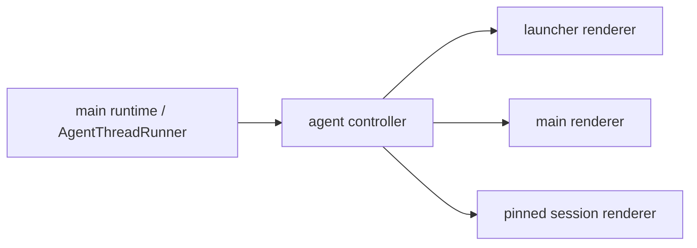

# Codex 风格会话钉出窗口方案

## 目标

Openwork 需要一个可以从 launcher AI 会话里随时“钉出”的独立会话窗口。这个窗口持有当前 session 的聊天体验，但不改变 launcher 作为临时搜索入口的本质。

本方案只定义证据、边界和实现路径；不在这里实现产品代码。

## 结论

- `置顶对话` 保持 thread/history pin 语义，不复用为窗口常驻。
- 新能力命名为 `钉出窗口` 或 `打开会话窗口`，语义是为当前 `threadId` 创建一个独立 BrowserWindow。
- launcher 继续是单例、临时、失焦消失；不要把 launcher 改成 pinned mode。
- `LauncherAiPage.tsx` 不直接通用化；应该抽出内部 `AiSessionSurface`，由 launcher window 和 pinned session window 分别提供 host 能力。
- V1 不做复杂同步。多个 renderer 已经可以订阅同一个 thread runtime event stream；composer 草稿、hover、展开状态、附件选择继续窗口本地化。

## Codex 本地证据

证据来自 2026-06-11 本机快照：`/Applications/Codex.app/Contents/Resources/app.asar`，CLI 版本为 `codex-cli 0.138.0-alpha.7`。复跑方式见 `.agents/skills/codex-desktop-code-paths/references/thread-window-and-pin.md`。

| 证据 | 说明 |
| --- | --- |
| `thread-actions-BQmectH9.js` 中同时存在 `threadHeader.openInNewWindow`、`threadHeader.moreActions`、copy、rename、archive、pin 相关 wiring | Codex 把 “open in new window” 和 thread pin 放在同一类 thread header action 里，但二者不是同一功能。 |
| `pinned-threads-query-Cl6DI8bn.js` 调用 `list-pinned-threads` | pin 是 pinned thread list 的 read model。 |
| `set-pinned-thread-Cfyf0hbx.js` 调用 `set-thread-pinned` / `set-pinned-threads-order` | pin 是 thread metadata/order，不是窗口 always-on-top。 |
| `hotkey-window-thread-page-CQd4KR1O.js` 是单独的 hotkey-window thread page chunk | Codex 存在单独 thread window/page 入口，不是把 launcher 本体常驻。 |
| `app-server-dynamic-tools-LoTaSv01.js` 暴露 `create_thread/list_threads/read_thread/send_message_to_thread/fork_thread/set_thread_*` | thread 控制属于 app-server/control API，不是 renderer local state。 |

## Openwork 当前边界

| 文件 | 当前职责 | 对本功能的含义 |
| --- | --- | --- |
| `src/main/windows/launcher-window.ts` | 创建 launcher 单例窗口，显示时 always-on-top，blur 时 hide | 这是 launcher 搜索体验的核心行为，不应该为钉出窗口修改。 |
| `src/main/windows/load-renderer-window.ts` | 定义 `AppWindowKind = "main" | "launcher" | "settings"`，用 `?window=` 分发 renderer | 新窗口应该新增一个 window kind，例如 `"pinned-ai-session"`。 |
| `src/renderer/src/main.tsx` | 根据 `window` query 渲染 `LauncherApp` / `SettingsApp` / `MainWindowApp` | 新增 `PinnedAiSessionWindowApp` 入口。 |
| `src/renderer/src/launcher-shell/LauncherApp.tsx` | launcher host、路由、搜索、AI 入口 | 保持 transient shell，不承载 pinned-window 状态。 |
| `src/renderer/src/ai-core/LauncherAiPage.tsx` | launcher AI host，包含返回 launcher、隐藏 launcher、header action、bottom action 等 | 抽内部 session surface，launcher 行为留在 host。 |
| `src/renderer/src/lib/agent-runtime-manager.ts` | renderer 订阅 main runtime event stream | pinned window 可以像 launcher/main 一样订阅 thread。 |
| `src/main/agent/controller.ts` | 用 `sender.id + threadId` 建立 event subscription | 多个窗口订阅同一个 thread 不会互相踢掉。 |

### 当前 Openwork 代码证据

这些点是后续实现时最重要的边界检查，不需要凭 UI 相似度猜：

```ts
// src/main/windows/launcher-window.ts
export function showLauncherWindow(launcherWindow: BrowserWindow): void {
  launcherWindow.setAlwaysOnTop(true, MAC_LAUNCHER_WINDOW_LEVEL)
  launcherWindow.show()
  launcherWindow.focus()
}

launcherWindow.on("blur", () => {
  hideLauncherWindow(launcherWindow)
})
```

含义：launcher 的 auto-hide 是窗口产品语义，不是 bug。钉出窗口必须新建 window owner。

```ts
// src/main/windows/load-renderer-window.ts
export type AppWindowKind = "main" | "launcher" | "settings"
```

含义：独立会话窗口应该成为新的 `AppWindowKind`，而不是复用 launcher query。

```tsx
// src/renderer/src/main.tsx
{windowKind === "launcher" ? (
  <ThreadProvider>
    <LauncherClipboardProvider>
      <LauncherApp />
    </LauncherClipboardProvider>
  </ThreadProvider>
) : windowKind === "settings" ? (
  <SettingsApp />
) : (
  <MainWindowApp />
)}
```

含义：pinned session window 应该在这里增加独立 renderer app 入口。

```ts
// src/renderer/src/lib/agent-runtime-manager.ts
const subscription = window.api.agent.connectThreadEvents(threadId, (batch) => {
  applyRuntimeBatch(batch)
})
```

```ts
// src/main/agent/controller.ts
const subscriptionKey = this.getSubscriptionKey(sender.id, threadId)
await this.agentThreadRunner.connectThreadEvents(threadId, subscriptionKey, listener)
```

含义：多窗口订阅同一 thread 的基础能力已经存在，V1 不需要先做全局同步层。

## V1 实现路径

### 1. Main 进程窗口注册

新增：

```text
src/main/windows/pinned-ai-session-window.ts
```

职责：

- 创建独立 BrowserWindow。
- 宽度/高度与 launcher AI 体验保持一致，先固定尺寸。
- 不监听 blur hide。
- registry 用 `windowId -> BrowserWindow`，不是 `threadId -> BrowserWindow`，因为同一个 session 允许钉出多份。
- 上限建议 `MAX_PINNED_AI_SESSION_WINDOWS = 3`。

示意：

```ts
export interface OpenPinnedAiSessionWindowParams {
  threadId: string
}

export interface OpenPinnedAiSessionWindowResult {
  ok: boolean
  reason?: "limit_reached"
  limit?: number
  windowId?: string
}
```

失败语义：

- 超过上限返回 `limit_reached`，renderer 负责显示轻提示。
- 创建窗口失败直接抛错并进入已有错误日志路径，不吞掉。

实现蓝图：

```ts
// src/main/windows/pinned-ai-session-window.ts
const PINNED_AI_SESSION_CONTENT_WIDTH = 760
const PINNED_AI_SESSION_MAX_WINDOWS = 3

const pinnedAiSessionWindows = new Map<string, BrowserWindow>()

export function openPinnedAiSessionWindow(
  params: OpenPinnedAiSessionWindowParams
): OpenPinnedAiSessionWindowResult {
  if (pinnedAiSessionWindows.size >= PINNED_AI_SESSION_MAX_WINDOWS) {
    return {
      limit: PINNED_AI_SESSION_MAX_WINDOWS,
      ok: false,
      reason: "limit_reached"
    }
  }

  const windowId = randomUUID()
  const window = createPinnedAiSessionWindow({ threadId: params.threadId, windowId })
  pinnedAiSessionWindows.set(windowId, window)
  window.once("closed", () => pinnedAiSessionWindows.delete(windowId))
  return { ok: true, windowId }
}
```

这里不要用 `threadId` 做 registry key。用户已经明确说“每次都能钉出一个新的”，同一个 session 可以有多个窗口。

### 2. Renderer 路由入口

修改：

```text
src/main/windows/load-renderer-window.ts
src/renderer/src/main.tsx
```

新增 `window=pinned-ai-session`。入口读取：

```ts
const threadId = new URLSearchParams(window.location.search).get("threadId")
const pinnedWindowId = new URLSearchParams(window.location.search).get("pinnedWindowId")
```

缺少 `threadId` 时显示一个明确错误态，不自动创建空 thread。

实现蓝图：

```ts
// src/main/windows/load-renderer-window.ts
export type AppWindowKind = "main" | "launcher" | "settings" | "pinned-ai-session"
```

```tsx
// src/renderer/src/main.tsx
{windowKind === "launcher" ? (
  <ThreadProvider>
    <LauncherClipboardProvider>
      <LauncherApp />
    </LauncherClipboardProvider>
  </ThreadProvider>
) : windowKind === "pinned-ai-session" ? (
  <ThreadProvider>
    <PinnedAiSessionWindowApp />
  </ThreadProvider>
) : windowKind === "settings" ? (
  <SettingsApp />
) : (
  <MainWindowApp />
)}
```

### 3. Preload API

新增或扩展：

```text
src/preload/api/ai-session-windows.ts
```

建议 API：

```ts
window.api.aiSessionWindows.open({ threadId })
```

renderer 不直接碰 Electron window，也不直接读 main registry。

实现蓝图：

```ts
// src/preload/api/ai-session-windows.ts
export interface AiSessionWindowsApi {
  open(params: { threadId: string }): Promise<OpenPinnedAiSessionWindowResult>
}
```

```ts
// src/main/index.ts 或 composition root
ipcMain.handle("ai-session-windows:open", (_event, params) => {
  return openPinnedAiSessionWindow(params)
})
```

### 4. AI Surface 拆分

新增：

```text
src/renderer/src/ai-core/AiSessionSurface.tsx
src/renderer/src/ai-core/PinnedAiSessionWindowApp.tsx
```

`AiSessionSurface` 负责会话本体：

- message projection
- composer
- pending approval
- model / permission 展示
- submit / resume / stop 的会话行为

host 注入窗口语义：

```ts
interface AiSessionSurfaceHost {
  kind: "launcher" | "pinned-window"
  threadId: string
  titleFallback: string
  onBack?: () => void
  onClose?: () => void
  onOpenMain?: () => Promise<void>
  onPinOut?: () => Promise<void>
}
```

`LauncherAiPage` 继续负责：

- launcher navigation
- `window.api.launcher.hide()`
- launcher home/back
- launcher bottom action overlay
- initial action submit

`PinnedAiSessionWindowApp` 负责：

- 读取 URL 中的 `threadId`
- 包 `ThreadProvider`
- 加载 thread snapshot
- 渲染 pinned window chrome

实现蓝图：

```tsx
// src/renderer/src/ai-core/PinnedAiSessionWindowApp.tsx
export function PinnedAiSessionWindowApp(): React.JSX.Element {
  const params = new URLSearchParams(window.location.search)
  const threadId = params.get("threadId")

  if (!threadId) {
    return <PinnedAiSessionWindowError message="Missing threadId" />
  }

  return (
    <AiSessionSurface
      host={{
        kind: "pinned-window",
        threadId,
        titleFallback: "新问题",
        onOpenMain: () => window.api.mainWindow.openThread(threadId)
      }}
    />
  )
}
```

### 5. UI 放置

launcher AI header 右侧新增独立 icon button，放在三点菜单旁边。

- 不放到右下角 composer action。
- 不把三点菜单里的 thread action 和 composer action 混合。
- 不使用 `Pin` 图标，避免和 `置顶对话` 混淆。
- 推荐图标语义：`PictureInPicture2`、`PanelTopOpen`、`ExternalLink`。
- 文案：`钉出窗口` 或 `打开会话窗口`。

pinned window 自己的 header：

- 左侧：Jingle logo / thread title / model。
- 右侧：打开主窗口、更多菜单、关闭。
- 未来可加 `置于最前` toggle，但 V1 不默认塞进 thread pin。

## V1 不做的事

- 不让 launcher 常驻。
- 不把 `置顶对话` 改成窗口 pinned。
- 不做跨窗口 composer 草稿同步。
- 不做窗口恢复到上次位置。
- 不把 pinned window 状态写入 Thread/Run/Message。
- 不新增 renderer focus reload 或定时 refresh。

## 同步边界

V1 使用现有 runtime 订阅：



核心事实仍在 main/runtime：

- run state
- checkpoint
- HITL request
- messages
- artifacts

窗口本地状态继续留在 renderer：

- composer draft
- hover / active menu
- local attachment picker state
- local expansion state

如果之后发现同一个 thread 在多个窗口同时 send/resume 会造成体验问题，再做 composer coordination。不要提前把所有 UI 状态中心化。

## 未来同步方案

### V2：WindowSessionRegistry

main 侧记录打开的会话 surface：

```ts
interface ThreadSurfaceInstance {
  id: string
  kind: "main" | "launcher" | "pinned-session"
  threadId: string
  focusedAt: Date | null
  createdAt: Date
}
```

用途：

- 展示同一 thread 已打开几个窗口。
- 支持窗口上限和清理。
- 为后续恢复窗口 bounds 做准备。

### V3：Composer Coordination

如果需要约束同一 thread 只能一个窗口编辑：

- main 侧增加 `thread-composer-lock`。
- lock 由 surface id 持有，有 TTL。
- renderer 只展示状态，不自己决定别的窗口是否可发。

这一步只有在真实 UX 问题出现后再做。

### V4：窗口恢复与置顶策略

可选持久化：

```ts
interface PinnedSessionWindowState {
  threadId: string
  bounds: Electron.Rectangle
  alwaysOnTop: boolean
  createdAt: string
}
```

注意：

- 恢复窗口是 app/session preference，不是 thread runtime fact。
- `alwaysOnTop` 是窗口属性，不是 `set_thread_pinned`。

## 验证计划

### 静态验证

```bash
npm run check:guardrails
npm run typecheck:node
npm run typecheck:web
```

### 行为测试建议

新增 BDD 或 main-window lifecycle 测试：

1. 打开 launcher AI session。
2. 点击 `钉出窗口`。
3. 验证出现第二个 BrowserWindow。
4. 验证 launcher 仍然可以通过快捷键打开搜索。
5. 连续点击 4 次时，第 4 次返回 `limit_reached`。

### 手动验收

- pinned window 失焦不消失。
- launcher 失焦仍消失。
- pinned window 里有新消息时，main/launcher 订阅可以跟随更新。
- 三点菜单仍只放 thread actions。
- 右下角 action 仍只放 composer/submit 相关操作。

## 建议拆 PR

1. 研究资产 PR：Codex evidence script + 本文档。
2. Window plumbing PR：main/preload/window kind/registry/limit，不碰 AI UI 重构。
3. Surface extraction PR：抽 `AiSessionSurface`，保持 launcher 行为不变。
4. Pinned session UI PR：按钮、pinned window chrome、错误提示、BDD。
