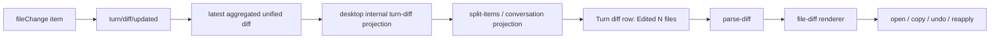

# Codex Turn Diff / Edited Files 调研

## 背景

目标是调研 Codex 桌面端里“Edited files / 已编辑文件”这类 turn diff 卡片是怎么做的，以及它依赖了哪些第三方库。这个文档只记录调研结论和后续复刻建议，不在本轮实现。

本次证据分两类：

1. 公开资料：
   - [openai/codex app-server README](https://github.com/openai/codex/blob/main/codex-rs/app-server/README.md)
   - [OpenAI: Unlocking the Codex harness](https://openai.com/index/unlocking-the-codex-harness/)
   - [Codex app Review docs](https://developers.openai.com/codex/app/review)
   - [The Architecture Behind OpenAI's Codex Desktop App](https://yuanjiwei.com/20250215-architecture-behind-codex/)：社区逆向文章，只作旁证。
2. 本机解包后的 Codex app bundle。以下 chunk 名称来自 2026-06-11 本机快照；hash 会随 Codex Desktop 版本漂移，复跑方式见 `.agents/skills/codex-desktop-code-paths/`：

- `webview/assets/app-server-manager-signals-DixsiAkQ.js`
- `webview/assets/local-conversation-thread-BpXdMdk5.js`
- `webview/assets/split-items-into-render-groups-2NGKahMb.js`
- `webview/assets/parse-diff-DQRSF2M8.js`
- `webview/assets/file-diff-BM4hTsMg.js`
- `webview/assets/diff-unified-xoniF9Pw.js`

本机解包目录里没有可用的 `package.json` / license 清单，因此不能直接确认当前 Codex Desktop 的完整 npm 依赖列表。下面的“三方库”判断只基于官方协议、社区逆向、bundle import 名字、chunk 名字和本仓已有依赖做区分。

## 核心结论

Codex 的“已编辑文件”能力不是单靠一个第三方 diff viewer 包实现的。公开协议和本地 bundle 对上之后，可以拆成四层：

1. App Server 协议层有 `fileChange` item，结构是 `{ id, changes, status }`，其中 `changes` 是 `{ path, kind, diff }` 列表。
2. App Server 还会发 `turn/diff/updated`，payload 是 `{ threadId, turnId, diff }`，表示该 turn 的聚合 unified diff。官方 README 明确说它会在每个 FileChange item 后发出，UI 不必自己 stitch 多个 `fileChange`。
3. Codex Desktop 内部再把这个 turn-level diff 投影成 conversation timeline 里的 `turn-diff` / `Edited N files` 行。
4. webview 用内部 diff parser + file diff renderer 渲染卡片，支持展开文件、统计、打开文件、undo/reapply。

所以如果 Openwork 要复刻，关键不是先找 UI 包，而是先定义一个可被 live UI 和 trace/read model 共同消费的“本轮文件变更事实”。

## Codex 数据流



关键证据：

- 公开 `openai/codex` app-server README：`turn/diff/updated` 是 `{ threadId, turnId, diff }`，代表 turn-level unified diff 的最新快照。
- 同一份 README：`fileChange` item 是 `{ id, changes, status }`，`changes` 列表项是 `{ path, kind, diff }`，`status` 有 `inProgress/completed/failed/declined`。
- OpenAI App Server 文章：App Server 把 Codex core 的底层事件转成稳定、UI-ready 的 JSON-RPC notifications；agent 过程会产生 artifacts，例如 diffs。
- Codex app Review 文档：Review pane 只适用于 Git repo；它展示的是 Git repository 状态，不只是 Codex 修改的内容，并且可以切到 `Last turn changes`。
- `webview/assets/app-server-manager-signals-DixsiAkQ.js`：把 `update/add/delete` 类型的 patch changes 合成 git-style unified diff。
- `webview/assets/app-server-manager-signals-DixsiAkQ.js`：收集成功 patch，生成并 push `{ type: "turn-diff", unifiedDiff, patchBatches, cwd }`。
- `webview/assets/local-conversation-thread-BpXdMdk5.js`：turn 页面依赖 `parse-diff-DQRSF2M8.js` 和 `file-diff-BM4hTsMg.js`。
- `webview/assets/local-conversation-thread-BpXdMdk5.js`：标题文案是 `Edited # file(s)` / `Edited {filename}`。
- `webview/assets/local-conversation-thread-BpXdMdk5.js`：undo/reapply 走 `apply-patch` command。
- `webview/assets/local-conversation-thread-BpXdMdk5.js`：多文件 diff 逐个渲染；大文件/不适合完整渲染的文件走 collapsed row。

## 可以确认的 Codex 前端模块

这些是 Codex bundle 里可以直接看到的内部 chunk，不等同于 npm 包名：

- `parse-diff-DQRSF2M8.js`
  - import `parsePatchFiles-Dx-HvB-f.js`。
  - 做 unified diff 解析、文件统计、binary patch / gitlink 检测、quoted path 归一化。
  - 有大 diff 阈值：文件数超过 128、变更行数超过 9000、变更字节超过约 12MB 会走大 diff 处理。
  - 小 diff 字符串有 LRU 缓存，长度阈值约 200KB，缓存上限 50。

- `file-diff-BM4hTsMg.js`
  - import `shiki-highlight-provider-gate-aZB7Uo2v.js`。
  - import `diff-view-mode-BXc6yATh.js`。
  - import `parsePatchFiles-Dx-HvB-f.js`。
  - 实现 `DiffHunksRenderer` / `VirtualizedFileDiff`，包括 unified/split 模式、hunk 展开、line annotations、异步高亮、虚拟化 buffer。

- `diff-unified-xoniF9Pw.js`
  - import `parse-diff`、`file-diff`、`diff-stats`、tooltip、button、copy-to-clipboard、undo icon 等 UI 基础设施。
  - 这是更完整的 diff UI shell，负责 header、统计、展开、打开文件、复制路径、undo/reapply 等。

- `diff-Cg3Dz6eA.js` / `diff-DsclGYzF.js`
  - 看起来是 Diff TextMate grammar 的 bundle 产物，用于 diff 语法高亮。

## 能推断但不能硬确认的第三方依赖

因为没有 Codex app 的 `package.json`，这里必须保守：

- Shiki：高度可信。
  - 证据是 `file-diff-BM4hTsMg.js` import `shiki-highlight-provider-gate-aZB7Uo2v.js`，并且内部有 theme、tokenize、highlighter、TextMate grammar 相关逻辑。
  - 社区逆向文章也把 Shiki 列为 renderer 层依赖。
  - 但对当前版本来说，这仍然不是 package.json 级确认。

- React / ProseMirror / Radix UI / Framer Motion：社区逆向文章列为 renderer 层依赖。
  - 这说明 Codex Desktop 的 diff row 不是孤立组件，而是嵌在一套 React webview / rich editor / design-system 里。
  - 本轮关心的是 diff 能力本身，所以这些只作为环境背景。

- Diff parser：Codex 看起来是内部 parser chunk，不应直接说它用了 `diff` / jsdiff。
  - 证据是 `parse-diff-DQRSF2M8.js` import 内部 `parsePatchFiles-Dx-HvB-f.js`。
  - 当前解包目录没有这个 chunk 文件本体，无法继续追溯它来自自研代码还是第三方编译产物。

- 虚拟化：Codex 的 diff 虚拟化看起来是内部实现。
  - `file-diff` 里有 `VirtualizedFileDiff`、bufferBefore/bufferAfter、滚动窗口计算等逻辑。
  - 没看到可直接指向 `react-window`、`react-virtualized`、`virtua` 的证据。

- 没有证据表明 Codex 用了 `diff2html`、`react-diff-viewer` 这类现成 diff viewer。
  - 现有 bundle 证据更像内部 diff renderer + Shiki 高亮。

## Openwork 当前已有能力

Openwork 现在已经有几块可复用能力，不需要为了第一版 turn diff 先加包：

- `package.json:116` 已有 `diff`。
- `package.json:129` 已有 `shiki`。
- `package.json:134` 已有 `virtua`。
- `src/renderer/src/components/chat/artifact-preview/patch-parser.ts:1-5` 已经用 `diff` 的 `parsePatch` 解析 unified patch。
- `src/renderer/src/components/chat/artifact-preview/PatchArtifactPreview.tsx:12-60` 已经有一个简单 patch artifact preview。

这说明 Openwork 第一版可以先复用 `diff` + 现有 patch preview 思路，把它提升成 shared diff viewer / turn diff row，而不是先引入新的 diff viewer 包。

## 复刻建议

不要把这个能力塞进当前 runtime event/state 的第一波，也不要把 UI 名字叫进 core event。推荐单独做一条“turn diff / edited files read model”线。

### V1：对标 App Server 语义，不加新包

Openwork 可以先对齐 Codex App Server 的语义，而不是直接照搬 Codex Desktop 的内部 `turn-diff` 名字：

```ts
type FileChangeItem = {
  id: string
  changes: Array<{
    path: string
    kind: "add" | "delete" | "update"
    diff: string
  }>
  status: "inProgress" | "completed" | "failed" | "declined"
}
```

再定义一个 turn 级聚合 diff read model：

```ts
type TurnFileDiffReadModel = {
  threadId: string
  runId: string
  turnId: string
  cwd: string | null
  unifiedDiff: string
  files: Array<{
    path: string
    additions: number
    deletions: number
    binary?: boolean
  }>
}
```

数据来源按可信度排序：

1. 受控 file edit / apply patch：直接产出 `fileChange` item，并聚合成 `turn/diff/updated` 等价 read model。
2. git repo 场景：run 前后做 git diff snapshot，可服务 Review pane / `Last turn changes` 这类 Git 状态视图。
3. 记录型 filesystem mutation：由 write/edit 工具或受控 fs 层记录真实变更。
4. tool args/result：可以用于 `write_file` / `edit_file`，但对 shell command 间接改文件不可靠。
5. `Artifact(kind=patch)`：只能表示 agent 明确产出的 patch artifact，不等同于真实落盘变更。

UI 先做：

- message/projection 里出现 `Edited N files`。
- 展开后展示文件列表、加减行数、简单 unified diff。
- 点击文件可打开对应路径。
- 大 diff 先折叠并显示统计，不急着做完整虚拟化。

### V2：再补富 diff 能力

如果 V1 证明有价值，再加：

- Shiki 行内高亮。
- `virtua` 或本地虚拟化处理大文件/多文件 diff。
- hunk 展开/折叠。
- copy path / open in editor / undo 或 apply patch。
- 图片、二进制文件、rename-only 文件的专门展示。

## 与 event/state/trace 的关系

这块不应该直接叫 `conversation.footer.artifact` 或 `footer` event。footer 是 UI 呈现位置，不是 core 事实。

更合适的 core fact 是“某个 turn/run 产生了文件变更”。如果对标 Codex，可以直接靠近这两个语义：

- `fileChange`：单个文件变更 item，带 status。
- `turn/diff/updated`：turn 级最新聚合 unified diff。

如果 Openwork 不想把协议名做成 slash 风格，内部 event 可以叫：

- `file_change.recorded`
- `turn_diff.updated`
- `workspace_changes.recorded`

命名可以后续再定，但语义必须是：

- 它描述真实文件变更或可回放 patch。
- 它可以喂 live UI。
- 它也可以映射到 trace。
- 它不依赖某个具体 UI 位置，比如 footer / card / activity row。

trace 层可以把它映射成 artifact-like span/event，但不必要求 UI event 和 trace event 完全同名。

## 不建议本轮新增的东西

- 不建议新增 `collapsed-tool-activity.*` 或 `dynamic-tool-call-group.*` 来解决 edited files。
- 不建议把 `artifact.presented` 当作文件变更事实。
- 不建议为了 Codex 外观先引入 `diff2html` / `react-diff-viewer`。
- 不建议把 diff capture 失败静默吞掉；失败应该有可观察日志/状态，但不阻塞 checkpoint、HITL、artifact 主路径。

## 下一步 Goal 草案

实现 Openwork 的 turn file diff read model 和基础 UI：

1. 在 agent run/turn 边界捕获本轮文件变更，生成稳定的 unified diff。
2. 持久化或派生 `TurnFileDiffReadModel`，包含 thread/run/turn/cwd/unifiedDiff/files。
3. message projection 增加 `Edited N files` 展示项，不把 `footer` 作为 core 概念。
4. 前端复用现有 `diff` parser 和 patch preview 能力，先实现可展开的文件列表和简单 unified diff。
5. 明确失败语义：diff 捕获失败可观察、可调试，但不能阻塞核心 runtime/checkpoint/HITL 写入。

验收：

- 一个会修改文件的 turn 结束后，conversation 里能看到 `Edited N files`。
- 展开后能看到文件路径、加减行数和 unified diff。
- 不新增新的第三方 diff viewer 包。
- 不引入 footer 命名进入 core event/state。
- 文档记录后续若接入 agent-tracing，应把该 read model 映射为 trace 事件/事实，而不是让 trace 反向决定 UI 状态。
