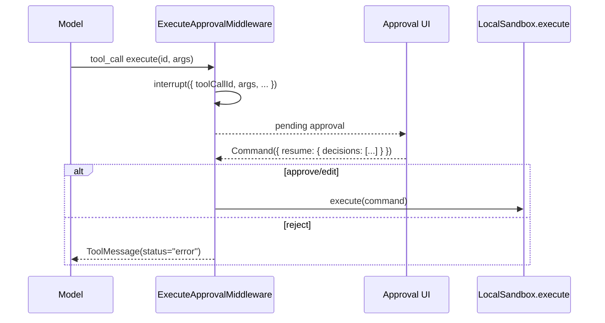

# Execute Approval Middleware

This project now uses a custom middleware for `execute` approval instead of `interruptOn`.

## Timing

The middleware lives in `wrapToolCall`, so it runs after the model has already emitted a tool call and right before the tool would actually execute.



## Why this is closer to deer-flow

- Same point of interception: `wrapToolCall`
- Same advantage: the real `tool_call.id` is available at the source
- Main difference: deer-flow returns a `Command(... goto=END)` and lets the user continue later, while openwork keeps the existing HITL UI and uses `interrupt()` plus resume decisions

## What changed

- Source of truth for tool-call linkage is now the interrupt payload itself: `actionRequests[0].toolCallId`
- `threads:history`, stream-time persistence, and the renderer all prefer that direct ID
- Old message-based matching remains only as a legacy fallback for historical checkpoints

## How to verify

1. Trigger an `execute` call from the agent.
2. In the main-process logs, you should first see:

```text
[ExecuteApprovalMiddleware] Intercepting execute tool call before execution
```

3. At this point, you should see the approval UI and you should not see:

```text
[LocalSandbox] Executing command:
```

4. Approve the request. Then the next logs should be:

```text
[ExecuteApprovalMiddleware] Received execute approval decision
[LocalSandbox] Executing command:
```

5. Refresh the thread. The pending approval should still resolve back to the same tool call because the persisted HITL row now stores the real `tool_call_id`.
