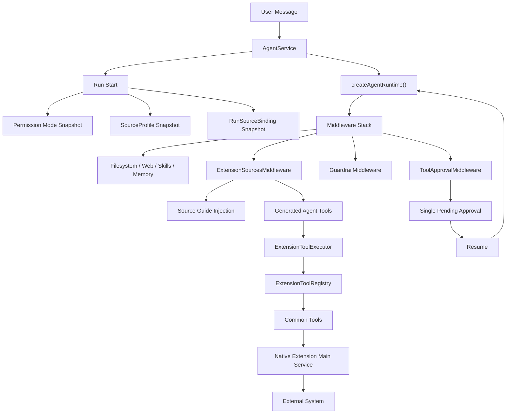
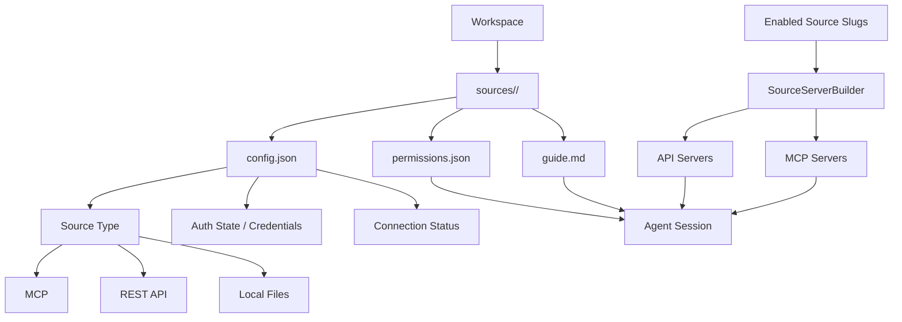
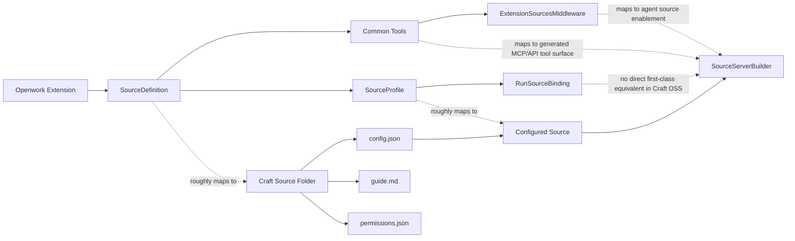

# Openwork vs Craft Agents

This document compares Openwork's current extension-source architecture with the Source model in Craft Agents OSS.

It answers one question:

`Are we structurally converging on the same thing, or only borrowing vocabulary?`

Short answer:

- `yes` at the Source boundary level
- `partly` at the runtime execution level
- `not yet` at the user-facing source-management level

## Openwork Current Shape

This is the current direction in Openwork after the first source-tool slice:



## Craft Agents Shape

This is the relevant Source shape in Craft Agents OSS based on workspace sources, permissions, guides, and server building.



## Layer Mapping

The useful mapping is this:



## What Already Matches

These parts are now genuinely similar in architecture, not just naming:

- `Source is agent-facing work context`, not just a plugin page.
- `Source Guide` exists as its own layer, separate from skills.
- `Permission` is source/tool related, not only a shell concern.
- `SourceProfile` is current configuration; `RunSourceBinding` is durable run evidence.
- `Common Tool` and profile-declared agent tool ids are separate from renderer UI.

At this level, Openwork is no longer "just Raycast command + AI". It is starting to look like a work-source architecture.

## What Is Still Different

These differences are still substantial:

### 1. Openwork is runtime-first; Craft is source-folder-first

Craft's Source system is centered on workspace files:

- `config.json`
- `guide.md`
- `permissions.json`

Openwork is centered on:

- native extension manifests
- main-side tool registry
- middleware injection
- run snapshots in harness metadata

So the shape is similar, but the ownership model is different.

### 2. Openwork has stronger harness evidence

Openwork now snapshots:

- permission mode
- source profiles
- run source bindings

into run metadata.

Craft OSS, by contrast, is more about current workspace source state and server building. Openwork is already leaning harder into replay/recovery semantics.

### 3. Openwork still lacks first-class source management UI

Craft already has visible source management as a primary product surface.

Openwork does not yet have:

- source profile list
- source picker
- profile auth management UI
- per-profile tool selection UI

So architecturally we are converging, but product surface is not there yet.

### 4. Openwork currently has one real source slice

Right now Openwork has:

- Apple Reminders source
- profile-declared source tools
- unified Permission Mode integration

It does not yet have a second real work source like GitHub wired through the same path.

That means the architecture is real, but still lightly exercised.

## Similarity Judgment

If the question is:

`Are we building the same kind of thing as Craft Sources?`

The answer is:

- `yes` in concept boundary
- `yes` in runtime direction
- `not yet` in source-management product completeness

If the question is:

`Could Openwork now reasonably claim to have a Source architecture rather than only extension commands?`

The answer is `yes`, but narrowly:

- one source slice is real
- the permission path is integrated
- source guide and run evidence exist
- source profiles are not yet a user-facing system

## Current Best Reading

The best way to describe Openwork now is:

```txt
Craft:
  Source-first work agent product with MCP/API/local adapters.

Openwork:
  Harness-first agent runtime that is gaining a Source layer through extensions.
```

That is close enough to be meaningfully comparable, but not interchangeable.
