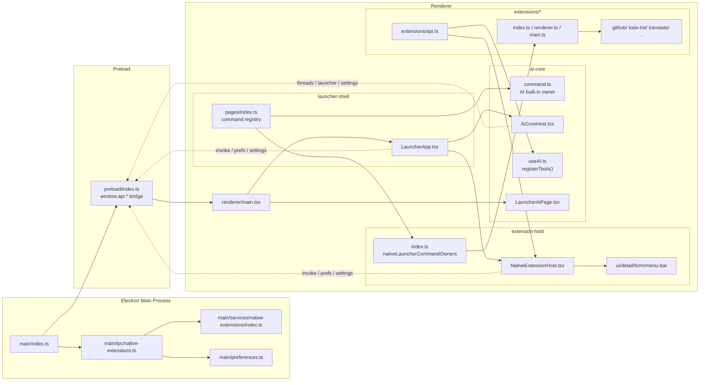
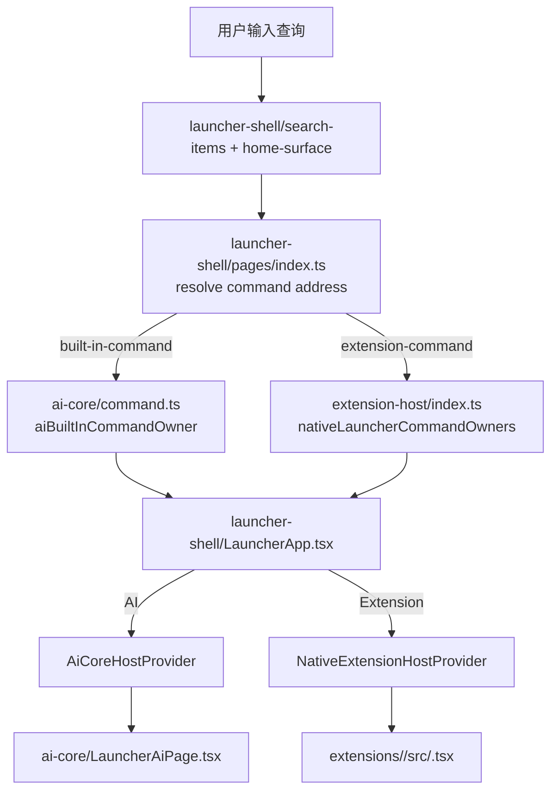
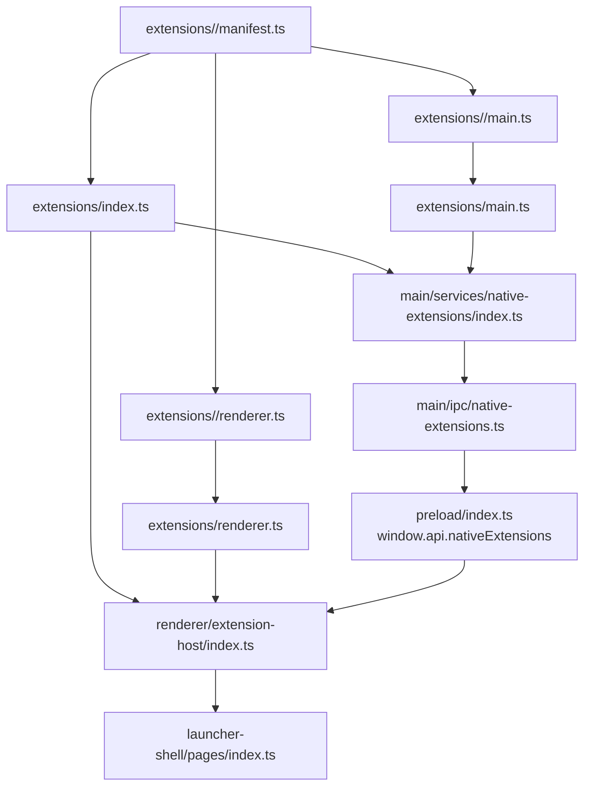
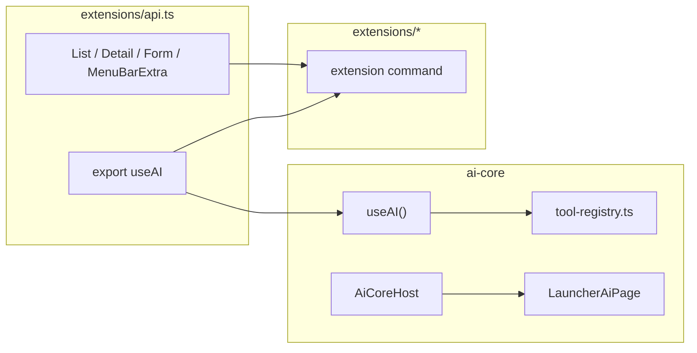

# Launcher / AI / Extension Architecture

这份文档只回答一件事：

`当前 Openwork 里，launcher-shell、ai-core、extension-host、extensions，以及 main/preload/renderer 到底是什么关系。`

目标不是讲历史，而是把现在的主路径讲清楚。

## 一句话总览

- `launcher-shell` 是入口壳：根搜索、路由、窗口交互。
- `ai-core` 是平台原生 AI 能力：AI 页面、AI host、`useAI()`。
- `extension-host` 是 native extension runtime：跑 `List / Detail / Form / MenuBarExtra` 和 command host。
- `extensions/*` 是具体 extension 自己的目录：manifest、renderer command、main service。
- `main + preload` 提供系统能力、settings、preferences、RPC、window 控制。

一句更硬的话：

`launcher-shell 决定打开谁，ai-core 和 extension-host 决定怎么跑，extensions 决定跑什么。`

## 当前目录分工

### renderer 主线

- `src/renderer/src/launcher-shell`
  - launcher 入口壳
  - 根搜索、route、command 打开、launcher chrome
- `src/renderer/src/launcher-components`
  - launcher 自己的展示组件
  - 不属于 extension SDK
- `src/renderer/src/ai-core`
  - AI 页面
  - AI host
  - `useAI()` 与 tool registry
  - `history.tsx` 当前也在这里，但它只是 parked surface，不是 AI 内核
- `src/renderer/src/extension-host`
  - native extension runtime
  - `NativeExtensionHost`
  - `List / Detail / Form / MenuBarExtra`
  - passive command host、view stack

### extension 声明层

- `src/extensions/api.ts`
  - extension 作者唯一稳定入口
- `src/extensions/index.ts`
  - extension manifest 总清单
- `src/extensions/renderer.ts`
  - extension renderer 定义总清单
- `src/extensions/main.ts`
  - extension main 定义总清单
- `src/extensions/<id>/`
  - 每个 extension 自己的 manifest / renderer / main / command 文件

### backend 主线

- `src/main/services/native-extensions/index.ts`
  - main 侧 extension runtime
  - settings schema 汇总
  - extension service invoke
- `src/main/ipc/native-extensions.ts`
  - 把 native extension 能力挂到 IPC
- `src/main/preferences.ts`
  - extension preferences / secrets / launcher settings
- `src/preload/index.ts`
  - 给 renderer 暴露 `window.api.nativeExtensions.*`、`window.api.launcher.*` 等桥

## 图 1：进程与模块关系

## 图 2：launcher 打开 command 的主链路

这条链路里最关键的职责分界是：

- `pages/index.ts` 只负责“这个地址是谁”
- `LauncherApp.tsx` 只负责“给它接哪个 host”
- AI 和 extension 各自跑自己的 host，不共享上下文

## 图 3：native extension 的前后端链路

这里要记住：

- `manifest.ts` 是 extension 元信息事实源
- `renderer.ts` 只声明前端 command 模块
- `main.ts` 只声明 main service
- renderer 和 main 不再各自维护一份 host 侧平行 inventory

## 图 4：AI 与 extension 的关系

当前 `useAI()` 的边界是：

- 它已经是平台原生 API 的入口
- 但现在只实现了 `registerTools()`
- 还没有扩到 `compilerSkill / registerMcp / registerContextProvider`

也就是说：

`AI 已经从 launcher/plugin 体系里拆出来了，但 AI core 还只是最小内核，不是完整 agent platform。`

## 前后端分别管什么

### renderer

renderer 负责三件事：

1. `launcher-shell`
   - root search
   - route
   - open command
   - shell 视觉与交互

2. `ai-core`
   - AI 页面
   - AI 页面自己的 host
   - `useAI()` 的 renderer 侧能力

3. `extension-host`
   - 运行 extension command
   - 给 extension 注入 navigation / surface / threads / preferences
   - 提供 `List / Detail / Form / MenuBarExtra`

### main

main 负责四件事：

1. settings / preferences / secrets
2. native extension main service
3. IPC handler
4. Electron window / launcher / menu bar 的系统能力

### preload

preload 只做桥：

- 不承载业务决策
- 不定义 extension 结构
- 只把 `window.api.launcher`、`window.api.nativeExtensions`、`window.api.settings` 等暴露给 renderer

## 当前最关键的依赖方向

### 正确方向

- `launcher-shell -> ai-core`
- `launcher-shell -> extension-host`
- `extension-host -> extensions/*`
- `extensions/* -> extensions/api.ts`
- `main/services/native-extensions -> extensions/main.ts`

### 不该出现的方向

- `extensions/* -> launcher-shell`
- `extensions/* -> renderer 私有实现`
- `extension-host -> launcher-shell 私有状态`
- `AI 被建模成普通 extension`

## 现在还没有完全收干净的地方

这是“当前架构图里的已知残留”，不是理想终局：

1. `src/shared/launcher-plugin.ts`
   - 仍然承载一部分 capability / manifest 命名
   - 所以 `NativeExtensionHost` 和 `main/services/native-extensions` 里还有少量旧命名残留

2. `src/renderer/src/ai-core/history.tsx`
   - 当前放在 `ai-core` 目录
   - 但它本质上是 parked surface，不是 AI 内核

3. `useAI()`
   - 现在只有最小 tool 注册
   - 还没形成完整 AI core contract

## 读代码顺序

如果你要用最短路径看懂现在的系统，按这个顺序读：

1. `src/renderer/src/main.tsx`
2. `src/renderer/src/launcher-shell/pages/index.ts`
3. `src/renderer/src/launcher-shell/LauncherApp.tsx`
4. `src/renderer/src/ai-core/command.ts`
5. `src/renderer/src/extension-host/index.ts`
6. `src/extensions/api.ts`
7. `src/extensions/renderer.ts`
8. `src/extensions/main.ts`
9. `src/main/services/native-extensions/index.ts`
10. `src/main/ipc/native-extensions.ts`

## 最后收口

今天这套关系可以压成一句产品/工程判断：

`launcher-shell 是 Raycast 那个总入口壳；ai-core 是平台自己的原生智能内核；extension-host 是我们自己的 extension runtime；extensions 是具体能力包；main/preload 则提供系统与持久化底座。`
