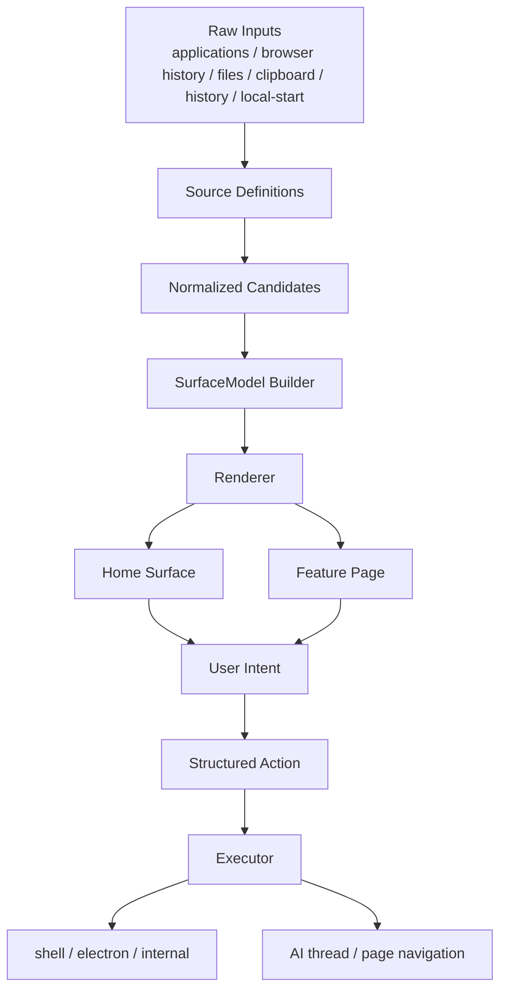
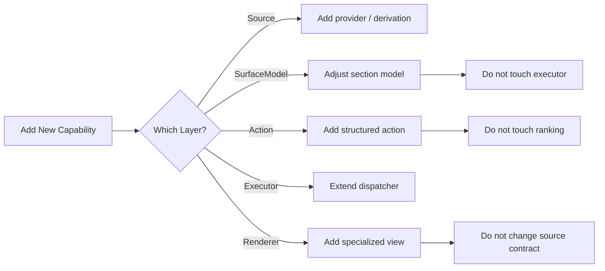

# Launcher Architecture Principles

这份文档描述 launcher 后续迭代应遵循的架构原则。

目标不是把 launcher 做成 webpack / prosemirror 那么重，而是借它们的一个核心原则：

**边缘可扩展，核心可推导。**

也就是：

- 变化大的东西，放在边界层扩展
- 产品核心规则，收成少数稳定中间模型
- 不把排序、导航、history、键盘语义做成到处可插的 plugin 系统

## 一句话版本

launcher 后续只围绕 5 个核心名词设计：

1. `Source`
2. `Candidate`
3. `SurfaceModel`
4. `Action`
5. `Executor`

如果一个新需求放不进这 5 个名词，通常说明设计还没砍干净。

## 核心架构图

## 分层解释

### 1. Source

职责：

- 从外部世界读原始数据
- 做各自领域内的最小归一化
- 产出统一 `Candidate`

例子：

- applications provider
- 未来 browser history provider
- 未来 files provider
- clipboard intent derivation
- local-start loader

它像 webpack 的 `loader`。

它负责：

- “我这里能产出什么候选项”
- “我这里的基础匹配分是什么”

它不负责：

- 首页 section 怎么排
- 默认选中谁
- 点了之后做什么

### 2. Candidate

职责：

- 统一不同来源的中间结果模型
- 成为 `SurfaceModel` 的唯一输入材料

建议字段：

- `id`
- `source`
- `kind`
- `title`
- `subtitle`
- `score`
- `identityKey`
- `presentation`
- `action`

要求：

- 足够小
- 足够稳定
- 不混入 UI 容器状态

### 3. SurfaceModel

职责：

- 决定 launcher 当前页面最终展示什么
- 决定 section 的顺序
- 决定每个 section 的局部排序
- 决定默认选中策略

它是 launcher 的核心中间层。

它像：

- 编辑器里的 document projection
- 或者 shell 的最终页面模型

它负责：

- 空输入时显示 `history-grid` 还是 `idle-list`
- 有输入时显示哪些 section
- `plugin-intents`、`search-results`、未来 `suggestions` 如何并存

它不负责：

- 去系统里扫描应用
- 读原始 clipboard
- 真正执行 action

### 4. Action

职责：

- 表达“用户到底要做什么”

不是：

- 展示逻辑
- 排序逻辑
- history 逻辑

推荐方向：

- `type`
- `executor`
- `target`

例如：

- `open-application`
- `open-url`
- `open-page`
- `submit-ai`

本地 UI 交互，例如 `replace-query`，不要强行塞进主 action 协议。
它们应该留在 shell item / local command 层。

### 5. Executor

职责：

- 真正执行 action

例子：

- `shell`
- `electron`
- `internal`

它只做分发和执行，不承载搜索和排序。

## 扩展层与核心层

### 允许扩展的

这些适合做 definition / registry：

- `Source Definitions`
- `Page Definitions`
- `Renderer Definitions`
- `Lifecycle Hooks`

对应例子：

- applications / browser / files provider
- AI / translate / future page entry
- attachment preview / 特殊 result row / tool action row
- `onLauncherShown` / `onEnterPage` / `onLeavePage`

### 不应扩展化的

这些应该保持为普通小函数：

- home assembly rules
- section ranking rules
- keyboard semantics
- history policy
- default selection policy

原因：

这些是 launcher 的产品真相，不是开放扩展点。

## 受 webpack / prosemirror 启发的地方

### 从 webpack 学到的

- `loader` 负责把异构输入转成统一中间模型
- `plugin` 只做少量生命周期切面

launcher 对应关系：

- `Source` 像 loader
- `Lifecycle Hooks` 像 plugin

不应该学的是：

- 把排序和首页组装也做成一堆 hook/plugin

### 从 prosemirror 学到的

- 每个 plugin 维护自己的局部 state
- `nodeView` 只解决特殊展示

launcher 对应关系：

- `clipboard session`
- `attachment draft`
- `route state`
- `history state`

这些都该有自己的归属。

而：

- `history tile`
- `attachment preview`
- `special result row`

只是表现层特化，不应反过来驱动核心状态。

## launcher 的减法

真正的减法不是删功能，而是把职责收窄。

后续每次加功能，都先问 3 个问题：

1. 它是 `Source`、`SurfaceModel`、`Action`、`Executor` 里的哪一层？
2. 它是产品核心规则，还是边界扩展点？
3. 它是否在增加 cross-layer 认知？

如果答案变成：

- 同时改 `source + ranking + UI + execute`

那通常说明边界已经错了。

## 对当前代码的落点

### 已经方向正确的

- `applications provider`
- `built-plugins / page entry`
- `defineToolComponent / defineHumanInTheLoop`
- `home-surface`

### 当前最需要继续收口的

- `useLauncherSearchPage`
  - 现在仍然承担太多首页控制职责
- `home-surface -> action`
  - 排序层不应继续理解执行协议
- `clipboard`
  - 应继续沿 `snapshot -> derivation -> consumption` 收口

## 未来按这份图推进时的实现规则

### Source / Provider 落地约束

搜索 source 的主进程实现统一按下面的形式落地：

- `class X implements LauncherSearchProvider`
- export 一个稳定实例，例如 `export const filesLauncherSearchProvider = new FilesLauncherSearchProvider()`

这样做的原因：

- provider 边界一眼可见
- `source / search / warmup` contract 固定
- 内部状态，例如缓存、预热 promise、icon cache，可以留在类内部，不外溢到搜索总线

不再把主链 provider 导出成匿名对象字面量。

## 决策标准

如果未来一个 launcher 功能满足下面条件，就说明方向是对的：

- 只需要改一层核心逻辑
- 或者只增加一个边界扩展定义
- 不需要同时改搜索、排序、执行、渲染四个地方

如果做一个小功能需要同时动：

- provider
- home-surface
- search hook
- executeAction
- page component

那就应该先停下来收边界。
