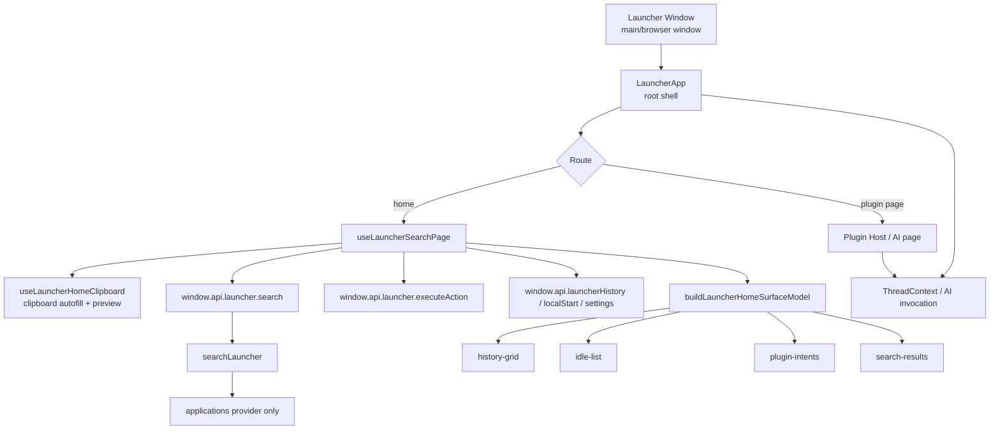
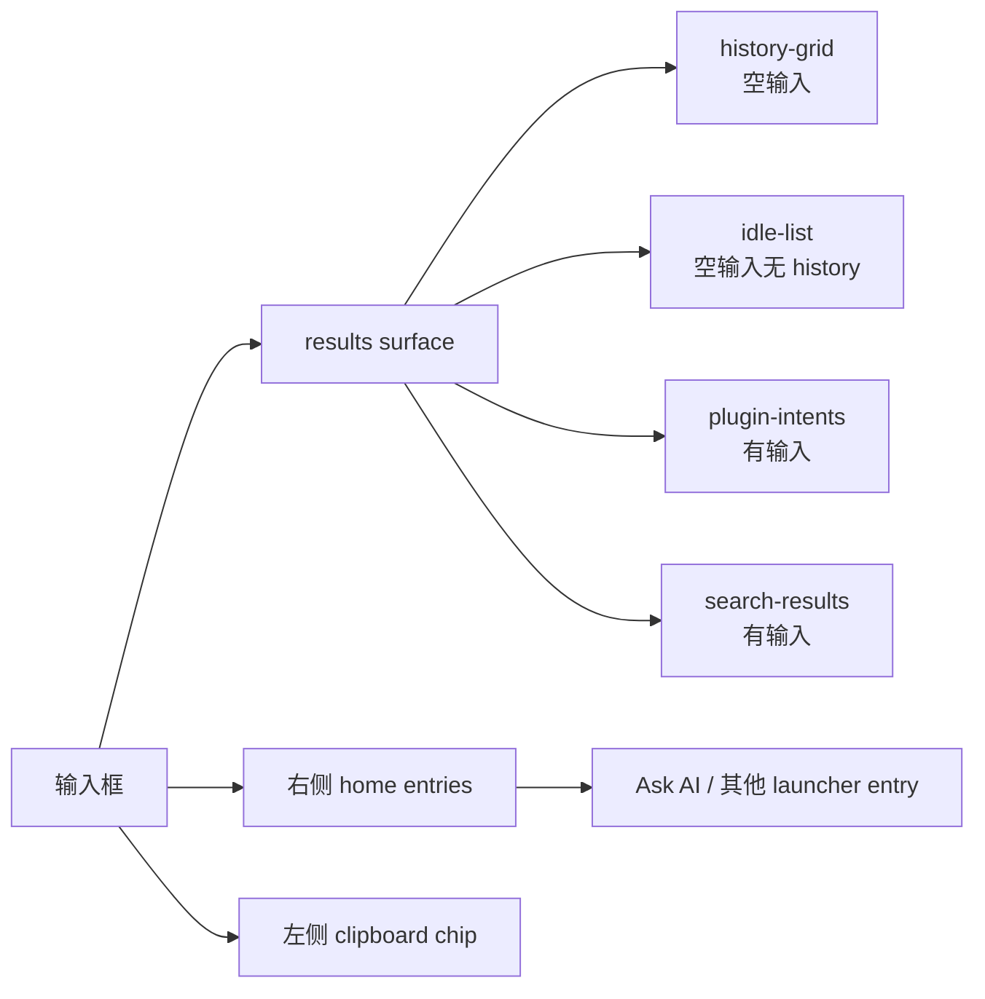

# Launcher Current State

这份文档只描述当前 `openwork launcher` 的真实状态，不讨论下一步方案。

## 总览

当前 launcher 已经具备：

- 全局快捷键唤起
- 应用搜索与启动
- 空输入 history 宫格
- `pin / unpin / remove`
- clipboard 文本自动回填
- clipboard 图片 / 文件 preview
- `Tab` 进入 AI 页
- launcher AI 复用 thread / messages / tool / HITL 主链

当前 launcher 还不具备：

- 输入框右侧 inline `— 打开`
- 浏览器搜索建议
- “点击后只填充输入框”的 suggestion
- 输入行即时动作 + 下方建议区块 这套双层首页模型

## 整体结构

## 首页结构

## 模块边界

### 1. 根壳

文件：

- [LauncherApp.tsx](/Users/junjieding/dingjunjie_dev/2026_03/openwork/src/renderer/src/launcher/LauncherApp.tsx)

职责：

- route 切换
- plugin host
- AI thread bridge
- viewport 同步
- 输入焦点策略

### 2. 首页控制器

文件：

- [useLauncherSearchPage.ts](/Users/junjieding/dingjunjie_dev/2026_03/openwork/src/renderer/src/launcher/hooks/useLauncherSearchPage.ts)

当前仍然负责：

- `query`
- 空态数据拉取
- 搜索请求
- 键盘语义
- 执行结果
- history `pin/remove`
- clipboard home 行为接入

### 3. 首页结果装配层

文件：

- [home-surface.ts](/Users/junjieding/dingjunjie_dev/2026_03/openwork/src/renderer/src/launcher/home-surface.ts)

当前产出 5 类 section：

- `history-grid`
- `idle-list`
- `plugin-intents`
- `suggestions`
- `search-results`

注意：

- 当前没有 `inline primary action`

### 4. 首页 UI

文件：

- [LauncherSearchPage.tsx](/Users/junjieding/dingjunjie_dev/2026_03/openwork/src/renderer/src/launcher/components/LauncherSearchPage.tsx)

当前结构：

- 左侧可以放 clipboard chip
- 右侧是 home entries，比如 `Ask AI`
- 底部 footer 是当前选中项的主操作
- 输入框右侧现在没有 inline `— 打开`

### 5. 主进程搜索链

文件：

- [index.ts](/Users/junjieding/dingjunjie_dev/2026_03/openwork/src/main/services/launcher-search/index.ts)
- [applications.ts](/Users/junjieding/dingjunjie_dev/2026_03/openwork/src/main/services/launcher-search/providers/applications.ts)

当前状态：

- 只有 `applications provider`
- 负责应用发现、匹配、打分、图标和 subtitle

### 6. 执行入口

文件：

- [launcher-window.ts](/Users/junjieding/dingjunjie_dev/2026_03/openwork/src/main/windows/launcher-window.ts)

职责：

- IPC `launcher:search`
- IPC `launcher:executeAction`
- IPC `launcher:getClipboardContext`
- launcher window 显示/隐藏与 viewport 高度同步

## 当前首页真实交互

### 空输入

- 优先显示 `history-grid`
- 没有 history 时显示 `idle-list`
- 可以右键 `pin / unpin / remove`

### 有输入

- 先走 `plugin-intents`
- 再走 `search-results`
- 再走 `suggestions`
- `Enter` 执行当前选中项
- `Tab` 进入 AI 页

### Clipboard

- 文本：输入为空时自动回填
- 图片 / 文件：以 preview chip 形式显示
- suggestion 已经进入首页 surface，但 clipboard 仍然还是上下文输入，不是 suggestion source

## 现阶段最关键的事实

当前 launcher 首页仍然是：

1. 输入框
2. 左 clipboard chip
3. 右 Ask AI
4. 下方结果区
5. 底部主操作

它已经开始往下面这种结构靠：

1. 输入行即时动作
2. 下方 suggestion 区块
3. suggestion 和 search result 并存的首页模型

当前还没到位的是：

1. 输入框右侧 inline primary action
