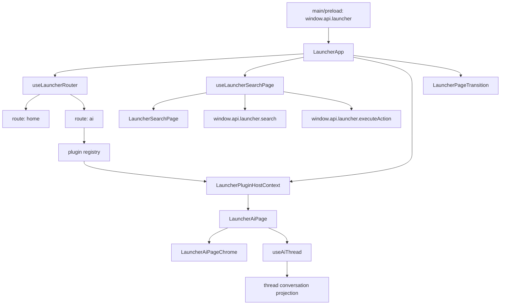

# Launcher Shell Architecture

## 目标

把 launcher 明确切成三层，避免继续把 search、detail page、窗口壳揉进一个 hook：

- `shell host` 只负责窗口、路由、focus、切页动画、viewport 下发
- `home/search page` 自己负责搜索输入、结果、选中态、执行流
- `feature page` 自己负责输入框、footer、快捷键、内部状态与提交链路

## 当前落地结果

- `LauncherApp` 只编排路由、focus、`Escape` 语义和 viewport 同步
- `useLauncherRouter` 只管理 `home <-> feature page` 导航
- `useLauncherSearchPage` 独立承接原 `useLauncherShell` 的搜索态
- `useLauncherSearchPage` 负责把 home 内部 intent item 和外部 search result 合成一条结果流
- `LauncherAiPage` 自己管理 AI page chrome、thread session 和固定 viewport
- `launcherHomeEntries` 与 `feature page registry` 分离，不再共用一个 definition

## First-Party Plugin Contract

当前 launcher 里的二级能力按 `first-party plugin` 收口，而不是继续按“内建特殊页”处理。

- `plugin registry` 负责 `id -> Component + viewport + home entry`
- `plugin host` 负责 `navigation + surface + clipboard + thread bridge + shown lifecycle`
- `home/search page` 只拥有自己的搜索输入和搜索结果
- `plugin page` 只拥有自己的输入、提交链路和内部状态
- 新的 first-party plugin 默认放进 `launcher/built-plugins/<plugin-id>`
- 内置插件通过 `defineBuiltLauncherPlugin()` 声明 manifest，而不是直接拼 registry 字段
- 插件 renderer 侧通过 `createBuiltPluginClient()` 走统一 `builtPlugins.invoke`，不直接依赖 `window.api` 细节
- 插件自己的 copy 尽量跟插件目录走，不再回写全局 `messages.ts`
- `seedQuery` 只在 `home -> plugin` 导航时显式传一次
- launcher 根层不再持有全局 `query state`

这条边界是为了先把内部能力写成稳定的插件宿主协议；后续如果真的需要外部加载或 npm 分发，只在这个 contract 外增加 loader，不回头修改 page 输入归属。

当前 `plugin host` 暴露的最小能力是：

- `navigation.goHome`
- `navigation.hideLauncher`
- `navigation.openPlugin`
- `surface.inputRef`
- `surface.shellConfig`
- `surface.viewportHeight`
- `surface.shownSequence`
- `clipboard.context / clipboard.clearContext`
- `threads.create`
- `threads.submit`

主进程与 preload 侧也做了对称收口：

- main 通过 `defineBuiltPluginService()` 声明插件后端方法
- preload 只暴露一个通用 `builtPlugins.invoke`
- 新增内置插件时，宿主层只需要增加注册，不再为每个插件扩散新的 preload API

第一版只补 3 个生命周期语义：

- `onEnter`
- `onLeave`
- `onLauncherShown`

## 模块图

## 状态归属

| 状态/行为                                                          | 归属                                | 说明                                                     |
| ------------------------------------------------------------------ | ----------------------------------- | -------------------------------------------------------- |
| 窗口 show/hide、focus、page transition                             | `LauncherApp`                       | 这是 launcher shell 的职责                               |
| 当前 route、前进/返回方向                                          | `useLauncherRouter`                 | 不承载 search 或 AI state                                |
| 搜索 query、debounce、results、selectedIndex                       | `useLauncherSearchPage`             | 只服务 home/search page                                  |
| feature intent item 组装                                           | `useLauncherSearchPage`             | 例如 `Ask AI with "{query}"` 这种内部跳转项              |
| plugin host 能力（返回、clipboard、surface、thread bridge、shown） | `LauncherPluginHostContext`         | plugin 页面不直接读取 shell 私有实现                     |
| feature page 输入、footer、提交逻辑                                | 各自 page                           | 现在由 `LauncherAiPage` / `useAiThread` 承担             |
| AI thread、resume、approval、display projection                    | `useAiThread` + shared thread layer | 与 launcher search 脱耦                                  |
| viewport 高度                                                      | 页面自己决定，shell 只下发          | home 用 search result 数量驱动，AI page 自己设置固定高度 |

## 关键约束

1. `plugin registry` 只保留 `id -> Component`，不再承载 shell 级输入状态。
2. `home entry` 单独定义；将来某些页面可以“可路由但不出现在 home 入口区”。
3. `seedQuery` 只在从 home 进入 plugin 时显式传递；进入后页面完全接管自身输入态。
4. `Escape` 统一由 shell host 决策：优先返回当前 feature page，再关闭 launcher 窗口。
5. 新 feature page 默认不复用 AI chrome；只有真实出现共性时，再下沉小颗粒 primitive。

## 后续扩展规则

- `settings`、`ctrl+k menu` 作为 shell-level overlay 进入，不放进 feature page registry
- `translate`、`image`、`chart` 各自拥有自己的 page layout 与 page hook
- 共享层只保留小颗粒 primitive，例如 `LauncherInput`、icon button、transition、bar primitive
