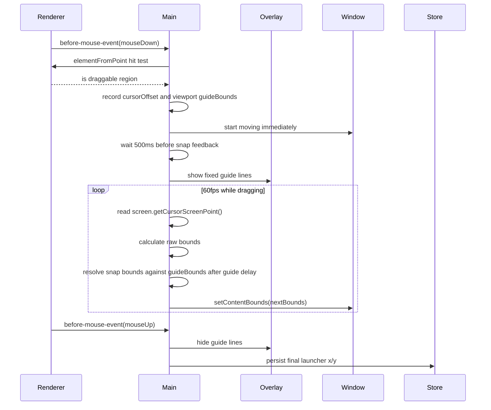

# Launcher 拖拽吸附线技术方案：为什么不能只靠系统拖动

> 这篇文档记录 Openwork/Jingle launcher 的 Raycast 风格拖拽吸附线实现。核心结论：普通窗口拖动可以交给系统；但如果要做固定虚线、磁吸和位置记忆，就必须由应用自己拥有拖动状态。

## 结论

普通无边框 Electron 窗口拖动，最简单方案是 CSS `app-region: drag`。但它只适合“能拖就行”的窗口，不适合 Raycast 那种拖动时出现灰色虚线、靠近后有吸附感、拖完记住位置的 launcher。

原因很直接：

- `app-region: drag` 会把这块区域交给系统窗口管理器，应用只能在外围收到窗口 move 事件。
- Electron 官方文档明确说明 draggable region 会忽略 pointer events，交互元素必须用 `app-region: no-drag` 排除。
- 吸附不是“拖完以后把窗口摆正”，而是拖动过程中窗口位置就应该被约束到 guide 上。
- 因此吸附线、拖动状态、窗口位置写入必须在同一个状态 owner 里完成。

当前实现采用社区常见的 main-process dragging 模式：`webContents.before-mouse-event` 捕获鼠标事件，main 进程读取全局 cursor 坐标，自己调用 `BrowserWindow.setContentBounds()` 移动窗口。

参考线不会在 mouseDown 后立刻出现。拖动本身立即开始，参考线和吸附规则会在持续拖拽 `500ms` 后启用，用来过滤短按误触和很小的位置微调。

## 支持系统

### macOS：支持

macOS 是这个功能的主目标平台。

实现依赖：

- frameless transparent `BrowserWindow`
- main 进程 `webContents.on("before-mouse-event")`
- `screen.getCursorScreenPoint()`
- `BrowserWindow.setContentBounds()`
- click-through overlay window
- `setAlwaysOnTop(true, "floating")`
- `setVisibleOnAllWorkspaces(true, { visibleOnFullScreen: true })`

macOS 上还有一个产品细节：launcher 使用 `type: "panel"`，这是为了让窗口更像 Raycast 一样能浮在全屏应用上方。

### Windows：支持

Windows 也是当前实现目标平台。

实现依赖同样是 Electron main-process window API，不需要额外 native module：

- `webContents.before-mouse-event`
- `screen.getCursorScreenPoint()`
- `BrowserWindow.setContentBounds()`
- transparent click-through overlay
- `setAlwaysOnTop(true)`

Windows 侧额外注意两点：

- frameless transparent window 的圆角/形状可能需要 `setShape()` 辅助。
- 拖动过程中不要每帧重算 shape；shape 是窗口内部坐标，只有宽高变化时才需要同步，否则会拖慢手感。

### Linux：不是本次验收目标

从 Electron API 形态看，Linux/X11 上有机会沿用同一套 main-process dragging 思路。但这次不能把 Linux 写成已支持。

原因是 Electron 官方对 Linux/Wayland 有明确限制：在 Wayland 下，程序通常不能随意 programmatically move、position、focus、blur 窗口；需要 Xwayland/X11 才更接近 macOS/Windows 的行为。

所以本文档的准确说法是：

- macOS：支持，已按产品目标实现。
- Windows：支持，按同一套 Electron main-process API 实现。
- Linux：best effort / 未验收；如果要正式支持，需要单独跑 X11、Xwayland、Wayland 三类窗口管理环境验证。

## 为什么 `app-region` 不够

Electron 的 `app-region: drag` 是系统拖动入口。它的优点是简单、稳定、符合普通桌面窗口直觉。

但它有三个天然限制：

1. 应用拿不到完整拖动生命周期。

   系统接管拖动后，renderer 的 pointer 事件会被影响。你可以监听窗口的 `move`、`moved`、`will-move`，但这些事件不是一个可靠的“拖动状态机”。特别是 macOS 上 `moved` 和 `move` 的语义也容易让“拖完再处理”的逻辑变得不稳。

2. 吸附只能后验修正。

   如果拖动由系统控制，应用只能在窗口已经移动之后尝试修正位置。这样用户看到的是“拖动自由移动，松手后跳一下”，没有 Raycast 那种靠近参考线时被吸住的感觉。

3. overlay guide 容易跟着错误状态跑。

   正确的 guide 应该来自当前视口的默认 launcher 位置，而不是当前窗口位置。否则用户把 launcher 拖到新位置并持久化以后，下一次拖动 guide 也会跟着变，吸附线就不再是稳定的视口参考线。

所以 `app-region` 适合 Settings、History 这类普通窗口标题栏拖动；launcher 的 snap overlay 要单独设计。

## 社区方案给出的方向

社区里成熟的 Electron frameless window drag 方案基本不是继续增强 `app-region`，而是绕开它：

- `electron-draggable`：main-process solution；监听 `webContents.on("before-mouse-event")`，根据 selector/exclude 判断是否可拖，然后读取 cursor screen point 更新窗口位置。
- `electron-drag`：更老的方案，思路也是在 drag 时用全局鼠标坐标驱动窗口 `setPosition()`，而不是依赖 DOM drag。

Openwork/Jingle 现在采用的是同类模式，但没有直接引入依赖，因为我们还要插入自己的 snap overlay、固定 guide、位置持久化和 Windows shape 优化。

对参考线出现时机，公开系统和社区材料没有指向“三秒长按”。Windows Snap 的官方描述是把窗口拖到屏幕边缘时自动显示 snap layout box；macOS tiling 的官方描述是拖到边缘/高亮区域后松手。SuperCmd 开源实现里可见的是命令式 window management preset，不是 Raycast 这种拖拽参考线 overlay。

所以这里不把正常窗口移动延迟到几秒后才开始，也不让参考线 mouseDown 秒出。当前选择是：窗口立即跟手移动，参考线和吸附规则在持续拖动 `500ms` 后启用。

## 正确的状态边界

这个功能里有三个角色：

1. Renderer：只标记拖拽热区。

   `LauncherChromeFrame` 给 header/footer 打上 `.launcher-window-drag-region`。它不拥有拖动状态，也不负责移动窗口。

2. Main process：拥有拖动状态。

   `launcher-window-drag-controller.ts` 是唯一的 drag state owner。它负责：
   - 判断 mouseDown 是否发生在可拖区域。
   - 记录鼠标相对窗口的 offset。
   - 按当前 display/workArea 计算固定的 viewport `guideBounds`。
   - 每帧读取 cursor screen point。
   - 计算 raw window bounds。
   - 应用 snap 规则。
   - 调 `setContentBounds()` 移动窗口。
   - mouseUp/hide 时持久化最终位置。

3. Overlay：只画线。

   `launcher-snap-overlay.ts` 创建一个 click-through transparent BrowserWindow；`launcher-snap-overlay.html` 只负责画三条虚线。

   Overlay 不计算吸附，也不参与拖动状态。它拿到的是按当前视口计算出来的固定 guide：
   - left line = viewport default launcher x
   - right line = viewport default launcher x + launcher width
   - top line = viewport default launcher y

   因此左右两条竖线的距离就是 launcher 宽度，并且拖动过程中不移动。用户拖完以后记住的新位置不会改变这组 guide。

## 拖动流程



## 吸附规则

当前吸附是一个纯几何函数：

- 横向吸附：当前窗口左边界接近 guide 左边界，或当前窗口右边界接近 guide 右边界。
- 纵向吸附：当前窗口顶部接近 guide 顶部。
- 吸附阈值：`8px`。
- 参考线延迟：`500ms`，延迟结束前只做普通拖动，不显示参考线，也不应用吸附。

这个规则的关键不是阈值，而是应用时机：必须在拖动过程中应用。

错误手感：

```text
用户拖动 -> 系统移动窗口 -> mouseUp -> 应用把窗口跳到 guide
```

正确手感：

```text
用户拖动 -> 应用计算 raw bounds -> 接近 guide 时立即返回 snapped bounds -> 窗口当场吸住
```

## 位置记忆

位置记忆不能放在 renderer，也不能靠窗口下次显示时猜。

当前策略：

- 拖动结束后读取 launcher content bounds。
- 写入 `settings.launcherWindowState = { x, y }`。
- 下次 `showLauncherWindow()` 时优先使用持久化坐标。
- 如果屏幕尺寸变化或显示器变化，再用现有 workArea 规则 clamp 到可见区域内。

这样可以避免两个问题：

- 拖完以后下一次又回默认居中。
- 外接显示器变化后窗口出现在不可见区域。

但这里有一个边界：位置记忆不是吸附参考线。

Launcher 可以记住用户拖到哪里，下次就从哪里打开；但是吸附线仍然应该来自当前视口的默认 launcher 布局。否则用户每拖一次，下一次 guide 都会更新，吸附线就变成“上一次位置”而不是“视口基准位置”。

## 实现里的坑

### 1. 不要在 move 事件里重算 guide

Guide 是当前视口的默认 launcher 参考线，不是当前窗口位置。它只应该在 `startDrag()` 时按 display/workArea 生成一次；位置记忆只影响窗口打开在哪里，不应该影响 guide 在哪里。

### 2. 不要让 `app-region` 留在 launcher 上

如果 launcher header/footer 仍然是 `app-region: drag`，系统会继续抢走拖动。main process controller 就只能收到残缺事件，磁吸会变成不稳定的后验修正。

### 3. 交互元素必须排除

拖拽热区里可能有 button、input、textarea、link、`role="button"`、可 focus 元素。controller 需要通过 selector/exclude 规则排除它们，否则输入框和按钮会被拖拽吞掉。

### 4. Overlay 必须 click-through

虚线 overlay 是一个真正的透明窗口。它必须 `setIgnoreMouseEvents(true)`，否则会挡住 launcher 或桌面上的鼠标事件。

参考线用于操作反馈，不承担品牌动效；出现和隐藏都不做淡入淡出，避免拖拽开始时有迟滞感。

### 5. Windows shape 不要每帧同步

Windows 的 shape/rounded window 修正和窗口移动不是同一件事。拖动中每帧重算 shape 会让移动变卡；只有宽高变化时才需要同步。

### 6. Linux 不能只看 Electron API 就宣布支持

Wayland 对程序主动移动窗口有限制。即使代码能编译，也要按窗口管理环境做验收。

## 当前代码入口

- `src/main/windows/launcher-window-drag-controller.ts`
- `src/main/windows/launcher-snap-geometry.ts`
- `src/main/windows/launcher-snap-overlay.ts`
- `resources/launcher-snap-overlay.html`
- `src/main/windows/launcher-window.ts`
- `src/main/preferences.ts`
- `src/renderer/src/launcher-components/LauncherChromeFrame.tsx`

## 验证方式

自动验证：

```bash
npm run typecheck
npm run check:guardrails
npm run test:node:target -- tests/node/launcher-snap-geometry.test.ts
```

人工验收：

1. 打开 launcher。
2. 从 header/footer 可拖区域开始拖动。
3. 灰色虚线出现，左右线距离等于 launcher 宽度。
4. 拖动过程中虚线固定不动。
5. 靠近左/右/顶部 guide 时窗口有磁吸感。
6. 松手后关闭再打开 launcher，位置保持在上次拖动后的地方。

## 参考

- Electron Custom Window Interactions: https://www.electronjs.org/docs/latest/tutorial/custom-window-interactions
- Electron BrowserWindow API: https://www.electronjs.org/docs/latest/api/browser-window
- Electron webContents API: https://www.electronjs.org/docs/latest/api/web-contents
- electron-draggable: https://github.com/ECRomaneli/electron-draggable
- electron-drag: https://github.com/kapetan/electron-drag
