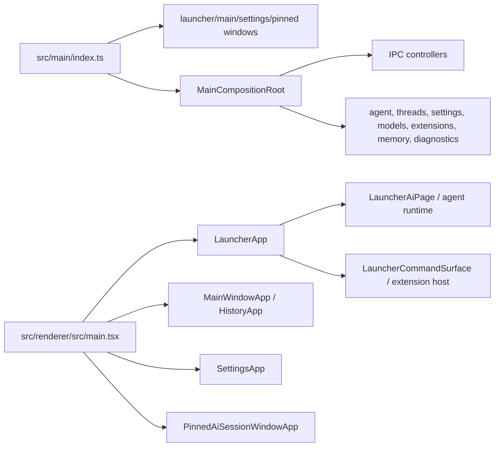

# Production Release Feature Inventory

Last audited from the local checkout on 2026-06-13.

This inventory lists current user-visible capabilities, their entry points,
their code owners, whether current docs match, and the production risk or gap.
It deliberately avoids treating old roadmap or research docs as current truth.

## System Map

Evidence:

- Main process owns lifecycle, protocol, windows, database init, composition root, native island, and shutdown in `src/main/index.ts:22-320`.
- `MainCompositionRoot` registers the product IPC surface and starts menu bar, launcher index refresh, shortcuts, and extension runtime services in `src/main/composition-root.ts:109-197`.
- Renderer dispatches by `window` query into launcher, pinned AI, settings, or main history in `src/renderer/src/main.tsx:20-98`.

## Feature Inventory

| Feature                                       | Current user-visible entry                                                                                                                                                                             | Code owner paths                                                                                                                                                                                                                                   | Current docs match                                                                                                                                                                                               | Release risk or gap                                                                                                                                                                                                                   |
| --------------------------------------------- | ------------------------------------------------------------------------------------------------------------------------------------------------------------------------------------------------------ | -------------------------------------------------------------------------------------------------------------------------------------------------------------------------------------------------------------------------------------------------- | ---------------------------------------------------------------------------------------------------------------------------------------------------------------------------------------------------------------- | ------------------------------------------------------------------------------------------------------------------------------------------------------------------------------------------------------------------------------------- |
| Launcher root search                          | App opens to launcher on ready; global shortcut/menu toggles launcher; root search opens apps, files, URLs, quicklinks, threads, extension commands                                                    | `src/main/index.ts:95-107`, `src/main/composition-root.ts:182-197`, `src/main/services/launcher-search`, `src/renderer/src/launcher-shell`, `src/renderer/src/launcher-components`                                                                 | Partial. README names the product but does not explain launcher search sources or result behavior. `docs/launcher-ui-audit-harness.md` is dev-only.                                                              | User help gap. `LauncherSearchSource` still contains `semantic-history` while provider list currently includes applications, quicklinks, threads, files, and browser history. Treat as type/API cleanup later, not user-facing claim. |
| Main history window                           | App activation and launcher history actions open the main window; target thread navigation selects a thread                                                                                            | `src/main/index.ts:109-118`, `src/renderer/src/main-window/MainWindowApp.tsx`, `src/renderer/src/ai-core/history.tsx`, `src/main/main-window-routing`                                                                                              | Partial. README has no user flow for history, thread search, or restoring previous work.                                                                                                                         | Help gap for "where did my work go?" and thread recovery.                                                                                                                                                                             |
| Launcher AI chat and agent workflow           | Launcher command route opens AI surface; users can send prompts, attach files, switch model, choose permission mode, stop, resume approvals, fork/branch threads                                       | `src/renderer/src/ai-core/LauncherAiPage.tsx`, `src/main/agent`, `src/shared/agent-thread-runtime.ts`, `src/renderer/src/lib/agent-runtime-manager.ts`, `src/main/threads`                                                                         | Partial. Many architecture docs exist, but no concise user-facing workflow doc. `docs/agent-activity-runtime-to-ui-cn.md` and `docs/ai-launcher-streaming-performance-boundaries-cn.md` are implementation docs. | High user-doc gap. Agent safety and HITL semantics need production help docs, not just architecture notes.                                                                                                                            |
| Controlled command execution and approvals    | Agent can request tool approvals; execute-command classifier and guardrail decide safety mode; pending approval renders in chat                                                                        | `src/main/agent/execute-command-classifier.ts`, `src/main/agent/execute-command-guardrail-provider.ts`, `src/main/agent/tool-approval-middleware.ts`, `src/renderer/src/components/chat/ComposerApprovalPrompt.tsx`, `src/shared/tool-approval.ts` | Partial. README warning exists, but no practical explanation of permission modes or approval decisions.                                                                                                          | Product trust gap. Users need a short explanation of auto/explore/ask-to-edit and how to inspect risky tool calls.                                                                                                                    |
| Persistent runtime, threads, HITL, artifacts  | Runs checkpoint into SQLite/Prisma and LangGraph checkpointer; threads can be listed, cloned, cloned until message, deleted; artifacts are persisted and rendered                                      | `src/main/agent/service.ts`, `src/main/agent/persistence.ts`, `src/main/threads/service.ts`, `src/main/artifacts`, `prisma/schema.prisma`, `src/renderer/src/components/chat/artifact-preview`                                                     | Dev docs exist but are scattered. User docs do not explain persistent run visibility, artifacts, or recovery.                                                                                                    | Help and dev-doc gap. Important production differentiator has no single user explanation.                                                                                                                                             |
| Settings window                               | Settings tabs: General, Appearance, Memory, Models, Extensions, Quicklinks, Shortcuts                                                                                                                  | `src/renderer/src/settings/SettingsApp.tsx:68-169`, `src/main/settings`, `src/main/model-provider`, `src/main/openwork-memory`, `src/main/native-extensions`, `src/main/shortcuts`                                                                 | Partial. `docs/model-provider-design.md` and memory docs are dev/product plans, not help docs.                                                                                                                   | Medium risk: settings are production-critical but discoverability depends on UI only.                                                                                                                                                 |
| Model provider management                     | Settings -> Models, model picker in launcher AI, default model resolution, configured credentials, remote model list validation, local registry                                                        | `src/main/model-provider`, `src/renderer/src/features/model-provider`, `src/renderer/src/ai-core/LauncherAiHeaderModelPicker.tsx`, `src/main/model-provider/registry.ts`                                                                           | Partial. README model list is static and may drift from catalog/adapters. `docs/model-provider-design.md` is implementation-oriented.                                                                            | High drift risk. Supported model docs should be generated or explicitly tied to current catalog/adapters before release.                                                                                                              |
| Personal memory                               | Settings -> Memory; agent context packs include structured memories and workspace context sources; pending suggestions can be accepted/rejected                                                        | `src/main/openwork-memory`, `src/main/db/agent-memory.ts`, `src/shared/openwork-memory.ts`, `src/renderer/src/settings/MemoryTab.tsx`, `src/renderer/src/components/chat/MemoryReviewPanel.tsx`                                                    | Partial. Product and technical docs exist, but no short user help page for what is saved, where it lives, and how to turn it off.                                                                                | Trust gap. Needs "local first", visibility, correction, delete/archive semantics in help center.                                                                                                                                      |
| Native/extension runtime                      | Built-in extensions plus bundled/user installable packages; extension commands render in launcher; AI capabilities load through extension catalog and `loadExtension` / `callExtension` path           | `src/main/extensions/registry`, `src/main/services/extension-runtime`, `src/extension-runtime`, `src/renderer/src/extension-runtime`, `src/renderer/src/extension-host`, `packages/extension-api`                                                  | Good dev coverage but spread across several long docs. User docs missing.                                                                                                                                        | Need a concise current contract and user-facing extension setup pages. Avoid letting migration/Raycast research read as current user docs.                                                                                            |
| Built-in Todo List extension                  | Launcher command "Todo List"; create and organize local todos                                                                                                                                          | `src/extensions/todo-list`, `tests/bdd/features/todo-list.feature`                                                                                                                                                                                 | No dedicated user doc.                                                                                                                                                                                           | Low product risk, simple help page needed.                                                                                                                                                                                            |
| Built-in Translate extension                  | Launcher natural-language translation or Translate command; uses app default or command model override                                                                                                 | `src/extensions/translate`, `tests/bdd/features/app-launch.feature` translation scenario                                                                                                                                                           | No dedicated user doc.                                                                                                                                                                                           | Low/medium risk: depends on configured model; help should mention model requirement.                                                                                                                                                  |
| Image Generation AI capability                | AI chat mention/capability generates or edits images; settings provide API key/base URL; outputs are presented as artifacts                                                                            | `extensions/image-generation`, `src/main/agent/extension-ai-middleware.ts`, `src/main/artifacts`, `tests/node/image-generation-ai-tools.test.ts`                                                                                                   | No user doc.                                                                                                                                                                                                     | Medium risk: external API key and generated file/artifact location need explanation.                                                                                                                                                  |
| Apple Reminders installable extension         | macOS reminder list/create/quick-add/menu-bar commands and AI capability                                                                                                                               | `installable-extensions/apple-reminders`, `src/native/openwork-apple-reminders.swift`, `scripts/build-native-island.mjs`, `electron-builder.yml`                                                                                                   | Prior docs mention root-cause history but no production user setup/troubleshooting page.                                                                                                                         | High platform risk. Needs macOS permission/troubleshooting doc and verified package path in dev docs.                                                                                                                                 |
| GitHub installable extension                  | OAuth connection; launcher commands for issues, PRs, repos, notifications, workflow runs; AI tools                                                                                                     | `installable-extensions/github`, `src/main/native-extensions/oauth-service.ts`, `src/main/native-extensions/connection-resolver.ts`, `tests/node/github-notion-ai-tools.test.ts`                                                                   | Dev/migration docs exist; no user setup page.                                                                                                                                                                    | OAuth and token locality need user doc.                                                                                                                                                                                               |
| Notion installable extension                  | OAuth/internal token connection; search pages/data sources, quick capture, add text, create database page, AI tools                                                                                    | `installable-extensions/notion`, `tests/node/notion-runtime-search-page.test.ts`, `tests/node/github-notion-ai-tools.test.ts`                                                                                                                      | Migration preview doc is detailed but too historical for production user docs.                                                                                                                                   | High doc risk: `docs/raycast-notion-dependency-migration-preview.md` is useful history but should not be the production entry.                                                                                                        |
| Figma Files installable extension             | OAuth connection; search team files; menu bar quick access; open in Figma/browser                                                                                                                      | `installable-extensions/figma-files`, `tests/node/launcher-search-page-store.test.ts`, `tests/node/native-extension-preferences.test.ts`                                                                                                           | No user setup page.                                                                                                                                                                                              | Medium risk: requires team ID and OAuth; needs help page.                                                                                                                                                                             |
| Quicklinks                                    | Settings tab and runtime Action.CreateQuicklink allow saved command links; launcher search opens quicklinks                                                                                            | `src/main/extension-quicklinks`, `src/main/launcher-history`, `src/renderer/src/settings/QuicklinksTab.tsx`, `src/main/services/launcher-search/providers/quicklinks.ts`                                                                           | No user doc.                                                                                                                                                                                                     | Medium discoverability gap.                                                                                                                                                                                                           |
| Shortcuts                                     | Settings -> Shortcuts; application menu shows launcher shortcut; global shortcut service applies settings                                                                                              | `src/main/services/shortcuts`, `src/main/shortcuts`, `src/renderer/src/settings/ShortcutsTab.tsx`, `src/shared/shortcuts`                                                                                                                          | README only shows BDD testing, no user shortcut guide.                                                                                                                                                           | Low/medium risk. Need user troubleshooting for shortcut conflicts.                                                                                                                                                                    |
| Appearance and theme                          | Settings -> Appearance updates app theme in all windows                                                                                                                                                | `src/renderer/src/settings/AppearanceTab.tsx`, `src/shared/app-theme.ts`, `src/main/settings`                                                                                                                                                      | No user doc.                                                                                                                                                                                                     | Low risk. Can be a short settings page.                                                                                                                                                                                               |
| Workspace selection and local project context | Settings default workspace; new threads create/use workspace; composer file mentions and memory source context read workspace files                                                                    | `src/main/workspace`, `src/renderer/src/components/chat/WorkspacePicker.tsx`, `src/renderer/src/composer-area`, `src/main/agent/workspace-file-context-middleware.ts`                                                                              | Partial. README says run from source but does not explain workspace semantics.                                                                                                                                   | High help gap because filesystem access and workspace trust boundary are core safety concepts.                                                                                                                                        |
| Logs and diagnostics                          | Structured local logs under `OPENWORK_HOME/logs`; main, renderer, window lifecycle, console, process failure, and renderer reports are logged; current worktree adds diagnostics IPC/preload/lib files | `src/main/diagnostics`, `src/shared/diagnostics.ts`, `src/preload/api/diagnostics.ts`, `src/renderer/src/lib/diagnostics.ts`, `tests/node/diagnostics.test.ts`                                                                                     | No user doc yet.                                                                                                                                                                                                 | Production support gap. Needs help page for finding logs and attaching safe diagnostic snippets.                                                                                                                                      |
| Electron debugging and local dev diagnostics  | Remote debugging via `OPENWORK_REMOTE_DEBUGGING_PORT`; Electron debugging doc; launcher UI audit script                                                                                                | `src/main/index.ts:26-31`, `docs/openwork-electron-debugging.md`, `scripts/ui-audit-launcher.mjs`                                                                                                                                                  | Dev doc mostly matches.                                                                                                                                                                                          | Keep as dev docs, not user docs.                                                                                                                                                                                                      |
| Desktop packaging and release                 | Package scripts for mac, win, linux; desktop-release GitHub Action runs on tags and manual dispatch, uploads release assets on tags                                                                    | `package.json:61-80`, `.github/workflows/desktop-release.yml:1-111`, `electron-builder.yml`, `docs/dev/release-runbook.md`                                                                                                                         | Improved in waves 1 and 3. README now separates desktop and npm release basics; dev runbook maps local packaging and workflows.                                                                                  | Remaining risk is artifact verification, signing/notarization, and product naming consistency across Openwork/Jingle surfaces.                                                                                                        |
| npm package / CLI entry                       | `bin/openwork` and npm release workflow publish package on `v*` tags                                                                                                                                   | `package.json:13-15`, `.github/workflows/release.yml`, `docs/dev/release-runbook.md`                                                                                                                                                               | Improved in wave 3. Release runbook explains `v*` vs `app-v*` behavior.                                                                                                                                          | Medium release risk remains around deciding whether npm and desktop releases should share tags long term.                                                                                                                             |
| BDD harness                                   | Electron BDD through Cucumber/Playwright with isolated `OPENWORK_HOME`; scenarios cover app launch, launcher, settings, threads, model provider, extensions, guardrails, artifacts                     | `tests/bdd`, `package.json:73-77`, `docs/dev/validation-matrix.md`                                                                                                                                                                                 | Improved in wave 3. Dev validation matrix maps BDD feature families and explains `OPENWORK_HOME` isolation.                                                                                                      | Remaining gap is deciding which targeted BDD scenarios are mandatory for each release branch.                                                                                                                                         |
| Node tests                                    | `tsx --test tests/node/*.test.ts`; broad coverage across runtime, extensions, models, diagnostics, projection, guardrails, packages                                                                    | `tests/node`, `package.json:79-80`, `docs/dev/validation-matrix.md`                                                                                                                                                                                | Improved in wave 3. README and validation matrix now include node tests.                                                                                                                                         | Remaining risk is suite runtime and selecting targeted tests for small PRs.                                                                                                                                                           |
| Guardrail and doctor checks                   | `npm run doctor`, `npm run check:guardrails`, extension contract checks                                                                                                                                | `.agents/skills/launcher-extension-guardrails/scripts`, `package.json:41-44`, `docs/dev/validation-matrix.md`                                                                                                                                      | Improved in wave 3. `doctor` now ignores empty dependency-only extension directories and guardrails scan `installable-extensions`.                                                                               | Keep as a production gate; rerun after extension root changes.                                                                                                                                                                        |

## Required Production Documentation Entrypoints

Each important feature should have one current code path and one user or dev doc entry:

| Feature family               | User doc entry                                   | Dev doc entry                                           |
| ---------------------------- | ------------------------------------------------ | ------------------------------------------------------- |
| Launcher and workspace       | Help: Getting Started, Core Concepts / Workspace | Dev: architecture boundaries, launcher search/providers |
| Agent workflow and approvals | Help: Agent Workflows, Permission Modes          | Dev: runtime invariants, agent runtime event contract   |
| Models and settings          | Help: Settings / Models                          | Dev: model provider design/current catalog              |
| Extensions                   | Help: Extensions setup pages                     | Dev: extension package contract and dev guide           |
| Logs and diagnostics         | Help: Logs and Diagnostics                       | Dev: Electron debugging, diagnostics implementation     |
| Testing and release          | Help: not applicable except troubleshooting      | Dev: validation matrix, packaging/release runbook       |

## Immediate Gaps Before Production Release

1. Split historical migration/research docs away from current production docs so they stop acting as accidental entrypoints.
2. Decide whether root product naming should be Openwork, Jingle, or a deliberate dual-name scheme across README, app windows, settings, OAuth URLs, logs, and help docs.
3. Expand help pages for memory, quicklinks, shortcuts, and each installable extension setup/troubleshooting path.
4. Decide the exact release gate subset for branch PRs versus final desktop release tags.
