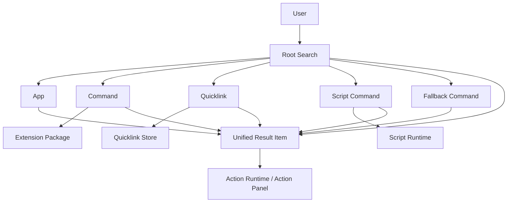
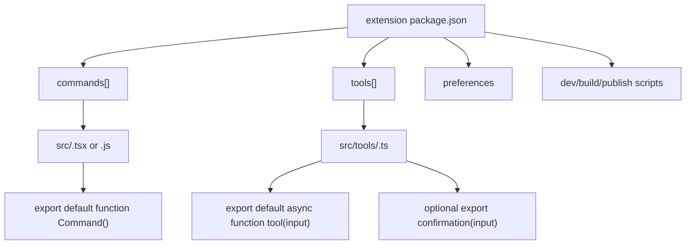
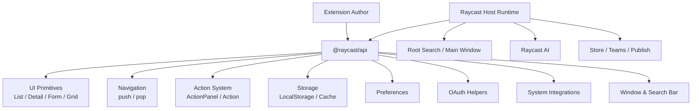
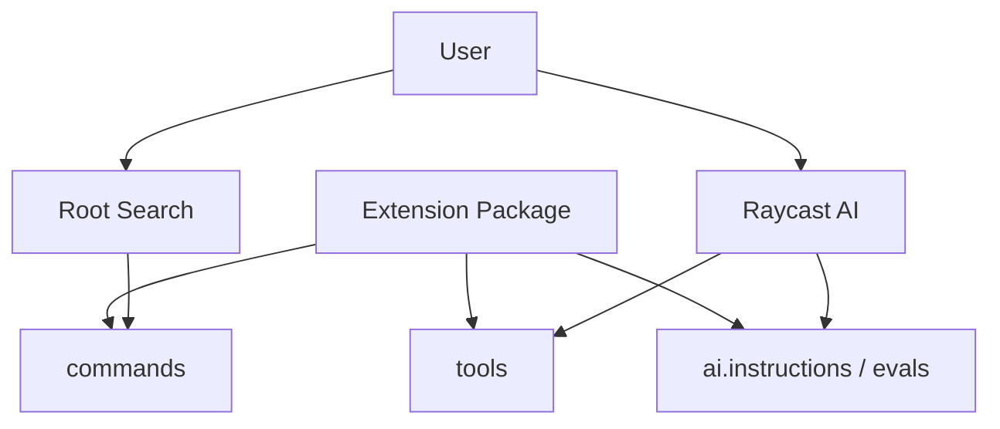
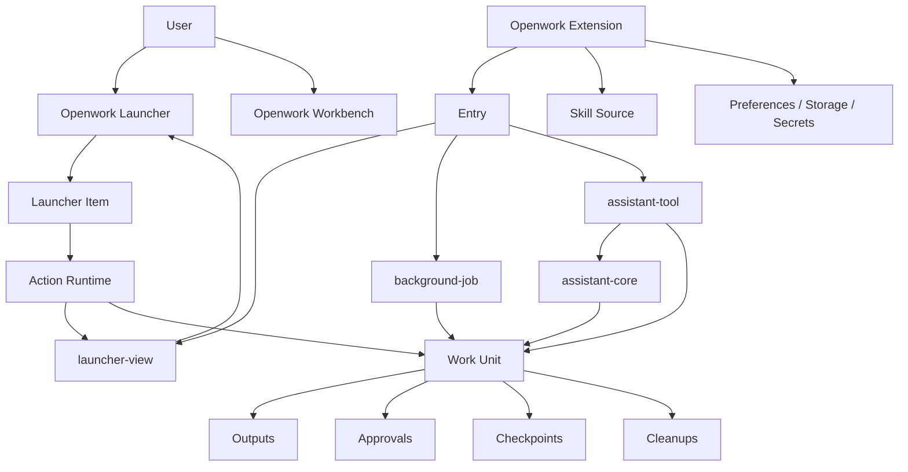

# Raycast Extension Repo Architecture Diagram

调研日期：2026-03-31

样本来源：

- 官方仓库：`raycast/extensions`
- 示例 extension：`examples/todo-list`
- API 示例：`examples/api-examples`

关联文档：

- `docs/raycast-platform-reference-notes.md`
- `docs/raycast-encapsulation-reference-notes.md`
- `docs/openwork-raycast-five-primitives.md`

## 先回答你的问题

是的，看一个真实 extension 仓库以后，很多事情会比只看文档清楚得多。

因为文档会告诉你：

- 有 `commands`
- 有 `tools`
- 有 `preferences`
- 有 `@raycast/api`

但仓库会直接暴露运行时真相：

- 这些东西都挂在同一个 `package.json`
- `command` 的实现就是一个默认导出的页面或脚本
- `tool` 的实现就是一个默认导出的异步函数
- `tool` 还可以额外导出 `confirmation`
- UI、导航、动作、存储、偏好读取都直接走 `@raycast/api`

这比抽象描述更接近平台本体。

## 从真实仓库里看到的 4 个关键信号

## 1. 一个 extension package 同时拥有 command 和 tool

`examples/todo-list/package.json` 已经很说明问题：

- `commands`
- `tools`
- `scripts`
- `dependencies`

都在一个 manifest 里。

这直接证明：

`Raycast 不是 command 系统和 AI tool 系统两套平行平台。它是一个 extension package，同时向人暴露 command，向 AI 暴露 tool。`

## 2. command 的导出形状非常薄

在 `examples/todo-list/src/index.tsx` 里，入口形状就是：

```ts
export default function Command() { ... }
```

在 `examples/api-examples/src/javascript.js` 里，`no-view` 甚至可以直接是脚本：

```js
showToast({ title: "Hello from JavaScript" })
```

这说明 Raycast 把命令入口封装到了非常薄的一层：

- manifest 负责声明 command
- 文件名和默认导出负责实现 command
- runtime 负责把它挂到 root search、窗口和动作系统里

## 3. tool 的导出形状也非常薄

`examples/todo-list/src/tools/*.ts` 很清楚地暴露了 tool contract：

```ts
export default async function tool(input) { ... }
```

对于破坏性操作，还能额外导出：

```ts
export async function confirmation(input) { ... }
```

这说明 Raycast 在 AI / tool 这条线上做的封装非常克制：

- 输入是 typed input
- 输出是普通返回值
- destructive tool 可选 confirmation
- 数据存储仍然走统一 substrate，例如 `LocalStorage`

也就是说它没有先发明一个巨大的 agent runtime。  
它只是让 extension package 可以额外长出 AI-callable entry。

## 4. `@raycast/api` 就是宿主封装面

从 `api-examples` 能很直观地看到，extension 作者主要消费的是一个宿主 API：

- `List`
- `Detail`
- `ActionPanel`
- `Action`
- `useNavigation`
- `LocalStorage`
- `getPreferenceValues`
- `showToast`
- OAuth helpers

这说明 Raycast 的真正平台边界不是 React 本身，而是：

`@raycast/api = host runtime contract`

## 架构图一：Raycast 的对象层

这张图对应你发的主窗口图。



这张图真正想表达的是：

- root search 吃的是很多异构对象
- 用户看到的却是统一结果项
- 最终所有对象又进入统一动作系统

## 架构图二：Raycast 的 extension package 结构

这张图对应官方示例仓库。



这张图解释了为什么说 Raycast 是 `extension-first`：

- `command` 不是独立包
- `tool` 也不是独立包
- 它们都从属于同一个 extension package

## 架构图三：Raycast 的 runtime / host 封装



这张图的重点是：

- 开发者不是直接操作系统级能力
- 开发者主要面对的是 `@raycast/api`
- 真正复杂的东西都被 host runtime 吃掉了

## 架构图四：Raycast AI 是怎么挂上去的



这张图很重要，因为它把平台立场画清楚了：

- 人通过 `command` 消费 extension
- AI 通过 `tool` 消费 extension
- AI 额外读取 `ai.instructions`
- 但 extension package 仍然是一等对象

所以：

`Raycast 是 extension-first，不是 AI-first。`

## 从仓库倒推它到底封装了什么

基于上面的样本，可以把 Raycast 的封装面更具体地说成 6 层。

## 1. 封装了入口注册

extension 作者不用自己接 root search。  
只要在 `package.json` 声明：

- command
- tool

平台自己负责注册、暴露和调起。

## 2. 封装了页面壳和导航

extension 作者不用自己做窗口系统。  
只写：

- `List`
- `Detail`
- `ActionPanel`
- `useNavigation`

平台负责：

- main window
- push / pop
- action 入口
- 搜索框联动

## 3. 封装了动作系统

`ActionPanel` 和 `Action.*` 说明 Raycast 已经把：

- primary action
- secondary action
- destructive action
- navigation action

都做成统一 runtime。

## 4. 封装了状态与配置底座

从示例仓库能直接看出：

- `LocalStorage`
- `getPreferenceValues`
- manifest-defined preferences

这是很强的一层。  
作者不需要每个 extension 重新做一套配置和持久化。

## 5. 封装了 AI tool 接口

tool 的 contract 非常薄：

- 一个默认异步函数
- 可选 confirmation

这说明它把 AI 接入做成了 extension package 的一个标准出口，而不是一个单独平台。

## 6. 封装了开发与分发流程

示例 `package.json` 里直接有：

- `ray develop`
- `ray build`
- `publish`

这说明 Raycast 把：

- create
- develop
- build
- publish

也视为平台的一部分，不只是附带工具。

## 对 Openwork 最有价值的架构图

如果把上面几张图收成一张更适合你们的图，我会画成这样：



这张图的意思是：

- 你们应该学 Raycast 的 `extension -> entry -> host runtime` 这半边
- 但最终要把它接到 `work unit` 上
- 这样才不会退化成一个只是更 AI 化的 launcher

## 用仓库样本得出的明确结论

看完真实 repo 以后，有几件事可以非常确定：

## 1. Raycast 的最小平台单元就是 extension package

不是 command。  
也不是 AI tool。

## 2. `@raycast/api` 才是核心封装面

不是 React 本身。  
React 只是写法，`@raycast/api` 才是平台。

## 3. command 和 tool 只是两种 entry projection

人类入口用 command。  
AI 入口用 tool。

## 4. confirmation 是很关键的控制点

这对 `openwork` 特别重要。  
因为你们完全可以把这层继续做大，扩成：

- file overwrite approval
- publish approval
- cleanup approval
- output adoption approval

## 5. 你们最不该抄错的是最高对象

Raycast 把一切收口到 `command` 世界，是因为它是 launcher 产品。  
Openwork 不能这样收。

Openwork 更应该是：

- extension package
- entry projection
- assistant orchestration
- work unit ledger

## Next Move

如果按这个新认识继续推进，最合理的下一步不是继续分析 Raycast。

而是把你们自己的 extension v1 直接收成：

```ts
interface OpenworkExtensionManifest {
  id: string
  role: "assistant-core" | "feature" | "tool"
  entries: OpenworkExtensionEntryManifest[]
  skills?: OpenworkSkillSource[]
  preferences?: OpenworkPreferenceDefinition[]
}
```

然后让 entry 明确分成：

- `launcher-view`
- `background-job`
- `assistant-tool`

最后把 `assistant-tool` 的执行结果默认接到：

- outputs
- approvals
- checkpoints
- cleanups

这才是你们真正能同时“靠近 Raycast 基建”又“超过 Raycast agent 能力”的路线。

## 官方与样本资料

- https://github.com/raycast/extensions
- https://raw.githubusercontent.com/raycast/extensions/main/examples/todo-list/package.json
- https://raw.githubusercontent.com/raycast/extensions/main/examples/todo-list/src/index.tsx
- https://raw.githubusercontent.com/raycast/extensions/main/examples/todo-list/src/tools/get-todos.ts
- https://raw.githubusercontent.com/raycast/extensions/main/examples/todo-list/src/tools/create-todo.ts
- https://raw.githubusercontent.com/raycast/extensions/main/examples/todo-list/src/tools/edit-todo.ts
- https://raw.githubusercontent.com/raycast/extensions/main/examples/todo-list/src/tools/delete-todo.ts
- https://raw.githubusercontent.com/raycast/extensions/main/examples/api-examples/package.json
- https://raw.githubusercontent.com/raycast/extensions/main/examples/api-examples/src/actions.tsx
- https://raw.githubusercontent.com/raycast/extensions/main/examples/api-examples/src/navigation.tsx
- https://raw.githubusercontent.com/raycast/extensions/main/examples/api-examples/src/preferences.tsx
- https://raw.githubusercontent.com/raycast/extensions/main/examples/api-examples/src/javascript.js
- https://raw.githubusercontent.com/raycast/extensions/main/examples/api-examples/src/oauth.tsx
- https://developers.raycast.com/
- https://developers.raycast.com/information/manifest
- https://developers.raycast.com/api-reference/tool
- https://developers.raycast.com/api-reference/ai
