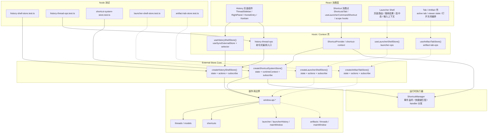
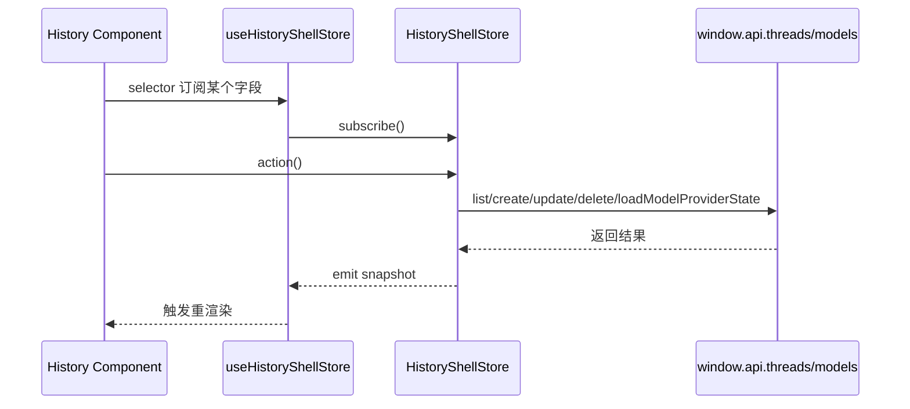
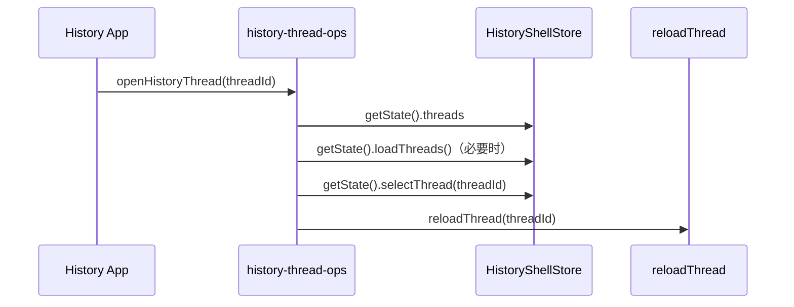
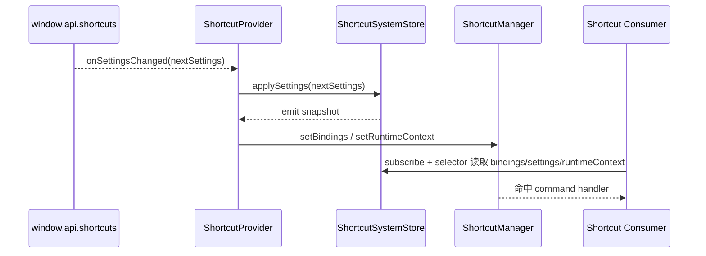

# Renderer External Store 基础能力架构图

这份文档描述当前仓库里已经落地的 renderer 侧基础能力。

目标不是再造一个通用状态框架，而是把这类“多组件共享、生命周期较长、需要少量命令式编排”的状态，收口成仓库内可测试的 external store。

## 总览

图例：

- 实线：已经接入的基础能力
- 虚线：下一批适合接入的候选域

## 分层说明

### 1. React 消费层

职责：

- 只订阅自己需要的 slice
- 触发 action 或命令式编排入口
- 不自己保存跨组件共享状态副本

当前落点：

- `src/renderer/src/ai-core/history.tsx`
- `src/renderer/src/components/sidebar/ThreadSidebar.tsx`
- `src/renderer/src/settings/ShortcutsTab.tsx`

### 2. Hook / Context 壳

职责：

- 把 React 和 external store 接起来
- 提供 `useSyncExternalStore` 订阅能力
- 保持现有消费 API 尽量稳定
- 放少量明确的命令式编排入口

当前落点：

- `src/renderer/src/lib/history-shell-store.ts`
- `src/renderer/src/lib/history-thread-ops.ts`
- `src/renderer/src/shortcuts/shortcut-context.ts`
- `src/renderer/src/shortcuts/shortcut-provider.tsx`

### 3. Store Core

职责：

- 真正拥有共享状态
- 真正拥有状态写入逻辑
- 只暴露 `getState` / `subscribe` / actions
- 不依赖 React
- 不直接读取 `window`

当前落点：

- `src/renderer/src/lib/history-shell-store-core.ts`
- `src/renderer/src/lib/history-thread-ops-core.ts`
- `src/renderer/src/shortcuts/shortcut-system-store.ts`

### 4. 副作用边界

职责：

- 作为 store 唯一外部依赖
- 统一承接 IPC 和 Electron 能力

当前落点：

- `window.api.threads.*`
- `window.api.models.*`
- `window.api.shortcuts.*`

## History 这条线怎么流动

命令式场景单独走：

这里的关键点是：

- 订阅留在 hook 壳
- 编排留在 ops
- 共享状态留在 core

## Shortcut 这条线怎么流动

这里的关键点是：

- Store 负责“状态真相”
- Manager 负责“事件执行”
- Provider 只是两者之间的装配壳

## 当前这套基础能力解决了什么

- 删除了 renderer 对 `zustand` 的运行时依赖
- 让共享状态逻辑可以直接做 node 单测
- 让 React 消费点能逐步切成 selector 订阅
- 让命令式编排不再和订阅逻辑混在一起
- 保留 `window.api.*` 作为唯一副作用边界

## 这套能力下一步最适合落在哪些地方

优先级最高：

- `launcher-shell` 页面路由、搜索结果、选中态、输入上下文
- tab / artifact 壳状态
- 其他已经出现“多组件共享 + 少量命令式编排 + 需要 node 单测”的 renderer 状态

如果映射到上面的虚线图：

- `LauncherUI -> LauncherShell -> LauncherStore` 代表 launcher 页面壳状态最适合直接复用这一套
- `ArtifactUI -> ArtifactShell -> ArtifactStore` 代表 tab / artifact 生命周期与 viewer 壳状态也适合按同样结构收口
- 这两条线都继续复用同一个副作用边界 `window.api.*`，不引入新的 renderer 状态框架

不建议强行套用：

- 单组件局部状态
- 表单输入态
- 很短生命周期的 UI 开关
- 没有跨组件共享需求的临时值
