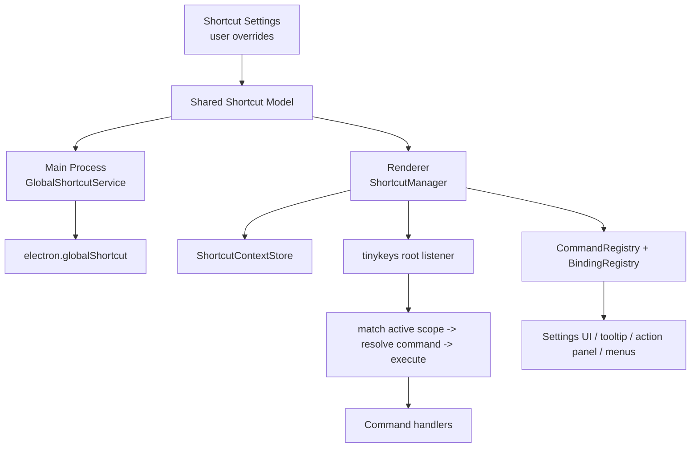

# Shortcut System Architecture

这份文档定义 Openwork 后续快捷键系统的重构方向。

目标方案是：

- `Electron globalShortcut` 负责系统级全局热键
- 自研 `command + registry + settings` 负责系统内统一管理
- `tinykeys` 负责 renderer 内的按键匹配与分发

这不是为了“找一个更强的 hotkey 库”。
真正要解决的是：

1. 快捷键定义分散
2. 输入框与页面级快捷键冲突
3. 无法做统一展示、冲突检测和用户自定义
4. extension / launcher / app 各层没有统一命令模型

它和 [launcher-extension-phase-checkpoints.md](/Users/junjieding/dingjunjie_dev/2026_03/openwork/docs/launcher-extension-phase-checkpoints.md) 是同一条主线的两份文档：

- `launcher-extension-phase-checkpoints.md` 负责 launcher / extension 主体架构
- 这份文档负责 command / binding / scope / context 这条输入系统基础设施

两者必须一起收口，不能把快捷键留成“以后补的细节”。

## 一句话结论

后续快捷键系统只围绕 5 个核心名词设计：

1. `Command`
2. `Binding`
3. `Scope`
4. `Context`
5. `Override`

如果一个快捷键需求不能清晰落到这 5 个名词上，说明设计边界还没收干净。

## 当前现状判断

这份文档最初写下时，仓库里的快捷键系统本质上只做了一半。
现在这个判断已经不准确了。

更准确地说：

- `静态描述层` 已经定稳
- `统一运行时层` 已经落地主体
- `settings / conflict` 还没有完全收尾

也就是说，我们已经开始有：

- 稳定的 `commandId`
- 默认 `binding` 数据结构
- shortcut 展示格式化
- shortcut 元数据注册
- main global shortcut + menu accelerator 共用 resolved binding
- renderer 单入口 `shortcut-manager`
- 显式 scope/context 投影
- launcher home / AI / native action panel / native list 的统一 dispatch
- preload 注入初始 resolved bindings，避免首帧空窗
- shortcut settings 持久化、IPC、availability 查询
- `ShortcutsTab`
- configurable command 白名单

但还没有真正做到：

- 完整 conflict / shadowing UI
- 大于 `launcher.toggle` 的 configurable command 集合
- settings 编辑流的完整行为覆盖

这也不是“系统已经收尾”。
现在的状态更像：

- 主体架构已经立住
- 用户可配置能力刚刚起了第一条闭环
- 剩下的是把配置范围、冲突反馈和设置体验继续收干净

### 已完成的主体

1. `Command identity`
   `src/shared/shortcuts/ids.ts` 已经建立了稳定命令标识。

2. `Binding model`
   `src/shared/shortcuts/model.ts`、`src/shared/shortcuts/defaults.ts`、`src/shared/shortcuts/settings.ts` 已经有 chord、scope、platform、`allowInTextInput`、`preventDefault`、override、availability、resolved binding 这些基础结构。

3. `Display formatting`
   `src/renderer/src/shortcuts/format-shortcut.ts` 和 `src/renderer/src/shortcuts/command-registry.ts` 已经能把 command 绑定格式化并展示到 UI；当前 launcher / AI / native footer 的运行时提示已经读 resolved binding，settings 页同时展示 current binding 和 default binding。

4. `Main runtime`
   launcher 全局唤起热键和 menu accelerator 已经走 shared/default + overrides 解析链，不再依赖旧硬编码常量。

5. `Renderer runtime`
   `shortcut-manager`、`shortcut-provider`、`shortcut-context` 已经建立，renderer 已经存在单入口匹配和分发。

6. `消费侧迁移`
   launcher home、AI、native action panel、native list 的主要快捷键已经迁到统一 runtime，不再是“每页各自私挂一套键盘监听”。

7. `Settings 起步`
   shortcuts 设置页已经存在，但当前只开放 `launcher.toggle`，这是刻意的产品边界，不是漏做。

### 剩余未收尾项

1. `Configurable scope` 还是极小白名单
   当前只有 `launcher.toggle` 进入 configurable command 集合。这是对的，但也意味着 settings 还只是 MVP。

2. `Conflict / shadowing` 还没落到 UI
   availability 已经有了，conflict / shadowing 还没有成为用户可见反馈。

3. `Settings 行为验证` 还不完整
   当前有 shortcuts tab 的存在性和白名单边界验证，但还没有覆盖“修改 `launcher.toggle` 后 UI 展示和实际执行同时变化”的完整行为场景。

### 为什么现在不该再叫“只做了一半”

因为最难、也最决定系统成不成立的那条运行时闭环，主体已经建立了：

`commandId -> binding -> active scope/context -> match -> execute`

现在真正剩下的，是：

`settings override completeness -> conflict/status UI -> configurable scope growth`

## 第三方库能帮什么，不能帮什么

可以依赖第三方库，但第三方库只能补“输入匹配层”，补不了这套系统最核心的架构缺口。

第三方库适合承担：

- renderer 内键盘事件匹配
- chord 解析
- Electron 全局热键注册的底层适配
- shortcut recorder 的输入捕获

第三方库不应该承担：

- Openwork 的 `commandId` 体系
- launcher / AI / extension 的 scope 边界
- 用户 override 模型
- 冲突检测和 shadowing 规则
- extension command 如何接入宿主

所以结论不是“找个 hotkey 库就补完了另一半”。
更准确的结论是：

- 可以用第三方库做 matcher / adapter
- 但 `command + binding + scope + context + override` 这层仍必须自研

如果这个边界不先立住，换任何库，最后都会重新退化成页面里 scattered `keydown`。

## 模块边界与当前落点

这里不是“把所有搜到 `keydown` 的文件都改一遍”。
正确做法一直是先按职责分层，把必须改的模块和暂时不要混进去的模块分开。

下面这组边界仍然有效，只是其中大部分现在已经有了明确代码落点。

### A. Shared 真相层

这些模块是整个 shortcut system 的稳定边界，必须先收口：

- `src/shared/shortcuts/ids.ts`
  - 保留稳定 `commandId`
  - 后续新增 command 时继续从这里长，不允许页面私造字符串 id

- `src/shared/shortcuts/model.ts`
  - 需要补充 override、conflict、availability 这类 shared 类型
  - 仍然只放可序列化模型，不放 renderer 闭包

- `src/shared/shortcuts/defaults.ts`
  - 继续只放默认 bindings
  - 不要把运行时代码塞进来

- `src/shared/settings-window.ts`
  - 需要扩展 settings tab 模型
  - 如果后续加 shortcuts 设置页，这里要新增 `shortcuts` tab

更正确的做法是新增独立 shortcut settings 模型，例如：

- `src/shared/shortcuts/settings.ts`
  - `ShortcutOverride`
  - `ShortcutConflictState`
  - `ResolvedShortcutBinding`
  - `GlobalShortcutAvailability`

不要把这些结构直接塞进 `src/shared/launcher-settings.ts`。
`launcherSettings` 现在是 launcher 外观设置，shortcut overrides 属于另一条系统边界。

### B. Main 持久化与 IPC

这些模块决定 shortcut settings 如何跨进程流动：

- `src/main/preferences.ts`
  - 需要新增独立 `shortcutSettings` 存储切片
  - 不应把 shortcut overrides 塞进 `launcherSettings`

- `src/main/ipc/models.ts`
  - 当前 settings handler 都挂在这里
  - 实现时最好把 shortcut 相关 handler 拆到独立 `src/main/ipc/shortcuts.ts`
  - 至少要避免继续把 shortcut runtime 逻辑混进 models IPC

- `src/preload/index.ts`
- `src/preload/index.d.ts`
  - 需要为 shortcut settings、resolved bindings、global availability 暴露明确 API

### C. Main 全局热键运行时

这些模块必须从“硬编码常量”迁到“shared binding -> resolved global shortcut”：

- `src/main/windows/launcher-window.ts`
  - 当前 `DEFAULT_LAUNCHER_SHORTCUT` 是硬编码真相源
  - 需要改成消费 resolved global binding

- `src/main/app-menu.ts`
  - 当前 menu accelerator 复制使用 `DEFAULT_LAUNCHER_SHORTCUT`
  - 应与 global shortcut 共用同一份 resolved binding

- `src/main/index.ts`
  - 需要负责 shortcut service 的生命周期装配

更正确的落点是新增：

- `src/main/services/shortcuts/global-shortcut-service.ts`
- `src/main/services/shortcuts/global-shortcut-adapter.ts`

这里的职责只应是：

- 读取 resolved global bindings
- 注册 / 注销 Electron `globalShortcut`
- 报告注册状态

不要把 renderer scope、route、输入框冲突判断拉进 main。

### D. Renderer Shortcut Core

这部分是当前最缺的半套，也是本次重构的核心：

- `src/renderer/src/shortcuts/command-registry.ts`
  - 继续负责 command 元数据目录
  - 需要避免演变成“吞下所有页面闭包”的上帝文件

- `src/renderer/src/shortcuts/format-shortcut.ts`
  - 继续只做展示格式化
  - 后续应从 resolved binding 读，不从零散调用方推断

更正确的做法是新增：

- `src/renderer/src/shortcuts/binding-registry.ts`
  - 合并 defaults + platform + user overrides

- `src/renderer/src/shortcuts/shortcut-context.ts`
  - 维护当前窗口的 active scope / modal / text input / IME 状态投影

- `src/renderer/src/shortcuts/shortcut-manager.ts`
  - 统一键盘监听、匹配、分发、`preventDefault`

- `src/renderer/src/shortcuts/shortcut-provider.tsx`
  - 在 renderer 根部装配 manager 和 context

如果需要局部注册执行 handler，更正确的方式是让 active scope host 注册 `commandId -> execute`，而不是把所有页面状态闭包硬塞进 `command-registry.ts`。

### E. Launcher Shell 消费侧

这些模块需要从“自己监听按键”改成“声明 scope + 注册 handler”：

- `src/renderer/src/launcher-shell/LauncherApp.tsx`
  - 需要挂 shortcut provider
  - 需要声明 launcher window 当前 active scopes

- `src/renderer/src/launcher-shell/hooks/useLauncherShellEffects.ts`
  - 当前持有 `Escape` 的窗口级监听
  - 后续应迁移为 launcher scope handler，而不是自己监听 DOM

- `src/renderer/src/launcher-shell/hooks/useLauncherSearchPage.ts`
  - 当前把 `Tab / ArrowDown / ArrowUp / Enter` 硬编码映射到 command
  - 迁移后应只保留这些 command 的本地执行语义，不再自己做按键匹配

- `src/renderer/src/launcher-shell/LauncherCommandSurface.tsx`
  - 是 built-in / extension surface 的宿主边界
  - 后续应在这里装配 route-specific scope host，而不是让子页面各自私挂监听

需要特别注意：

- `src/renderer/src/launcher-shell/pages/index.ts` 里的 `resolveLauncherCommand`
  这是 typed alias / query intent 解析，不是物理快捷键 runtime。
  不要把 alias 系统和 shortcut dispatch 混成一套。

### F. AI / Native Extension Surface 消费侧

这些模块是 renderer 内第二批必须迁移的运行时入口：

- `src/renderer/src/ai-core/useAiThread.ts`
  - 当前直接处理 `Enter` 和 `Backspace`
  - 后续应只暴露本地 command handler

- `src/renderer/src/extension-host/surface-actions.tsx`
  - 当前既有 overlay 监听，也有 surface 级监听
  - 后续应迁到 `launcher.action-panel` / surface scope 的统一 dispatch

- `src/renderer/src/extension-host/ui.tsx`
  - native list input 里还有 `ArrowUp / ArrowDown` 的本地键盘处理
  - 需要纳入统一 scope host，而不是继续单点写 `onKeyDown`

- `src/renderer/src/extension-host/actions.ts`
  - 旧 `shortcut?: string` 展示协议已经清掉
  - 后续继续保持 command-first，不再回引只展示不执行的 shortcut 字段

### G. Settings UI

这些模块决定 shortcut settings 是否真能落地，而不是只停在架构口号：

- `src/renderer/src/settings/SettingsApp.tsx`
  - `shortcuts` tab 已经接上
  - 当前只开放 `launcher.toggle`

- `src/renderer/src/settings/copy.ts`
  - shortcut settings 文案已经补齐

- `src/renderer/src/settings/GeneralTab.tsx`
  - 目前只管通用设置
  - shortcut 设置不应继续塞进 general tab

- `src/renderer/src/settings/ShortcutsTab.tsx`
  - 已经存在
  - 当前是最小 MVP，不是完整 Raycast 式快捷键设置页

这个 tab 至少应承载：

- command 列表
- 当前 binding 展示
- override 编辑
- 冲突 / shadowing / unavailable 状态

### H. 测试边界

这次如果按正确方式做，不能只靠 typecheck。
至少要补两层验证：

- 单元 / 类型层
  - binding normalize
  - scope precedence
  - override merge
  - conflict detection

- BDD / 行为层
  - launcher home: `Tab / Arrow / Enter / Escape`
  - AI surface: `Enter`
  - action panel: `Cmd/Ctrl+K`、`Enter`、`Escape`
  - settings 修改 binding 后，展示和执行同时变化

当前可复用的入口是：

- `tests/bdd/features/app-launch.feature`
- `tests/bdd/steps/app-launch.steps.ts`

正确方向是补稳定行为场景，而不是只给纯函数堆测试。

## 这次不要这样改

下面这些做法看起来省事，但方向是错的：

1. 不要把 shortcut overrides 塞进 `launcherSettings`
2. 不要把 typed alias / `resolveLauncherCommand` 和物理快捷键 runtime 合并
3. 不要把所有页面执行闭包硬塞进 `command-registry.ts`
4. 不要继续新增页面级 `window.addEventListener("keydown")`
5. 不要让 `shortcut?: string` 继续作为长期展示协议
6. 不要先做 settings UI，再回头补 runtime 真相源

更正确的顺序应该是：

1. shared model + main persistence + renderer runtime
2. home / AI / action panel 三条消费链迁移
3. settings overrides / conflict UI
4. extension command shortcut 接入

## 和 launcher extension 架构的关系

快捷键系统不是一个独立 feature，它挂在当前目标架构里：

1. `shared`
2. `launcher-shell`
3. `extension-host`
4. `extension-sdk`
5. `extensions/*`
6. `ai-core`

职责分工必须这样：

- `shared`
  - 放 shortcut model、binding model、scope model、序列化结构
- `launcher-shell`
  - 只声明 launcher 自己有哪些 command、哪些 scope 处于激活状态
  - 不自己发明第二套键盘监听
- `extension-host`
  - 管 native extension command 对应的 handler、scope 激活和 action panel 快捷键
  - 不让 extension 自己私挂全局监听
- `extension-sdk`
  - 给 extension 作者暴露稳定能力，例如声明 command shortcut、读取 binding 展示文本
  - 不暴露 `window.addEventListener("keydown")` 这类低层入口作为默认方案
- `extensions/*`
  - 只声明命令和命令元信息
  - 不自己实现 shortcut runtime
- `ai-core`
  - 只注册 AI 自己的命令和 handler
  - 不成为 extension shortcut 的宿主

一句话收口：

`shortcut system 是 command-first 基础设施，不是页面里随手写的 keydown 逻辑。`

## 当前问题

当前仓库里，快捷键处理主要是以下几种形态：

- `main` 进程直接注册全局热键
- `renderer` 页面里直接写 `onKeyDown`
- 组件挂自己的 `window.addEventListener("keydown")`
- UI 上显示 shortcut 文案，但不对应真实绑定
- 少数页面用 capture-phase 拦截整窗按键

典型例子：

- launcher 全局唤起硬编码在 `src/main/windows/launcher-window.ts`
- app 菜单 accelerator 再复制一份到 `src/main/app-menu.ts`
- launcher 根壳单独监听 `Escape`
- 首页、AI 页、native action overlay、translate 页面各自处理自己的键盘逻辑
- `NativeActionDescriptor.shortcut` 现在只是展示字符串，不是统一命令绑定

这套方式短期能跑，但一旦要支持：

- 大量快捷键
- 用户自定义
- 插件命令分发
- 冲突检测
- 与文本输入共存

它会迅速失控。

## 设计目标

这次重构的目标是：

- 所有快捷键都绑定到稳定的 `commandId`
- 快捷键定义、执行、显示、设置来自同一套注册表
- 全局热键与窗口内快捷键边界清晰
- 默认不干扰原生文本编辑行为
- 用户可以像 Raycast 一样按 command 配热键
- 扩展可以贡献 command，但不能随意绕过系统直接挂监听器

非目标：

- 暂不做 VS Code 那种完整 `when` DSL
- 暂不做低层 native keyboard hook
- 暂不支持复杂多段 chord / sequence 作为主能力
- 暂不引入一个“大而全”的第三方快捷键框架主导整个系统

## 设计原则

### 1. Command First

快捷键不是直接绑定 UI 代码，而是绑定命令。

例如：

- `launcher.toggle`
- `launcher.search.moveSelectionDown`
- `launcher.search.executeSelection`
- `launcher.ai.submit`
- `app.openSettings`

这样做的好处是：

- UI 展示可以直接读 command 元数据
- 用户设置针对 command 生效
- 菜单、按钮、快捷键、命令面板都能复用同一个 action

### 2. Binding Is Separate From Command

命令定义和按键绑定必须拆开。

一个 command 可以有：

- 默认绑定
- 平台差异绑定
- 用户覆盖绑定
- 无绑定但仍可被按钮或菜单执行

### 3. Scope Must Be Explicit

快捷键一定要声明作用域，不能靠“碰巧当前页面这么写”。

至少要区分：

- `global`
- `window`
- `launcher`
- `route`
- `modal`

### 4. Input Safety By Default

默认情况下，处于文本输入上下文时，快捷键不应抢占原生编辑语义。

必须明确声明哪些命令允许在输入框中触发。

### 5. User Settings Override Bindings, Not Behavior

用户可以改 command 的按键，不应该改 command 的生效逻辑。

也就是说：

- 用户可以把 `launcher.toggle` 从 `Cmd+Shift+Space` 改成别的
- 但不能把一个只在 launcher 首页生效的命令改成“全 app 所有输入框都能触发”

行为边界仍然由系统定义。

## 核心分层



### 1. Shared Model

职责：

- 定义 command id、binding 数据结构、scope、override 模型
- 提供 main / renderer 都能消费的序列化结构

建议放在：

- `src/shared/shortcuts/model.ts`
- `src/shared/shortcuts/ids.ts`
- `src/shared/shortcuts/defaults.ts`

这里是唯一允许 main / renderer / settings / extension metadata 共用的 shortcut 结构定义区。

### 2. Main Process: GlobalShortcutService

职责：

- 注册 / 取消注册系统级全局热键
- 只处理 `scope === "global"` 的 binding
- 监听设置变化并重新注册
- 将 Electron 注册失败状态反馈给设置页

它不负责：

- route 级快捷键
- 页面内输入框冲突
- 组件级行为

建议放在：

- `src/main/services/shortcuts/global-shortcut-service.ts`

### 3. Renderer: ShortcutManager

职责：

- 统一安装一个窗口级键盘监听
- 根据当前活动 `scope stack` 做匹配
- 处理 `preventDefault`
- 分发到 command handler

它不负责：

- 存储用户设置
- 决定 command 的业务逻辑

建议放在：

- `src/renderer/src/shortcuts/shortcut-manager.ts`

它和 `launcher-shell` 的关系应该是：

- `launcher-shell` 只上报当前 route / modal / action panel / focus context
- `ShortcutManager` 负责统一匹配和分发
- `launcher-shell` 不再自己写第二套 `Escape / Arrow / Enter` 硬编码监听

### 4. ShortcutContextStore

职责：

- 表达当前 shortcut 系统需要知道的运行态上下文
- 例如 launcher 是否打开、当前 route、是否存在 modal、是否在文本输入中、action panel 是否展开

它是 shortcut 系统的“状态投影”，不是业务状态本体。

建议放在：

- `src/renderer/src/shortcuts/shortcut-context.ts`

### 5. CommandRegistry

职责：

- 定义系统支持的所有稳定 command 元数据
- 提供标题、描述、分类、默认显示名
- 作为 settings、tooltip、menu、action panel 的统一命令目录

建议放在：

- `src/renderer/src/shortcuts/command-registry.ts`

这里的 registry 只认 `commandId`，不认“某个页面上临时写的按钮回调”。
具体执行 handler 应由 active scope host 提供，`ShortcutManager` 负责把命中的 `commandId` 分发给当前 host。

### 6. BindingRegistry

职责：

- 定义默认快捷键
- 合并平台差异和用户 override
- 产出运行时可匹配的 binding 列表

建议放在：

- `src/renderer/src/shortcuts/binding-registry.ts`

如果未来 extension 允许声明默认快捷键，也应该在这里统一合并，而不是每个 extension 自己注册。

## Command 模型

推荐最小模型：

```ts
export interface ShortcutCommandDefinition {
  id: string
  title: string
  description?: string
  category: "global" | "launcher" | "app" | "extension"
}
```

关键点：

- `id` 是唯一稳定标识，用于设置、显示、冲突检测、埋点
- command 可以没有任何默认快捷键

如果某个命令的执行天然不依赖局部页面状态，可以提供静态 execute。
但这不应成为默认路径。

对 `launcher.home`、`launcher.ai`、`launcher.action-panel` 这类强依赖局部状态的命令，更正确的方式是：

- registry 负责定义 command 元数据
- active scope host 负责注册当前可执行 handler
- `ShortcutManager` 只做匹配与分发

## Binding 模型

V1 不要直接把设置存成 `"cmd+k"` 这种任意字符串。
应该先存一个规范化结构，再由 adapter 转成 Electron accelerator 或 tinykeys keybinding。

推荐最小模型：

```ts
export type ShortcutModifier = "meta" | "ctrl" | "alt" | "shift"

export interface ShortcutChord {
  modifiers: ShortcutModifier[]
  key: string
  code?: string
}

export interface ShortcutBindingDefinition {
  commandId: string
  scope: ShortcutScope
  chord: ShortcutChord
  allowInTextInput?: boolean
  preventDefault?: boolean
  platform?: "darwin" | "win32" | "linux"
}
```

说明：

- `key` 用于命名键，例如 `Enter`、`ArrowDown`、`Escape`
- `code` 用于布局无关的物理键，例如 `KeyK`、`Digit1`
- 对字母数字键，renderer 侧优先考虑 `code`
- 对全局热键，仍要转换成 Electron accelerator；V1 只支持能稳定映射的组合

## Scope 模型

V1 不做字符串 DSL，直接用显式 scope + 代码里的启用条件。

推荐：

```ts
export type ShortcutScope =
  | "global"
  | "window"
  | "launcher"
  | "launcher.home"
  | "launcher.ai"
  | "launcher.action-panel"
  | "settings"
  | "chat"
```

运行时按照“最具体 scope 优先”的顺序匹配。

例如 launcher 内：

1. `launcher.action-panel`
2. `launcher.home`
3. `launcher`
4. `window`

这意味着：

- overlay 可以覆盖 page 级绑定
- page 级绑定可以覆盖 launcher 通用绑定
- 窗口通用绑定作为最后兜底

同一个 binding：

- 若 scope 完全相同，则视为冲突
- 若 scope 不同，则允许存在，但运行时按活动 scope 栈选择最具体命中项

## Context 模型

V1 不引入完整 `when` parser。
改用有限且显式的上下文字段。

推荐：

```ts
export interface ShortcutRuntimeContext {
  activeWindow: "main" | "launcher" | "settings"
  activeRoute:
    | "launcher.home"
    | "launcher.ai"
    | "settings.general"
    | "settings.extensions"
    | "app.chat"
  activeModal: "none" | "launcher.action-panel" | "native-dialog"
  textInputFocus: boolean
  composing: boolean
}
```

如果后续出现更多条件，再给 binding 增加一个代码级 predicate：

```ts
isEnabled?: (context: ShortcutRuntimeContext) => boolean
```

不要一开始就上 VS Code 风格表达式语言。
当前产品阶段没必要为未来不确定复杂度提前付 parser 和调试成本。

## 文本输入语义

这是这次重构必须优先守住的边界。

默认规则：

- 当焦点在 `input / textarea / contenteditable` 中时，快捷键默认不触发
- 只有显式标记 `allowInTextInput: true` 的 binding 才能在输入中生效
- IME composing 期间不触发快捷键

必须默认保留给原生文本编辑的按键：

- 裸 `ArrowLeft`
- 裸 `ArrowRight`
- 裸 `Home`
- 裸 `End`
- 裸 `Backspace`
- 裸 `Delete`
- `Cmd/Ctrl + A`
- `Cmd/Ctrl + C`
- `Cmd/Ctrl + V`
- `Cmd/Ctrl + X`
- `Cmd/Ctrl + Z`
- 文本导航组合，例如 `Option + Arrow`、`Cmd + Arrow`

这条规则的目的不是“防御性编程”，而是明确系统边界：

- 文本编辑语义归输入组件
- 页面导航语义归 shortcut system

只有非常明确的交互才允许在输入框内抢键，比如：

- launcher 首页 `ArrowUp / ArrowDown`
- 输入框中的 `Enter` 执行主动作
- `Cmd/Ctrl + K` 打开 action panel

## 全局热键策略

全局热键只走 `main` 进程。

V1 规则：

- 只有 `scope === "global"` 的命令允许注册到 `Electron globalShortcut`
- 全局热键必须是 modifier-heavy 组合
- 避免把单字母或高度依赖键盘布局的组合设计成默认全局热键
- 注册失败必须可见，而不是只在控制台打印日志

原因：

- `globalShortcut` 能力本来就是系统级，不应混入 route / component 语义
- Electron 官方文档明确提到全局快捷键可能因为被其他程序占用而注册失败
- 在 macOS 上，非 QWERTY 布局相关行为并不完全稳定

因此建议：

- launcher 主唤起热键保留为全局热键
- command 级“直达动作热键”谨慎开放
- 除非产品明确需要，否则不要一口气把大量 command 都做成全局热键

## Renderer 匹配策略

renderer 内只允许一个统一入口监听键盘事件。

建议实现方式：

1. 在窗口根部创建 `ShortcutManager`
2. 用 `tinykeys` 创建统一 handler
3. 根据活动 scope 栈和 `allowInTextInput` 过滤候选 binding
4. 命中第一条可执行 binding 后执行 command
5. 需要时 `preventDefault`

不要再让页面和组件各自去 `window.addEventListener("keydown")`。

如果某个临时界面确实需要局部快捷键：

- 通过 registry 注册一组带 scope 的 binding
- 在 mount/unmount 时向 manager 激活 / 释放 scope

而不是私自挂新的全局监听。

## 用户设置模型

用户自定义的对象应该是“对默认绑定的 override”，不是整个系统完整定义。

推荐最小模型：

```ts
export interface ShortcutOverride {
  commandId: string
  chord?: ShortcutChord
  disabled?: boolean
  platform?: "darwin" | "win32" | "linux"
}
```

说明：

- `commandId` 指向稳定命令
- `chord` 存用户自定义绑定
- `disabled` 表示禁用默认绑定
- 行为边界仍由 command 和 scope 决定，不由用户设置决定

建议持久化在统一 settings store 中，并带 schema version。

不是所有快捷键都应该进入这个设置模型。

- `展示` 和 `可配置` 是两条独立策略
- 一个 shortcut 被展示在 UI 上，不代表用户就应该能修改它
- 只有被产品明确标记为“允许自定义”的 command，才进入 override 白名单

当前已展示的这批快捷键，先视为固定产品语义，不进入用户设置：

- `launcher.toggle`
- `launcher.search.open-ai`
- `launcher.search.execute-selection`
- `launcher.ai.submit`
- `launcher.actions.open`
- `launcher.actions.execute-primary`

也就是说，当前阶段不需要为了“向后兼容未来可能的设置页”，把所有已展示 shortcut 都并入 override 体系。
后续如果真的要开放设置，应按 command 白名单逐个放开，而不是默认全开放。

## 冲突检测规则

冲突检测必须发生在“保存设置”和“注册运行时绑定”两个时刻。

V1 推荐规则：

1. 同一 scope 内，相同 chord 只能绑定一个 command
2. 不同 scope 允许同 chord 共存
3. 更具体 scope 覆盖更宽 scope，不算冲突，但要在设置页提示 shadowing
4. 全局热键若 Electron 注册失败，显示为 `unavailable`
5. 平台保留快捷键若明显高风险，设置页直接警告

建议区分三类状态：

- `ok`
- `shadowed`
- `conflict`
- `unavailable`

其中：

- `shadowed` 可以保存
- `conflict` 不可保存
- `unavailable` 只针对 global shortcut，取决于系统注册结果

## UI 展示原则

快捷键展示不能再靠手写字符串。

所有以下场景都应来自统一 registry：

- 设置页 shortcut 列表
- action panel 右侧 shortcut label
- tooltip / menu item accelerator
- command palette 说明

这意味着现有类似 `shortcut?: string` 的展示字段，后续应逐步迁移为：

- `commandId`
- 或 `bindingRef`

展示层只负责把 binding 格式化成平台文案，例如：

- macOS: `⌘K`
- Windows: `Ctrl+K`

但“展示来自统一 binding”不等于“所有展示项都支持用户修改”。

- 固定产品语义的 shortcut 可以继续展示
- 只有进入 configurable 白名单的 command，才需要接 settings override
- 不要把“显示给用户看”和“允许用户改”绑定成同一个默认规则

## Alias 与 Hotkey 的边界

后续系统要明确区分：

- `Alias`: 用户输入 query 时的命令别名
- `Hotkey`: 键盘事件直接触发命令

二者都可以指向同一个 `commandId`，但它们不是同一件事。

## 文件放置规则

后续实现时，文件落点按下面这张表走。

### shared

`src/shared/shortcuts/model.ts`

- shortcut 核心类型
- `ShortcutCommandDefinition`
- `ShortcutBindingDefinition`
- `ShortcutOverride`

`src/shared/shortcuts/defaults.ts`

- 默认 bindings
- 平台差异默认值

`src/shared/shortcuts/ids.ts`

- 稳定 command id 常量

### main

`src/main/services/shortcuts/global-shortcut-service.ts`

- 只处理 `scope === "global"`
- 只和 Electron `globalShortcut` 打交道

`src/main/ipc/shortcuts.ts`

- main <-> renderer <-> settings 之间的快捷键设置桥

### renderer

`src/renderer/src/shortcuts/shortcut-manager.ts`

- 统一键盘监听入口
- 执行匹配、分发、`preventDefault`

`src/renderer/src/shortcuts/shortcut-context.ts`

- 当前窗口 shortcut 运行态
- route、modal、text input、IME composing 等投影

`src/renderer/src/shortcuts/command-registry.ts`

- renderer 可执行 command 的统一注册表

`src/renderer/src/shortcuts/binding-registry.ts`

- 默认 bindings + 用户 overrides 合并

`src/renderer/src/shortcuts/format.ts`

- `⌘K` / `Ctrl+K` 这类展示格式化

### launcher-shell

`src/renderer/src/launcher/**`

- 只声明 launcher 命令、scope 激活、UI 消费
- 不直接持有 shortcut runtime

例如：

- launcher root route 激活 `launcher.home`
- AI 页面激活 `launcher.ai`
- action panel 激活 `launcher.action-panel`

### extension-host / extension-sdk / extensions

`src/renderer/src/extension-host/**`

- 负责 extension command 在运行时向 shortcut system 暴露 action / scope

`src/extensions/api.ts`

- 给 extension 作者暴露声明式 shortcut 能力
- 例如 `Action` 的 shortcut label、command id 绑定

`src/extensions/<ext>/manifest.ts`

- 后续若 extension 支持声明默认快捷键，应在这里声明元信息
- 不允许直接写 `window.addEventListener("keydown")`

## 当前阶段的实现边界

这套系统不应该一次性大修完。当前阶段只做 launcher 主线需要的部分。

### 现在先做

- 建立统一 `commandId`
- 建立 shared shortcut model
- 收口 launcher 内部散落的 `keydown`
- 让 action panel / footer / settings 展示都来自统一 binding

### 现在不做

- 不做完整 `when` DSL
- 不做复杂 chord sequence
- 不做仓库外 extension shortcut 分发
- 不让 extension 直接拥有独立 shortcut runtime

## 阶段与暂停点

### Shortcut Phase 0

名称：
锁定词汇和边界

暂停点验收：

- 文档里明确 `Command / Binding / Scope / Context / Override`
- 文件落点清楚
- launcher extension phase 文档有引用

### Shortcut Phase 1

名称：
shared model + command registry

只做什么：

- `commandId`、binding、override 类型
- launcher 自己的 command registry

暂停点验收：

- 新增一个 launcher command 时，不再自己手写 shortcut 文案
- 展示和执行开始围绕同一 `commandId`

### Shortcut Phase 2

名称：
renderer shortcut manager 收口

只做什么：

- 窗口级统一监听
- launcher 首页 / AI / action panel scope 激活

暂停点验收：

- `launcher-shell` 里散落的 `window.addEventListener("keydown")` 明显减少
- `Escape / Arrow / Enter / Cmd+K` 走统一入口

### Shortcut Phase 3

名称：
settings / overrides / 冲突检测

只做什么：

- 用户 overrides
- 冲突与 shadowing 提示
- 全局快捷键注册状态回流到设置页

暂停点验收：

- settings 能看到稳定 command 列表
- 修改 binding 后，展示和执行同时变化

### Shortcut Phase 4

名称：
extension command 接入

只做什么：

- extension command 进入 command registry
- action panel / extension command 复用统一 shortcut display 和 dispatch

暂停点验收：

- extension 作者不需要自己实现键盘监听
- extension command 的 shortcut 展示和执行来自同一 registry

## 当前最重要的纪律

1. 不再新增页面级 `window.addEventListener("keydown")`
2. 不再新增只展示不执行的 `shortcut?: string`
3. 不再把快捷键直接绑到组件内部回调，必须先经过 `commandId`
4. 不让 extension 直接操作浏览器级键盘监听
5. global shortcut 只在 main 进程注册

这和 Raycast 的模型一致。

在 Openwork 里：

- `resolveLauncherPluginCommand` 更接近 alias / query command 体系
- shortcut system 是独立的一条执行链

不要把“输入框里的 typed alias”与“物理键盘快捷键”混成一套逻辑。

同一个 command 可以同时拥有：

- alias
- local shortcut
- global hotkey
- menu action

但这些都应指向同一个 `commandId`。

## Extension / Plugin 接入方式

后续插件不应直接挂键盘监听。

正确接入方式是：

1. 插件贡献 command definition
2. 插件可声明默认 binding
3. 插件 action panel 项引用 command id
4. shortcut manager 统一处理匹配和执行

这样 extension 才能自动获得：

- 设置页展示
- 冲突检测
- 用户自定义
- 跨入口一致行为

## 推荐目录结构

```text
src/
  shared/
    shortcuts/
      model.ts
      ids.ts
      defaults.ts
  main/
    services/
      shortcuts/
        global-shortcut-service.ts
        global-shortcut-adapter.ts
    ipc/
      shortcuts.ts
  renderer/src/
    shortcuts/
      command-registry.ts
      binding-registry.ts
      shortcut-manager.ts
      shortcut-context.ts
      shortcut-provider.tsx
      format-shortcut.ts
    settings/
      ShortcutsTab.tsx
```

## 实施顺序清单

下面这份清单按“先定真相源，再接运行时，再迁消费侧，最后收设置和清理”的顺序排。

原则：

1. 每一步都必须保持应用可运行
2. 每一步都必须有明确验收点
3. 如果某一步为了平滑迁移引入兼容桥接代码，必须同步登记到 [cleanups.md](/Users/junjieding/dingjunjie_dev/2026_03/openwork/docs/cleanups.md)

### Step 1: 锁定 Shared Shortcut Truth

状态：已完成

目标：

- 把 shortcut system 的 shared 真相源彻底定稳
- 明确 shortcut overrides 不属于 `launcherSettings`

改动模块：

- `src/shared/shortcuts/ids.ts`
- `src/shared/shortcuts/model.ts`
- `src/shared/shortcuts/defaults.ts`
- `src/shared/settings-window.ts`
- 新增 `src/shared/shortcuts/settings.ts`

本步只做：

- 补齐 `ShortcutOverride`、resolved binding、availability、conflict 相关 shared 类型
- 为后续 settings tab 预留 `shortcuts` 导航模型
- 保持默认 bindings 仍只在 shared 层定义

本步不做：

- 不接 renderer 监听
- 不接 main 全局热键
- 不改页面 `keydown`

验收点：

- shortcut 相关 shared 类型不再依赖 renderer 闭包
- shortcut override 数据结构有单独落点，不进入 `launcherSettings`
- 现有 shortcut 展示行为不变

### Step 2: 建立 Main Persistence 与 Shortcut IPC

状态：已完成

目标：

- 建立 shortcut settings 的独立持久化与跨进程读写链路

改动模块：

- `src/main/preferences.ts`
- `src/main/ipc/models.ts`
- 新增 `src/main/ipc/shortcuts.ts`
- `src/preload/index.ts`
- `src/preload/index.d.ts`

本步只做：

- 给 main 增加 `shortcutSettings` 切片
- 增加读写 shortcut overrides、读取 resolved bindings、读取 global availability 的 IPC
- preload 暴露稳定 shortcut API

本步不做：

- 不接 settings UI
- 不改 renderer runtime dispatch

验收点：

- renderer 可以通过 preload 读取 shortcut settings 和 resolved bindings
- settings store 中出现独立 shortcut 配置切片
- 现有 launcher / settings / extension 设置功能不回归

### Step 3: 接管 Main Global Shortcut 与 Menu Accelerator

状态：已完成

目标：

- 让 `launcher.toggle` 的全局热键和菜单 accelerator 共享同一份 resolved binding

改动模块：

- `src/main/windows/launcher-window.ts`
- `src/main/app-menu.ts`
- `src/main/index.ts`
- 新增 `src/main/services/shortcuts/global-shortcut-service.ts`
- 新增 `src/main/services/shortcuts/global-shortcut-adapter.ts`

本步只做：

- 移除 `DEFAULT_LAUNCHER_SHORTCUT` 作为运行时真相源
- main 从 shared/default + overrides 解析 global binding
- 统一驱动 Electron `globalShortcut` 和 menu accelerator

可能出现的兼容桥接：

- 暂时保留旧常量作为 fallback
- 暂时把 menu accelerator 兼容指向旧值

这些桥接若出现，必须记到 `docs/cleanups.md`。

验收点：

- `launcher.toggle` 的 global shortcut 和 menu accelerator 来自同一份 resolved binding
- 注册失败状态可被查询，不只打印控制台
- 旧常量不再是主真相源

### Step 4: 建立 Renderer Shortcut Core

状态：已完成

目标：

- 建立 renderer 统一 shortcut runtime，而不是继续散落页面监听

改动模块：

- `src/renderer/src/shortcuts/command-registry.ts`
- `src/renderer/src/shortcuts/format-shortcut.ts`
- 新增 `src/renderer/src/shortcuts/binding-registry.ts`
- 新增 `src/renderer/src/shortcuts/shortcut-context.ts`
- 新增 `src/renderer/src/shortcuts/shortcut-manager.ts`
- 新增 `src/renderer/src/shortcuts/shortcut-provider.tsx`
- `src/renderer/src/main.tsx`

本步只做：

- 统一 resolved bindings 的 renderer 合并逻辑
- 建立 active scope/context 投影
- 建立单入口键盘匹配与分发
- 保持 `command-registry` 仍是元数据目录，不吞页面状态闭包

本步不做：

- 不一次性迁完所有页面 handler
- 不做 settings 编辑 UI

验收点：

- renderer 存在唯一 shortcut manager 入口
- active scope/context 可以被注入和读取
- 现有 shortcut 展示继续可用

### Step 5: 迁移 Launcher Shell 基础命令链

状态：已完成

目标：

- 先把 launcher 最核心的一组 shortcut 从页面硬编码迁到统一 runtime

改动模块：

- `src/renderer/src/launcher-shell/LauncherApp.tsx`
- `src/renderer/src/launcher-shell/hooks/useLauncherShellEffects.ts`
- `src/renderer/src/launcher-shell/hooks/useLauncherSearchPage.ts`
- `src/renderer/src/launcher-shell/LauncherCommandSurface.tsx`

本步只迁：

- launcher `Escape`
- home `Tab`
- home `ArrowUp / ArrowDown`
- home `Enter`

本步要求：

- `useLauncherSearchPage.ts` 只保留 command 执行语义，不再自己做按键匹配
- `useLauncherShellEffects.ts` 不再持有 launcher 根部 `Escape` 监听
- route / page / surface 的 active scope 由 host 层声明

可能出现的兼容桥接：

- manager 与旧 handler 双跑一段时间
- route host 临时同时提供旧回调和新 command handler

这些桥接必须记到 `docs/cleanups.md`。

验收点：

- launcher home 的 `Tab / Arrow / Enter / Escape` 全部走统一 dispatch
- `useLauncherSearchPage.ts` 不再 hardcode `event.key -> commandId`
- launcher 基础搜索和页面切换行为不回归

### Step 6: 迁移 AI 与 Native Surface Shortcut 链

状态：已完成

目标：

- 把 AI、action panel、native list/detail/form 的 shortcut 行为纳入同一 runtime

改动模块：

- `src/renderer/src/ai-core/useAiThread.ts`
- `src/renderer/src/extension-host/surface-actions.tsx`
- `src/renderer/src/extension-host/ui.tsx`
- `src/renderer/src/extension-host/actions.ts`
- 必要时补 `src/renderer/src/ai-core/*`、`src/renderer/src/extension-host/*` host 装配

本步只迁：

- AI `Enter`
- AI 空输入 `Backspace -> goHome`
- action panel `Cmd/Ctrl+K`
- action panel `Enter / Escape / ArrowUp / ArrowDown`
- native list input 的选择移动键

本步要求：

- `shortcut?: string` 开始向 `commandId / bindingRef` 迁移
- overlay scope 优先级高于 page scope

验收点：

- action panel 的打开、导航、执行、关闭都走统一 dispatch
- AI 页和 native list 不再各自 hardcode 主要快捷键匹配
- 同一 command 的展示和执行开始共享同一 binding 真相源

当前进度补充：

- dispatch 主体已经迁完
- overlay scope 已稳定落到 `launcher.action-panel`
- 本步遗留的展示协议与提示链清理已在 Step 8 完成

### Step 7: 接入 Settings Overrides 与 Recorder

状态：部分完成

目标：

- 只为明确进入白名单的 command 提供 shortcut 编辑能力，并让修改同时影响展示与执行

改动模块：

- `src/renderer/src/settings/SettingsApp.tsx`
- `src/renderer/src/settings/copy.ts`
- `src/renderer/src/settings/GeneralTab.tsx`
- 新增 `src/renderer/src/settings/ShortcutsTab.tsx`
- 可能新增 recorder / conflict UI 组件

本步只做：

- shortcuts tab
- configurable command 列表、搜索、当前 binding 展示
- override 编辑与保存
- conflict / shadowing / unavailable 展示

当前进度补充：

- `ShortcutsTab` 已存在
- configurable command 白名单已落地
- 当前只开放 `launcher.toggle`
- override 编辑与保存已接通
- availability 展示已接通
- conflict / shadowing UI 还没有做
- “显示和执行同时变化”这条目前对 `launcher.toggle` 主链成立

本步额外边界：

- 当前已展示的固定语义 shortcut 不自动进入设置页
- 是否开放某个 command，必须由明确白名单决定，而不是“只要展示了就默认可改”

本步不做：

- 不做复杂 chord sequence
- 不做完整 `when` DSL
- 不把当前固定展示型 shortcut 一次性全部开放

验收点：

- settings 中只能查看和编辑进入白名单的 command shortcut
- 修改 binding 后，UI 展示和实际执行同时变化
- global shortcut 注册失败状态能回流到 settings UI

### Step 8: 清理兼容层与遗留监听

状态：已完成

目标：

- 删除为了平滑迁移引入的桥接代码，恢复单一真相源

改动模块：

- 全仓与 shortcut 相关的遗留监听与兼容分支
- 重点复查：
  - `src/main/windows/launcher-window.ts`
  - `src/renderer/src/launcher-shell/hooks/useLauncherShellEffects.ts`
  - `src/renderer/src/launcher-shell/hooks/useLauncherSearchPage.ts`
  - `src/renderer/src/ai-core/useAiThread.ts`
  - `src/renderer/src/extension-host/surface-actions.tsx`
  - `src/renderer/src/extension-host/actions.ts`
  - `docs/cleanups.md`

本步只删：

- 旧 `window.addEventListener("keydown")`
- 双跑的 fallback handler
- 旧常量 fallback
- 只展示不执行的 shortcut 字符串协议

验收点：

- `docs/cleanups.md` 没有未清理的 shortcut 兼容项
- 主要 shortcut 行为都能追溯到 shared bindings + renderer/main runtime
- 不再存在新增 shortcut 时必须去多个页面手写按键逻辑的路径

## V1 明确不做的事

为了保持系统简单，V1 不做：

- 完整 `when` 表达式语言
- 多段 chord / sequence 录制和展示
- 低层 native event tap
- 每个组件都能动态定义任意快捷键语言

如果未来真的需要这些能力，再基于稳定 command / scope / override 模型演进。

## 验收标准

重构完成后，至少要满足：

1. 新增一个 command，不需要去多个页面手写键盘逻辑
2. 一个 shortcut 的定义、展示、设置、执行来自同一份注册表
3. 输入框里的原生光标移动、文本选择、不再被页面导航快捷键误伤
4. 全局热键注册失败可见
5. 插件命令可以进入统一快捷键设置页
6. 不同 route / modal 的同键位覆盖规则可预测

## 为什么是 `Electron globalShortcut + 自研 registry + tinykeys`

这是当前阶段最稳的组合：

- `Electron globalShortcut`
  - 只做系统级全局热键
  - 与 Electron 主进程边界天然一致

- 自研 `registry`
  - 解决 command、scope、设置、冲突、展示这些产品级问题
  - 这是现有系统真正缺失的核心

- `tinykeys`
  - 体积小
  - 足够现代
  - renderer 匹配能力够用
  - 支持 `key` 和 `code`，便于处理布局与物理键差异

相比之下：

- `electron-localshortcut` 过旧，不适合做系统基础设施
- `react-hotkeys-hook` 更适合局部 React 组件，不适合做全系统 source of truth
- `hotkeys-js` 能做浏览器级 hotkeys，但 command / scope / settings 仍然要自己设计
- `iohook` 这类低层 hook 成本高，应该在明确需要更底层全局能力时再上

## 参考

- Electron `globalShortcut`: https://www.electronjs.org/docs/latest/api/global-shortcut
- Electron keyboard shortcuts tutorial: https://www.electronjs.org/docs/latest/tutorial/keyboard-shortcuts
- tinykeys: https://github.com/jamiebuilds/tinykeys
- Raycast Hotkey: https://manual.raycast.com/hotkey
- Raycast Command Aliases and Hotkeys: https://manual.raycast.com/command-aliases-and-hotkeys
- Raycast Windows Shortcuts: https://manual.raycast.com/windows/shortcuts
- VS Code Keybindings: https://code.visualstudio.com/docs/getstarted/keybindings
