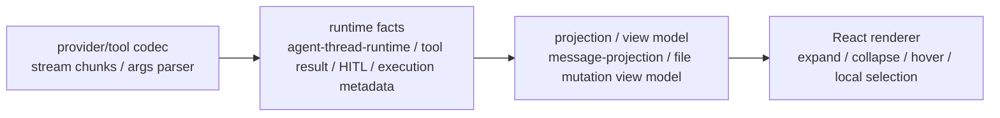

# Tool Call / File Mutation 渲染边界与可控优化计划

这份文档用于接下来一波可控优化：统一 Openwork 流式 tool call、文件变更、审批预览和完成结果的展示边界。

目标不是先修某个 `??`、三元表达式或 UI 细节，而是先把“事实从哪里来、在哪一层派生、React 只能做什么”钉住。后续改动按这里分波执行，避免继续在组件里补 runtime 契约，或者把 preview/pending diff 误当成 applied result。

## 核心结论

Openwork 这条链路必须保持单向：



判断一个 fallback 能不能留，不看写法像不像，而看它在哪一层：

| 层 | 可以做 | 不可以做 |
|---|---|---|
| codec / parser | 修补明确的不稳定输入，例如 provider chunk 字段为空、历史参数 JSON 脏数据 | 生成 UI fact 或 completed result |
| runtime | 写真实运行事实：active run、tool call、tool result、approval、file mutation metadata | 写 renderer 展开态、hover、临时文案 |
| projection | 从 runtime facts 派生稳定 view model，包括 streaming preview、approval preview、completed result | 执行工具、改写 runtime facts、把 pending diff 标成 applied |
| React renderer | 展开/折叠、hover、局部选择、滚动定位 | 从半截 args 伪造 diff、猜 completed result、注册 unknown fallback |

所以后续优化的第一原则是：

```text
有 owner 的事实，修 owner。
没有 owner 的事实，先补 owner。
React 组件里出现跨层补事实，删掉或搬回 projection。
```

## 外部参照

### LobeHub

LobeHub 的工具渲染路径里有几个值得借鉴的边界：

- `Tools` 只订阅 visible tool ids，单个 `Tool` 再按 `toolCallId` 订阅自己的 tool 数据；一个 streaming chunk 不会让兄弟工具重渲染。
- pending intervention 是 selector 从 message/plugin fact 派生出来的 `PendingIntervention`，不是 React 组件从 active operation 猜出来的。
- streaming arguments 可以交给 streaming renderer；没有 streaming renderer 就不显示 detail，不伪造成 completed result。
- completed 状态以 tool 自己的 result 为 source of truth；message-level operation 只作为仍在运行时的 UI loading 辅助。
- provider chunk 修补放在 model-runtime helper，历史脏数据修补放在 context-engine processor，不放在 React tool detail。

结论：LobeHub 不是没有 fallback，而是 fallback 有明确 owner、触发条件和语义边界。

### Codex Desktop

当前安装的 Codex Desktop 里，相关能力也分层明确：

- `app-server-manager-signals` 把 `fileChange` 转成 `patch` item。
- `split-items-into-render-groups` 做 collapsed tool activity、pending MCP tool calls、dynamic tool groups、approval cards 等 render grouping。
- `state_5.sqlite.thread_dynamic_tools` 是 per-thread dynamic tool availability/schema fact。
- `goals_1.sqlite.thread_goals` 是单独的 durable goal fact，不混进普通 message projection。

结论：Codex 的 render group 是 projection/display 层，不是 runtime truth。Openwork 可以学 owner 切分，不应该复制表名或 UI model。

## Openwork 当前事实链路

| 阶段 | 当前 owner | 说明 |
|---|---|---|
| provider/tool stream 解码 | `src/main/agent/agent-thread-runner.ts` | LangChain stream、tool chunks、tool result、HITL interrupt 进入 runtime projector |
| runtime event/state | `src/shared/agent-thread-runtime.ts` | `activeRun`、`pendingApproval`、`messagesPage`、tool started/updated facts |
| renderer event projector | `src/renderer/src/lib/agent-runtime-event-projector.ts` | runtime event 先更新 `thread.agent`，再刷新 `thread.view` |
| message projection | `src/renderer/src/lib/message-projection.ts` | turn、assistant entries、active status、tool execution view |
| tool render model | `src/renderer/src/components/chat/tools/normalize.ts` 和 `file-mutation-view-model.ts` | 把 tool call、active args、approval、result 变成 renderer 消费的 model |
| React display | `Messages.tsx`、`MessageTurnView.tsx`、`ActionMessage.tsx`、Pierre renderer | 只应该消费 projection/view model，并保存本地 UI 交互态 |

这个链路的大方向是对的。要优化的是几个漏在错误层的补偿逻辑。

## 四种文件变更语义

文件变更 UI 必须区分四种语义，不能互相冒充：

| 语义 | 来源 | 状态 | 可以显示什么 | 禁止 |
|---|---|---|---|---|
| streaming preview | `activeRun.toolCalls[].argsText` | pending / arguments streaming | 工具行、完整 JSON object 后的 pending preview | partial args 生成 diff；标记 applied |
| approval preview | HITL review payload / `pendingApproval` | approval | 即将执行的文件树和 diff | 用 UI 推断审批状态 |
| completed result | tool result / execution metadata / `FileMutationResultMetadata` | completed / failed | 已完成的 diff/code view 或 raw result | 从任意 result shape 猜 applied diff |
| artifact patch | artifact / explicit patch content | artifact / preview | patch artifact preview，可复制/查看/应用 | 说成真实已落盘变更，除非 runtime 有对应 fact |

### Streaming Preview

`argsText` 只允许这样用：

1. 为空或不是完整 JSON object：显示 raw args 或“参数流式生成中”。
2. 是完整 JSON object：projection 可以生成 pending preview。
3. preview 必须带 `status: "pending"` 或同等语义。
4. preview 只能更新当前 active tool call 对应的 view model，不能影响历史 activity group。

`parseCompleteToolCallArgsObject` 是当前正确边界：只接受完整 JSON object，`SyntaxError` 返回 `null`。

### Approval Preview

approval fact 属于 runtime/HITL：

- `pendingApproval` 是真实 pending fact。
- approval payload 可以携带 file mutation review。
- projection 负责把 approval payload 派生为 `FileMutationViewModel`。
- React 只能显示 approval view 和本地展开状态。

审批状态只能来自 approval fact，不能由 renderer 根据 tool call 名称或 active run phase 猜。

### Completed Result

completed file mutation view model 只能来自真实完成事实：

- 优先 `FileMutationResultMetadata`。
- 如果 execution metadata 明确记录了 file changes，可以作为 completed source。
- 如果只是 tool result string/object，但没有明确契约，显示 raw result。

禁止把这些当作 completed diff source：

- `result.files` / `result.changes` 这类未纳入工具契约的临时 shape。
- 任意 string 里看起来像 patch 的内容。
- streaming args 或 pending approval preview。

### Artifact Patch

artifact patch 是另一类实体：

- 它可以使用 diff renderer。
- 它可以显示 patch 文件树。
- 它不等于 applied file mutation。

如果后续需要“artifact patch 已应用”的状态，必须由 runtime/apply-patch 工具或 execution metadata 写事实，不能由 artifact renderer 自己改状态。

## 当前异味清单

### 1. `Messages.tsx` 里补 pending approval turn 归属

当前形状：

```ts
getTurnPendingApproval(turn, pendingApproval) ??
  (activeTurn && pendingApproval && activeRun.toolCalls.some(...))
```

这段的问题不是 `??` 本身，而是 React turn row 在补“pending approval 属于哪个 turn”。

正确 owner：

- 已存在的 `message-projection.ts`。
- 或更靠近 renderer store 的 projection owner。

最小方向：

- 把 activeRun + pendingApproval 的 turn 归属派生收口到 projection。
- `Messages.tsx` 只消费当前 turn 的 projection 结果。
- 保留 active turn 订阅优化，但不在组件里写归属 fallback。

### 2. Completed file mutation 从 result shape 猜 diff

当前 `file-mutation-view-model.ts` 在 metadata 为空时，会从 `input.result` 里解析 `files/changes/patch` 等形状。

这段风险更高，因为它可能把 raw result、preview 或工具自定义返回误显示成 applied diff。

正确 owner：

- completed source 应该是 `FileMutationResultMetadata` 或 execution metadata。
- result 没有明确 file mutation contract 时，projection 返回 `raw_result`。

最小方向：

- 删除未契约化的 `parseCompletedFileChanges(input.result)` fallback。
- 删除 string patch sniff 作为 completed file mutation 的路径。
- artifact patch 走 artifact renderer，不混进 completed tool result。

### 3. Controller 组合 persisted snapshot 和 live overlay 的 owner 不清

当前 `threads:agentThreadData` 里：

```ts
runner.readThreadDataOverlay(threadId, persistedThreadData) ?? persistedThreadData
```

这不一定是 bug，但 owner 名字不清。controller 作为 IPC 门面不应该成为“live overlay 如何覆盖 persisted snapshot”的设计 owner。

正确 owner：

- thread read model / runtime snapshot composition service。

最小方向：

- 命名一个明确的 composition 方法，例如 `readAgentThreadDataSnapshot(threadId)`。
- controller 只调用这个方法。
- overlay 的失败语义写清：没有 active runtime 或 revision 为 0 时返回 persisted snapshot；不是吞错 fallback。

### 4. `ToolRuntime.toolCallId` helper 命名和契约漂移

`extension-ai-middleware.ts` 同时读 `runtime.toolCallId` 和 `runtime.toolCall.id`，还把前者叫 `legacyToolCallId`。旁边 `artifact-tools-middleware.ts` 直接使用 `runtime.toolCallId`。

这里先不能想当然修：

- 如果 LangChain 当前契约就是 `runtime.toolCallId`，那 `legacy` 命名是错的。
- 如果某些 runtime 只给 `runtime.toolCall.id`，那需要一个 codec/helper 层兼容，但必须有来源证据。

最小方向：

- 先验证当前 `ToolRuntime` 类型和运行时对象。
- 统一一个 main-side helper，例如 `getRuntimeToolCallId(runtime)`。
- helper 写明为什么需要双路径；没有证据就只保留 canonical 路径。

### 5. Tool display helper 读取多个参数别名

`getPathArg(args)` 读 `path ?? file_path`，`getPatternArg(args)` 读 `pattern ?? query ?? glob`。

这类不是最高风险，因为它目前偏 display summary。但需要限制语义：

- 可以作为 UI label/detail fallback。
- 不能作为 tool fact、file mutation source、approval payload source。
- 更好的长期方向是每个 tool renderer 自己定义 typed display model。

## 分波优化计划

### 第 0 波：文档和 review 口径

目的：先统一判断标准，不动运行路径。

产物：

- 本文档。
- review 时按“owner 是否正确”判断 fallback，而不是按语法判断。

验收：

- 可疑点都有 owner、风险、最小方向。
- 后续 PR 能按波次拆，不一次性重构全链路。

### 第 1 波：收口 streaming tool call projection

目的：所有流式 tool call 走同一套 projection 逻辑。

改动范围：

- `src/renderer/src/lib/message-projection.ts`
- `src/renderer/src/components/chat/Messages.tsx`
- 相关 `tests/node/message-projection.test.ts`

做什么：

- 将 activeRun + pendingApproval 的 turn 归属派生从 `Messages.tsx` 移到 projection。
- 确认 chunk-only tool call 完成后 canonical tool call materialization 仍由 runner/runtime 负责。
- 按 `toolCallId` 稳定 key，不让当前 active tool 更新影响历史 activity group。

不做什么：

- 不改 file mutation renderer。
- 不引入新 UI。
- 不新增 unknown fallback。

验收：

- partial args 不生成 tool diff view model。
- active tool 更新不重建其他 turn/activity group key。
- pending approval 所属 turn 由 projection 给出。

### 第 2 波：清理 completed file mutation fallback

目的：completed diff 只来自真实完成事实。

改动范围：

- `src/renderer/src/components/chat/tools/file-mutation-view-model.ts`
- `src/renderer/src/components/chat/tools/normalize.ts`
- `src/shared/file-mutation-result.ts`
- `tests/node/action-message-view.test.ts`

做什么：

- 保留 `FileMutationResultMetadata` 路径。
- 没有 metadata 时显示 raw result。
- artifact patch 和 completed file mutation 分开。
- 删除未契约化 result shape sniffing。

不做什么：

- 不把 preview/pending diff 当 applied result。
- 不从半截 args 伪造 completed diff。

验收：

- completed tool result 只在有 metadata 时生成 completed file mutation view。
- raw result 仍可展开查看。
- artifact patch 仍能由 artifact renderer 查看，但不显示为 applied file mutation。

### 第 3 波：统一 file mutation view model source

目的：为 Pierre renderer 提供明确、稳定、可 memo 的 view model。

改动范围：

- `file-mutation-view-model.ts`
- Pierre renderer 入口
- approval review projection

做什么：

- 明确定义 `FileMutationViewModel`。
- `source` 区分：
  - `streaming_preview`
  - `approval_preview`
  - `completed_result`
  - `artifact_patch`
- `status` 区分：
  - `arguments_streaming`
  - `pending`
  - `approval`
  - `completed`
  - `failed`
- key 使用 `toolCallId + filePath + source`。
- argsText 解析结果 memoization：只在对应 argsText 内容变化时更新对应 tool call。

不做什么：

- 不在 renderer 注册 unknown fallback。
- 不在 React 组件里解析 raw result。

验收：

- 多文件变更显示树。
- 点击树节点定位 diff。
- 展开状态稳定。
- streaming 只更新当前 active tool preview。

### 第 4 波：Pierre 渲染与 legacy 删除

目的：最终只保留一套 file mutation detail renderer。

改动范围：

- Pierre file mutation renderer
- 旧 preview/list/detail renderer
- package audit

做什么：

- 使用 `@pierre/diffs` 渲染 diff/code view。
- 使用 `@pierre/trees` 渲染多文件树。
- 单文件时不显示空树面板。
- 多文件或 change-list 场景显示树。
- 删除旧 fake changes overview。
- 删除能被 Pierre 覆盖的旧 preview/list 结构。

不做什么：

- 不保留两套 file mutation detail renderer。
- 不为了兼容旧 UI 留隐藏 fallback。

验收：

- `write_file/edit_file` streaming 阶段先出现文件编辑工具行。
- partial args 不出现假 diff。
- args 完整后出现路径/文件名。
- completed 后工具行保留。
- 展开看到 Pierre diff/code view。
- approval 场景走同一套 tree/diff renderer。

### 第 5 波：read model composition 命名清理

目的：让 persisted snapshot + runtime overlay 的职责显性化。

改动范围：

- `src/main/threads/controller.ts`
- `src/main/agent/agent-thread-runner.ts`
- 可能新增 main-side read model helper

做什么：

- controller 不直接写 `overlay ?? persisted`。
- runner 或 service 暴露明确 read model composition 方法。
- 文档化没有 active runtime 时返回 persisted snapshot 的语义。

不做什么：

- 不改变 persistence schema。
- 不把 renderer projection 搬到 main。

验收：

- 行为不变。
- owner 名称清楚。
- 失败语义不靠 `??` 表达。

## 稳定 key 和增量更新规则

所有 tool/file mutation view model 都按稳定 identity 更新：

| 对象 | 稳定 key |
|---|---|
| tool call | `toolCallId` |
| streaming preview file | `streaming_preview:${toolCallId}:${filePath}` |
| approval preview file | `approval_preview:${approvalId}:${toolCallId}:${filePath}` |
| completed result file | `completed_result:${toolCallId}:${filePath}` |
| artifact patch file | `artifact_patch:${artifactId}:${filePath}` |
| tree node | source + normalized path |

增量原则：

- `argsText` memo 以完整字符串为 key。
- partial args 不进入 file diff projection。
- 当前 active tool 更新只替换自己的 preview。
- 历史 completed tool group 不因 active tool chunk 改变 key。
- 展开/折叠状态只存在 React local state，以 source + path key 保持稳定。

## 测试口径

优先补低成本 node tests；测试环境不可用时，先不硬写新测试，但文档化手动验收。

推荐覆盖：

- streaming args partial 不生成 diff view model。
- streaming args complete 生成 pending preview view model。
- approval file mutation 生成 approval preview view model。
- completed tool result 只从 metadata 生成 completed result view model。
- chunk-only tool call 完成后 materialize canonical tool call，并保留 UI 工具行。
- active tool 更新不重建其他 activity group key。

手动验收：

1. 让模型执行 `write_file`。
2. 在 `tool_call_chunks` 阶段，UI 先出现文件编辑工具行。
3. partial args 不出现假 diff。
4. args 完整后出现路径/文件名。
5. 完成后工具行不消失。
6. 展开能看到 Pierre diff/code view。
7. 多文件变更显示 file tree。
8. 单文件 diff/code 不显示空白 tree 面板。
9. approval 场景显示 pending preview，审批状态来自 approval fact。

## 禁止项

后续 PR review 直接按这些挡：

- renderer 注册 unknown fallback。
- React 组件从 activeRun/raw result 猜 completed file mutation。
- partial args 生成 diff。
- pending/approval preview 标成 applied/completed。
- artifact patch 被显示为真实已落盘变更。
- 保留两套 file mutation detail renderer。
- 用 `??` 或三元表达式隐藏 owner 不清的 fallback。
- 为了兼容旧 UI 保留 fake changes overview。

## 可以接受的 fallback

这些 fallback 可以保留，但必须写在正确层：

- provider chunk codec 为明确 provider 问题修补空字段。
- historical dirty message processor 在发送给 provider 前清洗旧数据。
- UI title/detail 缺少专用 display 时，显示 tool label 或 first string arg。
- local UI selection 在 active tab 消失后回到第一个 pending item。
- 没有 file mutation metadata 时显示 raw result。

关键区别：

```text
display fallback 可以降低空白感。
fact fallback 不能伪造事实。
completed fallback 不能把未知 shape 当已应用结果。
```

## 合入标准

每一波优化合入前至少回答：

1. 这次改动的 owner 是 runtime、projection、renderer 还是 codec？
2. 是否删除了错误层 fallback，而不是加新 fallback？
3. streaming preview、approval preview、completed result、artifact patch 有没有混淆？
4. React local state 是否只剩展开、hover、局部选择？
5. 是否保留了稳定 key？
6. 是否有测试或明确手动验收？
7. 如果动了前端依赖，是否跑 `npm run audit:frontend-packages`？

建议验证命令：

```bash
npm run audit:frontend-packages
npm run test:node:target -- tests/node/action-message-view.test.ts tests/node/message-projection.test.ts tests/node/tool-approval.test.ts tests/node/tool-approval-middleware.test.ts tests/node/artifact-agent-state.test.ts tests/node/agent-thread-runner.test.ts
npm run typecheck
git diff --check
```

如果测试环境当前不可用，可以先记录未跑原因，但不能把未验证路径说成已验证。
