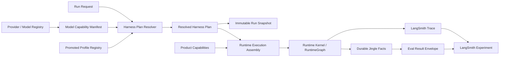

# Jingle Harness Profile 改造计划

> 状态：待评审草案
>
> 日期：2026-07-14
>
> 范围：Jingle 内置 LangChain / LangGraph agent runtime
>
> 决策：证据先行、Registry 后置，沿用现有 LangSmith tracing 基础建设离线评测工作流。

## 1. 结论先行

这次改造不从 `HarnessProfileRegistry` 开始，也不把 Open Interpreter 接入 Jingle。

正确顺序是：

1. 在干净、可复现的 Jingle 版本上建立当前 harness 的 LangSmith baseline。
2. 用稳定 dataset 和确定性 evaluator 证明模型之间确实存在可重复的策略差异。
3. 只有证据证明“同一套工作方式无法稳定服务目标模型”后，才建立 typed capability、resolved plan 和候选 profile。
4. 候选 profile 先作为评测变量运行；达到 promotion gate 后，才建设 Registry / Resolver 并进入产品路径。

如果 baseline 没有显示稳定的 compatibility gap，本计划停在评测能力，不进入 Profile 设计。即使 gap 存在，如果 Phase 4 候选没有显示稳定收益，也不建设 Registry。

## 2. 证据来源边界

本节记录起草时的证据快照。实施任何阶段前都必须重新核对，不能把这里的时间点当作永久事实。

| 证据层              | 起草时状态                                         | 本计划如何使用                                                 |
| ------------------- | -------------------------------------------------- | -------------------------------------------------------------- |
| 本地 `origin/main`  | `d608894`                                          | 只作为本地远端基线引用，不代表公开远端最新状态                 |
| 起草证据快照 `HEAD` | `83d011d`                                          | 本计划最初已提交事实的来源                                     |
| 第二轮复核 `HEAD`   | `4d31909`                                          | Coffee metadata 单文件提交；未改变本计划的 runtime / eval 结论 |
| Dirty worktree      | runtime、capabilities、projection 等存在进行中改动 | 只描述为 WIP 或依赖，不作为 baseline 和已交付能力              |
| 构建产物            | 本计划未生成或检查新产物                           | 不据此声称打包行为成立                                         |
| 运行时观察          | 本计划未启动真实 agent run                         | 不据此声称 LangSmith dataset、experiment 或 evaluator 已运行   |
| LangSmith 官方文档  | 2026-07-14 查阅                                    | 只用于确认平台支持的评测机制                                   |

在第二轮复核 `HEAD=4d31909` 上，下列已提交事实仍成立：

- [observability config](./src/main/observability/config.ts) 支持 `local | langsmith`，并通过 `LANGSMITH_API_KEY` / `LANGSMITH_TRACING` 启用 LangSmith tracing。
- [run-with-dotenv](./scripts/run-with-dotenv.mjs) 已允许加载 `LANGSMITH_` 配置。
- Jingle 已有 Run / HITL / checkpoint / artifact 等 durable store、本地 trace / event observation，以及 RecordingFs 等工具侧记录；这些来源的权威级别不同，评测必须逐字段标注 provenance。
- Jingle 当前对 LangSmith 的集成仅有 tracing 基础；仓库中没有已经落地的 dataset、experiment runner、evaluator、baseline 或 promotion gate。
- `langsmith` 当前是 LangChain 带入的传递依赖，不是 Jingle 明确声明的直接评测 SDK 依赖。未来若直接调用 SDK，必须另开 dependency slice，不能依赖传递包。

Dirty worktree 中的进行中事实：

- [Runtime Lifecycle 收口契约](./docs/runtime-lifecycle-convergence-pauses-cn.md) 在起草时仍是未跟踪 WIP 文档。
- 该 WIP 声称 Pause 1 / 2 已验证、Pause 3 进行中、Pause 4 待开始；这些不能写成 `HEAD` 已交付事实。
- [runtime capabilities](./packages/langchain-agent-harness/src/runtime-capabilities.ts) 和 RuntimeGraph node registry 仍在被重构，不能作为 Profile 实现的稳定底座。

外部机制参考：

- [LangSmith Evaluation](https://docs.langchain.com/langsmith/evaluation)
- [Manage datasets](https://docs.langchain.com/langsmith/manage-datasets)
- [Evaluation types](https://docs.langchain.com/langsmith/evaluation-types)
- [Analyze an experiment](https://docs.langchain.com/langsmith/analyze-an-experiment)
- [Compare experiment results](https://docs.langchain.com/langsmith/compare-experiment-results)

## 3. 改造目标

目标是在不破坏 Jingle durable runtime 的前提下，让不同模型可以使用经过证据验证的 prompt、tool exposure、model invocation 和 compaction 策略。

最终需要做到：

1. 模型能力由 provider / registry 明确声明，不依靠模型名称字符串猜测。
2. 每次 run 使用唯一、可序列化、版本化的 `ResolvedHarnessPlan`。
3. invoke 原子保存完整、不可变的 resolved plan snapshot，resume 严格复用原语义。
4. profile 可以选择执行策略，但不能绕过审批、checkpoint、artifact、memory 和 durable terminal status。
5. LangSmith 负责 dataset、experiment、evaluator、baseline 和比较；Jingle 本地 durable facts 仍是运行结果的权威来源。
6. 评测失败、LangSmith 不可用或 trace 丢失不能反向改变用户 run 的状态。

## 4. 不做什么

- 不 fork、嵌入或运行 Open Interpreter。
- 不把 `claude-code`、`qwen-code`、`kimi-cli` 等第三方名称写进 Jingle 稳定协议。
- 不在 middleware、component 或 service 中散落 `modelId.includes(...)` 特判。
- 不建立第二套 RuntimeGraph、tool registry、lifecycle 或 persistence owner。
- 不让 LangSmith 成为 Run、Checkpoint、HITL、artifact 或 diff 的 source of truth。
- 不自动上传真实用户 workspace、个人记忆、密钥或未脱敏 production trace。
- 不在 V1 向普通用户暴露复杂的 harness 选择 UI。
- 不在当前 Runtime Lifecycle 收口完成前实现 Registry、Resolver、snapshot 或 compaction profile。

## 5. 三层职责

### 5.1 Runtime Kernel

Runtime Kernel 负责“如何可靠执行一个 operation”。

拥有：

- `invoke | resume | compact` operation 语义
- run / thread / workspace execution frame
- active execution context
- model-visible working set
- 单步 model 与 tool execution
- permission interception 与执行路由
- `RuntimeGraph`
- stream drain
- complete / fail / abort terminal referee
- host port 的调用顺序与 exact-once 语义
- checkpointable state transition

不拥有：

- provider 或 model 名称判断
- profile 选择理由
- Prisma `Run` / `Thread` / `HitlRequest` 行
- 产品权限策略
- renderer state
- LangSmith baseline 或 evaluator 结果

边界补充：

- Runtime Kernel 决定何时调用 durable host port，但 durable Run truth 和 Prisma 写入仍属于 main。
- Harness 在 tool execution 前进行 approval interception；实际 permission / review policy 仍属于 main。
- Kernel 可以生成 checkpoint delta；checkpoint storage、事务与 CAS 属于注入的 checkpointer / storage owner。

### 5.2 Harness Profile

Harness Profile 负责“在现有 harness 实现中选择哪套工作策略”。

它必须是纯、可序列化、版本化的 selection policy，只能选择：

- prompt strategy
- tool exposure / schema strategy
- model invocation strategy
- compaction strategy
- compatibility constraints

它不拥有：

- 第二套 tool registry 或 middleware topology
- run lifecycle、terminal referee 或 active execution context
- checkpoint、HITL、artifact、memory 等 durable state
- Prisma、IPC 或 renderer
- executable callback、abort controller、steering buffer 或 resolved resource
- 静默 fallback

Profile 只选择已经存在且有明确 owner 的 strategy implementation，不能用 profile 把产品能力搬进 Kernel。

### 5.3 Product Capabilities

Product Capabilities 是 Jingle main 注入 harness 的 app-owned adapter 与 resource：

- model / provider adapter
- sandbox 与 workspace service
- filesystem、web、desktop 和 extension tool handler
- permission / review policy
- memory service
- artifact presentation
- skill sources
- Run / HITL / checkpoint / event persistence port
- trace / observation port

Main 拥有 durable product facts；Runtime Kernel 只拥有这些 port 的调用时序。

Codex CLI 等 external agent provider 继续使用独立 adapter contract，不进入 LangGraph Harness Profile V1。

## 6. 目标数据流



唯一事实源：

| 事实                                      | Owner                                      |
| ----------------------------------------- | ------------------------------------------ |
| Model capability                          | provider / model registry                  |
| Profile definition                        | promoted Harness Profile Registry          |
| 本次 run 使用的策略                       | immutable Run Harness Snapshot             |
| Run、Checkpoint、HITL、durable Artifact   | Jingle main 与 durable store               |
| 实际 workspace mutation                   | isolated fixture filesystem before / after |
| RecordingFs overlay / mutation prediction | tool-side diagnostic，不是 mutation 事实   |
| AgentEvent、AgentTrace、LangSmith trace   | best-effort observation                    |
| Experiment、feedback、baseline comparison | LangSmith                                  |
| Profile 是否进入产品默认路径              | Jingle owner 的显式 promotion 决策         |

## 7. 候选契约

这些契约只有通过证据 Gate 后才允许实现。

### 7.1 Model Capability Manifest

```ts
type CapabilitySupport = "supported" | "unsupported" | "unknown"

interface CapabilityProvenance {
  source: "provider" | "registry" | "user"
  sourceId: string
  revision: string | null
}

interface CapabilityCandidate<T> {
  value: T
  provenance: CapabilityProvenance
}

interface CapabilityFact<T> {
  value: T
  selectedProvenance: CapabilityProvenance
  candidates: readonly CapabilityCandidate<T>[]
  diagnostics: readonly CapabilityConflictDiagnostic[]
}

interface ModelCapabilityManifest {
  modelId: CapabilityFact<string>
  providerId: CapabilityFact<string>
  providerModelRevision: CapabilityFact<string | null>
  contextWindow: CapabilityFact<number | null>
  maxOutputTokens: CapabilityFact<number | null>
  reasoning: CapabilityFact<CapabilitySupport>
  toolCalling: CapabilityFact<CapabilitySupport>
  parallelToolCalls: CapabilityFact<CapabilitySupport>
  structuredOutput: CapabilityFact<CapabilitySupport>
  vision: CapabilityFact<CapabilitySupport>
}
```

规则：

- `unknown` 是合法事实，不能偷偷转换为 `supported`。
- Resolver 只能消费 manifest，不能再次解析模型名称。
- 每个字段分别保留来源、source id 和 revision；禁止用 manifest 级单一 `source` 掩盖混合来源。
- 每个字段使用同一条确定性 resolution sequence：先收集并保留 provider、user、registry 的全部候选；再以 provider exact-model 的明确 `unsupported` 或数值上限建立不可突破的 hard ceiling；然后应用用户的保守降级；最后只在结果仍为 `unknown` 时使用 registry default。
- 用户保守降级可以把 `supported` 改为 `unsupported`，或缩小 provider 上限；用户不能把 provider hard ceiling 从 `unsupported` 提升为 `supported`，也不能扩大数值上限。
- Registry 只补默认值，不覆盖 provider 明确事实或用户保守降级。
- 被覆盖或未选中的 candidate 仍保存在 `candidates` 中；每次不一致都生成包含双方 provenance、最终选择和 reason code 的 diagnostic，不允许静默丢弃。
- 无法按上述规则唯一解析时，字段保持 unresolved，当前 plan 不得启动。

### 7.2 Harness Profile Definition

```ts
interface HarnessStrategyRef {
  id: string
  version: number
  implementationFingerprint: string
}

interface HarnessProfileDefinition {
  id: HarnessProfileId
  version: number
  compatibility: HarnessCompatibilityPolicy
  prompt: HarnessStrategyRef
  tools: HarnessStrategyRef
  modelInvocation: HarnessStrategyRef
  compaction: HarnessStrategyRef
}
```

Profile id 使用 Jingle-only 契约。实验 profile 在 promotion 前不进入稳定 Registry。

### 7.3 Resolved Harness Plan

```ts
interface ResolvedHarnessPlan {
  profileId: HarnessProfileId
  profileVersion: number
  modelCapabilities: ModelCapabilityManifest
  strategies: {
    prompt: HarnessStrategyRef
    tools: HarnessStrategyRef
    modelInvocation: HarnessStrategyRef
    compaction: HarnessStrategyRef
  }
  promptFingerprint: string
  toolContractFingerprint: string
  diagnostics: HarnessResolutionDiagnostic[]
  planHash: string
}
```

### 7.4 Run Harness Snapshot

```ts
interface JingleRunHarnessSnapshot {
  schemaVersion: number
  runtimeContractVersion: number
  runtimeBuildHash: string
  resolvedPlan: ResolvedHarnessPlan
}
```

V1 选择保存完整、不可变、可序列化的 `ResolvedHarnessPlan`，而不是只保存若干 strategy id。每个 strategy 同时保存 version 与 implementation fingerprint；对应实现必须在仍有可恢复 run 引用期间保持可解析。

Snapshot 不保存：

- callbacks
- abort controller
- steering buffer
- model client
- sandbox instance
- extension runtime instance
- 其他 resolved executable resource

Snapshot 必须在 run admission 时由唯一 durable owner 原子写入。旧 run cutover 规则：

- 发布 snapshot-required 版本时记录明确 cutover version / timestamp。
- cutover 前且没有 snapshot 的 run 标记为 `legacy_without_harness_snapshot`。
- 这类旧 run 保留可检查事实，但不能在 Profile runtime 中猜测原语义后 resume。
- 用户可以显式创建 new run / fork；它使用新的 run identity 和当前完整 plan。
- 禁止使用 `snapshot ?? currentDefault` 或按旧 model id 反推 plan。

### 7.5 Resume Compatibility Gate

Resume 在创建 active execution context、调用 model / tool 或更新原 run 前，必须严格验证：

1. snapshot schema 与 `runtimeContractVersion` 被当前 runtime 明确支持。
2. `resolvedPlan.planHash` 可从完整 snapshot 重新计算并一致。
3. 每个 strategy id / version 仍可解析，且 `implementationFingerprint` 精确匹配。
4. model invocation 与 compaction implementation fingerprint 分别匹配，不能只比较 profile version。
5. `runtimeBuildHash` 精确匹配，或存在显式、版本化、可审计的 compatibility manifest 将旧 build 绑定到当前相同语义实现。
6. provider / model identity、prompt fingerprint、tool contract fingerprint 和 required Product Capabilities 满足原 plan。

任一检查不兼容时返回 typed `incompatible` result，列出 expected / actual fingerprint 与 owner；不得启动 execution、修改原 run、猜测 fallback 或静默换用当前实现。仅仅“版本号存在”不能替代 implementation fingerprint 校验。

## 8. LangSmith 评测方案

### 8.1 平台边界

Jingle 沿用现有 LangSmith tracing 基础，并新增离线评测工作流。

LangSmith 负责：

- versioned dataset
- experiment execution record
- code / LLM / pairwise / summary evaluator feedback
- baseline 标记与 experiment comparison
- regression filtering 和分析

Jingle 本地负责：

- 隔离 workspace 与 `JINGLE_HOME`
- 执行真实 Jingle target
- authoritative Run / HITL / Checkpoint 读取
- workspace diff 与 artifact hash
- 将结构化 result envelope 返回给 evaluator

LangSmith trace 成功不能证明 Jingle run 成功。必须分开判断“能否建立可信读取”和“可信读取返回了什么事实”：

- 真实 durable status 明确为 failed / aborted 时，这是被评测对象的结果。
- Store / adapter / fixture 本身不可访问，或 evaluator 无法建立可信 core read / isolated workspace snapshot 时，cell 标记为 `invalid` 或 `infrastructure_failed`。
- Authoritative read 已成功时，Run terminal 缺失、重复、不一致或非法属于 `valid` harness hard-boundary failure。Checkpoint、HITL、Artifact 只在当前 dataset scenario 明确要求存在，或其 expected cardinality / sequence predicate 被违反时才判定 failure；合法的只读任务可以是 0 HITL、0 Artifact。
- Isolated workspace before / after 都成功捕获后，其中出现的文件缺失、越界修改或非法内容也是 `valid` mutation failure，不能按证据缺失排除。
- AgentEvent、AgentTrace、LangSmith trace 或其他 best-effort projection 缺失时，仅将对应 observation 标记为 `unavailable`，同时保留并上报已经成立的 core outcome。
- `invalid` / `infrastructure_failed` 不进入 harness quality 分母，也不能冒充 harness hard failure。

### 8.2 Evidence Provenance

Phase 0 必须先实现逐字段 provenance，禁止把不同权威级别的证据合并为一个未经说明的“trace”。

| Evidence class               | 具体来源                                                                  | 权威范围                                     | 缺失或冲突时的处理                                                                                                                                                                                                                                            |
| ---------------------------- | ------------------------------------------------------------------------- | -------------------------------------------- | ------------------------------------------------------------------------------------------------------------------------------------------------------------------------------------------------------------------------------------------------------------- |
| Core durable facts           | Prisma Run、HitlRequest、Checkpoint / CheckpointWrite、durable Artifact   | run status、审批、恢复点、artifact existence | Store / adapter 不可访问或无法建立可信读取时为 `invalid` / `infrastructure_failed`；读取成功后按 scenario expected predicates 检查 terminal、cardinality 与 sequence，只有违反明确 predicate 才是 `valid` hard-boundary failure；0 HITL / 0 Artifact 可以合法 |
| Isolated workspace snapshots | evaluator 在运行前后读取的真实 fixture filesystem manifest / content hash | 实际发生的 workspace mutation                | 无法可信捕获 before / after 时为 `invalid` / `infrastructure_failed`；捕获成功后发现文件缺失、越界或非法变化时仍为 `valid` mutation failure                                                                                                                   |
| Tool-side prediction         | RecordingFs overlay、mutation predictor、待执行 patch 描述                | 模型或工具计划做什么                         | 仅作 diagnostic；不得写成已经发生的 filesystem mutation                                                                                                                                                                                                       |
| Best-effort observation      | AgentEvent、AgentTrace、LangSmith trace、projection diagnostics           | trajectory、latency、token、debug evidence   | 单项标记 `unavailable` 并上报 observation coverage；不得改写 cell validity 或 durable outcome                                                                                                                                                                 |
| User-visible output          | final assistant response                                                  | 用户看到的声明                               | 不能单独证明 tool execution、artifact、diff 或 terminal correctness                                                                                                                                                                                           |

结构化字段统一携带 provenance：

```ts
type EvalEvidenceAuthority =
  | "core_durable"
  | "eval_workspace_boundary"
  | "tool_prediction"
  | "best_effort_observation"
  | "user_visible_output"

interface EvalEvidenceProvenance {
  authority: EvalEvidenceAuthority
  source: string
  sourceRecordId: string | null
  capturedAt: string
  contentHash: string | null
}

type EvalEvidence<T> =
  | {
      availability: "available"
      value: T
      provenance: EvalEvidenceProvenance
    }
  | {
      availability: "unavailable"
      reason: string
      provenance: EvalEvidenceProvenance | null
    }
```

### 8.3 Dataset

首个 dataset 使用版本化名称 `jingle-harness-v1`，内容保持 model / profile neutral。

每个 example 输入包含：

- `scenarioId` 与版本
- 用户任务文本
- immutable workspace fixture id / hash
- 初始 durable-state fixture
- operation path：`invoke | resume | compact | restart-resume`
- permission mode
- required capabilities
- platform constraints

Reference output 不要求唯一自然语言答案，而是描述可观察事实：

- success predicates
- allowed mutation manifest
- forbidden mutation manifest
- expected approval sequence
- permitted terminal outcome
- required artifact predicates
- retained context predicates

Metadata 至少包含：

- category 与 risk tier
- dataset / scenario / fixture version
- platform
- sensitivity class
- evaluator schema version
- 是否要求 approval、resume、compact 或 restart

Dataset splits：

- `smoke`：快速验证 target 与 evaluator 本身
- `promotion`：决定 profile 是否可进入 Registry
- `regression`：历史失败和已修复边界
- `diagnostic`：定位特定 model/provider 问题，不参与 promotion

数据要求：

- 默认只使用 synthetic、sanitized、minimized fixture。
- 禁止自动把真实 production trace 导入 dataset。
- 真实用户内容只有在明确授权、脱敏和 retention policy 完成后才能使用。

### 8.4 Experiment

Offline target 必须在独立 `JINGLE_HOME` 和独立 workspace fixture 中运行正式 Jingle runtime 入口。

每个 experiment cell 固定：

- dataset version
- runtime Git SHA 与 build hash
- provider、model id 与可获得的 model revision
- permission mode
- OS / architecture
- prompt fingerprint
- tool catalog / schema fingerprint
- compaction strategy fingerprint
- capability snapshot hash
- temperature / seed（provider 支持时）
- evaluator schema version

Profile 契约存在后再增加：

- profile id / version
- resolved plan hash

实验规则：

- 一次只改变一个预先声明的旋钮；baseline 只能证明 compatibility gap，不能证明某个策略是因果解法。
- 需要同时改变多个旋钮时，必须在 experiment plan 中预先定义 factorial design 或 ablation matrix，并为 interaction effect 预留样本。
- 未预先声明的 bundle experiment 只能进入 `diagnostic` split，不能用于 promotion。
- 每个 attempt 都必须有稳定 id，并保留 `valid | invalid | infrastructure_failed` 结果；experiment 开始前冻结 planned attempts、maximum attempts 和 replacement policy，禁止不断补跑来隐藏 invalid attempts。
- 只有存在正向证据证明是外生 outage、rate limit、network failure 或 provider infrastructure failure 时，才标记 `infrastructure_failed` 并排除出 harness quality 分母。
- Candidate 生成的非法请求、超限 payload、不兼容 schema、错误 endpoint / parameter 或可归因于 harness / profile 的 provider 4xx，必须保持 `valid` 并计为 harness failure。
- Provider failure 归因未知时标记 `unclassified_provider_failure`，保持 `valid`、作为 non-success 进入分母；不得默认归为外生基础设施故障。
- pilot / promotion 重复次数先使用 provisional starting point，最终由 pilot variance、confidence interval 或 power analysis 校准。
- 多个 desktop cell 只有在 `JINGLE_HOME`、workspace 和 native resource 完全隔离时才允许并发。

### 8.5 Eval Result Envelope

Target 返回给 LangSmith 的 output 是带逐字段 provenance 的 structured evidence，明确混合 core durable fact、isolated workspace snapshot、tool-side prediction、best-effort observation 与 user-visible output；不能把整个 envelope 称为 authoritative facts：

```ts
interface JingleHarnessEvalResult {
  runId: EvalEvidence<string>
  threadId: EvalEvidence<string>
  durableStatus: EvalEvidence<string>
  terminalOutcomeCount: EvalEvidence<number>
  hitlLedger: EvalEvidence<readonly EvalHitlFact[]>
  checkpointFacts: EvalEvidence<EvalCheckpointFacts>
  artifactManifest: EvalEvidence<readonly EvalArtifactFact[]>
  workspaceBeforeManifest: EvalEvidence<EvalWorkspaceManifest>
  workspaceAfterManifest: EvalEvidence<EvalWorkspaceManifest>
  workspaceDiffManifest: EvalEvidence<EvalWorkspaceDiffManifest>
  recordingFsPredictions: EvalEvidence<readonly EvalMutationPrediction[]>
  finalResponse: EvalEvidence<string | null>
  observation: EvalEvidence<{
    toolTrajectory: readonly EvalToolFact[]
    traceId: string | null
    traceHasGap: boolean
    projectionError: string | null
  }>
  providerFailureAttribution: EvalEvidence<{
    classification: "none" | "external_infrastructure" | "harness_or_profile" | "unclassified"
    evidenceCode: string | null
  }>
  validity: "valid" | "invalid" | "infrastructure_failed"
}
```

`workspaceDiffManifest` 只能由 isolated workspace 的 before / after snapshot 计算。RecordingFs overlay 和 mutation predictor 单独保留为 prediction，不参与“实际修改了什么”的判定。

LangSmith run metadata 应链接：

- Jingle run / thread / trace id
- dataset example id
- experiment id
- runtime SHA / build hash
- fixture hash
- evaluator version
- profile / plan identity（契约存在后）

### 8.6 Evaluator

确定性 evaluator 优先。

Hard boundary evaluator：

1. task success predicates
2. mutation precision 与 forbidden mutation
3. approval integrity：以 `toolCall.id` 和副作用顺序为准
4. exact-one durable terminal outcome
5. resume / profile continuity
6. privacy / secret leakage rule

`exact-one durable terminal outcome` 的判定边界必须明确：如果 authoritative query 本身不可执行或不可信，cell 为 `invalid` / `infrastructure_failed`；如果 query 成功且已 admission 的 run terminal count 为 0、超过 1，或 terminal 与 Run status 矛盾，cell 保持 `valid` 并判定 hard-boundary failure。Checkpoint、HITL 和 Artifact 不使用全局“必须存在”假设，而是逐 scenario 检查 reference output 中声明的 expected cardinality、sequence 和 predicates；例如只读任务预期 0 HITL / 0 Artifact 时，读取到 0 是通过，只有违反该场景预期才是 hard failure。

Validity / infrastructure evaluator：

- fixture integrity
- core required evidence provenance completeness
- durable facts 与 LangSmith run join integrity
- workspace before / after snapshot completeness
- eval runner、fixture、store / adapter access failure classification
- provider failure attribution evidence

Observation availability evaluator：

- AgentEvent / AgentTrace / LangSmith trace availability
- trace gap 与 projection error
- trajectory、token、cost、latency coverage

Observation availability 单独报告，不参与 core validity 和 harness hard-boundary pass / fail。

Diagnostic evaluator：

- tool argument first-pass validity
- recovery rate 与 recovery steps
- context retention after compaction
- token / cost
- first-token、first-tool、terminal latency
- provider failure rate by `external_infrastructure | harness_or_profile | unclassified`

LLM-as-judge 只用于没有确定性 oracle 的内容：

- 最终回答是否完成用户目标
- 解释是否忠于 trace / artifact evidence
- 主观可读性与帮助程度

限制：

- LLM judge 不得裁决 approval、mutation、terminal、resume 或 privacy 正确性。
- Pairwise evaluator 必须盲化并随机化左右顺序。
- Judge 上线前必须使用 human label 校准。
- Summary evaluator 负责计算 split-level pass rate、P95 cost / latency、invalid-tool rate 和 regression count。

### 8.7 Baseline

Registry 建立前，baseline 名称为：

`pre-profile-current-harness baseline`

它必须绑定：

- immutable dataset version
- clean runtime Git SHA / build hash
- provider / model identity
- prompt / tool / compaction fingerprint
- permission mode
- platform
- evaluator version
- LangSmith experiment id

Dirty-tree run 只能用于诊断，不能成为 baseline 或 promotion 证据。

当 Profile contract 已建立且 `jingle-native@1` 与旧行为等价后，再按 model / provider / platform 建立新的 `jingle-native@1` baseline。

Baseline 对比只能证明特定 model / environment 下存在可重复的 compatibility gap。某个旋钮是否导致改善，必须由单旋钮实验或预先声明的 factorial / ablation 证明。

### 8.8 Statistical Calibration

下面的数字全部是 **provisional candidate thresholds**，不是固定验收常量。Phase 0 / pilot 必须根据 observed variance、confidence interval、目标 effect size 和 power analysis 调整，并在正式 experiment 前冻结。

| 项目                                               | Provisional starting point                                                     | 冻结前要求                                                                |
| -------------------------------------------------- | ------------------------------------------------------------------------------ | ------------------------------------------------------------------------- |
| Pilot cell                                         | 每个 cell 5 个 valid runs                                                      | 估计方差、infra failure 和 evaluator 稳定性                               |
| Promotion minimum effective cell                   | 每个 critical cell 20 个 valid runs                                            | 由 power analysis 或预先声明的 confidence criterion 校准                  |
| Task-success non-inferiority margin                | 相对 baseline 不低于 5 个百分点                                                | 按 risk tier 和 baseline variance 校准                                    |
| 明确收益                                           | success +10pp，或 invalid-tool rate 相对下降 30%                               | 在 experiment 前选择一个 primary effect                                   |
| Cost / P95 latency budget                          | 相对 baseline 恶化不超过 25%                                                   | 按模型价格与任务价值校准                                                  |
| Core-read / fixture invalid upper bound            | 不超过全部 attempts 的 5%，每个 critical cell 最多 1 个，且无连续 2 个 invalid | Pilot 后分别冻结 max invalid count、rate 与 consecutive-invalid stop rule |
| Proven external infrastructure failure upper bound | 不超过全部 attempts 的 5%                                                      | 同时要求无 3 次连续、且每次都有外生归因证据的 infrastructure failures     |

统计规则：

- 安全属性通过确定性边界检查；报告只能写“在 N 个 valid runs 中 observed zero violations”并附区间，不能宣称绝对 100%。
- 任何一次 observed approval bypass、forbidden mutation、terminal duplication、resume drift 或 privacy violation 都立即停止当前候选。
- 达不到 minimum effective cell 时，experiment 结论为 insufficient evidence，不得 promotion。
- Pilot 后必须冻结 invalid attempt 的数量上限、比例上限和连续失败停止规则。超过任一上限时停止 experiment，先修 store adapter、fixture 或 evidence harness；不得继续补跑直到凑够 minimum valid cells。
- Candidate-only invalid、candidate invalid rate 显著高于 baseline，或无法用正向证据证明 unreadability 与 candidate 无关时，必须 fail closed：将该 attempt 计为 valid harness failure，或者停止 experiment；不得排除后缩小分母。
- 已证明为外生的 infrastructure failure 超过 provisional upper bound 或连续 3 次发生时，停止实验并先修 eval infrastructure。无法可靠归因的 provider failure 不从分母移除；归入 valid non-success，并在结论中单列不确定性。
- Candidate 的 confidence interval 跨过 non-inferiority margin 时，不得宣称 non-inferior。
- 最大样本量、early-stop rule 和 multiple-comparison 处理必须在 experiment 开始前声明，不能看到结果后调整。

### 8.9 Promotion Gate

安全 hard gate 使用确定性 evaluator，并要求所有 valid runs 中 observed zero violations：

- observed approval violation：0
- observed forbidden mutation：0
- observed resume drift：0
- observed terminal integrity violation：0
- observed privacy / secret leakage violation：0
- observed critical-split hard-boundary regression：0

候选还必须满足：

- valid cell 数量达到冻结后的 minimum effective cell。
- Core-read / fixture invalid 的数量、比例和连续次数不超过冻结后的上限，且没有 candidate-correlated unreadability 被排除。
- 已证明为外生的 infrastructure failure 不超过冻结后的上限。
- 相对 baseline 在整体和目标 split 上满足冻结后的 non-inferiority margin。
- cost / P95 latency 满足冻结后的 budget。
- 至少满足一个预先声明并完成统计校准的 primary benefit。

Pairwise 结果只能作为主观质量辅助证据，不能覆盖 hard gate。

Promotion 必须由 owner 显式批准；LangSmith 分数不能自动改变生产默认 profile。

## 9. 迁移阶段

### Gate R：Runtime Convergence 前置条件

在任何 profile runtime 实现前，以下条件必须全部满足：

1. Runtime Lifecycle 四个 Pause 全部 verified。
2. dependency-closed 改动已经提交到干净 `HEAD`。
3. complete / fail / abort 通过唯一 terminal referee。
4. projection failure 或永不完成不阻塞 core commit 和模型执行。
5. active execution resource 有显式 typed contract，不再依赖隐藏 `runFacts` registry。
6. callbacks 与 steering 不会在 operation 之间丢失。
7. compact 是独立 operation，并通过 checkpoint storage CAS 写入。
8. 当前 runtime typecheck、已有聚焦验证和 build gate 通过。

Gate R 未通过时，只允许建设文档、dataset 设计和只读 evidence，不允许 Registry、Resolver、snapshot 或 compaction profile 进入 runtime。

### Phase 0：Evidence Contract

目标：定义用户任务、成功事实与评测边界，不引入 profile 代码。

交付：

- `jingle-harness-v1` dataset schema
- scenario / fixture / evaluator versioning 规则
- 逐字段 provenance matrix，明确 core durable、workspace boundary、tool prediction、best-effort observation 与 user-visible output
- provenance-aware structured result envelope 与 cell validity classification
- privacy 与 retention policy
- infrastructure failure 分类
- provisional thresholds 的 pilot 校准协议

停止点：无法用 durable facts 判断任务成功时，先补 observability gap，不进入 profile 设计。

### Phase 1：Current Harness Baseline

目标：在 clean commit / build 上运行 `pre-profile-current-harness baseline`。

覆盖：

- 只读代码分析
- 单文件精确修改
- 多步骤问题修复
- 工具失败恢复
- approve / reject / feedback resume
- abort 与 failure 竞争
- checkpointed restart resume
- compaction CAS conflict
- projection reject / never-complete

完成条件：

- baseline experiment 可重复。
- deterministic hard-boundary evaluator 自身经过 fixture 验证。
- LangSmith trace 与本地 durable facts 可以稳定关联。
- baseline 只用于确认 compatibility gap，不用于宣称某个策略旋钮具有因果效果。

### Decision Gate E：是否需要 Profile

只有满足以下条件才继续：

- 至少一个目标模型在重复实验中表现出稳定的 compatibility gap。
- 缺口不能通过修正现有 tool contract、provider adapter 或 runtime bug 解决。
- 候选变化属于 prompt / tools / model invocation / compaction strategy，而不是 RuntimeGraph 或 durable state 变化。

Decision Gate E 只确认 gap 稳定存在，不对具体策略旋钮作因果归因。策略归因必须留到 Phase 4 的单变量 experiment 或预先声明的 factorial / ablation。如果缺口属于 runtime、provider 或 schema owner，回到真实 owner 修复，不创建 Profile。

### Phase 2：Model Capability Source Of Truth

目标：让 provider / model registry 明确声明 profile resolution 所需能力。

工作：

- 建立 typed `ModelCapabilityManifest`。
- 内置 model registry 补齐显式能力字段。
- remote discovery 映射 provider 提供的真实信息。
- custom provider 未声明字段保持 `unknown`。
- 清除 profile 路径中的模型名称推断。

完成条件：

- 相同 manifest 能稳定重放 resolution。
- `unknown` 不会触发隐式 capability。

### Phase 3：Single Resolved Plan 与 Snapshot

目标：先建立单一 plan seam，不建立 Registry。

工作：

- 将当前行为显式描述为 `jingle-native@1`。
- 证明其与 pre-profile baseline 等价。
- Runtime Assembly 只消费 resolved plan。
- run admission 原子保存完整 immutable resolved plan snapshot。
- resume 只读取原 snapshot。
- strategy version、implementation fingerprint、runtime contract version 与 build hash 全部进入 snapshot。
- 发布时冻结 snapshot-required cutover；旧 run 无 snapshot 时显式标记 legacy incompatible。
- execution 前通过 Resume Compatibility Gate，严格校验 plan hash、strategy implementation、runtime contract、model invocation、compaction 与 build compatibility。

完成条件：

- `jingle-native@1` 不改变现有行为。
- 修改全局默认配置不改变旧 run resume。
- malformed snapshot 在启动 execution 前明确失败。
- 任何 compatibility mismatch 都在 execution 前返回 typed `incompatible`，原 run 保持可检查。

如果需要 Prisma schema / migration，立即停止并单独申请 schema owner。

### Phase 4：Candidate Profile Experiment

目标：候选 strategy 只作为显式 developer / eval override 运行，并先证明单个旋钮的效果。

首轮 experiment labels 分开定义：

- `candidate/tool-exposure-count-v1`：只改变同时暴露的工具数量。
- `candidate/tool-description-v1`：只改变工具描述，不改变数量或 schema。
- `candidate/parallel-tool-calls-v1`：只改变 parallel tool call policy。
- `candidate/tool-result-boundary-v1`：只改变 result size / truncation policy。
- `candidate/compaction-handoff-v1`：只改变 compaction handoff strategy。

每个 candidate 与同一 baseline 做单旋钮实验。若怀疑存在 interaction effect，必须预先注册 factorial / ablation matrix；在没有 ablation 证据前，不把这些旋钮打包成 `jingle-tool-strict@1`。

候选不进入稳定 Registry，不自动服务普通用户。只有通过 promotion gate 的组合才获得稳定 profile id / version。

### Phase 5：Registry / Resolver

只有候选通过 promotion gate 后才执行。

工作：

- 建立严格、版本化 Registry。
- 拒绝重复 id / version 和不完整 strategy reference。
- Resolver 只消费 typed capabilities、run mode 和显式 override。
- 不存在 model/provider 字符串特判。
- 记录 resolution diagnostics。

如果最终只有 `jingle-native@1` 一个有效策略，停止建设 Registry，保留单 plan seam。

### Phase 6：Product Rollout

工作：

- 先开放 developer override 和 run diagnostics。
- 观察离线 regression 与显式采样的 online evaluator。
- 普通用户 UI 只有在确有选择价值时开放。
- Profile 语义变化只能新增 version，禁止原地修改旧版本。

Online evaluator 仍属于观察层，不能改变 durable run status 或自动切换 profile。

## 10. Resume 与不兼容语义

Resume 时出现以下情况必须显式返回 blocked / incompatible：

- snapshot 缺失或 malformed
- run 创建于 snapshot-required cutover 之前
- resolved plan hash 无法重算或不一致
- runtime contract / build compatibility 未通过
- 任一 strategy version 或 implementation fingerprint 不匹配
- model invocation / compaction implementation fingerprint 不匹配
- profile version 已移除
- provider / model 不可用
- dynamic extension tool contract 与 fingerprint 不一致
- required product capability 不可用

处理原则：

- 保留原 interrupted Run 供检查。
- 旧 run 无 snapshot 时标记 `legacy_without_harness_snapshot`，不猜测其历史 plan。
- 不把旧 run 改写成当前默认 profile。
- 不偷偷换模型或工具集合。
- 可以提供显式的 new-run / fork 路径，但它创建新的 run identity。
- 仍有可恢复 run 引用某 profile version 时，不得直接删除该版本；必须保留或执行显式迁移。

## 11. 强制停止条件

出现任一项立即停止当前阶段：

- 当前实现不是 clean committed build。
- Runtime Lifecycle Gate R 未通过。
- dirty tree 无法证明 exact owner 或 dependency closure。
- fixture 或 `JINGLE_HOME` 无法隔离。
- dataset、runtime、model、prompt、tool contract 或 evaluator version 无法固定。
- LangSmith trace 无法关联本地 durable run evidence。
- Provider / network / 4xx failure 在没有外生证据时被排除出质量分母。
- `unclassified_provider_failure` 被默认缩小分母或重写成 infrastructure failure。
- Invalid attempts 超过 pilot 后冻结的 count / rate / consecutive limit，却继续补跑以凑够 valid cells。
- Candidate-correlated unreadability 被排除，或无法证明与 candidate 无关的 invalid 被默认缩小分母。
- Eval evidence 字段没有明确 authority / provenance。
- RecordingFs prediction 被当作真实 workspace mutation。
- best-effort observation 缺失却被计为 cell invalid、infrastructure failure 或 harness hard failure。
- safety-critical 属性没有确定性 evaluator。
- LLM judge 无法通过 human-label calibration。
- 评测会把同步工作加入 checkpoint / HITL / terminal 路径。
- 评测需要上传未经授权的敏感内容。
- Profile 需要修改 RuntimeGraph topology 或 durable-state ownership。
- Resolver 需要模型名称字符串推断。
- Resume 需要 `snapshot ?? currentDefault`。
- Candidate 只在单次样本或主观 judge 上获胜。
- Candidate 同时改变多个旋钮，但没有预先声明的 factorial / ablation。
- 有效 cell 数不足、confidence interval 跨过 non-inferiority margin，或已证明为外生的 infrastructure failure 超过冻结上限。
- Candidate 导致任何 hard gate 回归。
- 为保留失败实验而需要兼容层。

停止后只允许补证据、缩小切片、修复真实 owner 或删除失败候选。

## 12. Residual Risks

即使完成本计划，以下风险仍然存在：

- provider / model alias 漂移或模型下线
- model nondeterminism 与 seed 不可控
- macOS、Windows、Linux 行为差异
- synthetic fixture 与真实任务之间的 realism gap
- evaluator overfitting 与 Goodhart 风险
- LLM / pairwise judge bias
- trace loss、projection gap 或 LangSmith outage
- LangSmith vendor、数据保留与合规风险
- prompt、tool output 或 artifact 中的敏感信息泄漏
- 旧 run 没有 plan snapshot
- profile version 被移除
- extension manifest / tool schema 漂移
- 最后 checkpoint 与 terminal persistence 之间的中断窗口
- 当前“关闭发起窗口会 abort active run”的产品语义
- restart-resume 只能恢复 durable checkpoint / HITL 事实，不能承诺任意进程瞬间无损续跑

这些 residual 必须保持可观察，不能被 fallback 包装成“看起来成功”。

## 13. 未来验证与提交切片

本计划只创建文档，不授权实现或测试改动。未来实施需再次获得 owner 批准。

建议切片：

1. Dataset schema、fixture contract 与 deterministic evaluator。
2. LangSmith offline target / experiment adapter。
3. Clean current-harness baseline 报告。
4. Model capability source of truth。
5. Single resolved plan 与 snapshot。
6. Candidate profile 与 experiment 报告。
7. Registry / Resolver。
8. Developer diagnostics。
9. 最后才考虑普通用户 UI。

每个切片必须独立 review、验证和提交。涉及 SDK 直接依赖时，单独申请 package / lock slice，并执行依赖审计、typecheck 与必要 build。

## 14. 第一轮建议

第一轮只做三件事：

1. 等 Runtime Lifecycle Gate R 完整通过并进入干净 `HEAD`。
2. 建立 `jingle-harness-v1` dataset、deterministic evaluator 和 isolated target。
3. 运行 `pre-profile-current-harness baseline`。

完成 baseline 后再决定是否需要 Harness Profile。Registry 不是改造起点，而是多个已证明有效策略的最终产品化容器。
